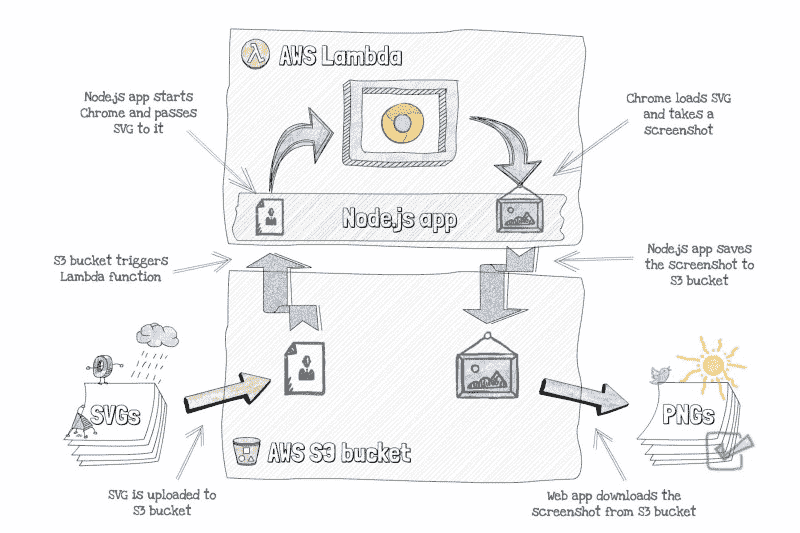
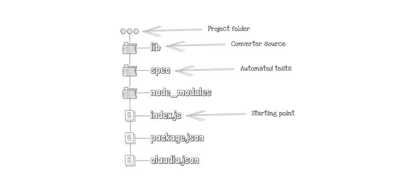
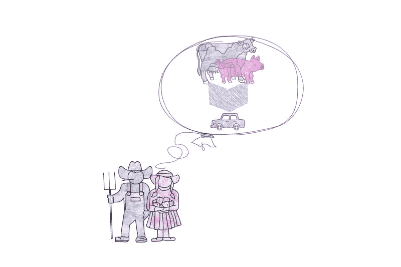
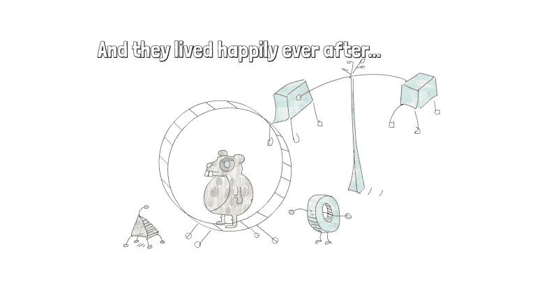

# 会融合吗？或者如何在 AWS Lambda 中运行谷歌 Chrome

> 原文：<https://www.freecodecamp.org/news/will-it-blend-or-how-to-run-google-chrome-in-aws-lambda-2c960fee8b74/>

是的，你没看错:这篇文章是关于在 AWS Lambda(无服务器计算平台)中运行 Google Chrome(浏览器)的。为什么有人会在服务器端运行浏览器？这是不是某种网页版的“[会融合？](https://en.wikipedia.org/wiki/Will_It_Blend%3F)

虽然我很想看到(或做)一个无服务器的“它会融合吗？”在 AWS Lambda 中运行奇怪东西的系列，不是这个。

但是这篇文章是什么呢？好了，故事时间到了！

从前在 [Cloud Horizon](https://cloudhorizon.com) 我们和一个客户合作，他有一些奇怪的 SVG 需要转换成 png。SVG-to-PNG 工具都不起作用，因为 SVG 包含了 [`<foreignObject>`](https://developer.mozilla.org/en-US/docs/Web/SVG/Element/foreignObject) 元素。

这个问题可以用许多不同的方法解决。最佳解决方案是分析为什么他们在 SVG 文件中嵌入 HTML 元素。但是，正如现实世界项目中的常见情况一样，原因隐藏在一堆遗留代码和遗留决策的背后。当然，需要尽快找到解决方案。

在特定情况下，对完美解决方案的追求变成了对最快体面解决方案的追求。

SVG 中的外来对象是 HTML 元素，显示 HTML 元素的最佳工具是浏览器。但是我们如何使用浏览器来解决这个问题呢？

手动地，我们会在浏览器中打开一个 SVG，然后截图。我们应该能够用 [PhantomJS](http://phantomjs.org) 做同样的事情，这是一个可以用 JavaScript API 编写脚本的无头 WebKit。我们试过了，但是没用，因为 PhantomJS 缺乏对 SVG 外来对象的支持。

我们还能用什么？想象一下像我们使用幻想曲一样使用 Chrome。等等！我们也许能做到。团队中有人最近读到了关于无头 Chrome 的报道。这听起来像是解决我们奇怪问题的完美工具。我们尝试使用无头 Chrome，并且成功了！

### 在不伤害未来自我的情况下解决问题

最后，我们有了一个可行的解决方案。但是，我们需要弄清楚如何将该解决方案集成到客户的应用程序中，而不增加额外的未来遗留代码层。

我们的客户使用 AWS，SVGs 文件在亚马逊 S3 桶中。这让我们有机会将**无服务器**用于 SVG 到 PNG 转换器。

无服务器解决方案很便宜，而且这种转换器是免费的，所以我们不需要许可就可以使用。这一点，以及基础设施不需要任何设置的事实，使我们能够快速移动。另一个巨大的胜利是隔离，它允许我们在不理解遗留代码的情况下工作。此外，我们的无服务器转换器将很容易在未来删除。

简要说明:**无服务器**是一种在云基础设施上部署和运行应用程序的方法，基于按使用付费，无需租赁或购买服务器。要了解更多关于无服务器以及它如何与 AWS 一起工作的信息，请参见我们新书的第一章“使用 Node.js 的无服务器应用程序”[这里](https://livebook.manning.com/#!/book/serverless-apps-with-node-and-claudiajs/chapter-1/v-5)。

如下图所示，我们的计划如下:

1.  客户端像以前一样上传 SVG 到 S3 桶。
2.  S3 触发了自动气象站的 Lambda 功能。
3.  在 Lambda 函数内部，Node.js 从 S3 bucket 下载 SVG 并启动无头 Chrome。
4.  无头 Chrome 加载 SVG 并截图。
5.  Node.js 应用程序然后将截图 PNG 图像上传回 S3 水桶。
6.  客户端使用来自 S3 桶的 PNG 图像。



Serverless screenshots app flow

### 给我看看代码

我们决定使用 Node.js，所以第一步是检查 NPM 是否存在用于 AWS Lambda 的 Google Chrome。我们没有失望:一个叫做[无服务器 chrome](https://github.com/adieuadieu/serverless-chrome) 的包覆盖了我们。

**注** : AWS Lambda 运行在亚马逊 Linux 上。要运行第三方库，比如 Google Chrome，你需要使用 Amazon Linux 把它编译成静态二进制。要了解这个过程的更多信息，请点击这里查看如何在 AWS Lambda [上编译和运行 Pandoc。](https://claudiajs.com/tutorials/pandoc-lambda.html)

另一个缺失的部分是在 AWS Lambda 中与 Google Chrome 交互的方式。最流行的库，[木偶师](https://github.com/GoogleChrome/puppeteer)，对于这个任务来说似乎很大，所以我们使用了 [chrome 远程界面](https://github.com/cyrus-and/chrome-remote-interface)。

让我们一起重建这个项目。但是，在这样做之前，有两个先决条件:

*   您需要安装带有 npm 的 Node.js。
*   你需要有一个 AWS 账户并设置凭证(见如何做[这里](https://claudiajs.com/tutorials/installing.html#configuring-access-credentials))。

要安装这两个依赖项，您应该启动一个新的 Node.js 项目，并在终端中运行以下命令:

```
npm install @serverless-chrome/lambda chrome-remote-interface --save
```

这个 Lambda 函数不大，一个文件不到 100 行代码就能装下。但是，为了使我们的函数可测试，我们将使用下图所示的结构。



Project folder structure

**如何测试无服务器功能**？概念和其他任何 Node.js app 差不多:你要应用一个[六边形架构](http://alistair.cockburn.us/Hexagonal+architecture)，然后你就可以用你喜欢的 Node.js 工具进行测试了。我们的选择是[茉莉](https://jasmine.github.io)。如果你想了解更多关于测试无服务器应用的知识，你可以看看我们的书[的测试章节。](https://livebook.manning.com/#!/book/serverless-apps-with-node-and-claudiajs/chapter-11)

在我们的结构中，index.js 文件只是处理事件，将它传递给转换器函数，并作出响应。该文件应类似于以下代码片段:

同样，出于测试目的，转换器逻辑位于以下文件中:

*   `convert.js`:连接所有其他文件的主文件。
*   `download-from-s3.js`:从 S3 桶下载 SVG 的函数。
*   `save-svg-and-get-dimensions.js`:将 SVG 文件保存到`/tmp`文件夹并读取其尺寸的功能。
*   `screenshot-with-headless-chrome.js`:在 headless Chrome 中加载文件并截图的功能。
*   `upload-to-s3.js`:上传截图(PNG 文件)回 S3 的功能。

大多数文件都很简单，只有几行代码。但是为了让这篇文章简短，我们来看看最重要的:`convert.js`和`screenshot-with-headless-chrome.js`。

正如您在下一个代码片段中看到的，convert 函数执行以下操作:

1.  使用`download-from-s3.js`文件中的函数从 S3 下载 SVG 文件。
2.  准备`/tmp`文件夹中 SVG 文件的路径，调用函数保存 SVG 文件并获取其默认尺寸。
3.  在 headless Chrome 中打开本地 SVG 文件，并使用`screenshot-with-headless-chrome.js`文件中的函数截图。
4.  使用`upload-to-s3.js`文件中的函数将截图上传到 S3 桶。

#### 运行无头浏览器

这个难题的最后一个重要部分是运行无头浏览器。为此，我们将使用`@serverless-chrome/lambda`模块启动 Chrome，然后使用`chrome-remote-interface`模块与之交互。

Chrome 远程界面获取所有标签的列表，并连接到第一个标签。然后，它为客户端启用页面和网络。

当页面和网络准备就绪后，Chrome remote 界面导航到您提供的 URL(SVG 文件的本地`file://`路径)，等待加载，并截图。

`screenshot-with-headless-chrome.js`文件的代码应该类似于下面的代码片段:

现在代码已经准备好了，是时候把它部署到 AWS Lambda 了。但是由于谷歌 Chrome 比 AWS Lambda 上的 50mb 限制要大，部署并不像你预期的那样顺利。

### 我们怎样才能把大象挤进汽车后备箱？

使用无服务器应用程序，您通常会得到比应用程序业务逻辑更多的自动化部署代码。这表明风险已经转移到部署上。因此，部署过程应该经过良好的测试，并且是您可以信任的。

为了避免意外的中断，我们使用 [Claudia.js](https://claudiajs.com) 将无服务器 Node.js 应用部署到 AWS Lambda 和 API Gateway。

对于 Claudia.js，我们通常只做`claudia create --region eu-central-1 --handler index.handler`。但是对于 headless Chrome 来说，这个命令会因为您试图部署的包的大小而失败。

AWS Lambda 对压缩文件的部署包大小有 50MB 的限制。幸运的是，未压缩代码也有 250MB 的限制，你可以通过 S3 桶使用。代码被上传到 S3 桶，然后被传输到 AWS Lambda 函数。



How can we squeeze the “elephant” into the car trunk?

要对 Claudia 执行此操作，请运行以下命令:

```
claudia create --region eu-central-1 --handler index.handler --memory 1024 --timeout 60 --use-s3-bucket S3_BUCKET_NAME
```

上一个命令的重要注意事项:

*   将`S3_BUCKET_NAME`替换为您拥有的一个 S3 桶的名称。您可以创建一个新的，并将其用作部署助手。
*   选择任何你最接近的区域，只要确保你的 Lambda 函数和辅助 S3 桶在同一个区域。在此查看所有支持的地区[。](https://docs.aws.amazon.com/general/latest/gr/rande.html#lambda_region)
*   如果您的主文件被不同地命名，您将需要在命令中更新 handler 到带有`.handler`而不是`.js`扩展名的文件名。例如，如果文件名是`main.js`，您的处理程序将是`main.handler`。
*   增加一点默认内存，因为 event a headless Chrome 需要比默认的 128MB 更多的内存。
*   增加超时时间(几秒钟应该足够了)。但是由于您不为超时付费，而只是为实际执行时间付费，所以您可以多花一点时间，甚至大约 5 分钟(最多)。

几分钟后(取决于您的网速)，您应该会看到一切都已成功部署的确认。

**注意**:如果你想更新你的代码，运行`claudia update --use-s3-bucket S3_BUCKET_NAME`命令。要学习如何使用 Claudia.js，请查看[网站](https://claudiajs.com/tutorials/)上的教程部分。

试驾前的最后一步是为你的 Lambda 函数设置 S3 触发器。克劳迪娅也帮你掩饰了。只需从您的终端运行以下命令:

```
claudia add-s3-event-source --bucket S3_BUCKET --suffix svg
```

同样，用将用于 SVG 和 PNG 文件的 S3 桶的名称替换`S3_BUCKET`。默认情况下，PNG 将保存到 SVG 文件所在的文件夹中。

当命令成功运行时，就完成了。您的无服务器文件转换器已准备好。

### 试乘

是时候来一次[试乘](http://carhumor.net/wp-content/uploads/2011/11/car-joke-funny-humor-hatchback-cow-golf-trunk.jpg)了！

那么，如何测试无服务器转换器呢？只需上传一个 SVG 文件到你的 S3 桶。然后呢？几秒钟后刷新 bucket，您将看到一个同名的 PNG 文件。你会惊讶于它实际工作的速度有多快！无头 Chrome 好像比我机器上的 Chrome 浏览器还快。也许我应该从现在开始用无头模式浏览网页。？

### 包扎

所以，这就是我们如何解决客户的问题而不伤害我们未来的自己。这不是最好的解决方案，但这是我们在短时间内和特定情况下能够想到的最好的解决方案。

但是这个故事有什么意义呢？如果你没有一个类似的客户端，为什么要关心在 AWS Lambda 中运行 Chrome 呢？

有许多潜在的用例。如果你还记得[测试金字塔](https://martinfowler.com/bliki/TestPyramid.html)，UI 测试既慢又贵。但是，如果您可以并行运行数百甚至数千个程序，并且只为执行时间付费，那会怎么样呢？有一些 UI 测试工具已经在进行类似的集成，比如[评估](https://appraise.com)。



我希望你喜欢这个故事。期待更多即将到来！

*一如既往，非常感谢我的朋友[亚历山大·西蒙维奇](https://twitter.com/simalexan)对这篇文章的帮助和反馈。*

> 所有插图都是使用 [SimpleDiagrams4](https://www.simplediagrams.com/) 应用程序创建的。

在这篇文章的制作过程中，没有奶牛受到伤害。

如果您想了解更多关于使用 Node.js 和 AWS 构建和测试无服务器应用程序的信息，请查看“使用 Node.js 的无服务器应用程序”，这是我与 Aleksandar Simovic 为 Manning Publications 撰写的一本书:

[**使用 Node.js 的无服务器应用**](https://www.manning.com/books/serverless-applications-with-nodejs)
[*使用 Claudia.js 的无服务器部署的精彩介绍*www.manning.com](https://www.manning.com/books/serverless-applications-with-nodejs)

这本书将教你更多关于无服务器应用的知识，并附有代码示例。您将学习如何使用 Node 和 Claudia.js 构建和调试真实世界的无服务器 API(带有数据库和身份验证)，以及如何为 Facebook Messenger 和 SMS(使用 Twilio)构建聊天机器人和 Alexa 技能。