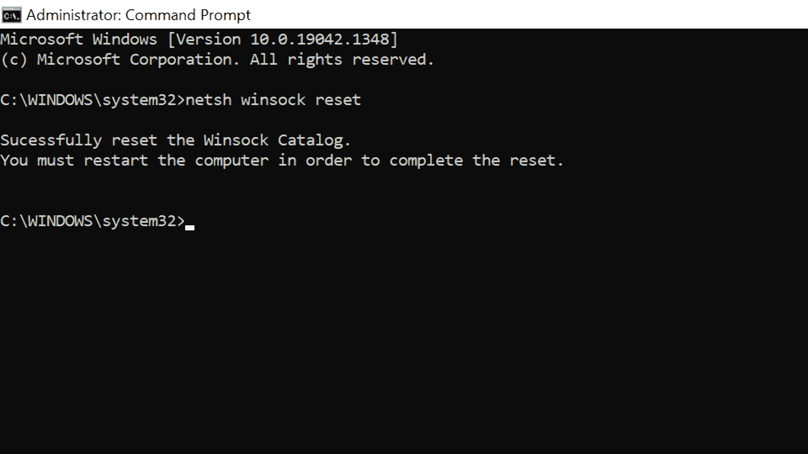

# Windows 10 网络适配器丢失–如何在 PC 上安装以太网驱动程序

> 原文：<https://www.freecodecamp.org/news/windows-10-network-adapter-missing-how-to-install-ethernet-driver-on-pc/>

在 Windows 10 和其他版本的 Windows 操作系统上，您需要一个网络适配器来通过有线或无线网络连接到互联网。

有时，您可能会收到网络适配器丢失的错误消息。这可能会非常令人沮丧，因为您将无法连接到互联网。

您可以使用一些简单的修复方法来解决此问题，包括:

*   卸下并重新插入电脑电池
*   关闭防病毒和 VPN 应用
*   重新启动计算机

但这些可能不足以解决问题。

因此，在本文中，我将向您展示 5 种更好的方法来修复网络适配器丢失错误，以便您可以重新开始将您的计算机连接到互联网。

## 如何使用内置网络重置工具修复网络适配器丢失

Windows 10 有一个内置的网络重置工具，可以将您的设置重置为默认值。这通常会为您解决这个问题。

要使用此解决方案修复网络适配器缺失错误，请按照以下详细步骤操作:

**步骤 1** :点击开始，选择设置。

**步骤 2** :从菜单平铺中选择网络和互联网。

**第三步**:在“状态”下，点击网络重置链接。

**第四步**:点击立即重置链接。

如果您使用此修复，请注意您必须在您的电脑上重新安装任何 VPN 应用程序，并重新输入 WiFi 密码。

## 如何通过检查驱动程序的电源管理设置来修复网络适配器丢失的问题

Windows 10 针对更好的电源管理进行了优化，因此当您的笔记本电脑电池电量低时，可以关闭一些设备以节省电量。

由于这种电源优化，您可能会遇到网络适配器丢失错误。

要为您的网络适配器驱动程序关闭此功能，请按照以下步骤操作:

**步骤 1** :右键点击开始，选择设备管理器。

**第二步**:扩展网卡。

**步骤 3** :右键点击受影响的网络适配器，选择属性。

**第四步**:切换到电源管理选项卡，取消选中“允许计算机关闭此设备以省电”，点击“确定”。

## 如何通过在命令行中重置 Winsock 设置来修复网络适配器丢失

Winsock 是一个确定 Windows 计算机上如何使用网络服务的程序。

如果 Winsock 出错，可能会导致网络适配器丢失错误。

要重置 Winsock，请按照以下步骤操作:

**第一步**:点击开始，搜索“cmd”，然后选择右边的“以管理员身份运行”。

**第二步**:在命令行中，键入“netsh winsock reset”并点击`ENTER`。

第三步:重启电脑。

## 如何通过重新安装或更新网络适配器驱动程序来修复丢失的网络适配器

如果已经讨论过的解决方案对您的计算机不起作用，那么您应该尝试重新安装或更新您的网络适配器驱动程序来解决这个问题。

要重新安装网络适配器驱动程序，您应该按照以下步骤操作:

**步骤 1** :点击开始，选择设备管理器。

**第二步**:扩展网卡。

**第三步**:右键点击受影响的驱动，选择卸载设备。

**步骤 4** :选择自动搜索更新的驱动软件。

**第五步**:重启电脑，驱动会自动为你重装。

## 结论

在这份详细的指南中，您了解了如何修复网络适配器丢失错误，以便您可以使用电脑再次连接到互联网。

如果你觉得这篇文章很有帮助，考虑把它分享给你的朋友和家人，这样它也能帮助他们。

感谢您的阅读。