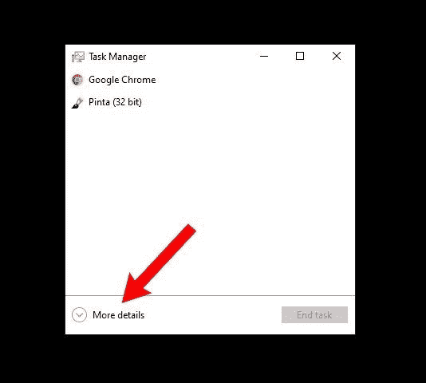
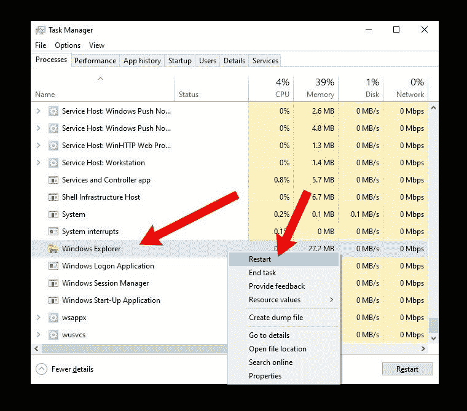
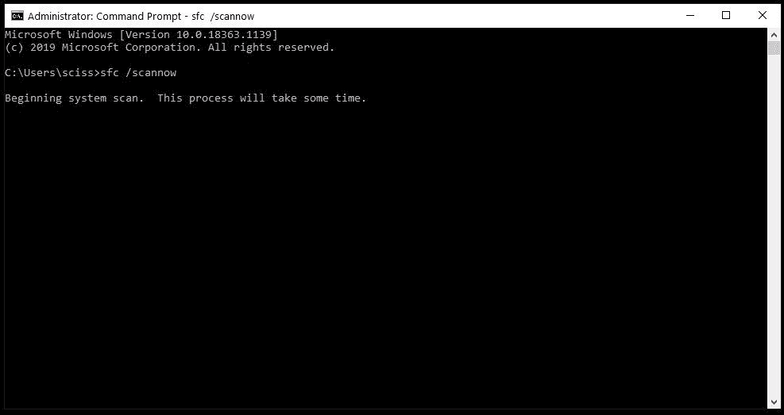
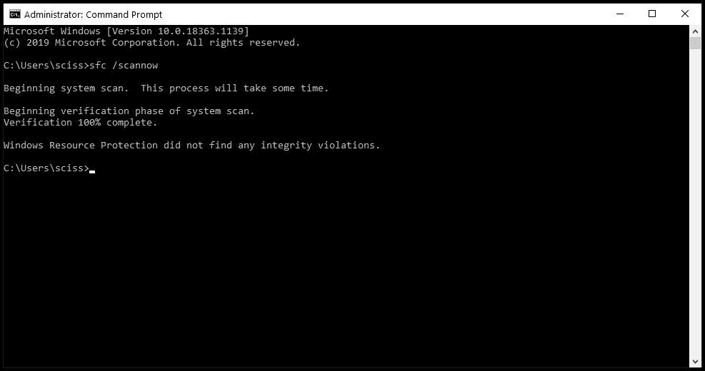
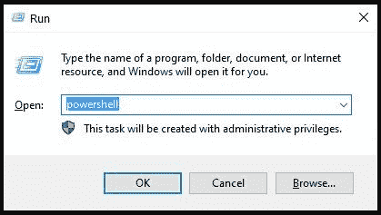
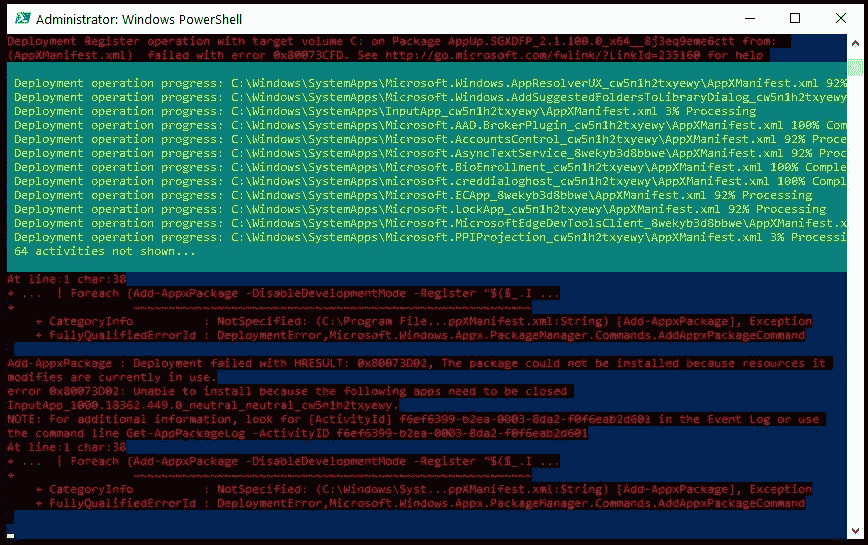
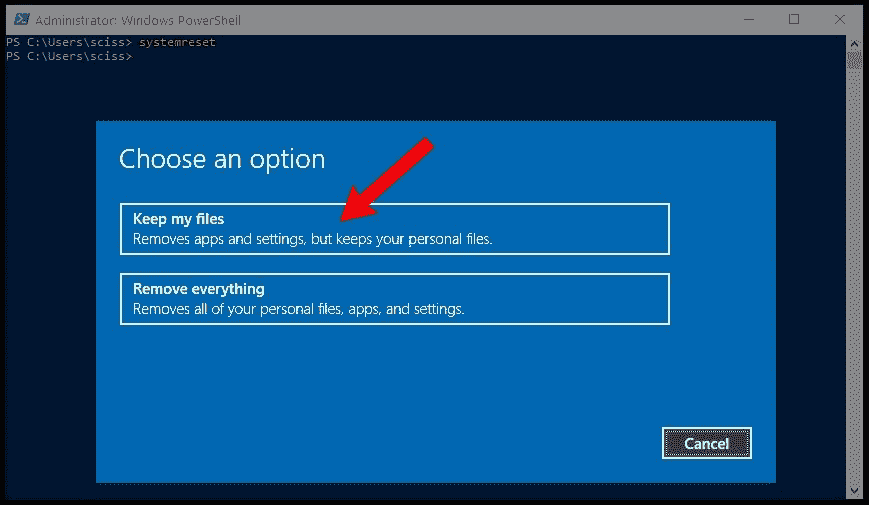
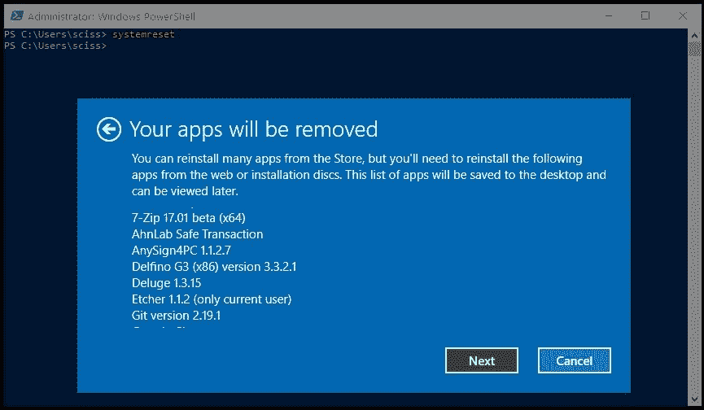

# Windows 10 开始菜单不起作用(已解决)

> 原文：<https://www.freecodecamp.org/news/windows-10-start-menu-not-working-solved/>

自 2015 年首次推出以来，Windows 10 已经走过了漫长的道路。每次更新都会带来许多新功能，微软已经以一种曾经被认为不可能的方式拥抱了开源社区。

尽管如此，和任何操作系统一样，还是有缺陷。运行 Windows 10 的人面临的一个更常见的错误是开始菜单突然停止工作。

有时打开的“开始”菜单会冻结并且没有响应，而其他时候当您单击“开始”菜单按钮时，它根本不会打开。

无论你对 Windows 10 开始菜单有什么具体的问题，我们都会在这篇文章中讨论一些快速和不那么快速的修复方法。

## 如何重新启动 Windows 资源管理器

Windows 资源管理器，现在称为文件资源管理器，是用于浏览文件系统和打开程序和文件的应用程序。但它也控制开始菜单、任务栏和其他应用程序。

如果您对“开始”菜单有问题，您可以尝试做的第一件事是在任务管理器中重新启动“Windows 资源管理器”进程。

要打开任务管理器，按下 **Ctrl + Alt + Delete** ，然后点击“任务管理器”按钮。

单击“更多详细信息”查看打开的程序和正在运行的后台进程的完整列表:



滚动列表，直到找到“Windows 资源管理器”进程。然后右键单击“Windows 资源管理器”并选择“重启”:



当 Windows 重新启动 Windows 资源管理器/查找器时，会有短暂的闪烁，任务栏和开始菜单也会出现。

之后，尝试打开开始菜单。如果它仍然不能正常工作，请尝试下面的其他修复方法。

## 如何修复损坏或丢失的 Windows 系统文件

有时更新会出错，或者您在研究文件系统时不小心删除了一个重要的文件。

如果“开始”菜单仍然给你带来麻烦，或者其他核心 Windows 应用程序崩溃，那么你可以尝试恢复任何丢失或损坏的 Windows 系统文件。

为此，您需要以管理员身份打开 Windows 命令提示符并运行系统文件检查程序。

以管理员身份打开命令提示符后，运行命令`sfc /scannow`:



系统文件检查器将开始检查您的所有系统文件，并用缓存副本替换任何损坏或丢失的文件。

这个过程需要一点时间，所以你可以花 5-10 分钟做点别的事情。注意不要在`sfc`工作的时候关上窗户。

一旦系统文件检查完成，您将会看到一个报告，所有的文件，它取代了，或者如果一切正常，你会看到这样的消息:



如果系统文件检查器替换了任何损坏或丢失的系统文件，请保存所有打开的工作并重新启动计算机。重新登录后，尝试打开“开始”菜单，看看这是否解决了您的问题。

**注意:**您也可以使用 Powershell 来运行`sfc /scannow`命令，但是记住您需要打开一个提升的 Powershell 终端。

## 如何使用默认的 Windows 10 应用程序重置开始菜单

接下来你可以尝试完全重置开始菜单，以及所有预装或从微软商店安装的 Windows 10 应用。

为此，您需要以管理员身份打开 PowerShell 命令提示符对于您将要运行的命令不起作用。

打开 PowerShell 的方法有很多，但最快的方法之一是使用 Run 程序。

使用快捷键 **Windows 键+ R** 打开运行程序，输入“powershell”，然后按住“Ctrl + Shift”点击“确定”按钮:



这将打开一个具有管理权限的 PowerShell 终端。

在 PowerShell 终端中，运行以下命令:

```
Get-AppXPackage -AllUsers | Foreach {Add-AppxPackage -DisableDevelopmentMode -Register "$($_.InstallLocation)\AppXManifest.xml"} 
```

`Get-AppXPackage`命令将尝试重新安装所有默认的 Windows 应用程序，包括开始菜单和搜索栏。

它还会为重新安装的每个程序注册一个清单文件。不过，你不需要担心清单文件——它只是 Windows 运行每个程序所需要的东西。

等待 5-10 分钟，并确保在完成之前不要关闭 PowerShell 窗口。

**注意:**当`Get-AppXPackage`命令运行时，你可能会看到一些可怕的错误弹出来。不要担心它们——大多数只是关于为什么程序不能被重新安装的警告:



当`Get-AppXPackage`命令完成后，重启电脑，登录，尝试打开开始菜单。

## 如何重置您的 Windows 10 安装

如果以上方法都没有修复开始菜单，那么你可以尝试的最后一件事就是对 Windows 10 安装进行出厂重置。但请记住，这是一个“几乎焦土”的方法，只应作为最后手段使用。

重置 Windows 10 安装应该会保持所有个人文件(文档、图片、视频等)不变，但会卸载所有其他已安装的驱动程序和程序。基本上，这会将您的计算机重置到您第一次开机时的状态。

在继续之前，使用闪存驱动器、外置硬盘/固态硬盘和/或在线文件主机(如 Google Drive 或 Dropbox)备份所有重要文件。

事实上，做两个备份。你可能不需要它们，但这并不痛苦。

当你备份完所有文件后，打开 powershell 终端——使用快捷键 **Windows 键+ R** ，输入“PowerShell ”,然后点击“OK”按钮。

在 PowerShell 终端中，运行命令`systemreset`以打开 Windows 重置向导。

接下来，单击“保留我的文件”按钮:



向导正在分析您的系统，请稍候。然后，您将看到所有将被删除的程序的列表:



点击“下一步”按钮，按照说明重置 Windows 10 安装。

一旦你完成了重置窗口和创建一个新用户，开始菜单应该再次工作。

## “Cortana，打开开始菜单”

所以以上就是修复 Windows 10 开始菜单的所有方法，从最容易到最难列出。

这些方法对你有用吗？有没有其他方法可以打开我错过的开始菜单？让我在推特上知道这件事。