# GitHub 2018 年 freeCodeCamp JAMstack 黑客马拉松的获奖者

> 原文：<https://www.freecodecamp.org/news/winners-from-the-2018-freecodecamp-jamstack-hackathon-at-github-2a39bd1db878/>

首先，我要说的是:每一个参加 2018 年 freeCodeCamp JAMstack 黑客马拉松的人都是赢家。

每个人都学习了一些新工具，花了整整两天时间编写代码，还交了一些新朋友。

有些人甚至带着奖品离开了。

今天，我将分享那些建造了最令人印象深刻的项目的团队。他们在 36 小时内完成了这项工作——其中许多人都是和他们刚刚认识的陌生人一起。

但是在我们深入演示之前，这里有一些关于 freeCodeCamp 的第一次官方黑客马拉松的更多信息，以及它是如何进行的。

## 正在设置

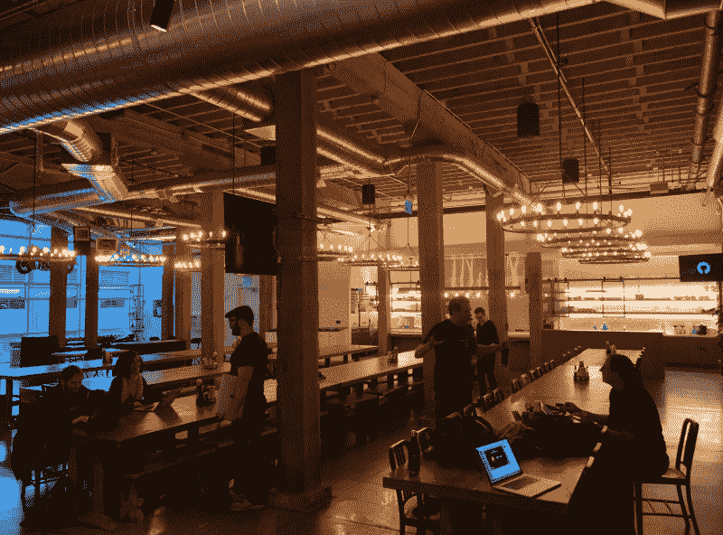

The calm before the storm — the JAMstack Hackathon team gets ready in GitHub’s Harry Potter-inspired dining hall. (Photo by [Sean Swyx Wang](https://twitter.com/swyx/status/1058740751566172160))

为了与 freeCodeCamp 的核心价值保持一致，我们很早就决定:

1.  黑客马拉松应该完全免费。因此，我们没有收费，而是要求人们浏览我的 JAMstack 教程并提交他们的应用程序，以获得免费入场券。
2.  我们应该为代码新手和首次参加黑客马拉松的人做好计划。
3.  黑客马拉松也应该对加州以外的人开放。所以我们计划了一个同步在线黑客马拉松。

黑客马拉松由 freeCodeCamp 在 GitHub 的旧金山总部与 [Netlify](https://www.netlify.com) 合作主办，作为 [JAMstack_conf](https://jamstackconf.com) 2018 的一部分。

## JAMstack 到底是什么？

JAMstack 是构建 web 应用程序的一种简单方式。JAM 代表 JavaScript、API 和标记(HTML 和 CSS)。

如果您已经构建了 freeCodeCamp 课程中的一些项目，那么您已经在使用 JAMstack 了。许多主要的网络应用——包括 freeCodeCamp.org 本身——都运行在 JAMstack 上。

JAMstack 与 LAMP 和 MEAN 等其他 web 开发堆栈的主要区别在于:您使用 API，而不是使用 web 服务器后端。

和其他黑客马拉松一样，我们有许多 API 赞助商，他们帮助这个活动成为可能。他们还为寻求将这些 API 集成到项目中的团队提供支持。

我采访了几个 API 赞助商的关键人物。

## 组织合作伙伴访谈

在采访 API 赞助商之前，[菲尔·霍克斯沃思](https://twitter.com/philhawksworth)和我采访了[马特·比尔曼](https://twitter.com/biilmann),[Netlify](https://www.netlify.com)的联合创始人兼首席执行官。

我们讨论了 web 开发的发展方向，JAMstack 的起源，以及黑客马拉松如何反映新产品的推出。我们还讨论了软件工程师应该如何像考虑编写代码本身一样考虑范围和管理他们的项目。

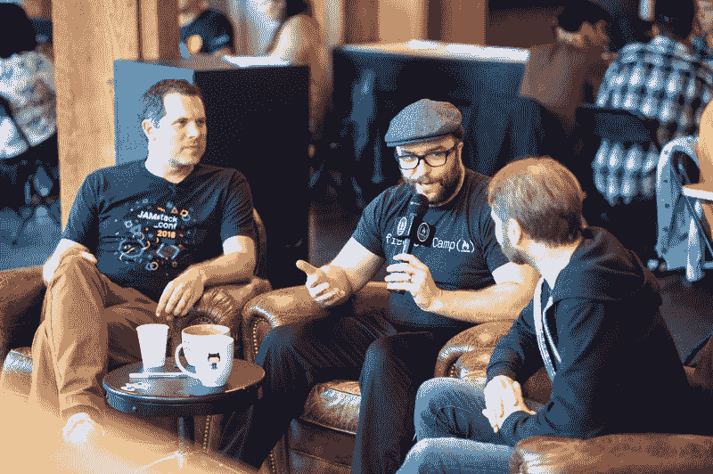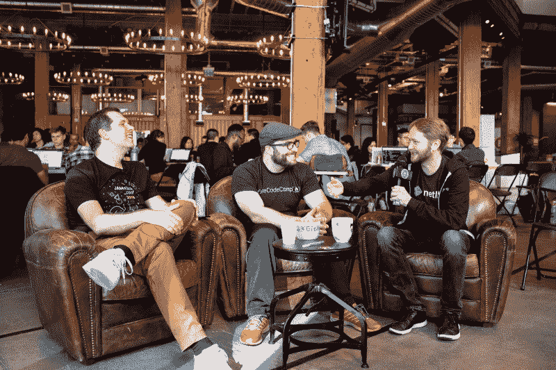

Matt Biilmann, co-founder and CEO of [Netlify](https://www.netlify.com)

## API 赞助商访谈

我和杰西卡·帕森斯(Jessica Parsons)与 Formspree 的创始人兼首席执行官[科尔·克鲁姆霍尔兹(Cole Krumbholz)](https://twitter.com/ColeVsCode)谈论了他在美国海军的时光，以及创业公司被收购的感受和他的长期目标。

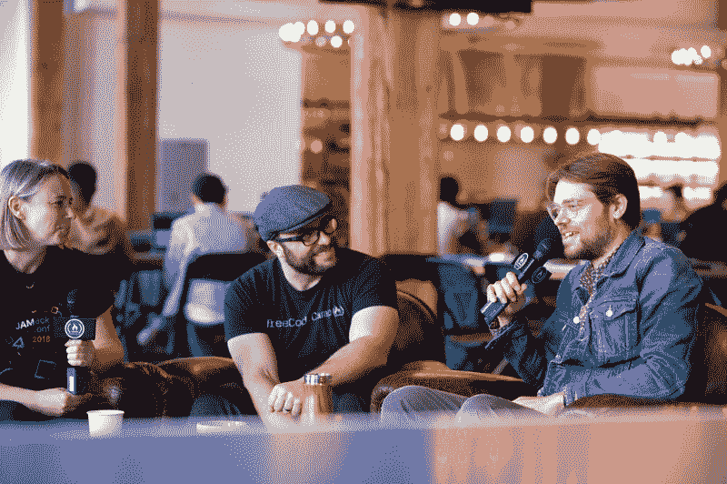

Cole Krumbholz, founder and CEO, Formspree

Phil Hawksworth 和我就不同数据库之间的权衡以及为什么像 FaunaDB 这样的分布式数据库如此强大的问题采访了开发人员福音部主任 Chris Anderson。

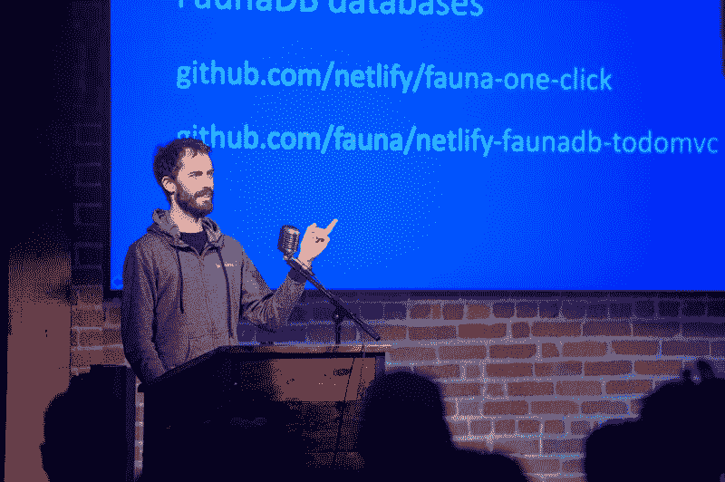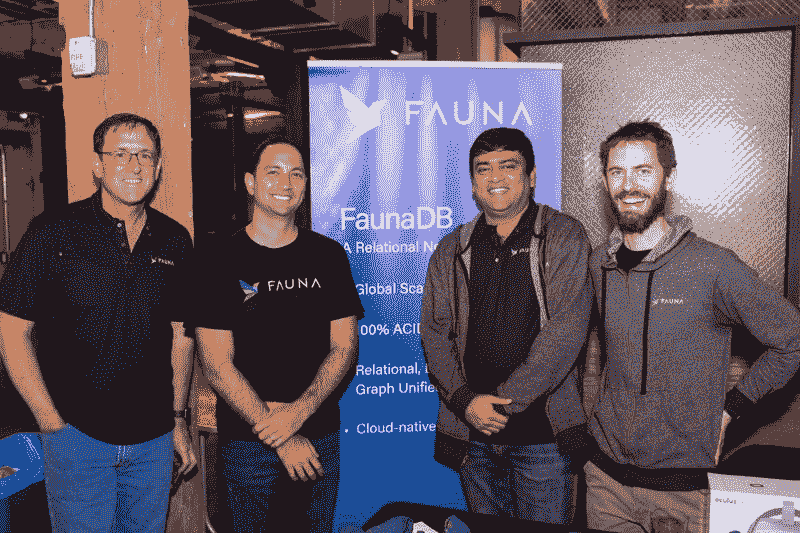

Chris Anderson presenting Fauna to the hackers, and the Fauna team (photos courtesy [Netlify](https://www.netlify.com))

在这些采访的间隙，我在 GitHub 中漫游，与来自世界各地的黑客马拉松参与者交谈。

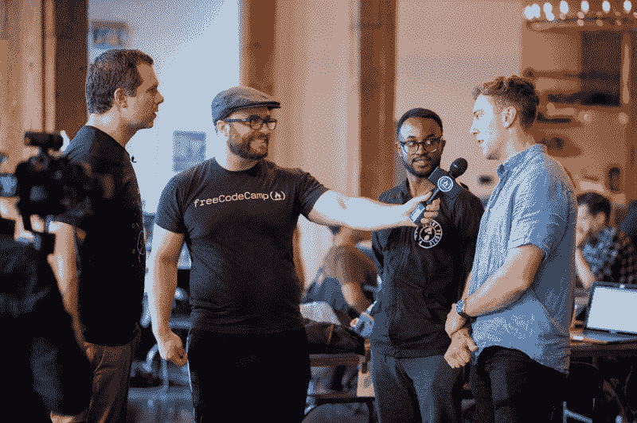

I interviewed many of the hackers to learn more about their projects and personal stories (Photos courtesy [Netlify](https://www.netlify.com))

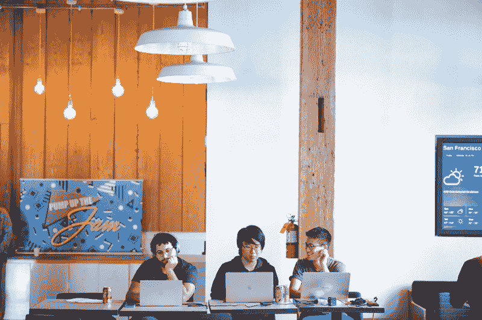

Some teams grabbed quiet corner to get some coding done (photo courtesy [Netlify](https://www.netlify.com))

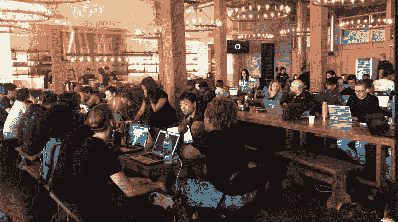

Other teams gathered around long tables and worked throughout the day on their projects. (Photo by [Kevin Davus](https://twitter.com/KevinDavus/status/1059291304524271616))

## 关于参与黑客马拉松的开发人员的有趣事实

开发者来自美国各地，其中许多人来自世界其他地方，如澳大利亚和拉丁美洲。

*   他们中的大多数人对软件开发都很陌生。他们编码的月数中位数只有 16 个月。
*   超过一半的人说这是他们第一次参加黑客马拉松。
*   超过三分之一的参与者是女性。

以下是他们各种背景的快速分类:

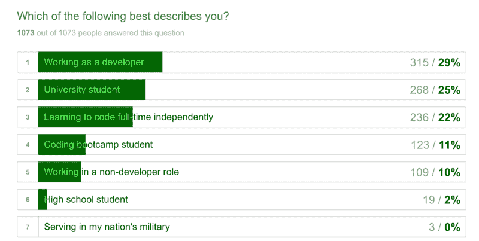

11 月 3 日星期六，我们从早上 9 点编码到晚上 9 点。然后我们都回家了，睡了个好觉。这不是那种没有人睡觉的超级竞争的通宵黑客马拉松——我们关注的是理智的、可持续的团队努力。

周日早上 9 点我们又见面了，然后继续编码。

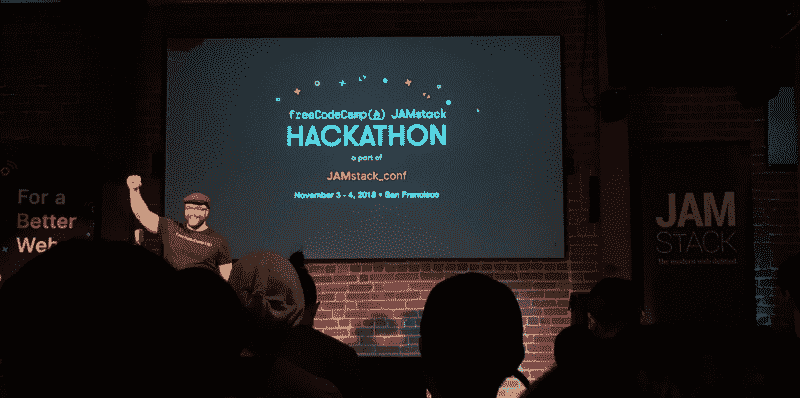

Me on stage getting the hackers fired up to finish their projects on Day 2 (Photo by [Gin](https://twitter.com/WongCoFood/status/1059144175554199552))

下午 5 点，演示时间到了。每个团队有 1 分钟的时间展示他们的项目，45 秒的时间回答评委的问题。

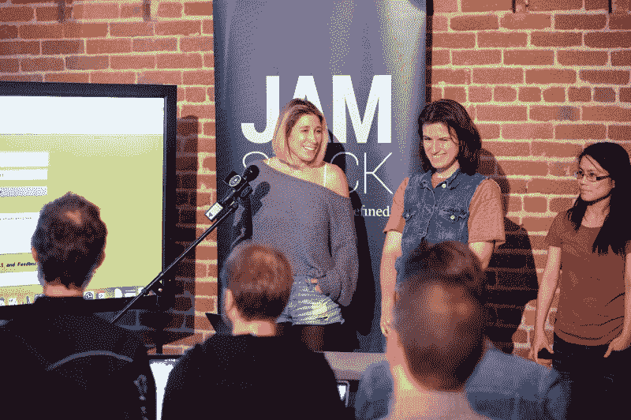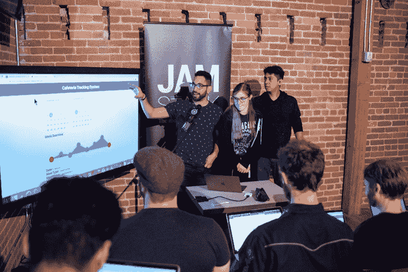

Just two of the many teams who demonstrated their project for the judges

基于这些演示，我们选择了 7 个团队上楼到 GitHub 的工作室做一个更长的演示和问答。基于这些演示，评委们选择了大奖获得者。

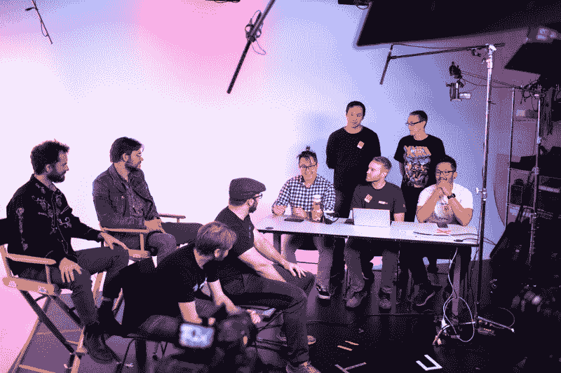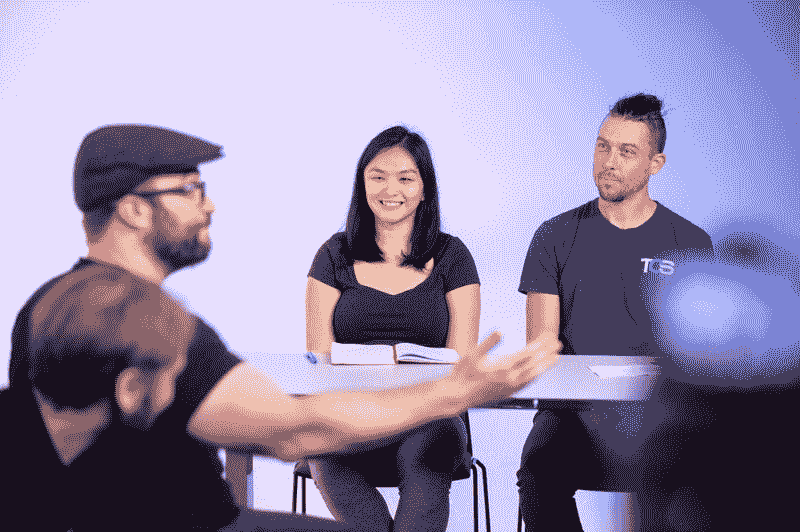

Two of the 7 teams interviewed in GitHub’s video studio (photos courtesy [Netlify](https://www.netlify.com))

以下是进入决赛的 7 支队伍的视频演示。每个演示大约 10 分钟长。(所有 7 个演示都是同一个 YouTube 视频的不同部分，这就是为什么每个视频的缩略图看起来都一样。)

## 首先，亚军

**标题本**

**Sicc Piccs**

**SmarTea 裤子**

**VisiJAM**

## 大奖获得者

### 第三名(200 美元):哈克斯比

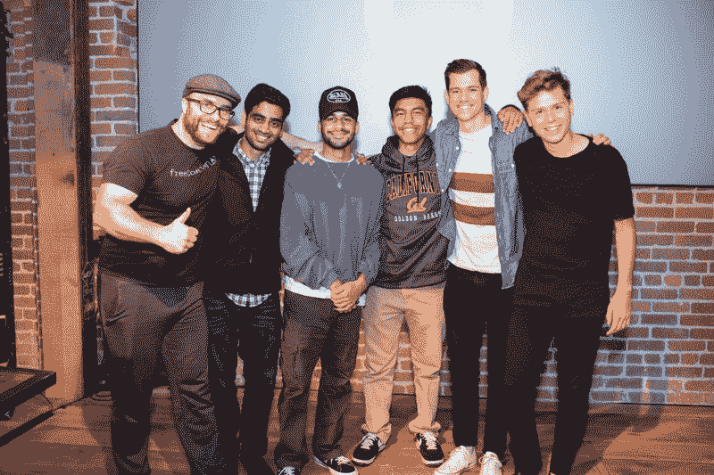

Team Hacksby posing for a photo op after their third-place win

### 第二名(300 美元):网络工作

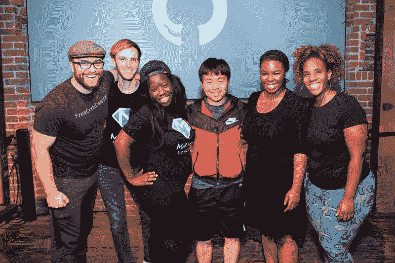

Team Make Squad posing on stage after their second-place win

### 第一名(500 美元):世界上哪里

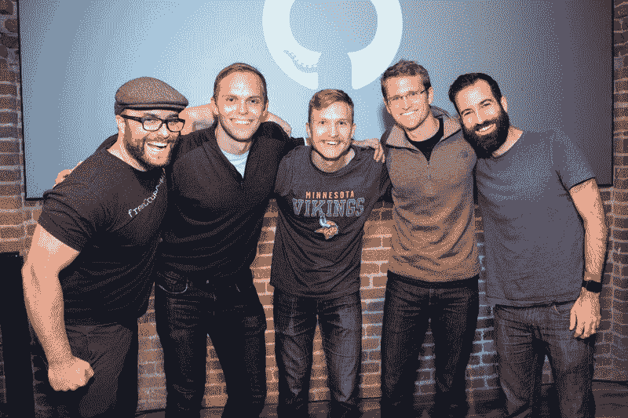

Team Where in the World all smiles after being announced the 2018 Hackathon Champions

此外，API 赞助商为最大限度利用其 API 的团队设立了自己的奖项。

动物界给三个团队颁发了 API 奖:[面对面](https://github.com/jimmy-guzman/quiche-friends)，[字幕本](https://captionthis.netlify.com/)，数字&文字。

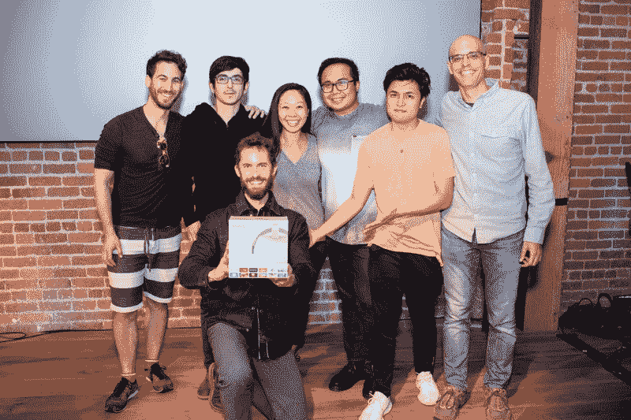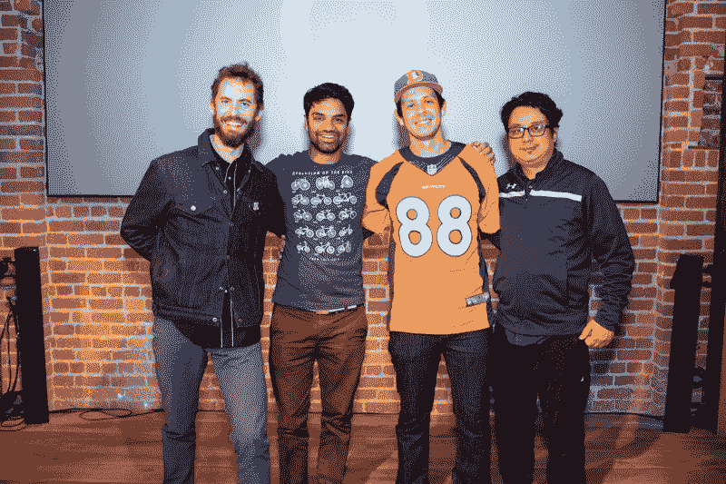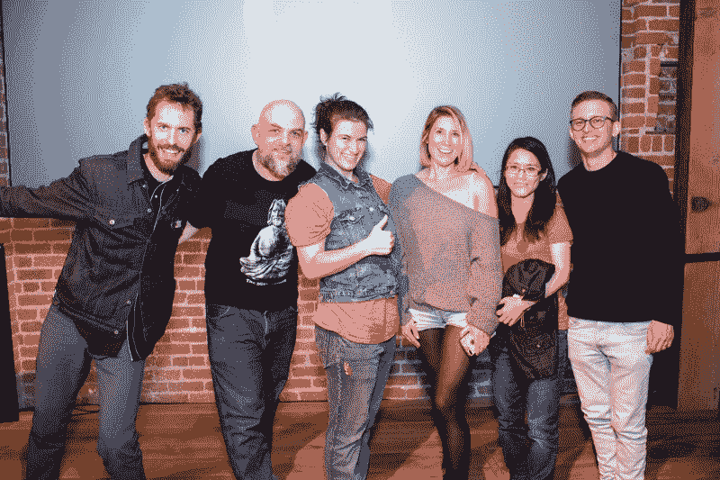

Fauna awarding prizes to their top 3 teams: Face to Face, Caption This, and Numbers & Words

Formspree 将其 API 奖授予了 [Visijam](https://visijam.netlify.com/) 。

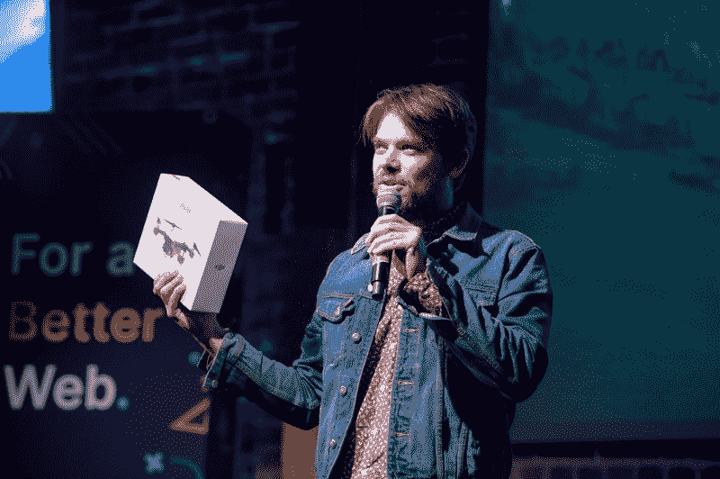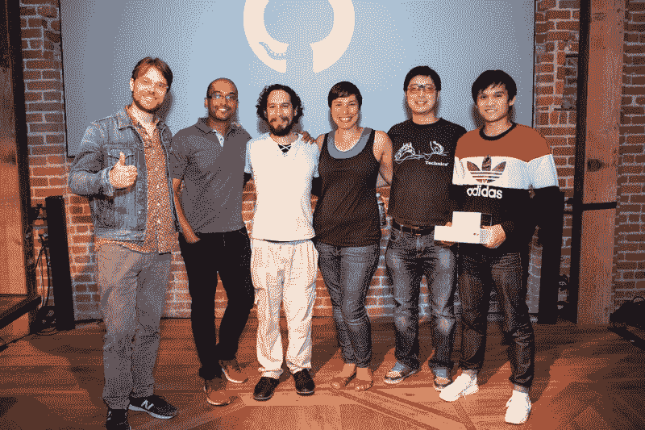

Formspree awarding their API prize to Visijam

## 在线黑客马拉松

我们还有来自世界各地的几十个团队参加，包括由志愿者在布拉索夫、哥印拜陀、休斯顿、诺曼和波特兰举办的卫星黑客马拉松。

这里是顶级的在线黑客马拉松团队和他们 90 秒的项目演示视频。

### 第一名(500 美元)

视频音频匹配器！

### 第二名(300 美元)

典当行！

### 第三名(200 美元)

狗狗比赛！

Doggie Match 还获得了 API 奖的[最佳形式狂欢整合](https://formspree.io/)和[最佳动物整合](http://fauna.com)。

以下是在线黑客马拉松团队，他们的项目获得了荣誉奖:

*   [全部清点完毕](https://youtu.be/R5lsyOgJKgM)
*   [备用零钱](https://www.youtube.com/watch?v=YqjSf0M1NDc)
*   [格位](https://youtu.be/vLOXRCnoXYQ)

最重要的是，人们玩得很开心，还交了新朋友。

## 许多黑客马拉松的第一次

对于许多参与者来说，这是他们的第一次黑客马拉松。这也是 freeCodeCamp 的第一次官方黑客马拉松。

黑客马拉松是一个很棒的学习工具。你将建设一个项目的全部经历——以及随之而来的所有决定和情绪起伏——都集中在一个周末。

我们希望在不久的将来有更多的黑客马拉松。

如果你还没有参加过黑客马拉松，我鼓励你尝试一下，不管你的编码技术水平如何。以下是全球即将举办的[黑客马拉松列表](https://devpost.com/hackathons)。

我鼓励你拿起果酱饼。这里有一个很好的教程让你开始:

最后，我想感谢所有让这个活动成为可能的人:Netlify、GitHub、Formspree、Fauna、freeCodeCamp 社区，以及所有在现场和在线黑客马拉松上提供帮助的志愿者。你真棒！

谢谢大家，并祝贺令人惊叹的第一次黑客马拉松！