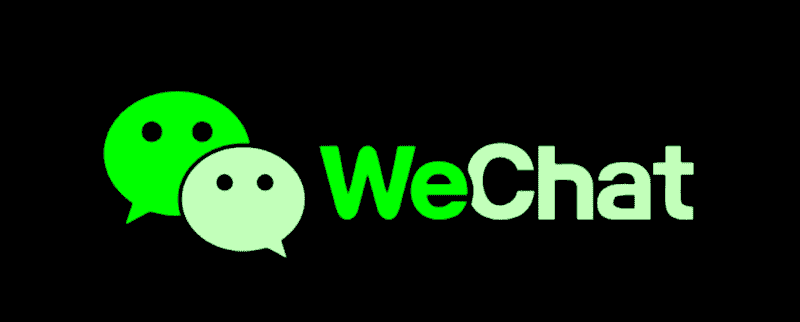
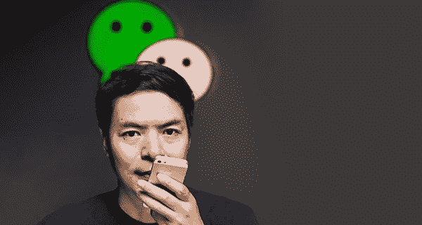
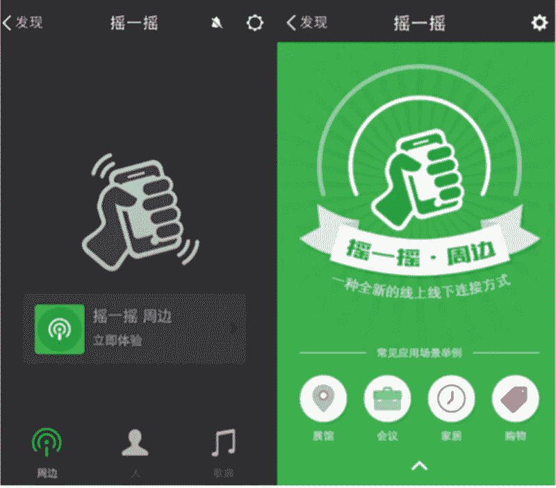
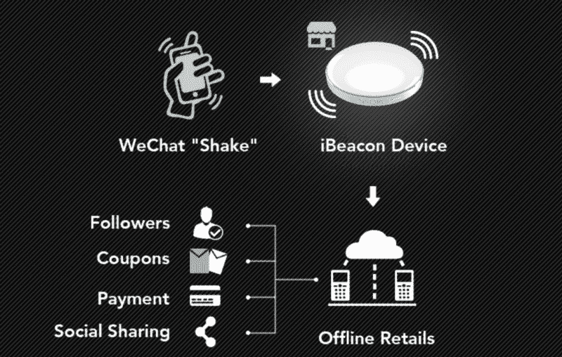
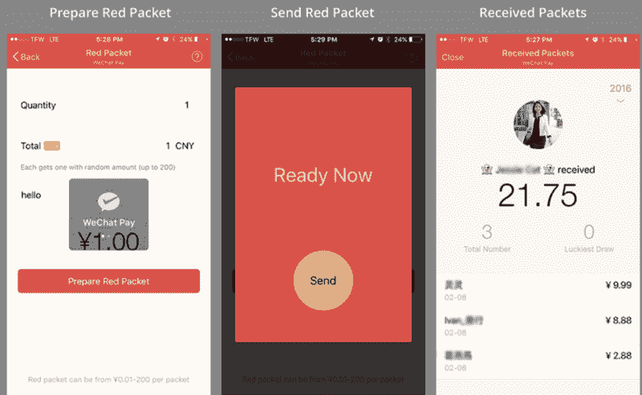
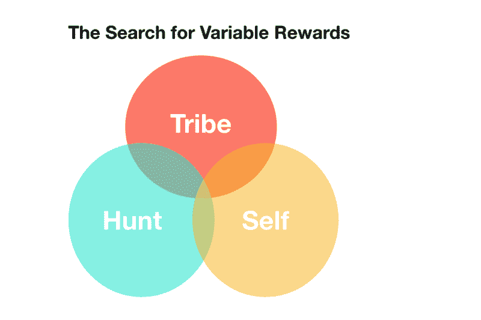
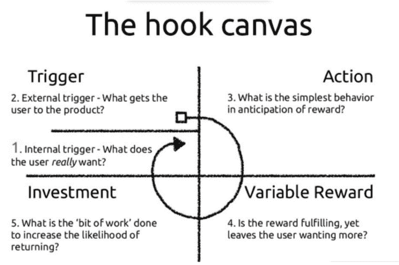
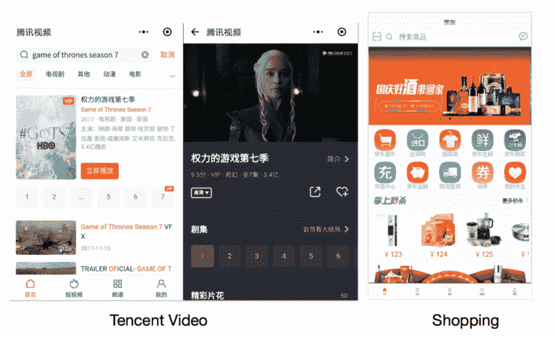
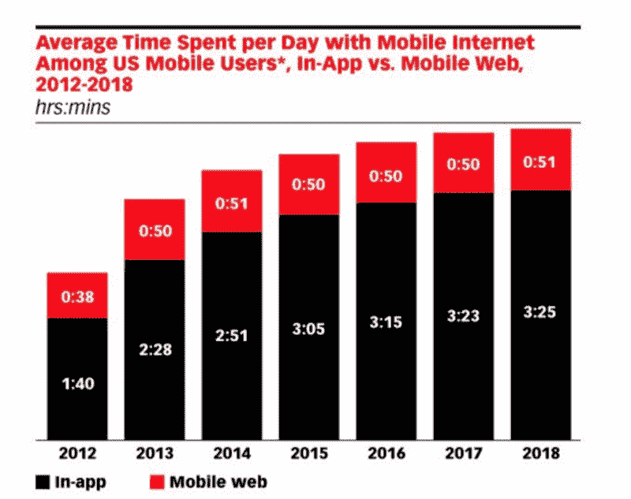

# 3 来自微信非常规创始人的获奖技术和产品见解

> 原文：<https://www.freecodecamp.org/news/winning-technology-insights-from-wechats-unconventional-founder-1fbc2483064c/>

作者亨利

# 3 来自微信非常规创始人的获奖技术和产品见解

***简介*** *:作者是现任 PM@LinkedIn。此前，他在脸书担任成长工程师。他平均每天花大约 5 个小时使用/思考消息传递&社交应用(微信、LinkedIn、FB、Kik、Telegram 等)。)*

**？在 LinkedIn 上发布的一篇[lso:h](https://www.linkedin.com/pulse/3-unique-technology-product-insights-from-wechats-founder-henry-yan/?lipi=urn%3Ali%3Apage%3Ad_flagship3_profile_view_base%3BSjGR8JWIS6SnFeYjDhDHqg%3D%3D)ttps://www . LinkedIn . com/pulse/3-unique-technology-product-insights-from-we chats-founder-Henry-Yan/？里皮= urn % 3 Ali % 3 page % 3Ad _ flagship 3 _ profile _ view _ base % 3 bsjgr 8 jwis 6 snfeyjdhdhqg % 3D % 3D**

在不断发展的消息和社交应用领域，[微信](https://web.wechat.com/)取得了前所未有的成功。

已经超过 10 亿 MAU(月活跃用户)。它被视为亚洲移动用户的“操作系统”，有数千个使用案例——预订酒店/航班/电影，管理资产等等。

当我在亚洲以外的朋友问我为什么微信在中国如此成功时，我通常的回答是:“如果你尝试在中国生活两周以上，你会发现自己已经离不开微信了。”

为了展示微信成功背后更具体的见解，我发现研究微信的创始人很有帮助:张小龙(张海星，中文字面意思是“小龙”)。如果你对技术和解决问题感兴趣，他对产品管理和技术的许多见解可能会让你感兴趣。

艾伦是一个内向的电脑极客。一些人在网上开玩笑说，“一个自己并不擅长沟通的人，却能打造出最成功的沟通/信使产品，这真是太棒了。”

艾伦的职业生涯始于工程师，后来成为产品经理。他创办了一家电子邮件软件初创公司 [Foxmail](https://en.wikipedia.org/wiki/Foxmail) ，该公司被[腾讯](https://www.tencent.com/en-us/index.html)收购。

Allen Zhang, founder of WeChat

我想分享我在阅读他的帖子和演讲后遇到的一些顶级主题。每个主题都有一个最能体现它的特征或产品。

### 1.少即是多。简单导致美丽。

*(Less is more. Simplicity is beauty. )*

#### 示例:“摇一摇”作为搜索和发现的门户

为了说明简单的重要性，艾伦曾经画了下面的物理学类比:

> 物理学家认为我们的宇宙法则非常简单。如果宇宙的法则很简单，为什么我们要把特征复杂化？

降低认知负荷，让 UI(用户交互)变得直观，这很好地服务了微信。

“摇一摇”(摇一摇)就是一个突出的例子。用户界面非常简洁，没有文本或用户界面。要使用该功能，您只需摇动手机。它帮助用户发现同时在颤抖的朋友，并扩展到其他用例，例如离线商业购买，甚至收集红包(免费的钱，红包)。
**你做的就是摇。**

在 2013 年春晚期间，观众在 1 分钟内使用了 8.1 亿次摇一摇来收集红包。这个功能像病毒一样传播开来，因为震动是有形可见的。其他人都看到你在使用它，这激发了他们的好奇心。

该功能还扩展到离线搜索和发现，结合了 iBeacon 和蓝牙技术。用户可以通过该功能轻松找到附近的餐馆、展览馆、博物馆和服装店。

例如，在一个广场，你可以在微信中摇一摇，发现附近的商店，并获得优惠券和交易奖励——这一直是一个杀手级的货币化用例。

如此简约的用户界面和设计元素是如何获得如此广泛的成功的，这真是令人着迷。正如艾伦所说:

> If feature needs leisure text explanation the design of the feature has been already failed.
> Once a function needs too much text explanation, the design of this function has failed.

简单是这一功能成功的关键。

### 2.人们很贪婪，喜欢随机的、可变的奖励。快乐胜过特色。

*(Users are greedy, and humans are addicted to random and variable rewards. "Cool" is better than function. )*

#### 例子:游戏化的红包

从神经科学的角度来看，人类大脑无法抗拒可变的奖励。这些奖励会在我们的大脑中诱发多巴胺，并创造习惯。TimeWellSpent 的 Tristan Harris 将具有可变奖励的粘性应用程序与赌场中的老虎机进行了比较。他们创建相同类型的间歇可变奖励。

张海星和微信将这种心理手段提升到了前所未有的高度，以优化留存率并吸引人们的注意力。红包(红包)就是一个突出的例子。

本质上，它的功能是一个游戏化的 P2P(点对点)资金转移功能。这个特点也深深植根于中国文化，人们出于庆祝和欣赏的目的发送红包。

2018 年除夕，微信发送了 6.88 亿个红包。

用户向一个群组发送一个金额为“x”的红包，为其他人点击并获得金钱奖励创造了一个竞赛。这里有一个问题:你可以指定只有前“x”个用户获得奖励，奖励金额是随机的。

这导致了大量的 FOMO(害怕错过)和团队中可变报酬的不确定性。

可变回报三人组得到了满足——部落(团队成员感到相互联系)、狩猎(创造了速度竞赛)和自我(产生了成就感)。

在 Hook Canvas 模型中，对应的动作极其简单:你点击红包的 rich-attachment，触发是一个红包已经发出的通知。

可变奖励完成了剩下的工作——竞争领取红包并获得随机的金钱奖励会在用户中诱发多巴胺和快感。这使得红包成为一个不可阻挡的特征。它让用户感觉很有成就感，并且总是想要更多。

### 3.用户花在微信上的时间太多了。一个好的产品体现了“实现你所需要的，然后上路。”

*WeChat takes up too much time of users, and good products should "run out and go".*

#### 例如:迷你程序和聊天机器人

这是最违背直觉的作品。艾伦认为，理想的软件产品应该让用户用最少的努力和时间实现他们的目标，而不是在应用程序中逗留太久。

“实现你所需要的，然后上路”(用完即走)的意思是用户不要在屏幕上花费太多的注意力和精力。他们应该转移到生活中其他重要的事情上，比如花时间和家人在一起，做其他有意义的事情。

这个概念最早是在微信推出“迷你程序”(小程序)，一个备受期待的功能。它允许用户在微信内访问第三方的任何应用体验，而无需下载该应用。

例如，用户可以使用[JD.com](http://jd.com/)(中国电子商务巨头)的迷你程序购买商品，租赁摩拜单车/Ofo 自行车，所有这些都在微信内进行。也可以在微信内通过腾讯视频直接从小程序观看《权力的游戏》。

这就让微信成为了一个各种用例的操作系统。这是一把名副其实的实用瑞士军刀。

这里有个问题:

#### 微信不向用户推广任何迷你程序，也勉强允许迷你程序发送任何推送通知。

要访问迷你程序，用户必须主动发现它们:要么扫描二维码，要么自己搜索。

当涉及到推送通知时，微信只允许通过迷你程序(只有支付确认和用户在 7 天内使用过它)进行非常少的操作。同样的理念也适用于微信官方账号，也称为聊天机器人。

#### 当用户 3 个月没有使用聊天机器人账户时，微信甚至会推广退订/取消关注(在社交应用程序中几乎闻所未闻)。

这帮助用户清理了他们的联系人列表，并显著提高了微信的信噪比。我喜欢这个特性，因为它将真正的价值(高质量的提要和更相关的内容)放在了传统指标(数量和质量)之上。

在这个注意力不足和 clickey 的世界里，艾伦和微信采取了给予用户更多自由的立场。他们让用户选择何时使用应用程序，而不会产生太多的“拉力”

研究显示，用户每天花在智能手机上的时间超过 4 小时。我个人已经使用了 20 多个迷你程序，订阅了 150 多个聊天机器人账户:所有这些都在争夺用户的注意力。

我很难想象如果微信允许他们自由发送通知，张贴横幅，使用提醒，会发生什么。用户会不断被通知分散注意力，其中大部分可能是噪音。他们的注意力和日常工作效率会受到相当大的打击。

获得您需要的东西，然后上路用完即走(对你生活中其他重要的事情)也许是软件产品中最有争议但又最深刻的价值主张之一。这个问题可以归结为衡量标准与真实用户价值的争论。微信因将体验变得更轻松，将工具减少到最本质而受到称赞。

> 如果你的产品足够好，用户会自己回来——你不需要把他们拉回来。—艾伦。

我以前在脸书公司担任软件工程师。我平均每天花大约五个小时使用或思考不同的信息和社交应用程序，如微信、LinkedIn、脸书、Telegram 和 Signal。

你对微信或其他有趣的消息或社交应用有什么体验/看法？我很乐意听到更多。欢迎在下面评论！

这篇文章也会在 [LinkedIn](https://www.linkedin.com/in/henryhaoyan/) 上分享。