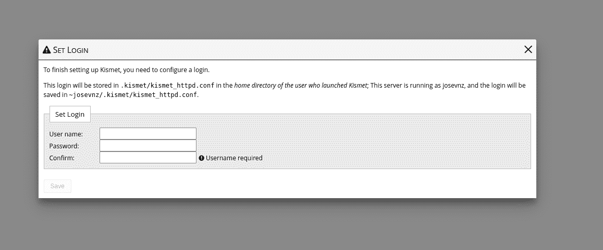
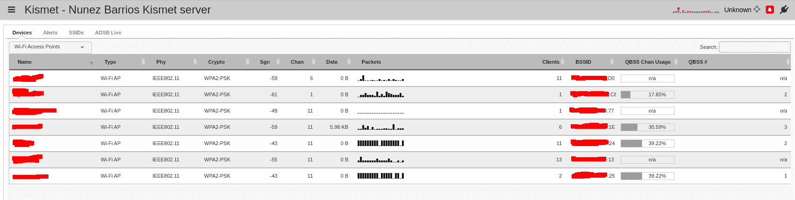
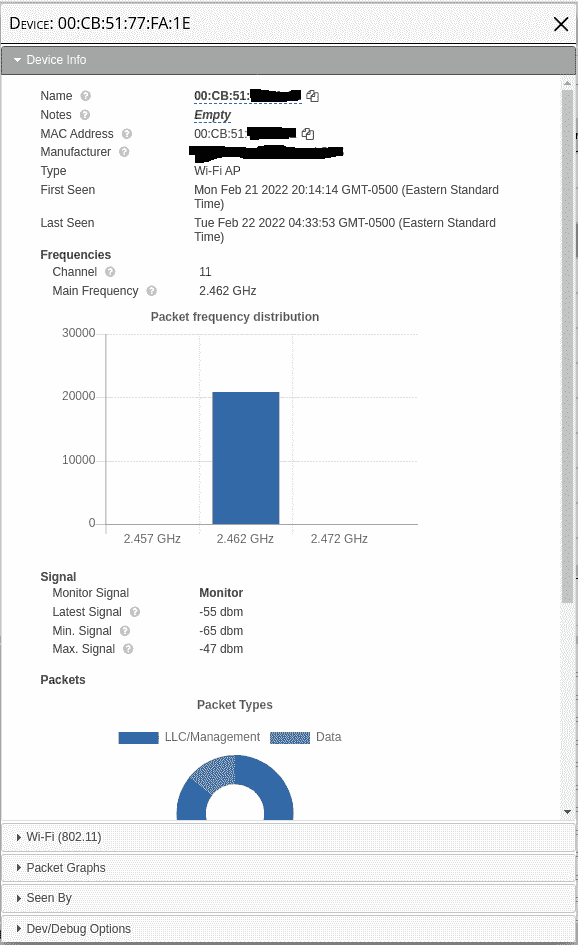
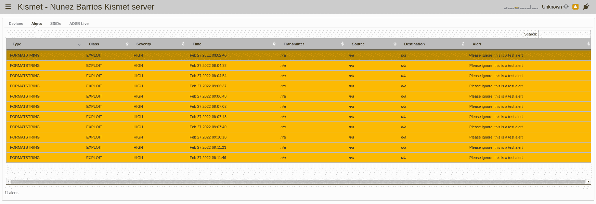
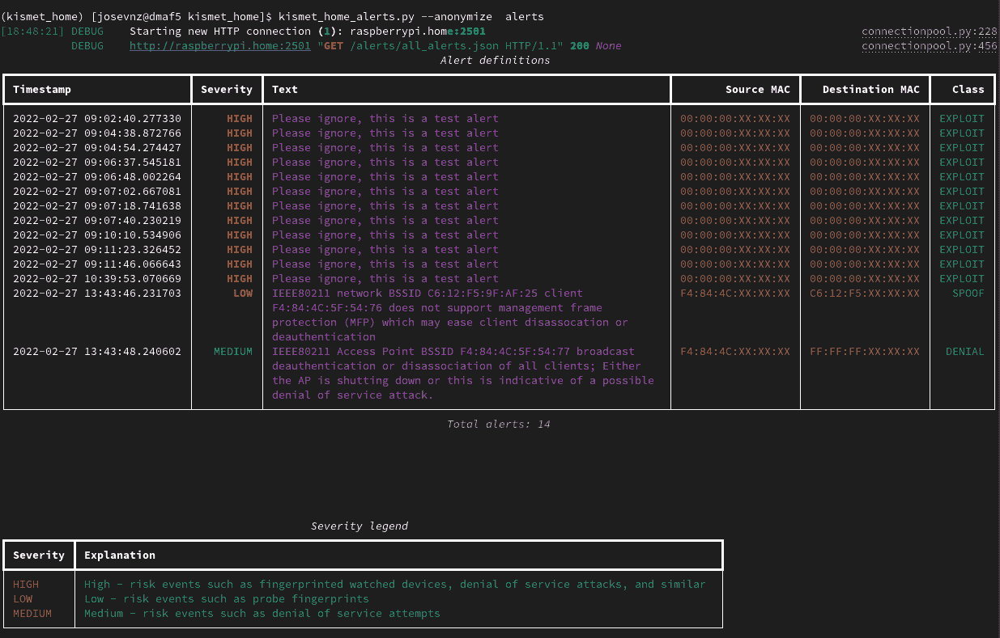

# 如何使用 Kismet 和 Python 保护您的家庭无线基础设施

> 原文：<https://www.freecodecamp.org/news/wireless-security-using-raspberry-pi-4-kismet-and-python/>

如今一切都与无线连接。在我的例子中，在我的家庭网络上运行一个简单的 [nmap 命令后，我发现我有很多设备:](https://www.freecodecamp.org/news/enhance-nmap-with-python/#nmap-101-identify-all-the-public-services-in-our-network)

```
[josevnz@dmaf5 ~]$ sudo nmap -v -n -p- -sT -sV -O --osscan-limit --max-os-tries 1 -oX $HOME/home_scan.xml 192.168.1.0/24 
```

所以我开始怀疑:

*   我的无线网络安全吗？
*   攻击者要多久才能进入？

我有一个安装了 Ubuntu (focal)的*覆盆子 4* ，决定用众所周知的 [Kismet](https://www.kismetwireless.net/) 一探究竟。

在本文中，您将了解到:

*   如何用 Kismet 了解你身边的网络
*   如何使用 Python 和 REST-API 定制 Kismet


If you are curious, this is my home Raspberry PI 4, tiny monitor and all

# 目录

*   [谚语“请求原谅，而不是允许”在这里并不适用](#the-saying-ask-for-forgiveness-not-permission-doesn-t-apply-here)
*   [了解您的硬件](#getting-to-know-your-hardware)
*   [命中注定](#kismet)
*   [REST-API](#restapi)
*   我们学到了什么？

# “请求原谅，而不是许可”这句话在这里并不适用

我的意思是*你不应该试图窃听或渗透不属于你的无线网络*。如果有新的未知客户端加入您的无线网络，检测起来相对容易，而且也是非法的。

所以做正确的事情——用这个教程来学习，不要闯入别人的网络，好吗？

# 了解您的硬件

我将提前一点向您展示 Raspberry 4 集成无线接口的一个小问题。

**Raspberry PI 4 板载无线网卡不能开箱即用**，因为固件不支持监控模式。

有作品[支持这个](https://github.com/seemoo-lab/bcm-rpi3)。相反，我采取了简单的方法，从 [CanaKit](https://www.canakit.com/raspberry-pi-wifi.html) 订购了一个外部 Wi-Fi 加密狗。

CanaKit 无线卡开箱即用，我们很快就会看到它。但是首先让我们安装并使用 Kismet。

## 确保接口在监控模式下运行

默认情况下，网络接口将关闭监控模式:

```
root@raspberrypi:~# iwconfig wlan1
wlan1     IEEE 802.11  ESSID:off/any  
          Mode:Managed  Access Point: Not-Associated   Tx-Power=0 dBm   
          Retry short  long limit:2   RTS thr:off   Fragment thr:off
          Encryption key:off
          Power Management:off 
```

我知道我会将我的 Ralink Technology，Corp. RT5370 无线适配器设置为监控模式，但我需要小心，因为 Ubuntu 可以交换 wlan0 和 wlan1(我想跳过的 Broadcom 适配器是 PCI 设备)。

Ralink 适配器是 USB 适配器，因此我们可以找到它的位置:

```
josevnz@raspberrypi:/etc/netplan$ /bin/lsusb|grep Ralink
Bus 001 Device 004: ID 148f:5370 Ralink Technology, Corp. RT5370 Wireless Adapter 
```

现在我们需要找出映射到 Ralink 适配器的设备。在 Ubuntu 社区的帮助下，我发现雷凌适配器使用 rt2800usb 驱动程序 [5370 雷凌技术](https://help.ubuntu.com/community/WifiDocs/Device/Ralink_RT5370)

我寻求的答案就在这里:

```
josevnz@raspberrypi:~$ ls /sys/bus/usb/drivers/rt2800usb/*:1.0/net/
wlan1 
```

因此，进行无线网卡检测的代码如下所示:

```
root@raspberrypi:~#/bin/cat<<RC_LOCAL>/etc/rc.local
#!/bin/bash
usb_driver=rt2800usb
wlan=\$(/bin/ls /sys/bus/usb/drivers/\$usb_driver/*/net/)
if [ $? -eq 0 ]; then
        set -ex
        /usr/sbin/ifconfig "\$wlan" down
        /usr/sbin/iwconfig "\$wlan" mode monitor
        /usr/sbin/ifconfig "\$wlan" up
        set +ex
fi
RC_LOCAL
root@raspberrypi:~# chmod u+x /etc/rc.local && shutdown -r now "Enabling monitor mode" 
```

确保卡处于监控模式:

```
root@raspberrypi:~# iwconfig wlan1
iw        iwconfig  iwevent   iwgetid   iwlist    iwpriv    iwspy     
root@raspberrypi:~# iwconfig wlan1
wlan1     IEEE 802.11  Mode:Monitor  Frequency:2.412 GHz  Tx-Power=20 dBm   
          Retry short  long limit:2   RTS thr:off   Fragment thr:off
          Power Management:off 
```

很好，让我们继续工具设置

# 什么是 Kismet？

[天命](https://www.kismetwireless.net/)是:

> 无线网络和设备检测器、嗅探器、驱动工具和 WIDS(无线入侵检测)框架。

## Kismet 安装和设置

Ubuntu RaspberryPI 默认自带的版本是 2016 年的，*太老了*。

取而代之的是，获得一个更新的二进制文件，就像这里解释的那样(我有 Ubuntu focal，和`lsb_release --all`核实一下)。

```
wget -O - https://www.kismetwireless.net/repos/kismet-release.gpg.key | sudo apt-key add -
echo 'deb https://www.kismetwireless.net/repos/apt/release/focal focal main' | sudo tee /etc/apt/sources.list.d/kismet.list
sudo apt update
sudo apt install kismet 
```

### 不要以 root 用户身份运行，使用 [SUID 二进制文件](https://en.wikipedia.org/wiki/Setuid)和 unix 组访问

Kismet 需要提升权限才能运行。并处理可能有敌意的数据。因此，使用最小化的权限运行是最安全的方法。

设置它的正确方法是使用一个 Unix 组并设置用户 id ( *SUID* )二进制。我的用户是“josevnz ”,所以我这样做了:

```
sudo apt-get install kismet
sudo usermod --append --groups kismet josevnz 
```

### 使用自签名证书加密您对 Kismet 的访问

我将使用自签名证书为我的 Kismet [安装启用 SSL。为此，我将使用 Cloudflare CFSSL 工具:](https://github.com/josevnz/home_nmap/tree/main/tutorial)

```
sudo apt-get update -y
sudo apt-get install -y golang-cfssl 
```

下一步是创建自签名证书。这里有许多样板步骤，所以我将向您展示如何跳过它们(但是请阅读手册页以了解每个命令的作用):

#### 初始证书

```
sudo /bin/mkdir --parents /etc/pki/raspberrypi
sudo /bin/cat<<CA>/etc/pki/raspberrypi/ca.json
{
   "CN": "Nunez Barrios family Root CA",
   "key": {
     "algo": "rsa",
     "size": 2048
   },
   "names": [
   {
     "C": "US",
     "L": "CT",
     "O": "Nunez Barrios",
     "OU": "Nunez Barrios Root CA",
     "ST": "United States"
   }
  ]
}
CA
cfssl gencert -initca ca.json | cfssljson -bare ca 
```

#### SSL 配置文件配置

```
root@raspberrypi:/etc/pki/raspberrypi# /bin/cat<<PROFILE>/etc/pki/raspberrypi/cfssl.json
{
   "signing": {
     "default": {
       "expiry": "17532h"
     },
     "profiles": {
       "intermediate_ca": {
         "usages": [
             "signing",
             "digital signature",
             "key encipherment",
             "cert sign",
             "crl sign",
             "server auth",
             "client auth"
         ],
         "expiry": "17532h",
         "ca_constraint": {
             "is_ca": true,
             "max_path_len": 0, 
             "max_path_len_zero": true
         }
       },
       "peer": {
         "usages": [
             "signing",
             "digital signature",
             "key encipherment", 
             "client auth",
             "server auth"
         ],
         "expiry": "17532h"
       },
       "server": {
         "usages": [
           "signing",
           "digital signing",
           "key encipherment",
           "server auth"
         ],
         "expiry": "17532h"
       },
       "client": {
         "usages": [
           "signing",
           "digital signature",
           "key encipherment", 
           "client auth"
         ],
         "expiry": "17532h"
       }
     }
   }
}
PROFILE 
```

#### 中级证书

```
root@raspberrypi:/etc/pki/raspberrypi# /bin/cat<<INTERMEDIATE>/etc/pki/raspberrypi/intermediate-ca.json
{
  "CN": "Barrios Nunez Intermediate CA",
  "key": {
    "algo": "rsa",
    "size": 2048
  },
  "names": [
    {
      "C":  "US",
      "L":  "CT",
      "O":  "Barrios Nunez",
      "OU": "Barrios Nunez Intermediate CA",
      "ST": "USA"
    }
  ],
  "ca": {
    "expiry": "43830h"
  }
}
INTERMEDIATE
cfssl gencert -initca intermediate-ca.json | cfssljson -bare intermediate_ca
cfssl sign -ca ca.pem -ca-key ca-key.pem -config cfssl.json -profile intermediate_ca intermediate_ca.csr | cfssljson -bare intermediate_ca 
```

#### Raspberry PI 4 机器上 SSL 证书的配置

我们在这里输入将运行我们的 Kismet web 应用程序的机器的名称和 IP 地址:

```
/bin/cat<<RASPBERRYPI>/etc/pki/raspberrypi/raspberrypi.home.json
{
  "CN": "raspberrypi.home",
  "key": {
    "algo": "rsa",
    "size": 2048
  },
  "names": [
  {
    "C": "US",
    "L": "CT",
    "O": "Barrios Nunez",
    "OU": "Barrios Nunez Hosts",
    "ST": "USA"
  }
  ],
  "hosts": [
    "raspberrypi.home",
    "localhost",
    "raspberrypi",
    "192.168.1.11"
  ]               
}
RASPBERRYPI
cd /etc/pki/raspberrypi
cfssl gencert -ca intermediate_ca.pem -ca-key intermediate_ca-key.pem -config cfssl.json -profile=peer raspberrypi.home.json| cfssljson -bare raspberry-peer
cfssl gencert -ca intermediate_ca.pem -ca-key intermediate_ca-key.pem -config cfssl.json -profile=server raspberrypi.home.json| cfssljson -bare raspberry-server
cfssl gencert -ca intermediate_ca.pem -ca-key intermediate_ca-key.pem -config cfssl.json -profile=client raspberrypi.home.json| cfssljson -bare raspberry-client 
```

添加 SSL 支持就像添加以下覆盖一样简单:

```
/bin/cat<<SSL>>/etc/kismet/kismet_site.conf
httpd_ssl=true
httpd_ssl_cert=/etc/pki/raspberrypi/raspberry-server.csr
httpd_ssl_key=/etc/pki/raspberrypi/raspberry-server-key.pem
SSL 
```

### 用 Kismet 的“站点”覆盖文件将所有内容放在一起

Kismet 有一个非常好的特性:它可以使用一个文件覆盖一些默认值，而不需要编辑多个文件。在这种情况下，我的安装将覆盖 SSL 设置、Wifi 接口和日志位置。所以是时候更新我们的/etc/rc.local 文件了:

```
#!/bin/bash
# Kismet setup
usb_driver=rt2800usb
wlan=$(ls /sys/bus/usb/drivers/$usb_driver/*/net/)
if [ $? -eq 0 ]; then
    set -ex
    /usr/sbin/ifconfig "$wlan" down
    /usr/sbin/iwconfig "$wlan" mode monitor
    /usr/sbin/ifconfig "$wlan" up
    set +ex
    /bin/cat<<KISMETOVERR>/etc/kismet/kismet_site.conf
server_name=Nunez Barrios Kismet server
logprefix=/data/kismet
source=$wlan
httpd_ssl=true
httpd_ssl_cert=/etc/pki/raspberrypi/raspberry-server.csr
httpd_ssl_key=/etc/pki/raspberrypi/raspberry-server-key.pem
KISMETOVERR
fi 
```

最后，是时候启动 Kismet 了(在我的例子中是作为非 root 用户 josevnz):

```
# If you know which interface is the one in monitoring mode, then 
josevnz@raspberrypi:~$ kismet 
```

现在让我们第一次登录 web 界面(在我的例子中是 http://raspberripi . home:2501



You will get a prompt the first time you try to log in your Kismet installation

在这里你可以设置你的管理员用户和密码。



Example of the wireless networks detected

过了一会儿，Kismet 将在主仪表板上显示它可以检测到的无线网络和设备的列表。你会惊讶的不仅仅是有多少相邻的设备，还有你自己家里有多少。

在我的例子中，我周围的无线设备看起来很正常，除了一个没有名字的设备:



A device with suspicious characteristics

web 界面提供了各种有用的信息，但是有没有一种简单的方法来过滤我网络上的所有 mac 地址呢？

Kismet 有一个 REST API，所以是时候看看我们能从那里自动化些什么了。

# Python 中的 REST-API

[开发者文档](https://www.kismetwireless.net/docs/devel_group.html)包含了如何扩展 Kismet 的例子，特别是与 Python 中的[官方 Kismet REST-API 相关的例子。](https://github.com/kismetwireless/python-kismet-rest)

但它似乎缺少一个使用 API 密钥而不是用户/密码的功能。而且和端点的交互好像也不复杂，我就写我的(功能不太丰富的)包装器吧。

您可以下载并安装我编写的一个小应用程序的代码( [kismet_home](https://github.com/josevnz/kismet_home) )来演示如何使用 kismet(也有本教程的副本)，如下所示:

```
python3 -m venv ~/virtualenv/kismet_home
. ~/virtualenv/kismet_home/bin/activate
python -m pip install --upgrade pip
git clone git@github.com:josevnz/kismet_home.git
python setup.py bdist_wheel
pip install kismet_home-0.0.1-py3-none-any.whl 
```

然后运行单元测试/集成测试，甚至第三方漏洞扫描器:

```
. ~/virtualenv/kismet_home/bin/activate
# Unit/ integration tests
python -m unittest test/unit_test_config.py
python -m unittest /home/josevnz/kismet_home/test/test_integration_kismet.py
# Third party vulnerability scanner
pip-audit  --requirement requirements.txt 
```

你会在 [README.md](https://github.com/josevnz/kismet_home/blob/main/README.md) 和 [DEVELOPER.md](https://github.com/josevnz/kismet_home/blob/main/DEVELOPER.md) 文件中找到更多细节。

让我们继续看代码。

### 如何使用 Python 与 Kismet 交互

首先，我将编写一个通用的 HTTP 客户端，我可以用它来查询 Kismet 或者向 Kismet 发送命令，这就是 KismetWorker 类:

```
import json
from datetime import datetime
from typing import Any, Dict, Set, List, Union
import requests

class KismetBase:

    def __init__(self, *, api_key: str, url: str):
        """
        Parametric constructor
        :param api_key: The Kismet generated API key
        :param url: URL where the Kismet server is running
        """
        self.api_key = api_key
        if url[-1] != '/':
            self.url = f"{url}/"
        else:
            self.url = url
        self.cookies = {'KISMET': self.api_key}

    def __str__(self):
        return f"url={self.url}, api_key=XXX"

class KismetWorker(KismetBase):

    def check_session(self) -> None:
        """
        Confirm if the session is valid for a given API key
        :return: None, throws an exception if the session is invalid
        """
        endpoint = f"{self.url}session/check_session"
        r = requests.get(endpoint, cookies=self.cookies)
        r.raise_for_status()

    def check_system_status(self) -> Dict[str, Any]:
        """
        Overall status of the Kismet server
        :return: Nested dictionary describing different aspect of the Kismet system
        """
        endpoint = f"{self.url}system/status.json"
        r = requests.get(endpoint, cookies=self.cookies)
        r.raise_for_status()
        return json.loads(r.text)

    def get_all_alerts(self) -> Any:
        """
        You can get a description how the alert system is set up as shown here: /alerts/definitions.prettyjson
        This method returns the last N alerts registered by the system. Severity and meaning of the alert is explained
        here: https://www.kismetwireless.net/docs/devel/webui_rest/alerts/
        :return:
        """
        endpoint = f"{self.url}alerts/all_alerts.json"
        r = requests.get(endpoint, cookies=self.cookies)
        r.raise_for_status()
        return json.loads(r.text)

    def get_alert_by_hash(self, identifier: str) -> Dict[str, Any]:
        """
        Get details of a single alert by its identifier (hash)
        :return:
        """
        parsed = int(identifier)
        if parsed < 0:
            raise ValueError(f"Invalid ID provided: {identifier}")
        endpoint = f"{self.url}alerts/by-id/{identifier}/alert.json"
        r = requests.get(endpoint, cookies=self.cookies)
        r.raise_for_status()
        return json.loads(r.text)

    def get_alert_definitions(self) -> Dict[Union[str, int], Any]:
        """
        Get the defined alert types
        :return:
        """
        endpoint = f"{self.url}alerts/definitions.json"
        r = requests.get(endpoint, cookies=self.cookies)
        r.raise_for_status()
        return json.loads(r.text) 
```

Kismet API 的工作方式是让 API 成为查询的关键部分，或者在 KISMET cookie 中定义它。我选择填充 cookie。

KismetWorker 实现了以下方法:

*   **check_session** :检查你的 API 密匙是否有效。如果不是，它将抛出一个异常。
*   **check_system_status** :验证管理员(很可能是您)是否为 Kismet 服务器定义了管理员。否则，所有的 API 查询都将失败。
*   **get_all_alerts** :从您的 Kismet 服务器获取所有可用的警报(如果有的话)。
*   **get_alert_by_hash** :如果您知道一个警报的标识符(hash)，那么您可以只检索该事件的详细信息。
*   **get_alert_definitions** :获取所有的预警定义。Kismet 支持广泛的警报，用户肯定会有兴趣了解它们是什么类型的警报。

你可以在这里看到所有的集成代码，看看这些方法是如何工作的。

我还写了一个需要管理员权限的类。作为集成测试的一部分，我使用它来定义一个定制的警报类型，并使用该类型向 Kismet 发送警报。目前，我在现实生活中还没有多少机会向 Kismet 发送自定义警报，但将来可能会有所改变，所以代码如下:

```
class KismetAdmin(KismetBase):

    def define_alert(
            self,
            *,
            name: str,
            description: str,
            throttle: str = '10/min',
            burst: str = "1/sec",
            severity: int = 5,
            aclass: str = 'SYSTEM'

    ):
        """
        Define a new type of alert for Kismet
        :param aclass: Alert class
        :param severity: Alert severity
        :param throttle: Optional throttle
        :param name: Name of the new alert
        :param description: What does this mean
        :param burst: Optional burst
        :return:
        """
        endpoint = f"{self.url}alerts/definitions/define_alert.cmd"
        command = {
            'name': name,
            'description': description,
            'throttle': throttle,
            'burst': burst,
            'severity': severity,
            'class': aclass
        }
        r = requests.post(endpoint, json=command, cookies=self.cookies)
        r.raise_for_status()

    def raise_alert(
            self,
            *,
            name: str,
            message: str
    ) -> None:
        """
        Send an alert to Kismet
        :param name: A well-defined name or id for the alert. MUST exist
        :param message: Message to send
        :return: None. Will raise an error if the alert could not be sent
        """
        endpoint = f"{self.url}alerts/raise_alerts.cmd"
        command = {
            'name': name,
            'text': message
        }
        r = requests.post(endpoint, json=command, cookies=self.cookies)
        r.raise_for_status() 
```

获取数据只是故事的一部分。我们需要将其规范化，以便最终的脚本可以使用它。

### 如何使 Kismet 原始数据正常化

Kismet 包含许多关于警报的细节，但是我们不要求向用户显示这些细节(想想您通过 web 应用程序获得的漂亮视图)。相反，我们使用下面的类和静态方法进行一些转换:

*   **parse_alert_definitions** :返回所有警报定义的简化报告
*   **process_alerts** :将数字警报更改为更具描述性的类型，并返回这些警报的类型和严重性含义的字典。
*   **pretty_timestamp** :将数字时间戳转换成我们可以用来比较和显示的东西

KismetResultsParser 助手类的代码:

```
class KismetResultsParser:
    SEVERITY = {
        0: {
            'name': 'INFO',
            'description': 'Informational alerts, such as datasource  errors, Kismet state changes, etc'
        },
        5: {
            'name': 'LOW',
            'description': 'Low - risk events such as probe fingerprints'
        },
        10: {
            'name': 'MEDIUM',
            'description': 'Medium - risk events such as denial of service attempts'
        },
        15: {
            'name': 'HIGH',
            'description': 'High - risk events such as fingerprinted watched devices, denial of service attacks, '
                           'and similar '
        },
        20: {
            'name': 'CRITICAL',
            'description': 'Critical errors such as fingerprinted known exploits'
        }
    }

    TYPES = {
        'DENIAL': 'Possible denial of service attack',
        'EXPLOIT': 'Known fingerprinted exploit attempt against a vulnerability',
        'OTHER': 'General category for alerts which don’t fit in any existing bucket',
        'PROBE': 'Probe by known tools',
        'SPOOF': 'Attempt to spoof an existing device',
        'SYSTEM': 'System events, such as log changes, datasource errors, etc.'
    }

    @staticmethod
    def parse_alert_definitions(
            *,
            alert_definitions: List[Dict[str, str]],
            keys_of_interest: Set[str] = None
    ) -> List[Dict[str, str]]:
        """
        Remove unwanted keys from full alert definition dump, to make it easier to read onscreen
        :param alert_definitions: Original Kismet alert definitions
        :param keys_of_interest: Kismet keys of interest
        :return: List of dictionaries with trimmed keys, description, severity and header for easy reading
        """
        if keys_of_interest is None:
            keys_of_interest = {
                'kismet.alert.definition.class',
                'kismet.alert.definition.description',
                'kismet.alert.definition.severity',
                'kismet.alert.definition.header'
            }
        parsed_alerts: List[Dict[str, str]] = []
        for definition in alert_definitions:
            new_definition = {}
            for def_key in definition:
                if def_key in keys_of_interest:
                    new_key = def_key.split('.')[-1]
                    new_definition[new_key] = definition[def_key]
            parsed_alerts.append(new_definition)
        return parsed_alerts

    @staticmethod
    def process_alerts(
            *,
            alerts: List[Dict[str, Union[str, int]]],

    ) -> Any:
        """
        Removed unwanted fields from alert details, also return extra data for severity and types of alerts
        :param alerts:
        :return:
        """
        processed_alerts = []
        found_types = {}
        found_severities = {}
        for alert in alerts:
            severity = alert['kismet.alert.severity']
            severity_name = KismetResultsParser.SEVERITY[severity]['name']
            severity_desc = KismetResultsParser.SEVERITY[severity]['description']
            found_severities[severity_name] = severity_desc
            text = alert['kismet.alert.text']
            aclass = alert['kismet.alert.class']
            found_types[aclass] = KismetResultsParser.TYPES[aclass]
            processed_alert = {
                'text': text,
                'class': aclass,
                'severity': severity_name,
                'hash': alert['kismet.alert.hash'],
                'dest_mac': alert['kismet.alert.dest_mac'],
                'source_mac': alert['kismet.alert.source_mac'],
                'timestamp': alert['kismet.alert.timestamp']
            }
            processed_alerts.append(processed_alert)
        return processed_alerts, found_severities, found_types

    @staticmethod
    def pretty_timestamp(timestamp: float) -> datetime:
        """
        Convert a Kismet timestamp (TIMESTAMP.UTIMESTAMP) into a pretty timestamp string
        :param timestamp:
        :return:
        """
        return datetime.fromtimestamp(timestamp) 
```

如果您在启用管理员角色的情况下运行集成测试，您将会看到一个或多个(取决于您运行测试的次数)警报被添加到 Web UI:



These alerts where generated using the Python client and the REST API

提醒一下，你可以通过查看这里的代码[来了解这是如何使用的。显示了针对我的安装运行的所有集成测试的示例(这一次没有发布警报，因此跳过了一些测试):](https://github.com/josevnz/kismet_home/blob/main/test/test_integration_kismet.py)

```
(kismet_home) [josevnz@dmaf5 kismet_home]$ python -m unittest /home/josevnz/kismet_home/test/test_integration_kismet.py 
[09:13:05] DEBUG    Starting new HTTP connection (1): raspberrypi.home:2501                                                                                                                                                        connectionpool.py:228
           DEBUG    http://raspberrypi.home:2501 "GET /session/check_session HTTP/1.1" 200 None                                                                                                                                    connectionpool.py:456
.           DEBUG    Starting new HTTP connection (1): raspberrypi.home:2501                                                                                                                                                        connectionpool.py:228
           DEBUG    http://raspberrypi.home:2501 "GET /system/status.json HTTP/1.1" 200 None                                                                                                                                       connectionpool.py:456
.           DEBUG    Starting new HTTP connection (1): raspberrypi.home:2501                                                                                                                                                        connectionpool.py:228
           DEBUG    http://raspberrypi.home:2501 "GET /alerts/definitions.json HTTP/1.1" 200 None                                                                                                                                  connectionpool.py:456
.[09:13:05] 'ADMIN_SESSION_API' environment variable not defined. Skipping this test                                                                                                                                       test_integration_kismet.py:105
....
----------------------------------------------------------------------
Ran 7 tests in 0.053s

OK 
```

### 我们在哪里存储我们的 API 密匙和其他配置细节？

像这样的细节不会被硬编码到脚本中，而是保存在外部配置文件中:

```
(kismet_home) [josevnz@dmaf5 kismet_home]$ cat ~/.config/kodegeek/kismet_home/config.ini 
[server]
url = http://raspberrypi.home:2501
api_key = E41CAD466552810392D538FF8D43E2C5 
```

以下类处理所有的访问细节(对每种类型的操作使用一个 Reader 和一个 Writer 类):

```
"""
Simple configuration management for kismet_home settings
"""
import os.path
from configparser import ConfigParser
from pathlib import Path
from typing import Dict

from kismet_home import CONSOLE

DEFAULT_INI = os.path.expanduser('~/.config/kodegeek/kismet_home/config.ini')
VALID_KEYS = {'api_key', 'url'}

class Reader:

    def __init__(self, config_file: str = DEFAULT_INI):
        """
        Constructor
        :param config_file: Optional override of the ini configuration file
        """
        self.config = ConfigParser()
        if not self.config.read(config_file):
            raise ValueError(f"Could not read {config_file}")

    def get_api_key(self):
        """
        Get back the API key used to connect to Kismet
        :return:
        """
        return self.config.get('server', 'api_key')

    def get_url(self):
        """
        Get back URL of Kismet server
        :return:
        """
        return self.config.get('server', 'url')

class Writer:

    def __init__(
            self,
            *,
            server_keys: Dict[str, str]
    ):
        if not server_keys:
            raise ValueError("Configuration is incomplete!, aborting!")
        self.config = ConfigParser()
        self.config.add_section('server')
        valid_keys_cnt = 0
        for key in server_keys:
            value = server_keys[key]
            if key not in VALID_KEYS:
                CONSOLE.log(f"Ignoring invalid key: {key} = {value}")
                continue
            self.config.set('server', key, value)
            CONSOLE.log(f"Added: server: {key} = {value}")
        for valid_key in VALID_KEYS:
            if not self.config.get('server', valid_key):
                raise ValueError(f"Missing required key: {valid_key}")

    def save(
            self,
            *,
            config_file: str = DEFAULT_INI
    ):
        basedir = Path(config_file).parent
        basedir.mkdir(exist_ok=True, parents=True)
        with open(config_file, 'w') as config:
            self.config.write(config, space_around_delimiters=True)
        CONSOLE.log(f"Configuration file {config_file} written") 
```

第一次设置 kismet_home 安装时，可以像这样创建配置文件:

```
[josevnz@dmaf5 kismet_home]$ python3 -m venv ~/virtualenv/kismet_home
[josevnz@dmaf5 kismet_home]$ . ~/virtualenv/kismet_home/bin/activate
(kismet_home) [josevnz@dmaf5 kismet_home]$ python -m pip install --upgrade pip
(kismet_home) [josevnz@dmaf5 kismet_home]$ git clone git@github.com:josevnz/kismet_home.git
(kismet_home) [josevnz@dmaf5 kismet_home]$ python setup.py bdist_wheel
(kismet_home) [josevnz@dmaf5 kismet_home]$ pip install kismet_home-0.0.1-py3-none-any.whl

(kismet_home) [josevnz@dmaf5 kismet_home]$ kismet_home_config.py 
Please enter the URL of your Kismet server: http://raspberrypi.home:2501/
Please enter your API key: E41CAD466552810392D538FF8D43E2C5
[13:02:35] Added: server: url = http://raspberrypi.home:2501/                                                                                 config.py:44
           Added: server: api_key = E41CAD466552810392D538FF8D43E2C5                                                                          config.py:44
           Configuration file /home/josevnz/.config/kodegeek/kismet_home/config.ini written 
```

请注意这里虚拟环境的使用。这将允许我们保持应用程序库的自包含性。

## 将所有东西放在一起:如何为 kismet_home 编写我们的 CLI

*kismet_home_alerts.py* 脚本将支持两种模式:

*   显示警报定义
*   显示所有警报

此外，它还允许根据级别(信息、中、高，...).

显示所有定义，按关键筛选:


You can see here the alert definitions filtered by level

或者显示到目前为止收到的所有警报，带有匿名 MAC 地址(非常适合这样的截图):



Alerts for my local network, with anonymous MAC addresses and filtered

如何轻松生成这些表格？文本用户界面(TUI)有一个专用的类:

```
from typing import List, Dict, Any

from rich.layout import Layout
from rich.table import Table

from kismet_home.kismet import KismetResultsParser

def create_alert_definition_table(
        *,
        alert_definitions: List[Dict[str, Any]],
        level_filter: str = 0
) -> Table:
    """
    Create a table showing the alert definitions
    :param alert_definitions: Alert definitions from Kismet
    :param level_filter: User can override the level of the alerts shown. But default is 0 (INFO)
    :return: A Table with the alert definitions
    """
    definition_table = Table(title="Alert definitions")
    definition_table.add_column("Severity", justify="right", style="cyan", no_wrap=True)
    definition_table.add_column("Description", style="magenta")
    definition_table.add_column("Header", justify="right", style="yellow")
    definition_table.add_column("Class", justify="right", style="green")
    filter_level = KismetResultsParser.get_level_for_security(level_filter)
    filtered_definitions = 0
    for definition in alert_definitions:
        int_severity: int = definition['severity']
        if int_severity < filter_level:
            continue
        severity = KismetResultsParser.SEVERITY[int_severity]['name']
        if 0 <= int_severity < 5:
            severity = f"[bold blue]{severity}[/ bold blue]"
        if 5 <= int_severity < 10:
            severity = f"[bold yellow]{severity}[/ bold yellow]"
        if 10 <= int_severity < 15:
            severity = f"[bold orange]{severity}[/ bold orange]"
        else:
            severity = f"[bold red]{severity}[/ bold red]"
        filtered_definitions += 1
        definition_table.add_row(
            severity,
            definition['description'],
            definition['header'],
            definition['class']
        )
    definition_table.caption = f"Total definitions: {filtered_definitions}"
    return definition_table

def create_alert_layout(
        *,
        alerts: List[Dict[str, Any]],
        level_filter: str = 0,
        anonymize: bool = False,
        severities: Dict[str, str]
):
    """
    :param severities:
    :param alerts:
    :param level_filter:
    :param anonymize:
    :return:
    """
    alerts_table = Table(title="Alert definitions")
    alerts_table.add_column("Timestamp", no_wrap=True)
    alerts_table.add_column("Severity", justify="right", style="cyan", no_wrap=True)
    alerts_table.add_column("Text", style="magenta")
    alerts_table.add_column("Source MAC", justify="right", style="yellow", no_wrap=True)
    alerts_table.add_column("Destination MAC", justify="right", style="yellow", no_wrap=True)
    alerts_table.add_column("Class", justify="right", style="green", no_wrap=True)
    filter_level = KismetResultsParser.get_level_for_security(level_filter)

    filtered_definitions = 0
    for alert in alerts:
        int_severity: int = KismetResultsParser.get_level_for_security(alert['severity'])
        if int_severity < filter_level:
            continue
        severity = KismetResultsParser.SEVERITY[int_severity]['name']
        if 0 <= int_severity < 5:
            severity = f"[bold blue]{severity}[/ bold blue]"
        if 5 <= int_severity < 10:
            severity = f"[bold yellow]{severity}[/ bold yellow]"
        if 10 <= int_severity < 15:
            severity = f"[bold orange]{severity}[/ bold orange]"
        else:
            severity = f"[bold red]{severity}[/ bold red]"
        filtered_definitions += 1
        if anonymize:
            s_mac = KismetResultsParser.anonymize_mac(alert['source_mac'])
            d_mac = KismetResultsParser.anonymize_mac(alert['dest_mac'])
        else:
            s_mac = alert['source_mac']
            d_mac = alert['dest_mac']
        alerts_table.add_row(
            str(KismetResultsParser.pretty_timestamp(alert['timestamp'])),
            severity,
            alert['text'],
            s_mac,
            d_mac,
            alert['class']
        )
    alerts_table.caption = f"Total alerts: {filtered_definitions}"

    severities_table = Table(title="Severity legend")
    severities_table.add_column("Severity")
    severities_table.add_column("Explanation")
    for severity in severities:
        explanation = f"[green]{severities[severity]}[/green]"
        severities_table.add_row(f"[yellow]{severity}[/yellow]", explanation)

    layout = Layout()
    layout.split(
        Layout(ratio=2, name="alerts"),
        Layout(name="severities"),
    )
    layout["alerts"].update(alerts_table)
    layout["severities"].update(severities_table)
    return layout, filtered_definitions 
```

现在所有的成分都准备好了，我们可以看看最终的脚本是什么样子的:

```
#!/usr/bin/env python
"""
# kismet_home_alerts.py
# Author
Jose Vicente Nunez Zuleta (kodegeek.com@protonmail.com)
"""
import logging
import sys

from requests import HTTPError
import argparse

from kismet_home import CONSOLE
from kismet_home.config import Reader
from kismet_home.kismet import KismetWorker, KismetResultsParser
from kismet_home.tui import create_alert_definition_table, create_alert_layout

if __name__ == '__main__':

    arg_parser = argparse.ArgumentParser(
        description="Display alerts generated by your local Kismet installation",
        prog=__file__
    )
    arg_parser.add_argument(
        '--debug',
        action='store_true',
        default=False,
        help="Enable debug mode"
    )
    arg_parser.add_argument(
        '--anonymize',
        action='store_true',
        default=False,
        help="Anonymize MAC addresses"
    )
    arg_parser.add_argument(
        '--level',
        action='store',
        default='INFO',
        help="Enable debug mode"
    )
    arg_parser.add_argument(
        'mode',
        action='store',
        choices=['alert_type', 'alerts'],
        help="Operation mode"
    )

    try:
        args = arg_parser.parse_args()
        conf_reader = Reader()
        kw = KismetWorker(
            api_key=conf_reader.get_api_key(),
            url=conf_reader.get_url()
        )
        if args.mode == 'alert_type':
            alert_definitions = KismetResultsParser.parse_alert_definitions(
                alert_definitions=kw.get_alert_definitions()
            )
            table = create_alert_definition_table(alert_definitions=alert_definitions, level_filter=args.level)
            if table.columns:
                CONSOLE.print(table)
            else:
                CONSOLE.print(f"[b]Could not get alert definitions![/b]")
        elif args.mode == 'alerts':
            alerts, severities, types = KismetResultsParser.process_alerts(
                alerts=kw.get_all_alerts()
            )
            layout, found = create_alert_layout(
                alerts=alerts,
                level_filter=args.level,
                anonymize=args.anonymize,
                severities=severities
            )
            if found:
                CONSOLE.print(layout)
            else:
                CONSOLE.print(f"[b]No alerts to show for level={args.level}[/b]")
    except (ValueError, HTTPError):
        logging.exception("There was an error")
        sys.exit(100)
    except KeyboardInterrupt:
        CONSOLE.log("Scan interrupted, exiting...")
    sys.exit(0) 
```

需要注意一些事情:

*   这不是一个长期运行的应用程序。相反，是所有警报的快照。举例来说，如果你想通过电子邮件或者像 [grafana](https://grafana.com/) 这样的框架来转发这些警告，你最好使用 [Websockets](https://pypi.org/project/websockets/) 和一种只检索最后更改的方法。
*   布局粗糙，有很大的改进空间。但是我们的小 tui 显示的是相关信息，没有太多干扰
*   如果编码很有趣的话！

# 我们学到了什么？

*   如何安装 Kismet 并用自签名 SSL 证书保护它
*   如何编写一个简单的 Bash 脚本，在 RaspBerryPI 重启后，在 monitor 模式下设置正确的无线接口
*   如何添加具有只读访问权限的 API 密钥，以使用它代替旧的用户/密码模式进行身份验证和授权
*   如何用 Python 编写可以使用其 REST-API 与 Kismet 通信的类
*   如何向代码中添加单元测试和集成测试，以确保一切正常，并且新的代码更改不会破坏现有的功能

请在 [git 库](https://github.com/josevnz/kismet_home)上留下您的评论，并报告任何错误。但更重要的是获得 Kismet，获得本教程的代码，并立即开始保护您的家庭无线基础设施。