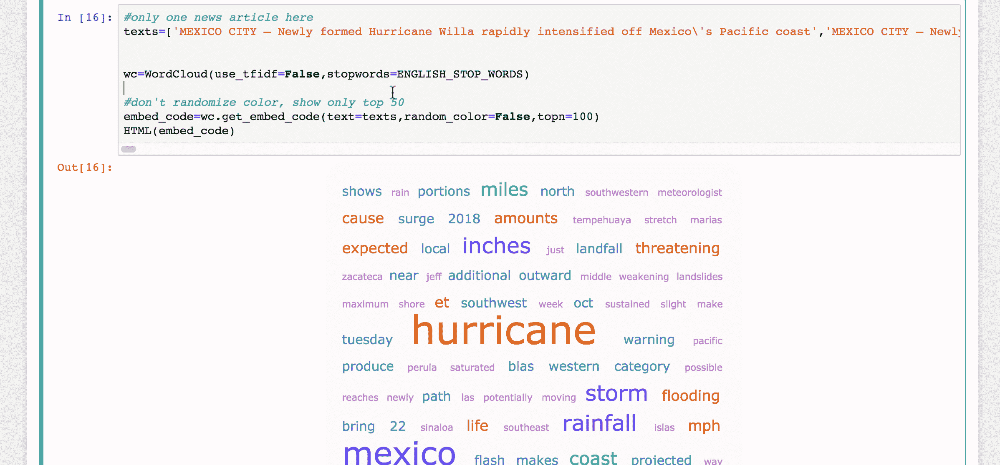
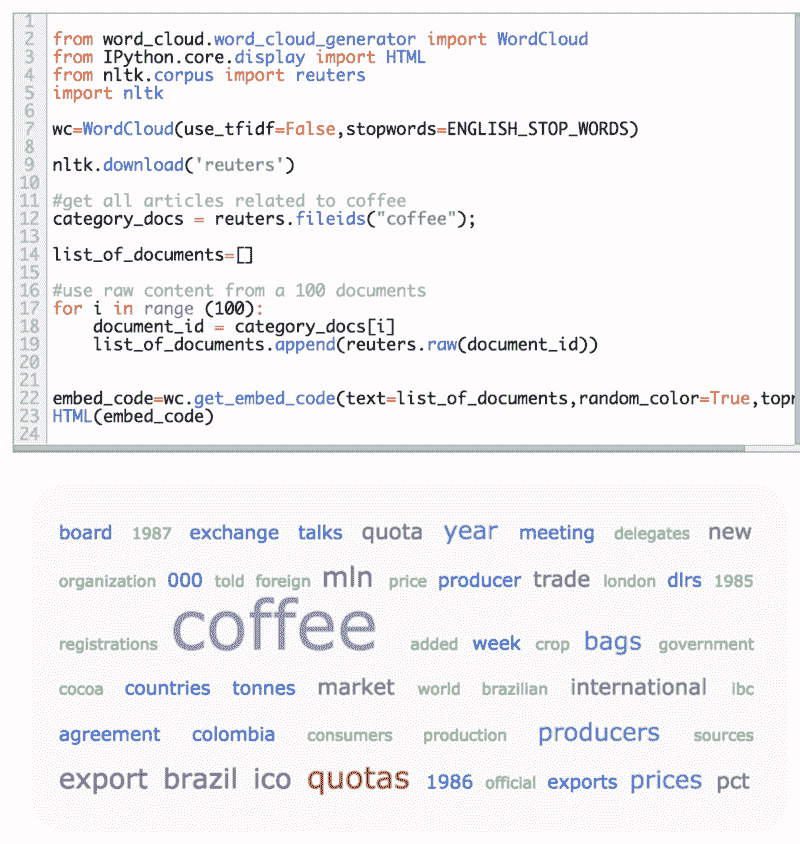
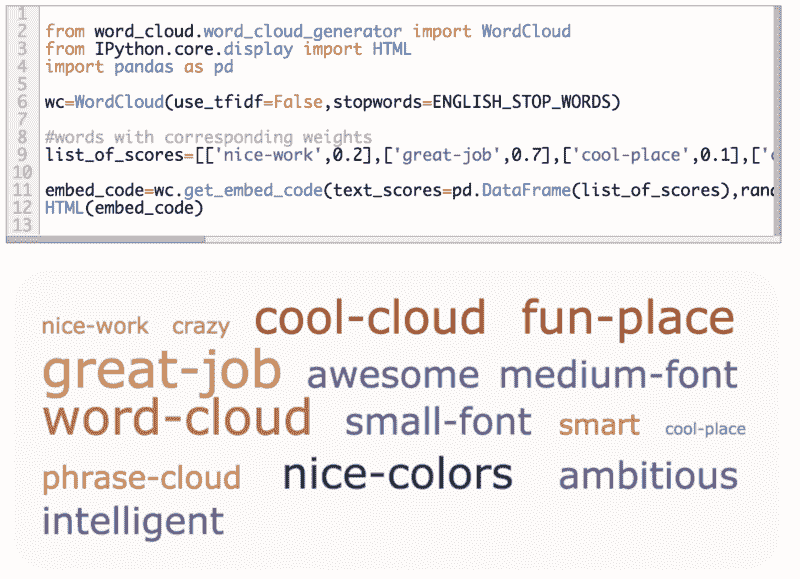

# 为数据科学家创造文字云的简单方法

> 原文：<https://www.freecodecamp.org/news/word-cloud-for-data-scientists-76b8a907e04e/>

作者:卡维塔·加内桑

# 为数据科学家创造文字云的简单方法

word_cloud python library

大约一年前，我到处寻找可以在我的 Jupyter 笔记本中使用的 Python 单词云库。我需要它足够灵活，可以在需要时使用`counts`或`tfidf`，或者只接受一组单词和相应的权重。

我有点惊讶，像这样的东西在像`plotly`这样的库中还不存在。我只想快速理解我的文本数据和单词向量。我想这个要求可能不算过分…

这是一年后的我，用自己的 [word_cloud](https://github.com/kavgan/word_cloud) 可视化库。它不是最漂亮或最复杂的，但它适用于大多数情况。我决定分享它，这样其他人也可以使用它。在[安装](https://github.com/kavgan/word_cloud)之后，这里有几个你可以使用它的方法。

#### 使用单个文本文档生成单词云

这个例子展示了如何用一个文档生成单词云。虽然颜色可以随机化，但在本例中，颜色是基于默认颜色设置的。

默认情况下，单词按字数进行加权，除非您明确要求 tfidf 加权。Tfidf 加权只有在开始时有很多文档的情况下才有意义。

word cloud based on a single document

#### 从多个文档生成单词云

假设您有来自一个新闻类别的 100 个文档，并且您只想查看常见的提及是什么。

word cloud based on multiple documents

#### 从现有权重生成词云

假设你有一组有相应权重的单词，你只是想把它形象化。你需要做的就是确保权重在[0 - 1]之间归一化。

word cloud from existing weights

希望你觉得这有用！请随意提出修改来美化输出——只需用您的修改打开一个拉请求。

### 链接

*   [查看我的 Jupyter 笔记本，里面有代码示例](https://colab.research.google.com/drive/1AkdUKEFmaYom77r6KPh18jdQrplIQbKQ)
*   [开始使用 word_cloud 库](https://github.com/kavgan/word_cloud)