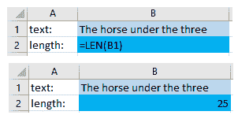
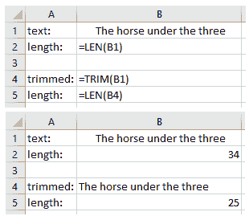
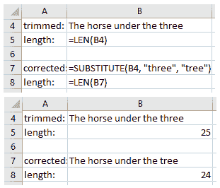
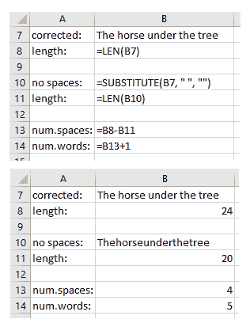
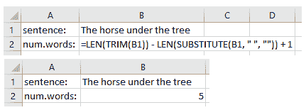

# Excel 中的字数统计–如何检查字数

> 原文：<https://www.freecodecamp.org/news/word-count-in-excel-how-to-check-the-number-of-words/>

Excel 没有自己的工具可以让您简单地查看文档中的字数(像 Word 一样)。但是无论如何有可能发现吗？

是的，它是——但是它有点复杂，而且一次只能作用于一个细胞。不过，不要担心——我们将在最后看到如何让它在一组细胞上发挥作用。下面我们来探讨一下如何在 Excel 中统计字数。

# 我们将用来计算字符数的 Excel 函数

我们需要了解三个 Excel 函数，`LEN()`、`TRIM()`和`SUBSTITUTE()`，然后才能在公式中使用它们。

## 如何使用 Excel 中的`LEN()`函数

`LEN()`函数获取一个包含文本内容的单元格，并返回该单元格中的字符数。

例如，如果我们在一个单元格中写下`The horse under the three`，我们使用`LEN()`函数计算另一个单元格中该句子的字符数，我们将得到`25`。你可以在这里看到它是如何工作的:



通过指定我们需要单元格 B1 的`LEN()`(上面单元格 B2 中的`LEN(B1)`)，Excel 为我们做了这个计算。

注意:我将在下面解释为什么我包括了拼写错误(“三”而不是“树”)。

## 如何在 Excel 中使用`TRIM()`函数

`TRIM()`函数获取一个包含文本内容的单元格，并返回相同的文本，在开头或结尾没有任何空白。

例如，假设我们有一个像这样的单元格: `The horse under the three`(文本前有 7 个空格，末尾有 2 个空格。它的总长度为 34 个字符，包括空格。

`TRIM()`函数将返回`The horse under the three`(只有最初的 25 个字符)，开头和结尾没有空格。它看起来是这样的:



您可以看到，类似于上面带有`LEN()`的示例，当我们将`TRIM()`指令放入单元格 B4 时，Excel 会计算单元格 B5 中的正确值。

## 如何使用 Excel 中的`SUBSTITUTE()`函数

`SUBSTITUTE()`函数将一段文本替换为另一段文本。例如，在我们使用的文本中有一个拼写错误(我们用`three`代替了`tree`)。我们可以使用`SUBSTITUTE()`功能修复它。

语法是`SUBSTITUTE(text, old_text, new_text, [instance_num])`，其中`text`是我们要更改的文本。在这种情况下，我们将拥有我们想要更改的文本，以及将被替换为`new_text` ( `tree`)的`old_text`和我们想要更改的部分(`three`)。

完整的公式是`SUBSTITUTE(B4, "three", "tree")`。请注意，公式中的文本总是需要用引号括起来。它是这样工作的:



如果您需要知道的话，`instance_num`是一个可选参数，您可以在文本中有多个`old_text`实例的情况下使用，而您只想更改其中的一个。但是我们没有在这里使用它。

# 如何在 Excel 中统计字数

我们已经学习了如何使用上面的单个函数，现在我们需要以一种有点复杂的方式一起使用它们。

在将它们放在一起之前，让我们试着理解我们是如何使用它们的，然后我们将一起构建完整的公式。

## Excel 中字数统计的工作原理

Excel 没有合适的字数统计工具或公式，但有一样东西我们可以统计，那就是字符，正如我们在上面学到的。具体来说，我们要计算字符串中的空格数。由此，我们将得出单词的数量，只是在空格的数量上加 1。

当我们看我们的例子时，我们可以看到字符串`The horse under the tree`有四个空格。如果我们加上一，我们得到五，句子的总字数。

计算空间也不是一件小事。由于没有一个特定的工具或公式可以只计算空格，我们需要有点创意。

我们要做的是统计字符串中的字符数，然后统计去掉空格后字符串中的字符数(我们可以用`SUBSTITUTE(text, " ", "")`来做这个)。那我们就取两者之差。

`The horse under the tree`有 24 个字符，而`Thehorseunderthetree`有 20 个字符。差值为 4，这是原始字符串中的空格数。如果我们加上 1，我们得到 5，字数。



## 付诸实践

现在我们需要加入一个我们在上一段中见过的公式。这个公式有三个组成部分:

*   去掉句首或句尾的空格后的句子长度(我们只想计算单词间的空格)，所以我们将使用`LEN(TRIM(text))`
*   没有空格的字符串的长度，在这种情况下，我们不需要使用`TRIM()`，因为我们正在删除所有空格，所以`LEN(SUBSTITUTE(text, " ", ""))`
*   然后我们就加上`1`。

完整的公式是:`LEN(TRIM(text)) - LEN(SUBSTITUTE(text, " ", "")) + 1`。



# 如何在 Excel 中创建自定义字数统计函数

我们已经学会了如何计算单元格中的字数，但也许我们不想每次需要计算字数时都输入所有的内容。

幸运的是，我们可以通过创建一个自定义函数来计算单词来解决这个问题。我们还可以有一个自定义函数来计算多个单元格中的总字数。

## 如何用 Visual Basic for Applications 创建自定义函数

我们可以用`Alt + F11`(Mac 用`FN + Alt + F11`)打开 VBA 编辑器。然后我们可以去**插入>模块**，我们就准备写我们的函数了。

我们可以使用我们已经编写的内容作为起点，但是我们需要用`REPLACE`函数替换`SUBSTITUTE`，因为它在 Visual Basic 中不存在。所以现在我们有了`LEN(TRIM(text)) - LEN(REPLACE(text, " ", "")) + 1`。

让我们命名我们想要创建的新函数。我选择了名字`WORDCOUNT`，但是你可以使用任何你想要的名字。只要在两个地方用你选择的名字替换它。

```
Function WORDCOUNT(text)
   WORDCOUNT = LEN(TRIM(text)) - LEN(REPLACE(text, " ", "")) + 1
End Function 
```

一旦在编辑器中添加了这些代码，就创建了这个函数。现在您可以关闭编辑器并享受您的新功能了！但是请记住，它只适用于本工作簿。

现在，让我们让该函数适用于多个单元格，然后我们还可以将其永久添加到 Excel 中。

## 如何构建自定义 Excel 函数来计算一组单元格中的总字数

我们现在将更新该函数，以处理一系列单元格，使其更加有用。我们采用与上面相同的代码，并将其应用于一个范围内的每个单元格，合计每个单元格中的字数。

用下面的代码替换我们之前编写的代码:

```
Function WORDCOUNT(rng As Range)
    Count = 0
    For Each cl In rng
        thisCount = LEN(TRIM(cl.Value)) - LEN(REPLACE(cl.Value, " ", "")) + 1
        Count = Count + thisCount
    Next
    WORDCOUNT = Count
End Function 
```

注意:此版本适用于单一范围的单元格，并且所有选定的单元格都必须包含文本。如果你想的话，你可以尝试制作你自己的更通用的版本，就自己去探索 VBA 吧！

最后，我们希望确保我们的函数在每个 Excel 工作手册中都可用。为此，我们必须关闭 VBA 编辑器，并将我们正在处理的书保存为`*.xlam`，Excel 插件文件类型。

要做到这一点，我们可以去**文件>另存为**，给这个文件一个让我们可以识别的名字，比如“WordCount”，选择格式“Excel 插件(*。xlam)”从下拉菜单中选择。不要更改保存文件的文件夹，因为它会自动设置为一个 **AddIns** 文件夹。

既然我们已经创建了文件，我们需要将它导入 Excel。为此，我们进入**文件>选项>插件**。在窗口底部，从下拉菜单中选择“Excel 插件”,然后点击 **Go....**在新窗口中使用**浏览...**按钮，它应该会打开我们保存文件的 **AddIns** 文件夹。选择它并按下**确定**，然后再次按下**确定**。现在`WORDCOUNT()`功能在你每次使用 Excel 的时候都会有。

# 结论

在本文中，我们学习了如何在 Excel 中计算字符串中的字数。

尽管 Excel 没有现成的计算单词的工具，但我们学会了如何创建自己的自定义函数，以避免每次想要获得字符串中的单词数时都必须编写每个公式。

最后，我们还学会了如何扩展我们的功能，使其适用于任意数量的细胞。