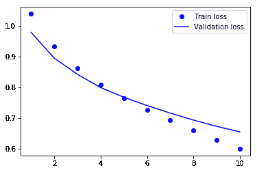
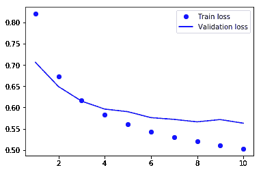
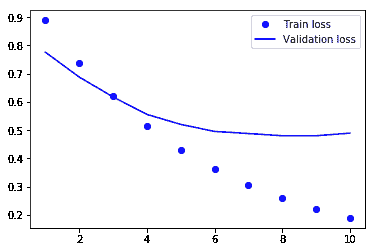

# 深入探究用于情感分析的单词嵌入

> 原文：<https://www.freecodecamp.org/news/word-embeddings-for-sentiment-analysis/>

当对单词应用一键编码时，我们最终得到高维度的稀疏(包含许多零)向量。在大型数据集上，这可能会导致性能问题。

此外，独热编码没有考虑单词的语义。所以像 **飞机** 和 **飞机** 这样的词被认为是两个不同的特征，尽管我们知道它们有非常相似的意思。单词嵌入解决了这两个问题。

单词嵌入是具有低得多的维度的密集向量。其次，词与词之间的语义关系反映在向量的距离和方向上。

我们将使用 Kaggle 上的[Twitter airlinesensing 数据集。该数据集包含大约 15K 条推文，具有 3 种可能的情绪类别(积极、消极和中立)。在我之前的帖子中，我们试图通过对单词进行标记和应用两个分类器来对推文进行分类](https://www.kaggle.com/crowdflower/twitter-airline-sentiment)[。让我们看看单词嵌入是否能胜过它。](https://www.freecodecamp.org/news/sentiment-analysis-with-text-mining/)

阅读本教程后，你将知道如何使用 ****Keras**** 的嵌入层计算特定任务的单词嵌入。其次，我们将研究在更大的语料库上训练的单词嵌入是否可以提高我们的模型的准确性。

本教程的结构是:

*   单词嵌入背后的直觉
*   项目设置
*   数据准备
*   Keras 及其嵌入层
*   预训练单词嵌入—手套
*   多维度训练词嵌入

# 单词嵌入背后的直觉

在我们可以在分类器中使用单词之前，我们需要将它们转换成数字。一种方法是简单地将单词映射成整数。另一种方法是一键编码单词。然后，每条 tweet 可以表示为一个向量，其维数等于语料库中的单词(有限的一组)。tweet 中出现的单词在向量中的值为 1。所有其他向量值等于零。

单词嵌入的计算方式不同。每个单词被定位成一个*多维空间。这个空间中的维度数量由数据科学家选择。您可以尝试不同的维度，看看什么能提供最好的结果。*

*一个单词的 ******向量值代表它在这个嵌入空间中的位置****** 。同义词之间的距离很近，而意思相反的词之间的距离很大。您还可以对向量应用数学运算，这会产生语义上正确的结果。一个典型的例子就是 **国王** 和 **女** 的单词嵌入之和产生了 **皇后** 的单词嵌入。*

# *项目设置*

*让我们从导入这个项目的所有包开始。*

```
*`import pandas as pd
import numpy as np
import re
import collections
import matplotlib.pyplot as plt
from pathlib import Path
from sklearn.model_selection import train_test_split
from nltk.corpus import stopwords
from keras.preprocessing.text import Tokenizer
from keras.preprocessing.sequence import pad_sequences
from keras.utils.np_utils import to_categorical
from sklearn.preprocessing import LabelEncoder
from keras import models
from keras import layers`*
```

*我们定义了在整个项目中使用的一些参数和路径。大部分都是不言自明的。但是其他的将在代码中进一步解释。*

```
*`NB_WORDS = 10000  # Parameter indicating the number of words we'll put in the dictionary
VAL_SIZE = 1000  # Size of the validation set
NB_START_EPOCHS = 10  # Number of epochs we usually start to train with
BATCH_SIZE = 512  # Size of the batches used in the mini-batch gradient descent
MAX_LEN = 24  # Maximum number of words in a sequence
GLOVE_DIM = 100  # Number of dimensions of the GloVe word embeddings
root = Path('../')
input_path = root / 'input/'
ouput_path = root / 'output/'
source_path = root / 'source/'`*
```

*在这段代码中，我们还将使用一些帮助函数来进行数据准备、建模和可视化。这里没有显示这些函数定义，以避免博客文章混乱。你可以随时参考 Github 里的[笔记本看代码。](https://github.com/bertcarremans/TwitterUSAirlineSentiment/blob/master/source/Using%20Word%20Embeddings%20for%20Sentiment%20Analysis.ipynb)*

# *数据准备*

## *读取数据和清理*

*我们读入包含 tweets 的 CSV 文件，并对其索引进行随机排序。之后，我们删除停用词和@提及。分离出 10%的测试集，以根据新数据评估模型。*

```
*`df = pd.read_csv(input_path / 'Tweets.csv')
df = df.reindex(np.random.permutation(df.index))
df = df[['text', 'airline_sentiment']]
df.text = df.text.apply(remove_stopwords).apply(remove_mentions)
X_train, X_test, y_train, y_test = train_test_split(df.text, df.airline_sentiment, test_size=0.1, random_state=37)`*
```

## *将单词转换成整数*

*使用 Keras 中的 ******标记器****** ，我们将 tweets 转换成整数序列。我们把单词的数量限制到******NB _ WORDS******最频繁出现的单词。此外，tweets 被一些过滤器清理，设置为小写，并在空格上分割。*

```
*`tk = Tokenizer(num_words=NB_WORDS,
filters='!"#$%&()*+,-./:;<=>?@[\]^_`{"}~\t\n',lower=True, split=" ")
tk.fit_on_texts(X_train)
X_train_seq = tk.texts_to_sequences(X_train)
X_test_seq = tk.texts_to_sequences(X_test)`*
```

## *等长序列*

*每批都需要提供等长的序列。我们用******pad _ sequences******的方法来实现这一点。通过指定******【maxlen】******，序列或用零填充或被截断。*

```
*`X_train_seq_trunc = pad_sequences(X_train_seq, maxlen=MAX_LEN)
X_test_seq_trunc = pad_sequences(X_test_seq, maxlen=MAX_LEN)`*
```

## *编码目标变量*

*目标类是需要转换成数字向量的字符串。这是通过 Sklearn 的******label encoder******和 Keras 的******to _ categorial******方法完成的。*

```
*`le = LabelEncoder()
y_train_le = le.fit_transform(y_train)
y_test_le = le.transform(y_test)
y_train_oh = to_categorical(y_train_le)
y_test_oh = to_categorical(y_test_le)`*
```

## *分离验证集*

*从训练数据中，我们分离出 10%的验证集用于训练。*

```
*`X_train_emb, X_valid_emb, y_train_emb, y_valid_emb = train_test_split(X_train_seq_trunc, y_train_oh, test_size=0.1, random_state=37)`*
```

# *建模*

## *Keras 和嵌入层*

*Keras 提供了一种将每个单词转换成多维向量的便捷方法。这可以用 ******嵌入****** 层来完成。它将计算单词嵌入(或使用预先训练的嵌入)并在字典中查找每个单词以找到其矢量表示。这里我们将训练 8 维的单词嵌入。*

```
*`emb_model = models.Sequential()
emb_model.add(layers.Embedding(NB_WORDS, 8, input_length=MAX_LEN))
emb_model.add(layers.Flatten())
emb_model.add(layers.Dense(3, activation='softmax'))
emb_history = deep_model(emb_model, X_train_emb, y_train_emb, X_valid_emb, y_valid_emb)`*
```

**

*我们有大约 74%的验证准确率。推文字数比较低，所以这个结果还是挺不错的。通过比较训练和验证损失，我们看到模型从第 6 个时期开始 ****过拟合**** 。*

*在之前的一篇文章中，我讨论了我们如何避免过度拟合。如果你想深入研究这个话题，你可能想读一下。*

*当我们在所有数据(包括验证数据，但不包括测试数据)上训练模型并将时期数设置为 6 时，我们得到 78%的测试准确度。这个测试结果还可以，但是让我们看看我们是否可以通过预先训练的单词嵌入来改进。*

```
*`emb_results = test_model(emb_model, X_train_seq_trunc, y_train_oh, X_test_seq_trunc, y_test_oh, 6)
print('/n')
print('Test accuracy of word embeddings model: {0:.2f}%'.format(emb_results[1]*100))`*
```

## *预训练单词嵌入—手套*

*因为训练数据不是很大，所以模型可能无法学习用于情感分析的良好嵌入。或者，我们可以加载建立在更大的训练数据上的预训练单词嵌入。*

*[手套数据库](https://nlp.stanford.edu/projects/glove/)包含多个预训练的单词嵌入，以及在推文 上训练的更具体的 ******嵌入。所以这可能对手头的任务有用。*******

*首先，我们将单词嵌入放在字典中，其中键是单词，值是单词嵌入。*

```
*`glove_file = 'glove.twitter.27B.' + str(GLOVE_DIM) + 'd.txt'
emb_dict = {}
glove = open(input_path / glove_file)
for line in glove:
    values = line.split()
    word = values[0]
    vector = np.asarray(values[1:], dtype='float32')
    emb_dict[word] = vector
glove.close()`*
```

*通过将手套嵌入加载到字典中，我们可以在航空公司 tweets 的语料库中查找每个单词的嵌入。这些将被存储在一个形状为******NB _ WORDS******和******GLOVE _ DIM******的矩阵中。如果在手套字典中找不到某个单词，则该单词的单词嵌入值为零。*

```
*`emb_matrix = np.zeros((NB_WORDS, GLOVE_DIM))
for w, i in tk.word_index.items():
    if i < NB_WORDS:
        vect = emb_dict.get(w)
        if vect is not None:
        emb_matrix[i] = vect
    else:
        break`*
```

*然后，我们指定模型，就像我们对上面的模型所做的那样。*

```
*`glove_model = models.Sequential()
glove_model.add(layers.Embedding(NB_WORDS, GLOVE_DIM, input_length=MAX_LEN))
glove_model.add(layers.Flatten())
glove_model.add(layers.Dense(3, activation='softmax'))`*
```

*在嵌入层(这里是 0 层)我们 ******为单词设置权重****** 为那些在手套中找到的单词嵌入。通过将 ******可训练****** 设置为 False，我们可以确保手套单词嵌入不能被更改。之后，我们运行模型。*

```
*`glove_model.layers[0].set_weights([emb_matrix])
glove_model.layers[0].trainable = False
glove_history = deep_model(glove_model, X_train_emb, y_train_emb, X_valid_emb, y_valid_emb)`*
```

**

*该模型在 3 个时期后很快过拟合。此外，与在训练数据上训练的嵌入相比，验证准确度较低。*

```
*`glove_results = test_model(glove_model, X_train_seq_trunc, y_train_oh, X_test_seq_trunc, y_test_oh, 3)
print('/n')
print('Test accuracy of word glove model: {0:.2f}%'.format(glove_results[1]*100))`*
```

*作为最后一个练习，让我们看看当我们用与手套数据相同的维数训练嵌入时会得到什么结果。*

## *多维度训练词嵌入*

*我们将用与手套嵌入相同的维数训练单词嵌入(即 GLOVE_DIM)。*

```
*`emb_model2 = models.Sequential()
emb_model2.add(layers.Embedding(NB_WORDS, GLOVE_DIM, input_length=MAX_LEN))
emb_model2.add(layers.Flatten())
emb_model2.add(layers.Dense(3, activation='softmax'))
emb_history2 = deep_model(emb_model2, X_train_emb, y_train_emb, X_valid_emb, y_valid_emb)`*
```

**

```
*`emb_results2 = test_model(emb_model2, X_train_seq_trunc, y_train_oh, X_test_seq_trunc, y_test_oh, 3)
print('/n')
print('Test accuracy of word embedding model 2: {0:.2f}%'.format(emb_results2[1]*100))`*
```

*在测试数据上，我们得到了很好的结果，但是在使用 CountVectorizer 的情况下，我们并没有优于 LogisticRegression。所以还是有提升的空间。*

# *结论*

*最好的结果是利用在可用数据上训练的 100 维单词嵌入来实现的。这甚至超过了在更大的 Twitter 语料库上训练的单词嵌入的使用。*

*到目前为止，我们只是在展平的嵌入物上加了一个致密层。这样， ******我们就不考虑推文中****** 这几个词之间的关系了。这可以用递归神经网络或 1D 卷积网络来实现。但这是以后的事了:)*