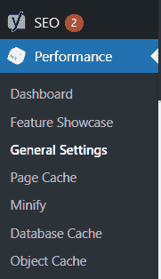
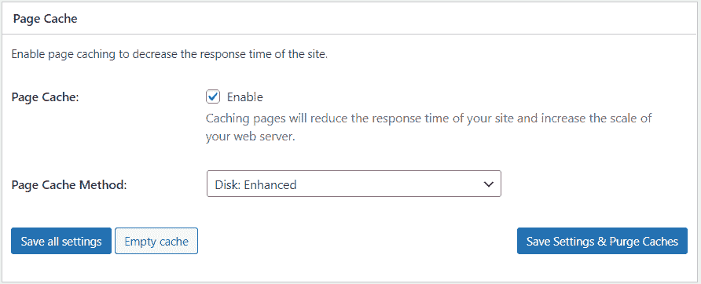
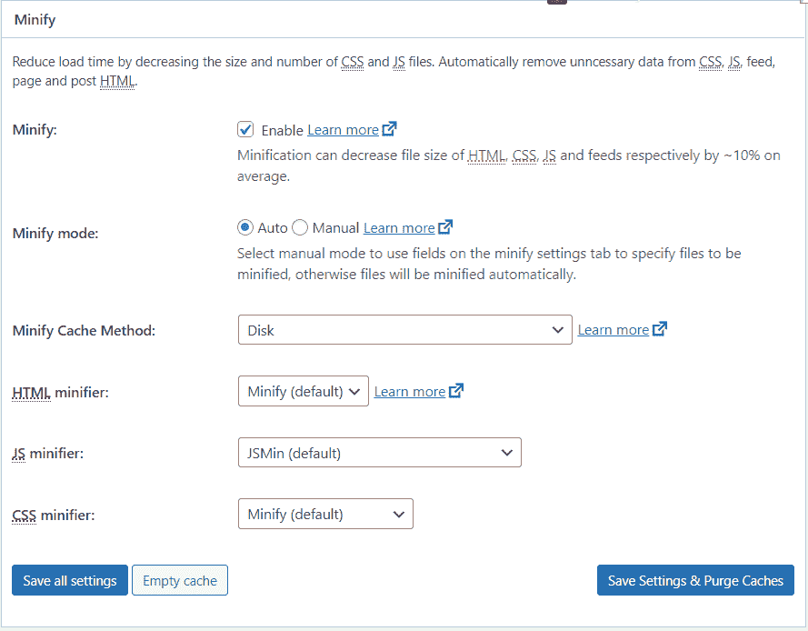
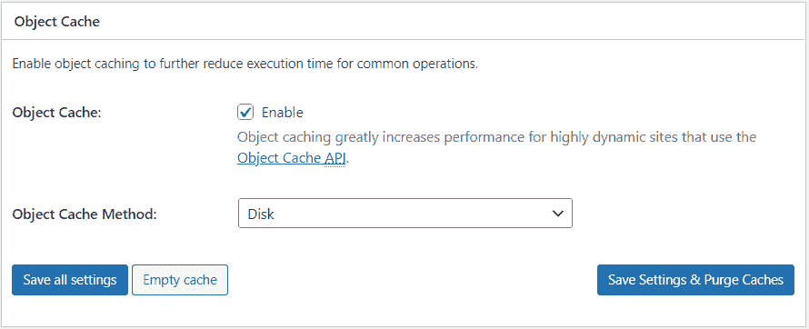
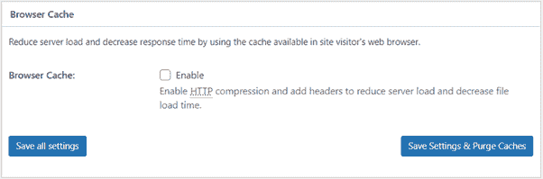
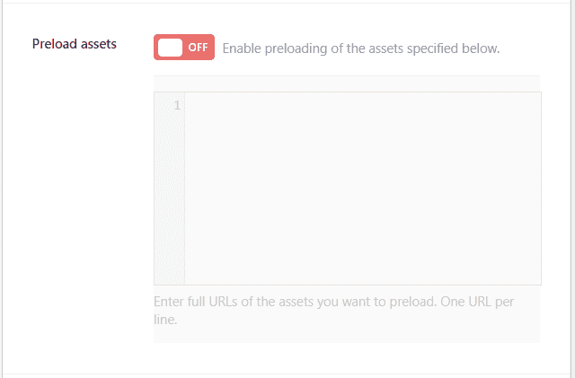
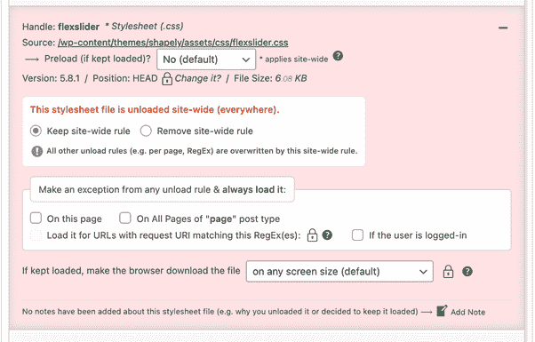
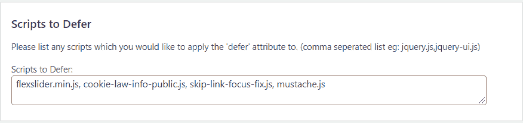

# 5 个 WordPress 插件来提高你网站的性能

> 原文：<https://www.freecodecamp.org/news/wordpress-plugins-to-improve-your-website-performance/>

在这篇博文中，我将向你展示你应该使用哪些免费的 WordPress 插件，以及如何配置它们来显著提高你的 WordPress 网站的性能。

Web 性能是一个重要的 SEO 因素，你不应该低估它。你的网站加载的每一秒钟都会损害你的业务和投资回报率。

幸运的是，WordPress 提供了许多选项和插件，可以帮助你提高性能，而无需更深入的软件开发知识。

## 网站性能最佳 WordPress 插件

在这篇文章中，我将介绍 5 个插件，它们可以帮助你修复网站的性能。如果配置正确，它们可以协同工作，不会有任何兼容性问题。

我是一名 SEO 专家，我在我的项目中使用这些插件。请记住，一些插件或它们的设置会影响你网站的功能。每次你改变或安装一个新的插件时，都有必要测试你的网站是否一切正常。

## 1.W3 总缓存 WordPress 插件

这个插件是最先进的网站性能优化插件之一，并提供了大量的选项。

W3 Total Cache 通过缓存站点、提高服务器性能和减少加载时间来提高性能。但是，如果你使用另一个插件进行缓存，要小心——在这种情况下，你应该禁用或卸载它。否则，当您激活此功能时会出现问题。

### 如何设置 W3 总缓存

首先，安装 [W3 总缓存](https://cs.wordpress.org/plugins/w3-total-cache/)到你的 WordPress。成功安装插件后，在你的 WordPress 设置中找到 Performance 项，并选择“常规设置”项。



*W3 Total Cache - find Performance in the Menu.*

在通用设置中，启用**页面缓存**。页面缓存在每次加载页面时创建静态缓存页面，因此页面不是动态加载的。如果你没有每天改变你的内容，那么你需要这个！通过启用缓存，您可以显著减少加载时间。

在页面缓存方法中使用磁盘:增强。这对每个使用共享主机的人来说都是一样的。



*W3 Total Cache - enable Page Cache.*

**缩小**是最基本的性能优化之一。缩小是通过从代码中删除任何不必要的字符(换行符、多余的空格等)来最小化 HTML、CSS 和 JavaScript 文件的过程。这将减少这些文件的大小，并减少加载时间。

你可以使用各种 WordPress 插件进行缩小。W3 总缓存也提供了这个选项。如果您使用 Cloudflare，可以在那里启用缩小，而不是使用 W3 总缓存。



*W3 Total Cache - enable Minify.*

接下来，您可以启用**对象缓存**。对象缓存意味着存储数据库查询结果。因此，当您下次需要一个结果时，它由缓存提供，而不需要重复查询数据库。

对象缓存有助于减轻数据库和服务器的负载，并且可以更快地提供查询。

共享主机情况下的对象缓存方法是磁盘。在启用对象缓存之前和之后测试您的速度-在某些情况下，它可能会降低您的网站速度。



*W3 Total Cache - enable Object Cache.*

然后可以启用**浏览器缓存**。这意味着图像、HTML、CSS 和 JS(静态资产)存储在你的浏览器中。当用户再次访问您的网站时，浏览器缓存会更快地加载您的网站。

在我的例子中，我没有启用浏览器缓存，因为我使用的是 Polylang 插件，并且有一个[兼容性问题](https://wordpress.org/support/topic/w3-polylang-not-working-correctly-from-0-9-7-3/)。[poly lang 插件](https://wordpress.org/plugins/polylang/)是最流行的插件之一，允许你创建双语或多语言网站。还有一个可定制的语言切换器，但如果启用了浏览器缓存，切换语言不起作用。



*W3 Total Cache - enable Browser Cache.*

W3 总缓存中的另一个重要设置是在用户体验中启用**延迟加载图像**。这意味着您的页面将只显示折叠上方的图像，其余的将在用户滚动页面时加载。

这将缩短站点的加载时间，减少首页加载过程中的 HTTP 请求数量，并节省数据(尤其是移动数据)。


*W3 Total Cache - enable Lazy Load Images.*

不要忘记保存每个设置。这些只是 W3 总缓存的一些常规设置，将真正帮助您提高页面速度和加载时间。

## 2.加速包插件

[加速包](https://cs.wordpress.org/plugins/speed-booster-pack/)与 W3 总缓存有一些类似的设置，但它也提供了额外的功能。

在资产中，您可以选择添加一个**预加载资产**。这意味着某个资源会比浏览器发现它的时间更快，因为它对当前页面很重要。如果有需要预加载的资产，您只需向该资产添加一个 URL。



*Speed Booster Pack - add preload assets*

在“特殊”菜单项中，您可以启用**本地化谷歌分析&谷歌标签管理器** (GTM)。这意味着 Google analytics 和 GTM 的脚本将被替换为本地保存的脚本。


*Speed Booster Pack - enable Google Analytics and Google Tag Manager.*

## 3.资产清理:页面速度加速器插件

[资产清理](https://cs.wordpress.org/plugins/wp-asset-clean-up/)插件对于删除或禁用某些 CSS 和 JavaScript 文件很有用。大多数 WordPress 主题都有很多 CSS 和 JavaScript 文件，比如各种元素、动画或其他你可能不需要或不使用的效果。但是，即使您没有使用它们，它们仍然会为用户加载。

如果您编辑某个页面，您可以在该页面的底部找到“资产清理”部分。您可以看到为该页面加载的所有 CSS 和 JS 文件。然后，您可以选择禁用这个特定的文件，您可以禁止加载整个网站。



*Asset CleanUp - disable CSS and JS files so they don't load.*

## 4.异步 JavaScript WordPress 插件

如果 JavaScript 文件不是异步加载的，加载时间会变慢，因为 JavaScript 代码是在构建 DOM 时执行的。

[Async JavaScript](https://cs.wordpress.org/plugins/async-javascript/) 插件允许你定义哪些 JavaScript 文件应该异步加载或者延迟加载。

Async 表示文件在后台异步下载，并在准备就绪时运行。DOM 和其他脚本不会等待它们。Defer 意味着文件也是异步下载的，但是只在 DOM 完全构建好之后才执行。

### 如何设置异步 JavaScript 插件

首先，点击设置，启用**异步 JavaScript** 。


*Async JavaScript - enable Async JS.*

第二步，选择**异步 JS 方法**。这里先选择异步。启用异步后，你需要测试你的整个网站，看看它是否正常工作。你还应该在 Chrome web 控制台中检查错误。

如果一切正常，您可以尝试启用 defer。然后，你应该再次测试你的整个网站，如果有一些问题，你应该恢复这个设置为异步。


*Async JavaScript - Select Async JS Method.*

在**脚本到** **延迟**部分，您可以选择想要延迟的特定脚本。您应该只延迟那些彼此之间或与其他 JavaScript 代码之间没有任何依赖关系的 JavaScript 文件。您应该知道这些 JavaScript 文件的用途，以及它们用于何处，以决定是否可以推迟它们。



*Async JavaScript - Scripts to Defer.*

## 5.允许网页/AVIF 图片插件

如果你在寻找更快加载的图像，那么 **WebP** 和 **AVIF** 格式正适合你。

WebP 和 AVIF 是现代格式，在网络上具有卓越的无损和有损压缩图像。使用这些格式是因为它们提供更小、更丰富的图像，使网站运行更快。

例如，WebP 无损压缩比 PNGs 小 26%。AVIF 的压缩效果最佳，甚至优于 WebP。它提供高质量的图像，并且比其他已知格式小 10 倍。

但是请记住，并非所有的网络浏览器都支持 WebP，AVIF 格式只在 Chrome、Firefox 和 Opera 中受到支持。这不是一个问题，因为现在有很多方法来定义不同格式的图像，浏览器只加载支持的格式。

```
<picture>
   <source srcset="/images/image.avif" type="image/avif">
   <source srcset="/images/image.webp" type="image/webp">
   
</picture> 
```

在上面的代码中，浏览器遍历一组图像，并在第一个支持的格式处停止。Chrome 停在第一张图片上，因为它支持 AVIF。Edge 停在第二张图片上，因为它不支持 AVIF，但支持 WebP。

2021 年 7 月之前，WordPress 不支持 Webp 图片。但现在，即使没有额外的插件，也可以将它们添加到您的媒体中([更新 5.8](https://wordpress.org/support/wordpress-version/version-5-8) )。

WordPress 花了很长时间才启用这种格式，而我们已经有了不被支持的 AVIF 格式。幸运的是，有一个插件 [Mime Types Plus](https://wordpress.org/plugins/mime-types-plus/) 允许你在你的媒体文件中添加支持的 Mime 类型。

## 结论

在本文中，您了解了可以使用哪些插件来提高网站的性能。

请记住，在每次设置后测试你的网站是很重要的，因为可能会有与其他插件的兼容性问题。WordPress 平台提供插件，无需额外编码就能完全照顾网站性能。

但是如果你的网站运行在不同于 WordPress 的平台上，那么你将需要使用其他针对 web 开发者的工具，你可能需要做一些编码工作。

你知道其他对网站性能有用的 WordPress 插件吗？让我知道，因为我想知道更多。