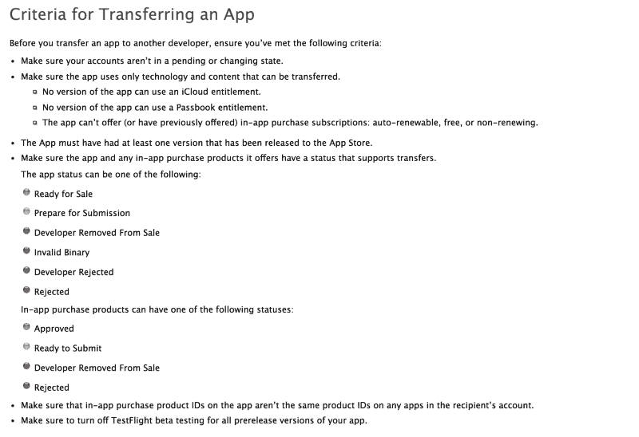
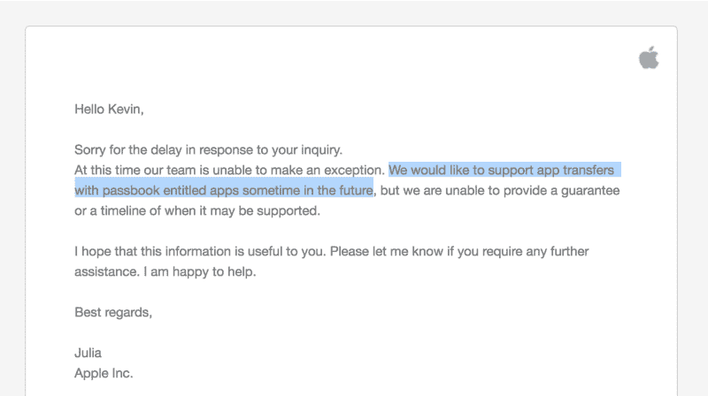

# 开发 iOS 应用程序？小心这个。

> 原文：<https://www.freecodecamp.org/news/working-on-an-ios-app-be-careful-you-can-lose-100k-with-a-single-click-8c8835ad8a1d/>

凯文·纳坦森

# 开发 iOS 应用程序？小心这个。

#### 集成某些 SDK 可能会产生不可逆转的后果

在[测试实验室](http://beta.uy)，我们已经开发应用很长时间了。在我们的旅程中，我们创建了许多应用程序，它们进入了前十名，被数百万用户使用。然而，像任何其他创业公司一样，我们也经历了大量的失败和挫折。

我们一直在尽可能多地发布我们的发现、见解和知识。主要是因为知道我们的故事帮助其他人在网上建立更好的东西，让我们非常高兴。许多创作者、创始人、营销人员和开发人员向我们伸出援手，让我们知道这对他们有多大帮助，这种感觉棒极了！这是我们最后一篇关于前九名的帖子:

[**前九名火了！**](https://blog.beta.uy/top-nine-is-going-viral-1cef13033635)
[*宣布安卓版本* blog.beta.uy](https://blog.beta.uy/top-nine-is-going-viral-1cef13033635)

今天，我们想与你分享我们的一个挫折，目的是拯救其他应用程序制造商，使他们不要忽视一些可能在未来成为真正大问题的事情。

### 问题是:点击一下就可能损失 10 万美元以上

也许这个标题有点吸引人，但是想象一下你的应用程序值那么多钱，有人想买它。但是不能卖。

对于参与 iOS 应用开发的任何人(营销人员、开发人员、首席执行官、项目经理等)来说，意识到这个重要问题非常重要:

> 如果你在你的应用程序中使用 Passbook 权限，你将永远无法转移它。

以下是苹果文档:

[source](https://developer.apple.com/library/content/documentation/LanguagesUtilities/Conceptual/iTunesConnect_Guide/Chapters/TransferringAndDeletingApps.html)

虽然很明显，任何版本的应用程序都可能包含要传输的 Passbook，但当开发人员将框架添加到项目中时，没有任何警告。

### 为什么转移应用程序如此重要？

原因很多，仅举几个:

*   你可能想把你的应用程序卖给另一家公司，保留你的开发者账户和其他资产。
*   你可能已经从个人开发者账户**开始，然后是公司账户，你需要将应用转移到公司账户。**
*   为了简单起见，你可能**在别人的账户**下发布了应用程序(比如你的开发商店)。

### 我们从惨痛的教训中学到了这一点

两年前，当我们还不太了解如何将应用程序货币化时，我们决定集成 Twitter MoPub 中介。我们认为 CPM 会很高，因为 SDK 的潜力真的很大，可以实现脸书观众网络目前正在做的事情。

作为整合的一部分，我们遵循了 MoPub 编写的教程。

此外，第三方网络需要:

*   音频工具箱.框架
*   AVFoundation .框架
*   Ad .框架
*   MessageUI.framework
*   MobileCoreServices.framework
*   PassKit.framework
*   社会框架

作为开发人员，您所要做的就是将库添加到 Xcode 项目中。那会有什么负面影响？

几个月后，我们能够将这个应用程序放在“真心话大冒险”关键词的第一位，每月从有机安装中赚取超过 15，000 美元——主要是寻找有趣应用程序的家庭聚会爱好者。

我们真的很高兴能尽早找到买家，所以我们决定继续以“便宜”的价格卖出一个好价钱。毕竟，一个月赚 1.5 万美元的资产至少值 6 位数。

转移应用程序应该非常简单，因为苹果已经为此提供了一个流程。但是，在与买家达成交易后，我们意识到我们在某个时候添加了存折权利。

(我们最近也将 Passbook 整合到了前九名中，但这一次我们是故意这样做的，因为它需要整合 Apple Pay)

只需轻点两下就能完成一个电子商务结账流程，值得一提的是，除非有收购者决定收购整个公司，否则无法转让该应用。但同样，这是一个开发者应该仔细考虑的权衡，不要意识到一旦为时已晚，他们已经随意地选择了让他们的应用程序不可转让。

### 苹果如何解决这个问题

他们能解决的最好(但最不可能)的方法是完全取消这一限制。也就是说，即使应用程序可能在过去的某个时间点集成了 passbook 权限，也允许应用程序被转移。我们试着和苹果公司合作，但是几年后我们没有运气了。

如果出于某种原因很难支持这一点，那么我所要求的就是在开发时添加这个库的业务含义的明确警告。集成 Passbook SDK 是一个不可轻率做出的决定，因此如果开发人员需要添加这个库，我预计该操作需要提升权限，同时也需要一些提醒:

### 你能提供什么帮助

如果你正在读这篇文章，那意味着你正在参与应用程序开发。如果是这样的话，你可以帮助一个朋友，或者帮助我们让苹果解决这个问题。

如果你是一名 iOS 开发人员，并且你想提供帮助，我们只需要你在 Twitter 上分享这篇文章，并附上以下推文:

> 亲爱的@Apple，你能解决这个问题吗？— [发这条微博。](https://twitter.com/intent/tweet?ref_src=twsrc%5Etfw&text=Dear%20%40Apple%2C%20can%20you%20please%20fix%20this%3F&tw_p=tweetbutton&url=https%3A%2F%2Fmedium.com%2F%40kevntz%2Fworking-on-an-ios-app-be-careful-with-this-8c8835ad8a1d)

### 谢谢大家！