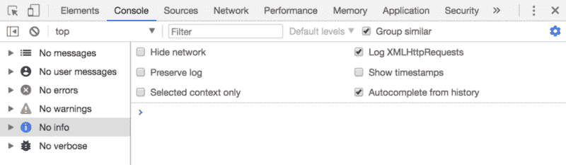
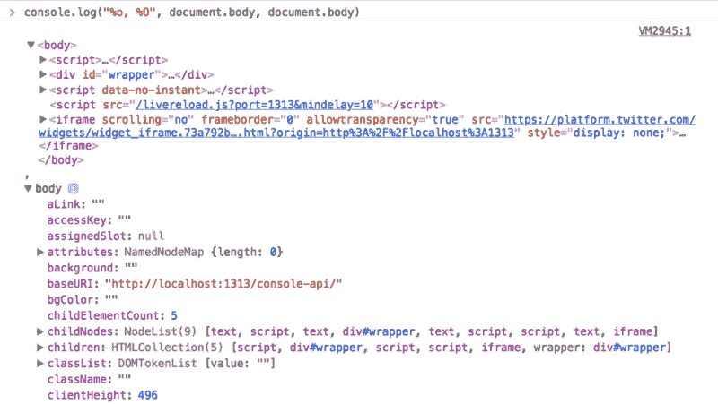
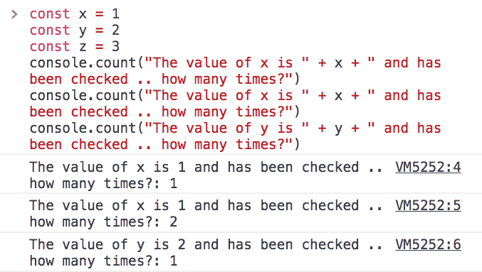
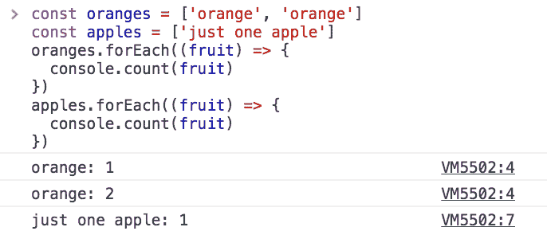
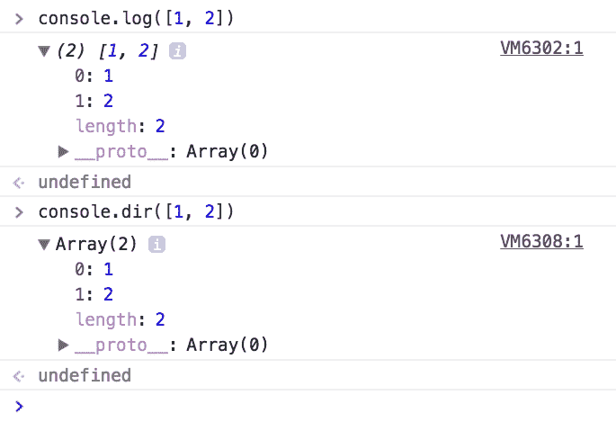
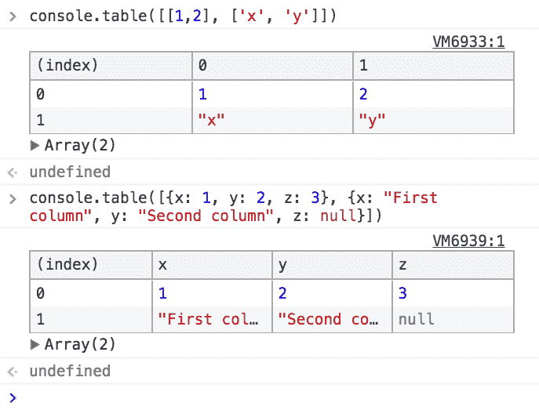
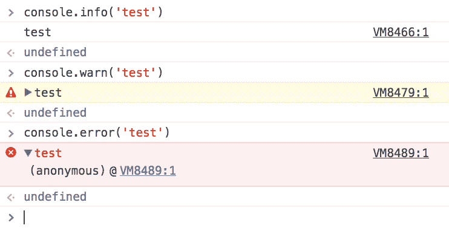
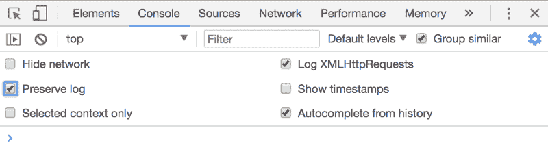
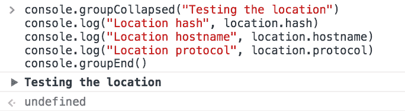
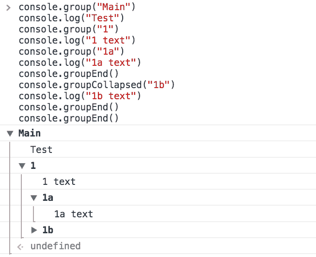

# 如何使用 DevTools 控制台和控制台 API:概述

> 原文：<https://www.freecodecamp.org/news/working-with-the-devtools-console-and-console-api-an-overview-13cff6dc3db4/>

> 对学习 JavaScript 感兴趣？在 jshandbook.com 获得我的电子书

每个浏览器都有一个控制台，让你与 [Web 平台 API](https://flaviocopes.com/web-platform/)进行交互，并通过打印页面中运行的 [JavaScript](https://flaviocopes.com/javascript/) 代码生成的消息，让你深入了解代码。

### 控制台概述

控制台工具栏很简单。有一个按钮可以清除控制台消息，你也可以通过点击 macOS (Mac)中的`cmd-K`或 Windows (Win)中的`ctrl-K`来完成。

第二个按钮激活过滤侧边栏，让您按照文本或消息类型进行过滤。您可以按错误、警告、信息、日志或调试消息进行过滤。

您还可以选择隐藏网络生成的消息，只关注 JavaScript 日志消息。



控制台不仅仅是一个可以看到消息的地方，也是与 JavaScript 代码交互的最佳方式，很多时候是与 DOM 交互。或者只是从页面上获取信息。

让我们输入第一条消息。请注意`&`gt；。

让我们点击那里并键入:

```
console.log('test')
```

控制台充当 **REPL** ，这意味着读取-评估-打印循环。简而言之，它解释我们的 JavaScript 代码并打印一些东西。

### 使用 console.log 格式

如您所见，`console.log('test')`在控制台中打印`test`。

在您的 JavaScript 代码中使用`console.log`可以帮助您调试，例如通过打印静态字符串。但是你也可以给它传递一个变量，这个变量可以是一个 JavaScript 原生类型，比如一个整数或者一个对象。

您可以将多个变量传递给`console.log`:

```
console.log('test1', 'test2')
```

我们还可以通过传递变量和格式说明符来格式化漂亮的短语:

```
console.log("My %s has %d years", 'cat', 2)
```

*   `%s`将变量格式化为字符串
*   `%d`或`%i`将变量格式化为整数
*   `%f`将变量格式化为浮点数
*   `%o`可以用来打印一个 DOM 元素
*   `%O`用于打印一个对象表示

例如:

```
console.log("%o, %O", document.body, document.body)
```



另一个有用的格式说明符是`%c`，它允许我们传递 CSS 来格式化字符串:

```
console.log("%c My %s has %d years", "color: yellow; background:black; font-size: 16pt", "cat", 2)
```


### 清空控制台

在操作控制台时，有三种方法可以清除控制台，输入方法也各不相同。

第一种方法是点击控制台工具栏上的**清除控制台日志**按钮。

第二种方法是在控制台中输入`console.clear()`，或者在你的应用/网站中运行的 [JavaScript 函数](https://flaviocopes.com/javascript-functions/)中输入。

也可以只输入`clear()`。

第三种方法是通过键盘快捷键。是`cmd-k` (Mac)还是`ctrl + l` (Win)。

### 计数元素

`console.count()`是一种简便的方法。

以这段代码为例:

```
const x = 1const y = 2const z = 3
```

```
console.count("The value of x is " + x + " and has been checked .. how many times?")console.count("The value of x is " + x + " and has been checked .. how many times?")console.count("The value of y is " + y + " and has been checked .. how many times?")
```

发生的情况是，`count`将计算一个字符串被打印的次数，并在其旁边打印计数:



你可以只数苹果和橘子:

```
const oranges = ['orange', 'orange']const apples = ['just one apple']
```

```
oranges.forEach((fruit) => {  console.count(fruit)})
```

```
apples.forEach((fruit) => {  console.count(fruit)})
```



### 记录更复杂的对象

检查变量是非常令人惊奇的。你也可以给它传递一个对象，它会尽最大努力以可读的方式打印出来。大多数情况下，这意味着它打印对象的字符串表示。

让我们试试:

```
console.log([1, 2])
```

打印对象的另一个选项是使用`console.dir`:

```
console.dir([1, 2])
```

如您所见，该方法以类似 JSON 的表示打印变量，因此您可以检查它的所有属性。

通过执行以下操作，可以实现与`console.dir`输出相同的内容:

```
console.log("%O", [1,2])
```



当然，使用哪一种取决于您需要调试的内容。你必须决定这两个人中哪一个最适合你。

另一个函数是`console.table()`，它打印出一个漂亮的表格。

我们只需要向它传递一个元素数组，它将在新的一行中打印每个数组项:

```
console.table([[1,2], ['x', 'y']])
```

还可以通过传递对象文字而不是数组来设置列名，这样它将使用 Object 属性作为列名:

```
console.table([{x: 1, y: 2, z: 3}, {x: "First column", y: "Second column", z: null}])
```



`console.table`也可以更强大。如果您向它传递一个包含对象的对象文字，并传递一个包含列名的数组，它将打印一个包含来自对象文字的行索引的表。

例如:

```
const shoppingCart = {}
```

```
shoppingCart.firstItem  = {'color': 'black', 'size': 'L'}shoppingCart.secondItem = {'color': 'red',   'size': 'L'}shoppingCart.thirdItem  = {'color': 'white', 'size': 'M'}
```

```
console.table(shoppingCart, ["color", "size"])
```


### 记录不同的错误级别

正如我们所见，console.log 非常适合在控制台中打印消息。

我们现在将发现三种更方便的方法来帮助我们调试，因为它们隐含地指出了不同级别的错误。

**console.info()**

**console.warn()**
打印一个黄色感叹号。

如果您激活控制台过滤工具栏，您可以看到控制台允许您根据类型过滤邮件，因此区分邮件非常方便。例如，如果我们现在单击“警告”，所有非警告的打印消息将被隐藏。

这与其他的有些不同，因为除了打印一个红色的 X 来清楚地表明有一个错误，我们还有生成错误的函数的完整堆栈跟踪。所以我们可以去试着修复它。



每个页面导航上的控制台消息都会被清除，除非您在控制台设置中检查了**保留日志**:



### 将控制台消息分组

控制台消息的大小可能会增加，当您试图调试错误时，噪音可能会令人无法忍受。

为了限制这个问题，控制台 API 提供了一个方便的特性:对控制台消息进行分组。

先做个例子:

```
console.group("Testing the location") 
```

```
console.log("Location hash", location.hash) console.log("Location hostname", location.hostname) console.log("Location protocol", location.protocol) 
```

```
console.groupEnd()
```


如您所见，控制台创建了一个组，其中包含日志消息。

您也可以这样做，但是输出一个折叠的消息，您可以根据需要打开它以进一步限制噪音:

```
console.groupCollapsed("Testing the location") 
```

```
console.log("Location hash", location.hash) console.log("Location hostname", location.hostname) console.log("Location protocol", location.protocol) 
```

```
console.groupEnd()
```



好的一面是这些组可以嵌套，所以您最终可以做:

```
console.group("Main")console.log("Test")console.group("1")console.log("1 text")console.group("1a")console.log("1a text")console.groupEnd()console.groupCollapsed("1b")console.log("1b text")console.groupEnd()console.groupEnd()
```



### 打印堆栈跟踪

在某些情况下，打印一个函数的调用堆栈跟踪可能是有用的，也许是为了回答这样一个问题:“您是如何到达那部分代码的？”

您可以使用`console.trace()`来完成:

```
const function2 = () => console.trace() const function1 = () => function2() function1()
```


### 计算花费的时间

使用`time()`和`timeEnd()`，你可以很容易地计算出一个函数运行需要多长时间。

```
const doSomething = () => console.log('test')const measureDoingSomething = () => {  console.time('doSomething()')  //do something, and measure the time it takes  doSomething()  console.timeEnd('doSomething()')}measureDoingSomething()
```


### 生成 CPU 配置文件

DevTools 允许您分析任何函数的 CPU 概要性能。

您可以手动启动。但是最准确的方法是将您想要监控的内容放在`profile()`和`profileEnd()`命令之间。

它们类似于`time()`和`timeEnd()`，除了它们不只是测量时间，而是创建更详细的报告:

```
const doSomething = () => console.log('test')const measureDoingSomething = () => {  console.profile("doSomething()")  //do something, and measure its performance  doSomething()  console.profileEnd()}measureDoingSomething()
```


> 对学习 JavaScript 感兴趣？在 jshandbook.com 获得我的电子书