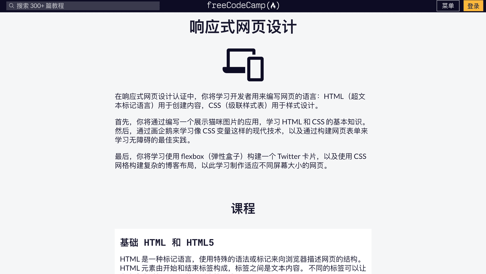
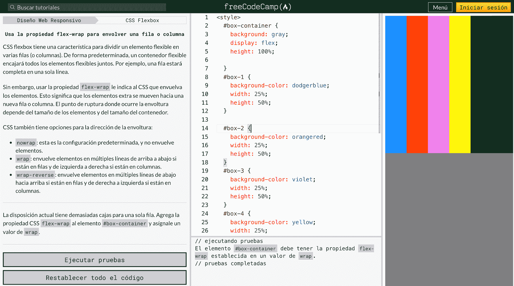
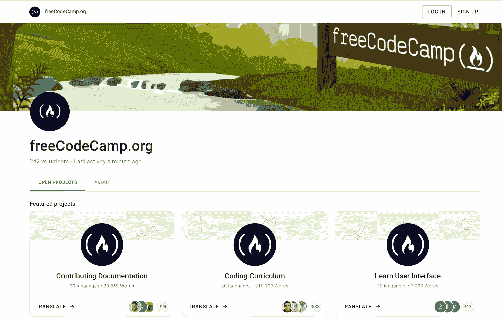
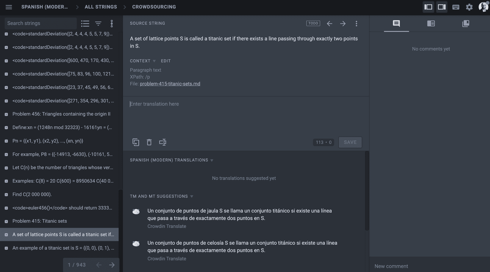
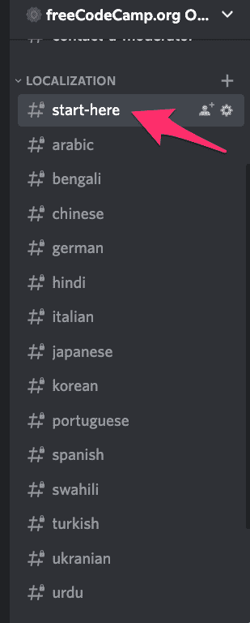
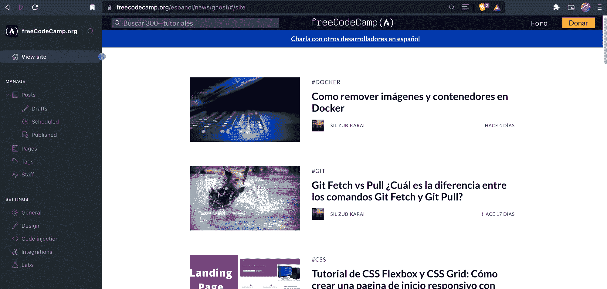
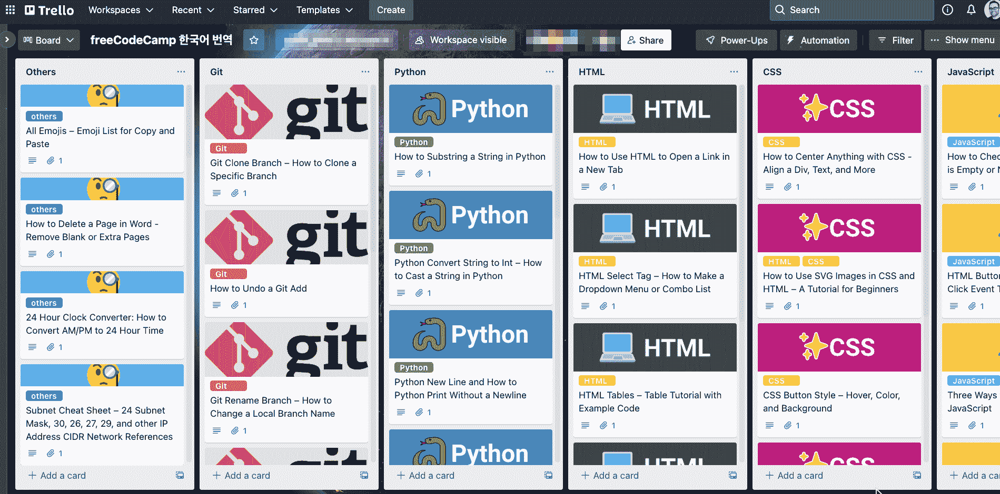

# 学习用西班牙语、汉语和 30 种其他语言编码——freeCodeCamp 的翻译工作

> 原文：<https://www.freecodecamp.org/news/world-language-translation-effort/>

经过一年的研究、编码和翻译，我自豪地宣布:

*   我们已经将 freeCodeCamp 的课程翻译成了西班牙语和中文。这些是我们全球社区贡献者的人工翻译，而不是机器翻译。
*   我们已经准备好了将 freeCodeCamp 翻译成其他 28 种世界主要语言的所有代码。
*   如果你会两种语言，我们需要你的帮助。

本月，freeCodeCamp 悄悄推出了核心编程课程的西班牙语和中文版本。您可以从导航菜单中访问它们:

freeCodeCamp's language selection options in the new menu drop-down

该社区也正在努力将 freeCodeCamp 翻译成至少 28 种其他世界主要语言:

*   阿非利堪斯语
*   阿拉伯语
*   孟加拉语
*   巴西葡萄牙语和欧洲葡萄牙语
*   加泰罗尼亚语
*   捷克人
*   丹麦的
*   荷兰人
*   芬兰人的
*   法语
*   德国人
*   希腊的
*   哈提安克里奥尔
*   希伯来人
*   印地语
*   匈牙利的
*   意大利的
*   日本人
*   韩国的
*   挪威的
*   波斯语(波斯语)
*   抛光剂
*   罗马尼亚的
*   俄语
*   塞尔维亚的
*   斯瓦希里语。亦称 KISWAHILI
*   瑞典的
*   泰国的
*   土耳其的
*   乌克兰的
*   和越南人

freeCodeCamp 社区现在已经准备好了代码和流程来人工翻译所有这些内容。UI、课程、失败的测试和运行时错误消息——一切。

freeCodeCamp's Responsive Web Design certification, shown in Simplified Chinese characters

我们的目标是让人们能够在完全不懂英语的情况下通过 freeCodeCamp 取得进步。大多数 HTML、CSS、Python、JavaScript 和 SQL 语法都是英文的。但是我们可以翻译除了代码本身以外的任何东西。

freeCodeCamp's interactive coding challenges shown in Spanish

同样，这已经是生产中的实况。我们已经将用户界面和响应式网页设计认证完全翻译成西班牙语和中文。(我们仍在将剩余的认证翻译成西班牙语和中文，欢迎您的帮助。)

这些也不是逐字的翻译。他们考虑到文化差异和其他细微差别。

我们的长期目标是让这些语言社区各得其所。为此，我们计划针对每种语言发布以下内容:

*   本地化出版物。这是西班牙的出版物，这是 T2 的中文出版物。
*   本地化的 YouTube 频道。这里是西班牙 YouTube 频道，这里是中国 YouTube 频道[。其中每一个都至少有一个完整长度的课程，我们将很快发布更多。所以一定要订阅。](https://www.youtube.com/channel/UCjJ2wNr0beoxQN5_q3CaR1w)
*   本地化子论坛。这里是新的西班牙语论坛。这里是[中文论坛](https://chinese.freecodecamp.org/forum/)。
*   用于分享更新的本地化 Twitter 帐户。这里有[西班牙的推特](https://www.twitter.com/freecodecampes)和[中国的推特](https://twitter.com/freecodecampzh)。我们将在每个账户上分享大量有用的资源，所以一定要在 Twitter 上关注它们。

## 这些翻译工具就像是我们翻译人员的动力外骨骼

我们使用 GitHub 和一个强大的工具 crowd in T1 的组合。这使得你和成千上万的其他人可以毫无困惑或重复地进行翻译。

The translation landing page. The coding curriculum currently includes 310,000 words to translate into each language – a major undertaking that will take hundreds of contributor-hours per language.

一旦校对者(一个有经验的说该语言的翻译贡献者)批准了你的翻译，他们可以直接将它们合并到 freeCodeCamp 的代码库中，在那里我们的脚本会自动将它们部署到生产中。

The Crowdin translation interface – translating the curriculum sentence-by-sentence. Crowdin gives translation contributors a wide range of tools, including machine translation suggestions.

## **如何翻译 freeCodeCamp**

如果你对贡献感兴趣，这里有你可以参与的方法。

第一步:[填写这张谷歌表格](https://docs.google.com/forms/d/e/1FAIpQLSdWC609yj1_2afEX0G8AGQyrkGj7bhj1J4XWgCt4BJGuzQk5g/viewform)。

第二步:[加入 freeCodeCamp 官方 Discord](https://discord.gg/PRyKn3Vbay) 在“从这里开始”房间介绍自己。然后你可以加入一个特定语言的房间，说你的母语。

Some of our Discord chatrooms for the global localization effort

我们有每种世界语言的语言线索。根据你想对哪种语言做出贡献，你会收到其中一个人的电子邮件，以了解更多关于你和你的目标的信息。

他们可能会给你免费的 CodeCamp 出版物，在那里你可以开始翻译文章。

We use Ghost, a powerful open source CMS, for our publication. This screenshot is our Spanish publication.

对于每种语言，我们都有一个大的 Trello 板，上面有我们想要优先排序的文章。

A Trello board we use to coordinate our Korean translation effort

## **让世界各地的每个人都可以使用免费代码营**

这是一项艰巨的任务，需要很多年。但是社区已经为实现这一目标采取了一些具体措施。

请加入我们，让世界各地的人们更容易获得这些免费的学习资源。🌏🌍🌎

## 非常感谢到目前为止我们所有的翻译人员。

最后，我想感谢一些善良的人们，他们在过去的几个月里付出了时间和精力将 freeCodeCamp 的课程翻译成西班牙语和中文。他们的工作才刚刚开始，因为他们还有更多的认证需要翻译，还有更多的认证正在开发中。

如果你能说两种语言，并且对我们的翻译工作感兴趣，我期待有一天能把你加入这个名单。👍

### 西班牙队

*   凯文·桑切斯
*   [玛丽奥里·s·博内乌](https://twitter.com/msboneu)
*   胡安·卡里略
*   [麦伦·埃尔南德斯](https://www.linkedin.com/in/mail%C3%A9n-hern%C3%A1ndez-en-es-translator-99023217a/)
*   马蒂亚斯·巴尔丹扎

### 中国队

*   [Hu Luoyang](https://github.com/huluoyang)
*   [Chen Zhicheng](https://github.com/ZhichengChen)
*   [S1ngS1ng](https://github.com/S1ngS1ng)
*   [Wu Zeqing](https://github.com/silentsvv)
*   [Ye Xinlei](https://github.com/xinleiye)
*   [Brilliant](https://github.com/rainpure)
*   [Shooter](https://github.com/ssshooter)
*   [Ding Zhige](https://github.com/stevending1st)
*   [徐奇立](https://github.com/XuQuan-nikkkki)
*   [Lai Shaoliang](https://github.com/XERO75)
*   [Liu Hui](https://github.com/CatcherO)
*   [Scholarly Ink Sword](https://github.com/demongodYY)
*   [Zhao Tingrui](https://github.com/Robin-zero)
*   [Wu Yuping](https://github.com/fs523577192)
*   [Fu Xiaoluo](https://github.com/XiaoLuo01)
*   [Practice Zhiwen](https://github.com/LynnLian)
*   [Dark interpretation](https://github.com/thewindsword)
*   [Tang Wei](https://github.com/biglemonblob)
*   [Dong Kaixuan](https://github.com/sameer1994kiki)
*   [Cui Pingping](https://github.com/Hectlles)
*   [clearly](https://github.com/ifyour)
*   [Liu Manting](https://github.com/stanleyyylau)
*   [Xiaoxizi](https://github.com/xiaoxizi333)
*   [Li Jie](https://github.com/bigfacemaster)
*   [Li Xukai](https://github.com/Jupiter-Lee)
*   [Xia Shikun](https://github.com/Echocruise)
*   [Zhi Yuan](https://github.com/juzhiyuan)
*   [Han Yile](https://github.com/hylerrix)
*   [ginger](https://github.com/jiangyuzhen)
*   [Wei Chaoxin](https://github.com/hanx316)