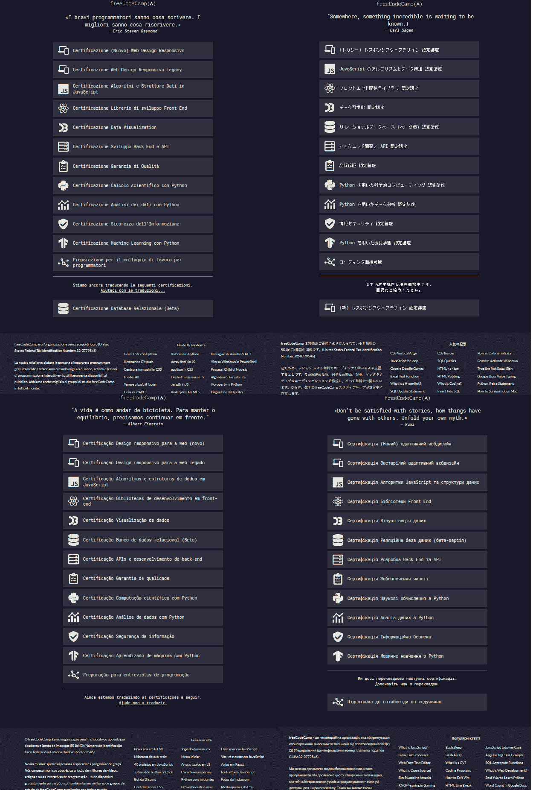
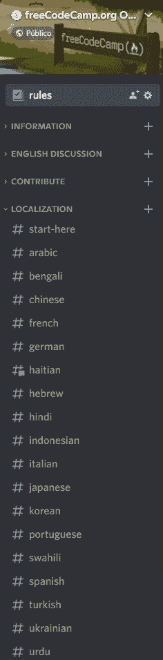
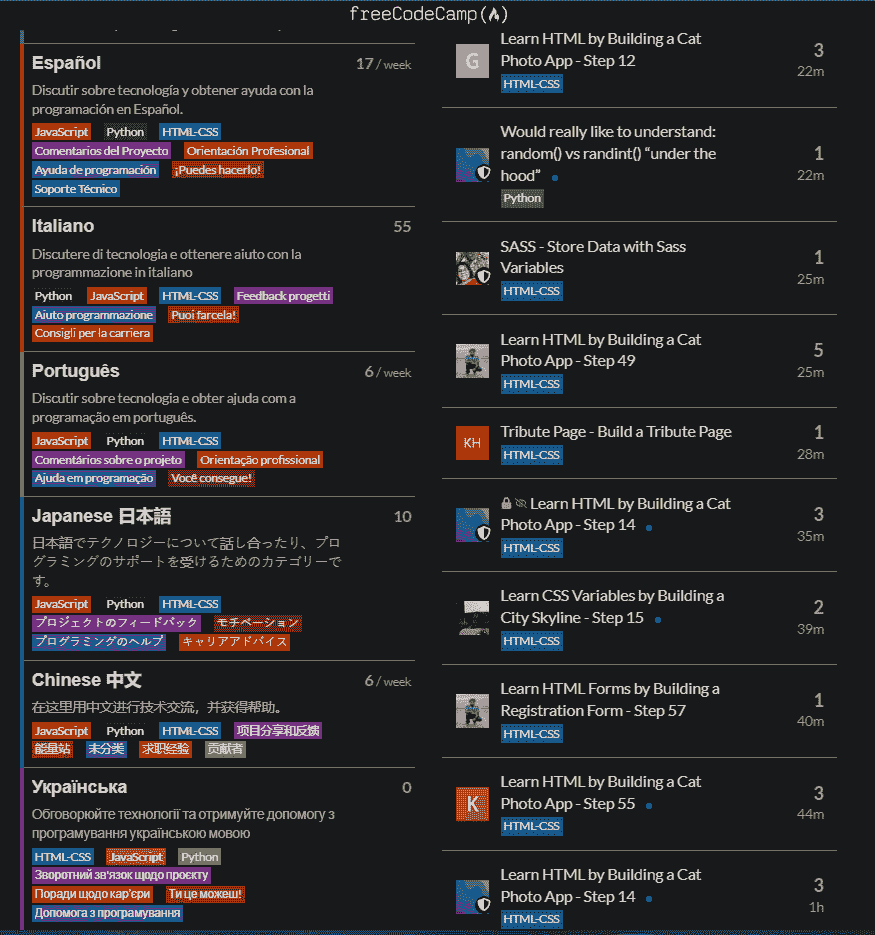

# 世界翻译月又回来了——如何帮助将 freeCodeCamp 翻译成您的母语

> 原文：<https://www.freecodecamp.org/news/world-translation-month-is-back-how-can-you-contribute-to-translate-freecodecamp-into-your-language/>

自 2021 年 9 月 freeCodeCamp 举办我们的第一个世界翻译月以来，一年已经过去了。

又到了九月，这是这个为期一个月的活动的第二部分。freeCodeCamp 连续第二年举办我们的世界翻译月，从 9 月 6 日开始，一直持续到月底。

## 什么是世界翻译月？

世界翻译月是 freeCodeCamp 举办的一项活动，旨在帮助将 freeCodeCamp 的课程翻译成尽可能多的世界语言。

该活动欢迎新的本地化贡献者，并感谢那些已经在翻译过程中提供帮助的人。

在去年的首次活动中，freeCodeCamp 举办了一次 Twitter 空间会议。在那次会议中，我们和贡献者聊天。我们帮助许多新人开始将 freeCodeCamp 翻译成他们的母语。

全球翻译工作的领导者 Rafael 发表了这篇文章来宣布这一事件。它提供了到那时为止翻译工作的一些数据。

您也可以[观看这个简短的视频](https://www.youtube.com/watch?v=jHbylSuuhIo)，其中包含了来自世界各地的投稿人的信息，讲述了世界翻译月对他们的意义以及他们是如何提供帮助的。

[https://www.youtube.com/embed/jHbylSuuhIo?feature=oembed](https://www.youtube.com/embed/jHbylSuuhIo?feature=oembed)

## 迄今为止的翻译进度

从那以后的 12 个月里发生了太多的事情。我们有来自许多不同语言的贡献者。例如，意大利语、日语、葡萄牙语和乌克兰语现在已经翻译了整个课程。

其他人已经开始翻译前三个核心认证——响应式网页设计(最新版本)、JavaScript 和前端库——如阿拉伯语、孟加拉语、法语、德语、印度尼西亚语、韩语、波斯语、罗马尼亚语、俄语、土耳其语和乌尔都语。

freeCodeCamp's certifications translated to Italian and Japanese (above), Portuguese and Ukranian (below).

社区也改变了我们的关注点。今年，我们决定将注意力转移到 freeCodeCamp 出版物上。我们已经开始将我们最受欢迎的教程翻译成其他世界语言

我们现在已经用多种语言发布了这些教程。我们已经有 475 篇西班牙文文章和 1000 多篇中文文章。

葡萄牙语有大约 350 篇文章，意大利语有超过 200 篇文章被翻译。

日语、孟加拉语、阿拉伯语和乌尔都语新闻部门也为他们的出版物制作了越来越多的译文。

这并不意味着我们放弃了课程。事实上，这两项任务是同时发生的。一些投稿人专注于课程，而其他人则协助文章的翻译。

## 我们沟通渠道的改变

我们还改变了与本地化贡献者的沟通方式。在六月，我们把我们用来和贡献者交流的聊天室搬到了我们的社区不和谐服务器上。

这使得与贡献者的互动更加容易。它还帮助他们更容易地相互交流，以及与社区中正在学习编码的其他成员交流。

翻译聊天室正在本地化，如下图所示:

Localization chat rooms on the fCC Discord server

如果营员需要课程方面的帮助，他们仍然可以在 [freeCodeCamp 论坛](https://forum.freecodecamp.org/)上提问。

我们还在论坛上设立了不同语言的版块，以帮助那些在课程学习过程中有疑问但发现很难用英语提问的人。

Several localized sections of the fCC forum are now available

## 世界翻译月的目标

世界翻译月的目标有两个:

*   感谢我们的贡献者为尽可能多的世界语言提供免费代码营所做的一切
*   邀请更多的投稿人参与我们的翻译工作。

昆西在六月发表了一篇文章，你可以从中了解如何联系我们来提供翻译帮助。

我们还要感谢我们的贡献者花时间用他们的语言编写了越来越多的文本。这些翻译的课程和文章使世界各地的人们有可能学习用他们的母语编写代码。

## 世界翻译月徽章

今年，我们将再次向整个月帮助我们翻译文章的贡献者颁发徽章。尽管文章的大小可能不同，但我们知道每一篇文章都需要大量的努力。

翻译文章和翻译课程是完全不同的。投稿人可以翻译课程表里的几串，停止投稿。但是每个投稿人一旦决定翻译整篇文章，就要对它负责。所以投稿人开始和结束他们选择的文章的翻译，这是他们擅长的。

在世界翻译月活动期间，我们将向所有在整个月做出贡献的参与者颁发世界翻译月徽章。

此外，在活动结束时，我们将向在九月份做出最大贡献的顶级译者颁发特殊徽章。

如果您愿意，您可以在您的 freeCodeCamp 论坛个人资料中显示这些徽章。

## 感谢所有的译者、撰稿人和校对人员！

如果你想帮助将 freeCodeCamp 的课程翻译成任何一种世界语言，请访问我们的 Discord 贡献者频道，并阅读昆西的文章，了解如何贡献和学习更多内容。

如果你是这个倡议的一部分，并自愿将 freeCodeCamp 的大量资源翻译成你的母语，那么谢谢你！我们表示衷心的感谢，并希望这个过程对你有所帮助，对你有所乐趣。继续努力吧！

## 世界末日翻译月 2022 更新

世界翻译月已经结束了。我们要感谢所有帮助我们将 freeCodeCamp 出版物和课程翻译成多种世界语言的贡献者。

在下表中，您可以找到我们九月份按语言分组的最多产译者名单。贡献最大的人还将获得顶级翻译徽章，以表彰他们为此付出的大量时间。

### 阿拉伯语

#### 出版

| 名字 | 出版物简介 | Twitter 句柄 | 顶级贡献者 |
| --- | --- | --- | --- |
| Mostafa Higazy | 穆斯塔法 |  |  |

#### 课程

| 名字 | Crowdin 用户名 | Twitter 句柄 | 顶级贡献者 |
| --- | --- | --- | --- |
| 穆罕默德·埃尔梅特瓦利 | @Sakaly |  | ✔️ |
| 可疑的穆斯塔法 | @Tozlock |  | ✔️ |
| 阿卜杜勒哈基姆 | @abdelhakim |  |  |
| 哈立德·本杰隆 | @kmbenjel |  |  |
| 卡里姆·埃尔尼姆尔 | @karim.elnemr |  |  |
| 梅纳·麦哲伦 | @mernamageed |  |  |

### 中国人

#### 出版

| 名字 | 出版物简介 | Twitter 句柄 | 顶级贡献者 |
| --- | --- | --- | --- |
| 成君。我会的 | [成俊](https://chinese.freecodecamp.org/news/author/chengjun/) |  | ✔️ |
| Xiong Zhijie | [熊](https://chinese.freecodecamp.org/news/author/xiong/) |  | ✔️ |
| 帕帕雅黄 | [木瓜黄](https://chinese.freecodecamp.org/news/author/papayahuang/) |  | ✔️ |
| 罗吉音 | [骆基音](https://chinese.freecodecamp.org/news/author/luojiyin/) | [@ vizrtloo](https://twitter.com/vizrtluo) | ✔️ |
| 李亚星 | [亚星](https://chinese.freecodecamp.org/news/author/yaxing/) |  |  |
| Zhao Qiaochu |  |  |  |

#### 课程

| 名字 | Crowdin 用户名 | Twitter 句柄 | 顶级贡献者 |
| --- | --- | --- | --- |
| 陈志成 | @陈志成 |  | ✔ |
| 罗一航 | @iLtc |  | ✔ |
| 希金斯利 | @ higgineselee |  |  |
| 郑 | @ Johnson-郑 |  |  |
| 凛 | @Rin |  |  |
| 奇迹 | @奇迹 |  |  |
| 李善 | @shanlillian33 |  |  |

### 法语

#### 出版

| 名字 | 出版物简介 | Twitter 句柄 | 顶级贡献者 |
| --- | --- | --- | --- |
| 尼桑 | [ihssan](https://www.freecodecamp.org/french/news/author/ihssand/) |  | ✔️ |
| 埃文赫米 | 埃文 |  |  |
| 皮埃尔·德·莱平伊 | 皮埃尔 |  |  |
| 纪尧姆·法索 | 纪尧姆 |  |  |
| 拉杜斯杰罗姆 | [chuck2kill](https://www.freecodecamp.org/french/news/author/chuck2kill/) |  |  |
| 伯纳德·恩甘杜 | 伯纳德-吴 |  | ✔️ |
| 阿瑟·兰杜兰特 | 亚瑟 |  |  |
| 下一个拉斐尔 | [拉斐尔](https://www.freecodecamp.org/french/news/author/raphael/) |  |  |
| 艾琳·勒罗伊 | [aline](https://www.freecodecamp.org/french/news/author/aline/) |  |  |
| 让-巴蒂斯特 | [让-巴蒂斯特-利兰达斯](https://www.freecodecamp.org/french/news/author/jean-baptiste-lelandais/) |  |  |
| 埃马纽埃尔·克波格莱 | [伊曼纽尔](https://www.freecodecamp.org/french/news/author/emmanuel/) |  |  |
| 詹妮弗·科林 | 詹尼弗 |  |  |
| 迈赫迪 | [很快](https://www.freecodecamp.org/french/news/author/soon/) |  |  |

### 德国人

#### 出版

| 名字 | 出版物简介 | Twitter 句柄 | 顶级贡献者 |
| --- | --- | --- | --- |
| 斯捷潘·施拉德霍夫特 | 斯蒂芬 | [@stephandue](https://twitter.com/stephandue) | ✔️ |
| 亚历山大·亨切尔 | [亚历山大](https://www.freecodecamp.org/german/news/author/alexander/) |  | ✔️ |

### 海地克里奥尔语

#### 出版

| 名字 | 出版物简介 | Twitter 句柄 | 顶级贡献者 |
| --- | --- | --- | --- |
| 一定是雷米 | [cerillemi](https://www.freecodecamp.org/haitian/news/author/certilremy/) | [@ cerillemi](https://twitter.com/certilremy) | ✔️ |
| 克里斯·韦斯利·皮埃尔 |  |  |  |
| 瓦内萨·雅克 |  |  |  |
| 玛丽·玛格达拉·圣蒂尔 |  |  |  |
| 埃斯诺尔德·朱尔 |  |  |  |
| 达尼奥·安奈斯 |  |  |  |
| 让·卡姆·波拉德 |  |  |  |
| 让·热拉尔·布塞 |  |  |  |

### 印地语

#### 出版

| 名字 | 出版物简介 | Twitter 句柄 | 顶级贡献者 |
| --- | --- | --- | --- |
| 凯拉什·乔杜里 |  |  |  |
| 平滑拉杰普 |  |  |  |

### 印度尼西亚的

#### 出版

| 名字 | 出版物简介 | Twitter 句柄 | 顶级贡献者 |
| --- | --- | --- | --- |
| 凯南山口 |  |  |  |
| Bagus Aji Santoso |  |  | ✔️ |
| 彼得·何塞 |  |  |  |
| Suci R. Putri |  |  |  |
| Haris Wirabrata |  |  |  |
| 亨德里·普里扬博沃 |  |  |  |
| Egar Pramana |  |  |  |
| 克里斯廷 |  |  |  |
| 穆罕默德·乔里德·希达亚图拉 |  |  |  |
| 太好了 |  |  |  |
| 凯文·马修 |  |  |  |
| Rizki Kurniawati |  |  |  |
| 穆罕默德·阿斯旺 |  |  |  |

### 意大利的

#### 出版

| 名字 | 出版物简介 | Twitter 句柄 | 顶级贡献者 |
| --- | --- | --- | --- |
| 罗伯托·保利托 | [rob1458](https://www.freecodecamp.org/italian/news/author/rob1458/) |  | ✔️ |
| 亚历山德罗·奇普里亚尼 | 亚历山德罗 |  |  |
| 基多库萨尼 | [gducsn](https://www.freecodecamp.org/italian/news/author/gducsn/) |  |  |
| 蒂齐亚诺·卡鲁阿纳 | [蒂齐亚诺 _ 卡鲁阿纳](https://www.freecodecamp.org/italian/news/author/tiziano_caruana/) |  |  |
| Tobia Trinci | [tobia](https://www.freecodecamp.org/italian/news/author/tobia/) |  |  |
| 卢卡·德·安吉利斯 | 卢卡 |  |  |

### 日本人

#### 出版

| 名字 | 出版物简介 | Twitter 句柄 | 顶级贡献者 |
| --- | --- | --- | --- |
| 古谷仁美·川原 | [仁美](https://www.freecodecamp.org/japanese/news/author/hitomi/) | [@aiminlabs](https://twitter.com/aiminlabs) | ✔️ |
| 高野明子 | [秋子](https://www.freecodecamp.org/japanese/news/author/akiko/) | [@秋子 _ 苏璞](https://twitter.com/akiko_pusu) |  |
| 干预 | [梅尔](https://www.freecodecamp.org/japanese/news/author/mell/) | [@ _*me11*](https://twitter.com/__me11_) |  |
| 松本相叶マナブ | [马纳布](https://www.freecodecamp.org/japanese/news/author/manabu/) |  |  |
| 冈本佑介 |  |  |  |

#### 课程

| 名字 | Crowdin 用户名 | Twitter 句柄 | 顶级贡献者 |
| --- | --- | --- | --- |
| 关口和夫 | @tomigo7 |  | ✔ |
| mmatsumoto1026 | @mmatsumoto1026 |  |  |
| 高野明子 | @ akiko _ 苏璞 |  |  |
| 科达伊 | @k0dai |  |  |
| yoshikoueda_18 | @yoshikoueda_18 |  |  |
| samymammy | @samymammy |  |  |

### 葡萄牙语、巴西语

#### 出版

| 名字 | 出版物简介 | Twitter 句柄 | 顶级贡献者 |
| --- | --- | --- | --- |
| 保拉模拟 | [paulaflavia](https://www.freecodecamp.org/portuguese/news/author/paulaflavia/) | [@paulaflaviaps](https://twitter.com/paulaflaviaps) | ✔️ |
| 加布里埃尔·加尔帝诺 | 加布里埃尔·加尔迪诺 |  |  |
| 佩德罗·阿尔维斯 | [佩德罗保罗](https://www.freecodecamp.org/portuguese/news/author/pedropaulo/) | [@pedrotriforce](https://twitter.com/pedrotriforce) |  |
| 伊诺·摩罗 | [enoa](https://www.freecodecamp.org/portuguese/news/author/enoa/) |  |  |
| 拉斐尔·方特内尔 | 拉斐尔-方特内尔 |  |  |
| 加布里埃尔·利马 | 加布里埃尔 | [@gabriellimma](https://twitter.com/gabriellimma) |  |
| 提阿戈科斯塔巴尔博萨 | [蒂亚戈科斯塔巴博萨](https://www.freecodecamp.org/portuguese/news/author/thiagocostabarbosa/) | [@_thiagocb](https://twitter.com/_thiagocb) |  |
| 阴极射线管 | 卡西乌斯 | [@c_leodegario](https://twitter.com/c_leodegario) |  |

#### 课程

| 名字 | Crowdin 用户名 | Twitter 句柄 | 顶级贡献者 |
| --- | --- | --- | --- |
| 安娜·比阿特丽斯 | @anabeatriz |  | ✔ |
| Dairenkon Majime | @moxu |  |  |
| 丹尼尔·比莱拉 | @danielevilela |  |  |
| 拉斐尔·方特内尔 | @拉斐尔-方特内尔 |  |  |

### 西班牙语

#### 出版

| 名字 | 出版物简介 | Twitter 句柄 | 顶级贡献者 |
| --- | --- | --- | --- |
| 何塞·西雷拉 | [豪尔赫 _ 塞拉](https://www.freecodecamp.org/espanol/news/author/jorge_sierra/) | [@豪尔赫 _ 塞拉 _1](https://twitter.com/Jorge_Sierra_1) |  |
| 安娜会喜欢的 | 安娜 | [@艾米利亚](https://twitter.com/aimerianna) |  |
| 约书亚 | [漂移](https://www.freecodecamp.org/espanol/news/author/drifting/) | [@DriftingL_](https://twitter.com/DriftingL_) | ✔️ |
| 克里斯蒂娜·帕迪拉 | 克里斯汀娜帕迪拉 | [@ crispitina](https://twitter.com/crispitipina) |  |
| 伊恩·考利 | 伊恩-考利 |  |  |
| 埃里克 | [usdek](https://www.freecodecamp.org/espanol/news/author/usdek/) | [@usdekx](https://twitter.com/usdekx) |  |
| 左 jhonathan | 乔纳森 |  |  |
| 何塞·冈萨雷斯 | 何塞-冈萨雷斯-努涅斯 |  |  |
| 阿尔瓦罗·贝尔特兰 | 阿尔瓦罗-贝尔特兰 | [@BeltranAlvaro08](https://twitter.com/BeltranAlvaro08) |  |
| 若热·托雷斯·托雷斯 | 豪尔赫-托雷斯-托雷斯 | [乔根托](https://twitter.com/jorgettor) |  |
| 米格尔·恩东 | 米奇 | [@mickyrend](https://twitter.com/mickyrend) |  |

### 斯瓦希里语。亦称 KISWAHILI

#### 出版

| 名字 | 出版物简介 | Twitter 句柄 | 顶级贡献者 |
| --- | --- | --- | --- |
| 安诺·卡尔古塔 | [安诺](https://www.freecodecamp.org/swahili/news/author/annoh/) | [@annoh_karlgusta](https://twitter.com/annoh_karlgusta) | ✔️ |
| 哈罗德·奥利弗 | 哈罗德 |  | ✔️ |
| Neema Adam | [neicore](https://www.freecodecamp.org/swahili/news/author/neicore/) | [@neicoree](https://twitter.com/neicoree) | ✔️ |

### 土耳其的

#### 出版

| 名字 | 出版物简介 | Twitter 句柄 | 顶级贡献者 |
| --- | --- | --- | --- |
| 卡住了 |  |  |  |
| "死神"是白色的 |  |  |  |
| 多安 |  |  |  |
| 希拉，你好 |  |  |  |

### 乌克兰的

#### 出版

| 名字 | 出版物简介 | Twitter 句柄 | 顶级贡献者 |
| --- | --- | --- | --- |
| 鲁斯塔姆 | [rustamdocstranslator](https://www.freecodecamp.org/ukrainian/news/author/rustamdocstranslator/) |  | ✔️ |

### 乌尔都语

#### 出版

| 名字 | 出版物简介 | Twitter 句柄 | 顶级贡献者 |
| --- | --- | --- | --- |
| 阿席达卡那边 | [阿里](https://www.freecodecamp.org/urdu/news/author/ali/) | [@ashiqaliaslam](https://twitter.com/ashiqaliaslam) | ✔️ |
| 胡拉姆·沙赫扎德 | khurram | [@Khurram78730833](https://twitter.com/Khurram78730833) |  |
| 塞达·法拉·拉赫曼 | 希达 | [@FarahSaifRahman](https://twitter.com/FarahSaifRahman) |  |
| 塔尔哈 | [its-talha](https://www.freecodecamp.org/urdu/news/author/its-talha/) | [@talha_inside](https://twitter.com/talha_inside) |  |
| Naveed | [导航](https://www.freecodecamp.org/urdu/news/author/naveed/) | [@Naveed_Tech_T](https://twitter.com/Naveed_Tech_T) |  |
| 阿卜杜勒·马吉德 | 阿卜杜勒 | [@阿卜杜勒马吉德 _DHB](https://twitter.com/abdulmajid_DHB) |  |
| 穆罕默德·亚当·伊克巴尔 | [亚当](https://www.freecodecamp.org/urdu/news/author/aadam/) | [@AadamIqbal11](https://twitter.com/AadamIqbal11) |  |

#### 课程

| 名字 | Crowdin 用户名 | Twitter 句柄 | 顶级贡献者 |
| --- | --- | --- | --- |
| 胡拉姆·沙赫扎德 | @ksl1816 |  | ✔ |

### 越南人

#### 出版

| 名字 | 出版物简介 | Twitter 句柄 | 顶级贡献者 |
| --- | --- | --- | --- |
| 通阮 |  |  |  |
| 裴荣 |  |  |  |