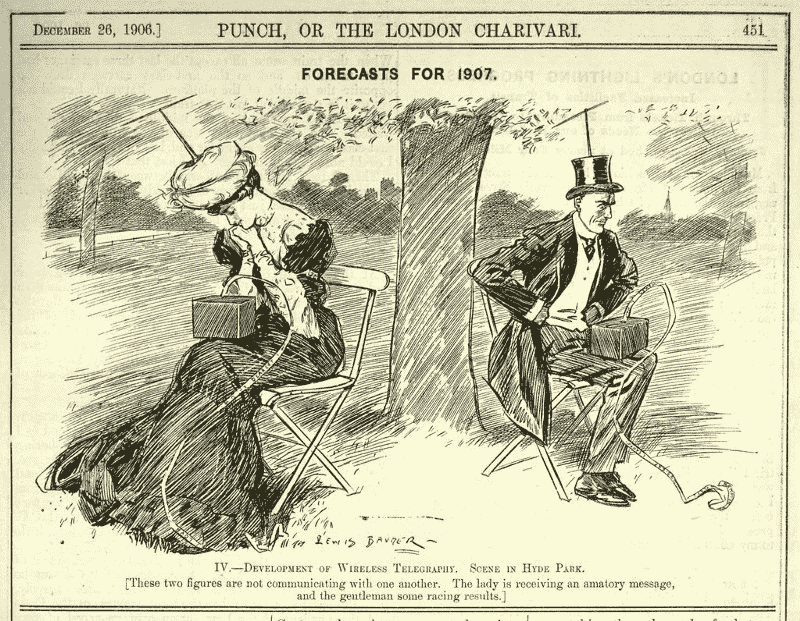

# 过去 150 年来最糟糕的技术预测

> 原文：<https://www.freecodecamp.org/news/worst-tech-predictions-of-the-past-100-years-c18654211375/>

伊利亚·佩斯托夫

# 过去 150 年来最糟糕的技术预测

Telegraph kills live communication

科学家、工程师和实业家之间有一个悠久的传统。每年新年，他们都会预测未来。

区块链是一项主要技术，还是只是一个时髦词？

机器人与应用:谁将在 2017 年胜出？

今年会是虚拟现实不再让人晕车的一年吗？

在过去的一个世纪里，技术已经被证明是非常不稳定的。尽管业内人士已经掌握了大量信息，但他们在过去几年里做出了一些非常糟糕的预测。

历史记忆最深刻的预测是那些表现出惊人的误判、误解、过度乐观的夸张、自欺欺人或过时的美好的一厢情愿的预测。

下面，我列出了最糟糕的预测，显示出即使是行业巨头也不总是知道他们在说什么。无论是对技术进步、采用率还是市场潜力的预测，我们都同意这些预测是完全错误的。

**1876:** *“这种‘电话’有太多缺点，不能认真考虑作为一种通讯手段。”***——威廉·奥顿**，西联公司总裁。

**1876:** *“美国人需要电话，但我们不需要。我们有很多送信的男孩。”***——威廉·普里斯爵士**，英国邮政局总工程师。

**1889:** *“瞎摆弄交流电只是浪费时间。没有人会使用它，永远不会。”* **—托马斯·爱迪生。**

1903 年: *“马会一直存在，但汽车只是一种新奇的东西——一种时尚。”*——密歇根储蓄银行行长建议**亨利·福特的**律师霍勒斯·拉克姆不要投资福特汽车公司。

**1921:***无线音乐盒没有想象中的商业价值。谁会为发送给任何人的信息付费呢？***——大卫·沙诺夫同仁**响应其号召投资广播。

1926 年:*虽然电视在理论上和技术上是可行的，但在商业上和经济上却是不可能的。***—李·德福瑞斯特，**“无线电之父”，发展电影有声电影的先驱。他拥有 180 多项专利。

1932 年:*没有丝毫迹象表明有可能获得核能。这将意味着原子将不得不被随意粉碎。***——*爱因斯坦*** *。*

**1936:** “火箭永远无法离开地球大气层。” **—《纽约时报》。**

1946 年: *“在最初的六个月之后，电视将无法保住它所占领的任何市场。人们很快就会厌倦每晚盯着一个胶合板箱。”*——**达里尔·扎努克**，电影制片人，20 世纪福克斯公司的联合创始人。

**1949:***“ENIAC 上的一台计算器配有 18000 个真空管，重 30 吨，而未来的计算机可能只有 1000 个真空管，重一吨半。”* **—大众力学。**

1957 年:*“我走遍了这个国家的每一个角落，与最优秀的人交谈，我可以向你保证，数据处理不会持续一年。”***——徒弟堂商业书籍编辑。**

**1959:***复印机全球潜在市场最多 5000 台。***IBM**告诉施乐最终的创始人。

1961 年: *“在美国国内，几乎没有可能利用通信卫星来提供更好的电话、电报、电视或无线电服务。”*——**t . a . m .克雷文**，联邦通信委员会(FCC)专员。

1977 年:“任何个人都没有理由在家里拥有一台电脑。” **—肯·奥尔森**，数字设备公司创始人

1981 年:“没有人会需要超过 637KB 的个人电脑内存。640KB 对任何人来说都应该足够了。” **—比尔·盖茨**，微软联合创始人兼董事长。

1981 年: *“移动电话绝对不会取代本地有线系统。”***——马蒂·库珀**，发明家。

**1989:** “我们永远不会做出 32 位的操作系统。” **—比尔·盖茨**，微软联合创始人兼董事长。

1992 年:“在每个口袋里都装一个个人通讯器的想法是一个“被贪婪驱使的白日梦”。“**——安迪·格罗夫**，时任英特尔首席执行官。

1995 年: *“我预测互联网将很快成为壮观的超新星，并在 1996 年灾难性地崩溃。”* **—罗伯特·梅特卡夫，**3Com 创始人，以太网发明者。

**2003:** *“购买音乐的订阅模式破产了。我认为你可以通过订阅模式来提供第二次降临，但这可能不会成功。”* **—乔布斯，*滚石*中的**

2007 年:*“iPhone 不可能获得任何显著的市场份额。”* **—史蒂夫·鲍尔默**，微软首席执行官。

> “能发明的都发明了。”—归功于美国专利局专员 Charles H. Duell，1899 年。

### 经验教训:不要混淆趋势和事实

正如保罗·克鲁格曼在他 1998 年的文章《为什么大多数经济学家的预测是错误的》中所指出的:

> 随着"[梅特卡夫定律](https://en.wikipedia.org/wiki/Metcalfe%27s_law)"的缺陷变得明显，互联网的发展将会大幅放缓。梅特卡夫定律指出，网络中潜在的连接数量与参与者数量的平方成正比:大多数人彼此之间无话可说！到 2005 年左右，人们将会清楚地看到，互联网对经济的影响并不比传真机大。

这是我最喜欢的预测，因为结果是他自相矛盾。

预测是一件冒险的事情。如果是关于不远的将来，就更是如此。一旦被证明是错误的，这些话就会像回旋镖一样回到它们的原点，而这些引语就会永远萦绕在说话者的心头。

感谢阅读。

