# JavaScript ES6 —写得更少，做得更多

> 原文：<https://www.freecodecamp.org/news/write-less-do-more-with-javascript-es6-5fd4a8e50ee2/>

JavaScript ES6 带来了新的语法和令人惊叹的新特性，使您的代码更加现代，可读性更好。它允许你写更少的代码，做更多的事情。ES6 向我们介绍了许多很棒的特性，如箭头函数、模板字符串、类销毁、模块…等等。让我们来看看。

### const and let

`const`是 ES6 中用于声明变量的新关键字。`const`比`var`更强大。一旦使用，变量不能被重新分配。换句话说，它是一个**不可变的变量**，除非它与对象一起使用。

这对于瞄准选择器非常有用。例如，当我们有一个触发事件的按钮时，或者当你想在 JavaScript 中选择一个 HTML 元素时，使用`const`而不是`var`。这是因为`var`被‘吊’起来了。当不想重新分配变量时，最好使用`const`。

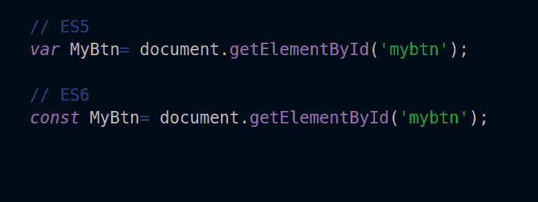

在上面的代码中，`const`不会改变，也不能被重新分配。如果你试图给它一个新的值，它会返回一个错误。

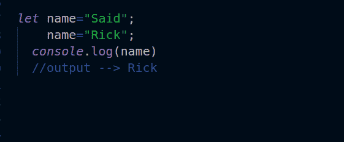

`let`可以重新分配并取新值。它创建了一个可变变量。

`let`与`const`相同，都是阻塞范围。这意味着该变量仅在其作用域内可用。

### 箭头功能

箭头功能真的很棒，它让你的代码更易读，更结构化，看起来像现代代码。不使用这个:

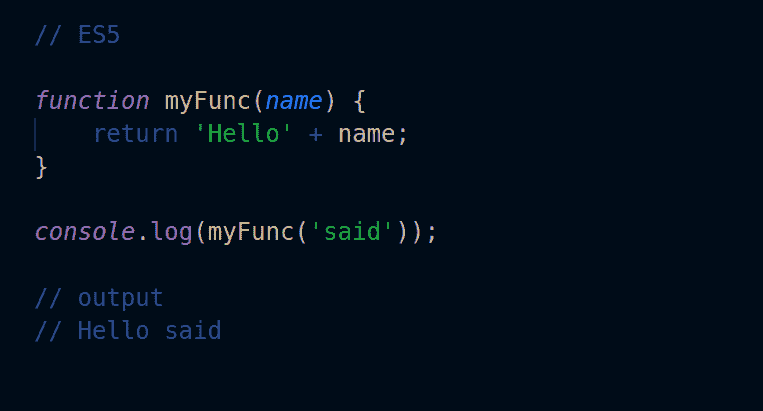

用这个:

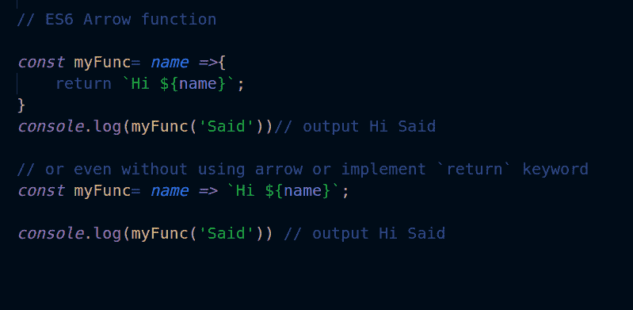

正如你所看到的，箭头函数看起来更加清晰易读！你将不再需要使用旧的语法。

此外，您可以将箭头函数与`map`、`filter`和`reduce`、**、**内置函数一起使用。


带箭头的 map 函数看起来比 ES5 中的`map`更加清晰易读。使用 ES6，您可以编写更短、更智能的代码。你可以用`filter`和`reduce`做同样的事情。

### 模板文字

模板文字或模板字符串非常酷。我们不必使用加号(+)操作符来连接字符串，或者当我们想在字符串中使用变量时。

旧语法:

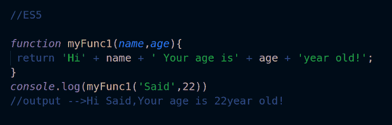

使用新的 ES6 语法:

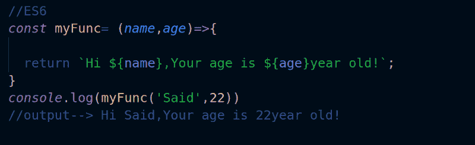

这么简单！这是旧语法和 ES6 之间的巨大差异。当使用字符串时，ES6 中的文字字符串看起来比 ES5 更有组织，结构更好。

### **默认参数**

当我在 PHP 中工作时，我通常使用默认参数。这些允许你预先定义一个参数。

所以，当你忘记写参数时，它不会返回一个未定义的错误，因为参数已经在缺省值中定义了。所以当你用一个丢失的参数运行你的函数时，它会取默认参数`t`的值，并且不会返回错误！

看看这个例子:

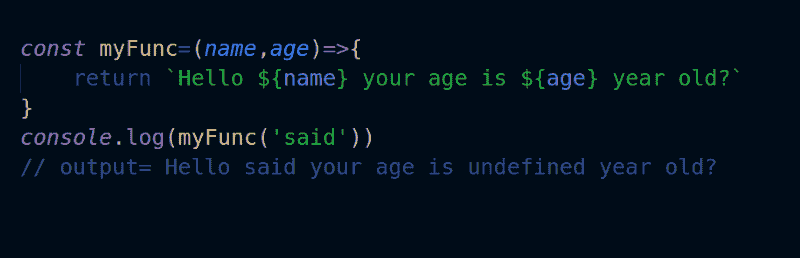

上面的函数返回 undefined，因为我们忘记给它第二个参数`age`。

但是如果我们使用了默认的参数，它不会返回 undefined，当我们忘记给一个参数赋值时，它会使用它的值！

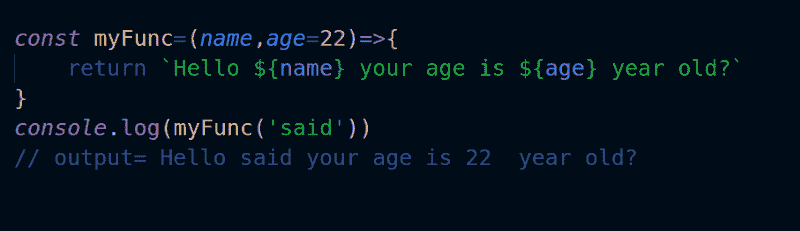

如您所见，即使我们遗漏了第二个参数，该函数仍会返回值。现在有了默认参数，我们可以提前处理错误。

### 数组和对象析构

析构使得将数组或对象的值赋给新变量变得更加容易。

旧语法:

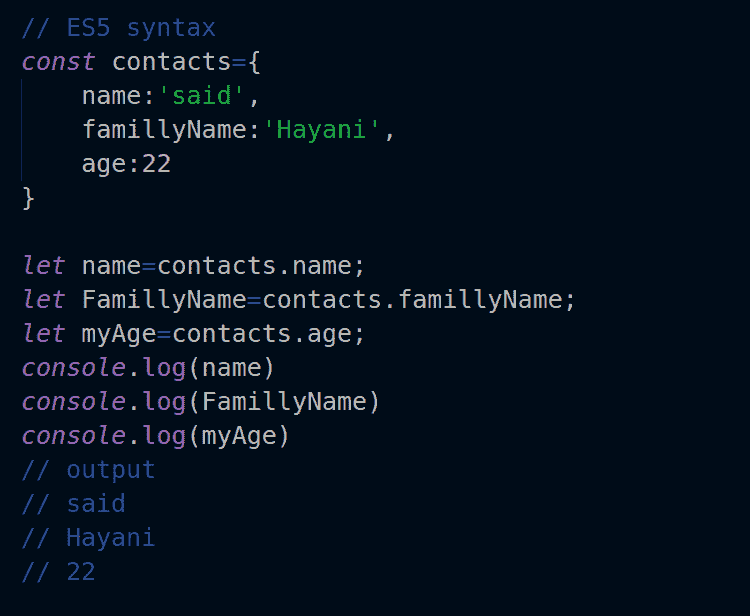

使用 ES6 语法:

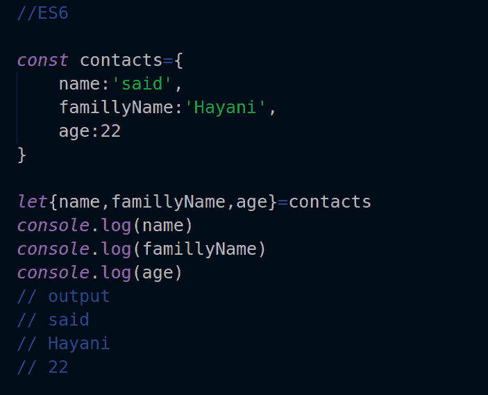

对于 ES5，我们必须将每个值赋给每个变量。在 ES6 中，我们只需将值放在花括号中，就可以获得对象的任何属性。

注意:如果你给一个变量赋了一个和属性名不一样的名字，会返回 undefined。例如，如果属性的名称是`name`，我们将它赋给一个`username`****变量，它将返回 undefined。****

****我们总是必须用属性的名字来命名变量。但是如果我们想重命名变量，我们可以使用冒号`:`来代替。****

****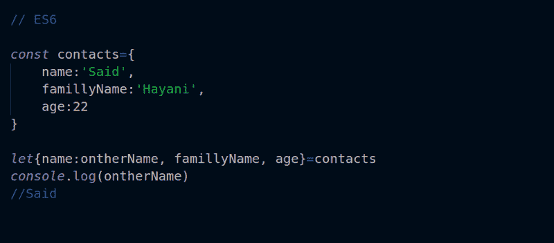****

****对于数组，我们使用与对象相同的语法。我们只需用方括号替换花括号。****

****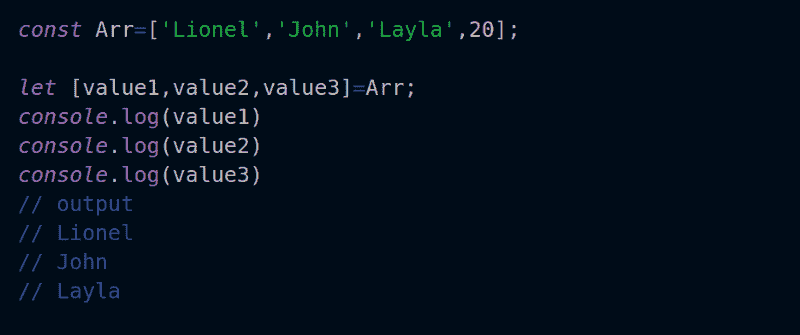****

### ****进出口****

****在您的 JavaScript 应用程序中使用`import`和 `export`会使它更加强大。它们允许您创建单独的和可重用的组件。****

****如果你熟悉任何一个 JavaScript MVC 框架，你会看到他们大部分时间使用`import`和`export`来处理组件。那么它们到底是如何工作的呢？****

****很简单！`export`允许您导出要在另一个 JavaScript 组件中使用的模块。我们使用`import`来导入模块，以便在我们组件中使用它。****

****例如，我们有两个文件。第一个被命名为`detailComponent.js` ，第二个被命名为`homeComponent.js`。****

****在`detailComponent.js` 中我们要导出`detail`函数。****

****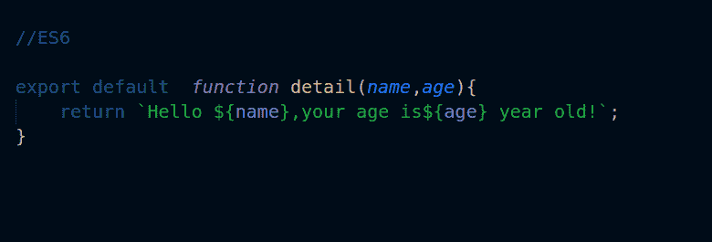****

****如果我们想在`homeComponent.js`、**和**中使用该功能，我们只需使用`import`。****

****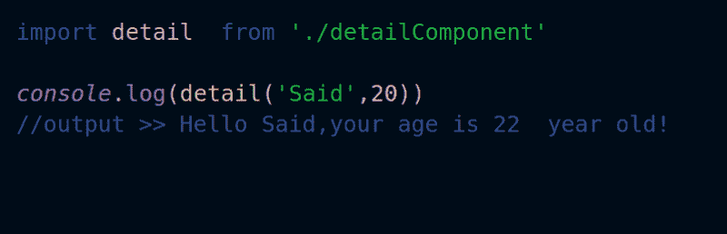****

****如果我们想要导入多个模块，我们只需将它们放在花括号中。****

****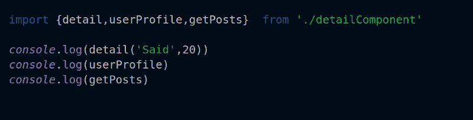****

****太酷了，不是吗？！****

### ******承诺******

****承诺是 ES6 的新特性。这是一种编写异步代码的方法。例如，当我们想从一个 API 获取数据，或者当我们有一个需要时间来执行的函数时，可以使用它。承诺让解决问题变得更容易，所以让我们创造我们的第一个承诺吧！****

****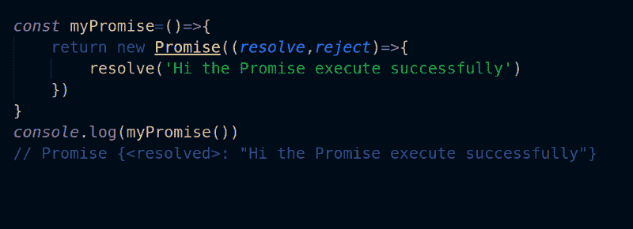****

****如果你登录你的主机，它会返回一个承诺。因此，如果我们想在获取数据后执行一个函数，我们将使用一个承诺。该承诺采用两个参数:`resolve`和`reject`来处理预期的错误。****

****注意:fetch 函数返回一个承诺本身！****

```
**`const url='https://jsonplaceholder.typicode.com/posts';`**
```

```
**`const getData=(url)=&gt;{return fetch(url);}`**
```

```
**`getData(url).then(data=&gt; data.json()).then(result=> console.log(result));`**
```

****现在，如果您登录您的控制台，它将返回一组数据。****

### ****剩余参数和扩散算子****

****[其余参数](https://developer.mozilla.org/ar/docs/Web/JavaScript/Reference/Functions/rest_parameters) s 用于获取一个数组的自变量，并返回一个新数组。****

****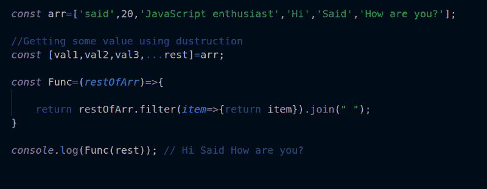********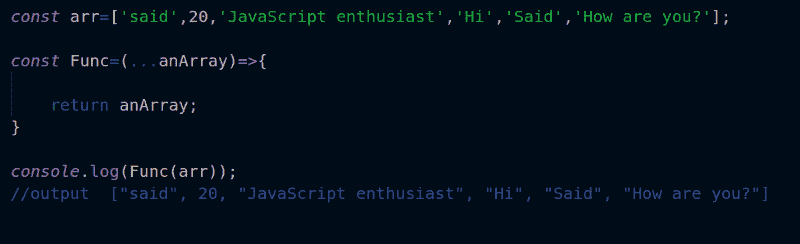****

****spread 运算符的语法与 rest 参数相同，但是 spread 运算符接受数组本身，而不仅仅是参数。我们可以使用 Spread 参数来获取数组的值，而不是使用 for 循环或任何其他方法。****

```
**`const arr=['said',20,'JavaScript enthusiast','Hi','Said','How are you?'];

const Func=(...anArray)=>{
  return anArray;
}

console.log(Func(arr));

//output  ["said", 20, "JavaScript enthusiast", "Hi", "Said", "How are you?"`**
```

### ****班级****

****类是面向对象编程(OOP)的核心。它们使您的代码更加安全和封装。使用类给你的代码一个好的结构并保持它的方向性。****

****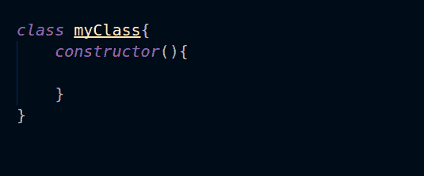****

****要创建一个类，使用`class`关键字，后跟带有两个花括号的类名。****

****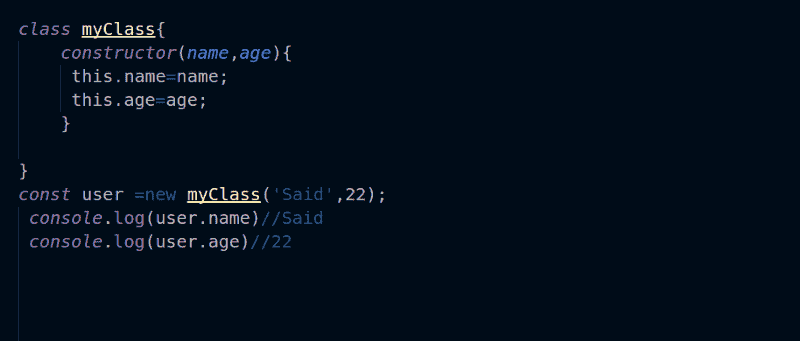****

****现在我们可以使用`new`关键字访问`class`方法和属性。****

```
**`class myClass{
    constructor(name,age){
    this.name=name;
    this.age=age;
}
}
const Home= new myClass("said",20);
console.log(Home.name)//  said`**
```

****要从另一个类继承，使用`extends`关键字，后跟您想要继承的类的名称。****

****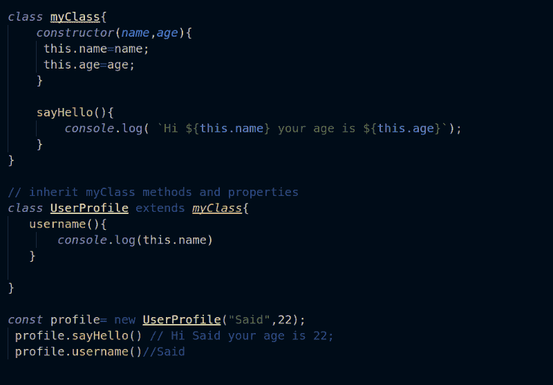****

****你可以在这里了解更多关于[的课程。](https://developer.mozilla.org/ar/docs/Web/JavaScript/Reference/Classes)****

****ES6 还有其他令人惊叹的功能——你可以在这里探索它们[。](http://es6-features.org)****

### ****结论****

****我希望这篇文章对你们有用，我也希望我能够向你们介绍一些 ES6 的特性。如果是这样，订阅这个[邮件列表](http://eepurl.com/dk9OJL)来了解更多关于前端的话题。谢谢你的时间。****

> ****顺便说一下，我最近和一个强大的软件工程师团队合作开发了一个移动应用程序。这个组织非常棒，产品交付得非常快，比我合作过的其他公司和自由职业者快得多，我想我可以诚实地向他们推荐其他项目。如果你想联系我，请发邮件给我—[said@devsdata.com](mailto:said@devsdata.com)。****