# React 测试库教程——如何为 React 应用编写单元测试

> 原文：<https://www.freecodecamp.org/news/write-unit-tests-using-react-testing-library/>

在本教程中，您将学习如何使用[测试库](https://testing-library.com/)自信地编写单元测试。这是一个非常流行的 React 测试库，用于编写单元测试。

所以让我们开始吧。

## 我们将涵盖的内容:

1.  为什么需要编写单元测试？
2.  [什么是 React 测试库？](#what-is-the-react-testing-library)
3.  [测试库不测试什么](#what-not-to-test-with-the-testing-library)
4.  [如何用 Vite 建立一个 React 项目](#how-to-setup-a-react-project-with-vite)
5.  [如何在 React 项目中建立测试库和 Jest](#how-to-set-up-the-testing-library-and-jest-in-a-react-project)
6.  [如何创建测试 UI](#how-to-create-the-ui-for-testing)
7.  [如何编写单元测试用例](#how-to-write-unit-test-cases)
8.  [让我们再写一些测试](#let-s-write-some-more-tests)
9.  [结论](#conclusion)

如果你想从零开始深入学习 React 测试库，可以看看我的 [MERN 栈课程](https://online-elearning-platform.netlify.app/)。

## 为什么需要编写单元测试？

你可能认为你不需要写这么多单元测试用例，这是浪费时间。也许您可以手动测试应用程序。

嗯，你说得对，你当然可以这么做。但是随着应用程序的增长，可能很难测试应用程序中的所有场景，您可能会错过一些东西。如果所有的主要功能都没有正确测试，那么即使是很小的变化也可能会破坏应用程序。

这就是为什么我建议编写单元测试用例，覆盖你作为用户手动经历的所有场景。

因此，只需执行一条命令，您就能知道应用程序中是否有问题，或者某个测试是否失败。

## 什么是 React 测试库？

React [测试库](https://testing-library.com/)有一组帮助你以用户为中心的方式测试 UI 组件的包。这意味着它基于用户如何与页面上显示的各种元素进行交互来进行测试。

因此，当用户单击任何按钮或在任何输入文本框中键入内容时，就会使用这个测试库来测试交互。

因此，用户不必手动进行测试(这需要花费大量时间，并且当应用程序增长时，用户可能会错过测试某些场景)，而是通过编写单元测试用例并通过一个命令执行它们来进行测试。

## 测试库不测试什么

测试库鼓励你避免测试实现细节，比如你正在测试的组件的内部。

本库的指导原则强调了对测试的关注，这些测试非常类似于用户与网页的交互方式。

您可能希望避免测试以下实现细节:

*   组件的内部状态
*   组件的内部方法
*   组件的生命周期方法
*   子组件

因此，如果你有使用[酶测试](https://enzymejs.github.io/enzyme/)的经验，当你点击任何按钮时，你可能会检查状态的值，或者如果有变化，你可能会检查正确的值。

但是这些类型的检查对于使用 React 测试库进行测试并不是必需的。相反，在 React 测试库中，当用户点击按钮或提交表单等时，您可以检查 DOM 的行为。

## 如何用 Vite 建立一个 React 项目

为了设置我们将要测试的应用程序，我们将使用 [Vite](https://vitejs.dev/) 。这是一个比[创建-反应-应用](https://reactjs.org/docs/create-a-new-react-app.html)更受欢迎、更快捷的替代方案。

我们将使用 Vite，因为当应用程序增长时,`create-react-app`变得很慢，并且当我们对应用程序代码进行任何更改时，需要花费大量时间来刷新页面。此外，默认情况下，它还添加了许多我们很少需要的额外的包。

Vite 只是重建我们改变的东西，而不是重建整个应用程序，这在开发过程中节省了大量时间。

请记住，Vite 要求 Node.js 版本为 14.18+，因此请确保安装高于或等于 14.18 的节点版本。

安装和切换 Node.js 版本最简单的方法就是使用 [nvm](https://github.com/nvm-sh/nvm#installing-and-updating) 。

即使您使用的是`create-react-app`，您将在本教程中学习的所有测试应该完全相同，没有任何错误。

要用 React 创建一个新的 Vite 项目，从终端执行`npm init vite`命令。

它会问你`project name`、`framework`和`variant`。

*   对于`project name`，您可以输入`testing-library-demo`或您选择的任何名称。
*   对于`framework`，从选项列表中选择`React`
*   对于`variant`，从选项列表中选择`JavaScript`

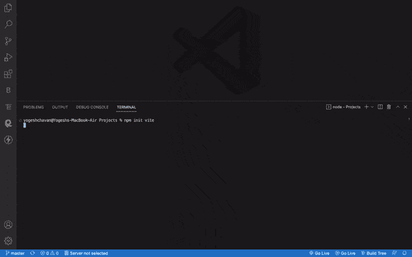

Create a new React project using Vite

一旦创建了项目，您就可以在您喜欢的 IDE 中打开该项目。

项目文件夹结构将如下所示:

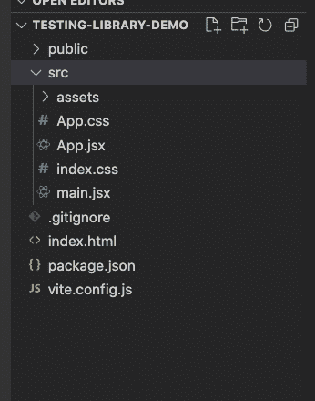

Folder structure of React Vite project

现在，执行`yarn`或`npm install`命令安装来自`package.json`文件的所有包。

一旦安装了所有的包，就可以执行`yarn run dev`或`npm run dev`命令来启动创建的 React 应用程序。

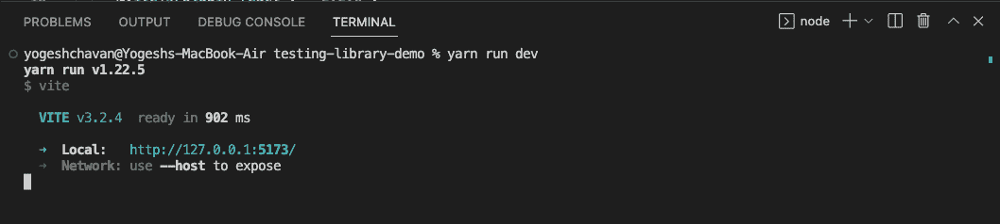

Running a React app

现在，如果您访问显示的 URL `http://127.0.0.1:5173/`，您将能够看到使用 Vite 创建的默认 React 应用程序。

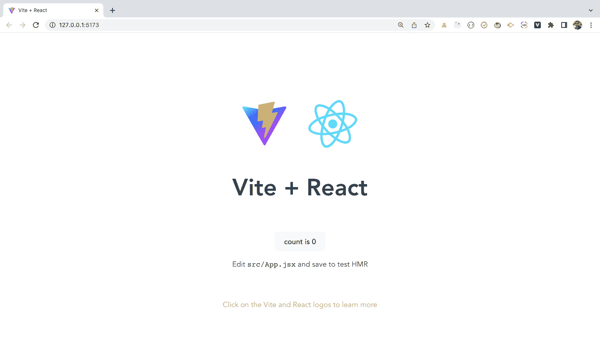

Default React page rendered using Vite

因此，让我们看看如何在我们的 Vite 项目中建立[测试库](https://testing-library.com/docs/)。

## 如何在 React 项目中建立测试库和 Jest

你不能只使用测试库——你还需要安装 [Jest](https://jestjs.io/) 。它公开了一个广泛使用的全局 expect 函数和其他东西，帮助您在测试用例中做出断言。

要设置[测试库](https://testing-library.com/)和 [Jest](https://jestjs.io/) ，您需要安装 Jest 和测试库包作为开发依赖项。

因此，从`testing-library-demo`文件夹中执行以下命令:

```
yarn add @testing-library/jest-dom@5.16.5 @testing-library/react@13.4.0 @testing-library/user-event@14.4.3 jest@29.3.1 jest-environment-jsdom@29.3.1 vitest@0.25.3 --dev 
```

或使用 npm:

```
npm install @testing-library/jest-dom@5.16.5 @testing-library/react@13.4.0 @testing-library/user-event@14.4.3 jest@29.3.1 jest-environment-jsdom@29.3.1 vitest@0.25.3 --save-dev 
```

我在这里提到的每个包的版本都是在写本教程时的最新版本。所以即使将来有新的破坏性版本发布，你的代码也不会被破坏。

这里，我们正在安装`jest-environment-jsdom`库，因为我们将在节点环境中运行测试。但是我们正在通过 DOM 测试浏览器交互——所以为了通知 Jest 这一点，我们需要添加这个库。

`@testing-library/jest-dom`库是必需的，因为它包含像`toBeInTheDocument`、`toHaveBeenCalled`这样的断言，使得测试 DOM 元素变得容易，这一点你将在本教程的后面看到。

我们还添加了`vitest`包，只有在使用 Vite 时才需要这个包。

如果你正在使用`create-react-app`或者你自己的 webpack 配置，你不需要它。

现在我们已经安装了所需的包，让我们在`package.json`文件中添加一个脚本来运行测试。

打开`package.json`文件并在其中添加`test`脚本，如下所示:

```
"test": "vitest" 
```

您的`package.json`文件现在看起来像这样:

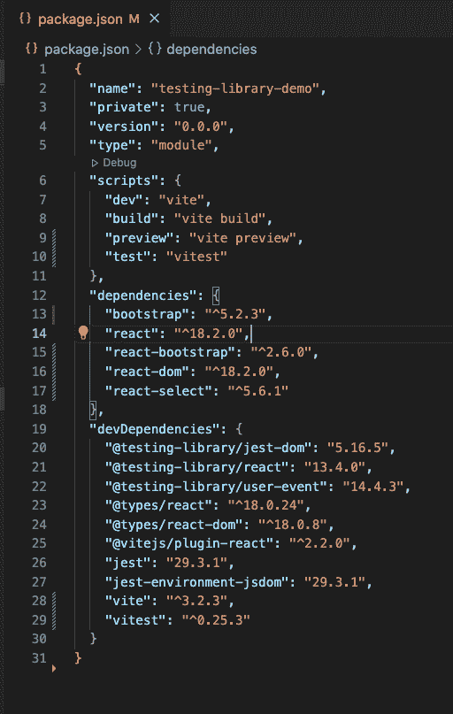

Package.json file preview

如果您没有使用`vite`来创建 React 应用程序，那么您将使用下面的测试脚本:

```
"test": "jest --watch" 
```

现在，在项目的根目录(`testing-library-demo`)下创建一个名为`setupTests.js`的新文件，并在其中添加以下代码:

```
import "@testing-library/jest-dom"; 
```

现在，打开`vite.config.js`文件并添加一个新的`test`对象，如下图所示:

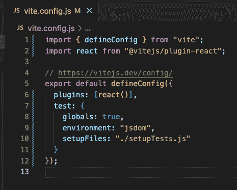

vite.config.js file configuration

## 如何创建用于测试的 UI

在编写测试之前，我们需要测试一些组件。

因此，让我们创建一个简单的注册页面，带有一些复选框、输入字段、下拉选择框和按钮，这样我们就可以为它编写测试用例。

我们将使用 [react-bootstrap](https://react-bootstrap.github.io/) 来创建 UI 元素，这样我们就不必从头开始编写所有的 CSS。

从终端执行以下命令，安装`bootstrap`和`react-bootstrap`:

```
yarn add bootstrap@5.2.3 react-bootstrap@2.6.0 react-select@5.6.1 
```

或使用 npm:

```
npm install bootstrap@5.2.3 react-bootstrap@2.6.0 react-select@5.6.1 
```

Bootstrap 提供了一个基本的 CSS，我们需要它来使 UI 看起来更好，所以我们也将 Bootstrap 和 react-bootstrap 一起安装。

安装完成后，打开`src/main.jsx`，在其他 CSS 文件之前添加一个引导 CSS 文件的导入，如下所示:

```
import "bootstrap/dist/css/bootstrap.min.css"; 
```

您的`src/main.jsx`文件现在看起来像这样:

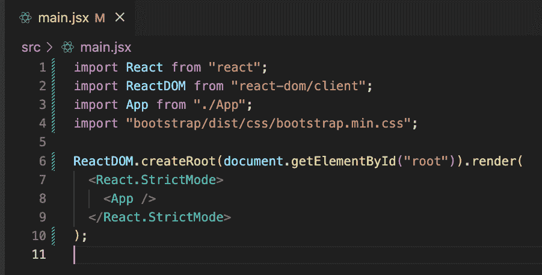

bootstrap css imported

我们不需要`index.css`和`App.css`文件，所以你可以删除它们。

现在，在`src`文件夹中创建一个`components`文件夹，在`components`文件夹中创建一个`register`文件夹。在`register`文件夹中，创建`Register.jsx`和`register.css`文件。

所以您的`Register.js`文件路径将是`src/components/register/Register.js`。

在`Register.jsx`文件中添加来自[本次回购](https://github.com/myogeshchavan97/testing-library-demo/blob/master/src/components/register/Register.jsx)的内容，在`register.css`文件中添加来自[本次回购](https://github.com/myogeshchavan97/testing-library-demo/blob/master/src/components/register/register.css)的内容。

现在，打开`App.jsx`文件，在其中添加以下内容:

```
import Register from "./components/Register";

function App() {
  return <Register />;
}

export default App; 
```

现在，如果您通过执行`yarn run dev`或`npm run dev`命令运行应用程序，您将看到以下屏幕:

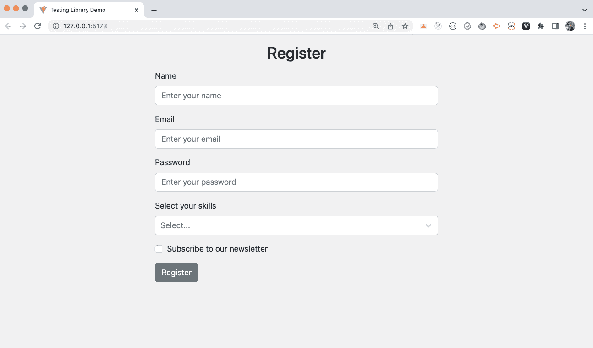

Registration page

本教程的重点是测试库，所以我不打算解释来自`Register.js`文件的代码，因为它是基本的 React 代码。但是如果你不熟悉 React 钩子，你可以看看这篇文章来更好地理解它。

此外，您可以使用非常流行的 [react-hook-form](https://react-hook-form.com/) 库，而不是自己管理状态和 onChange 处理程序。

它还允许您在不编写太多代码的情况下向代码中添加验证。如果你想更详细地了解它，请查看这篇文章。

现在，我们都准备好编写单元测试用例了，让我们开始吧。

## 如何编写单元测试用例

在编写测试用例之前，您应该了解可以用来访问页面元素的不同查询。

测试库提供了一组查询，您可以在下面的屏幕截图中看到:


Screenshot showing getBy, queryBy, findBy, getAllBy, queryAllBy, and findAllBy queries. ([Source](https://testing-library.com/docs/queries/about))

总结一下:

*   要选择单个 DOM 元素，可以使用`getBy`、`findBy`或`queryBy`查询
*   要选择多个 DOM 元素，可以使用`getAllBy`、`findAllBy`或`queryAllBy`查询
*   如果没有匹配或有多个匹配，则`getBy`和`findBy`返回错误
*   如果没有匹配项，则返回 null，如果有多个匹配项，则返回错误
*   `findBy`适用于异步代码，但不适用于`getBy`和`queryBy`
*   如果没有匹配，返回一个错误，并返回一个或多个匹配的数组
*   如果没有匹配，返回一个错误，并返回一个或多个匹配的数组
*   `queryAllBy`返回一个空数组表示没有匹配，返回一个或多个匹配的数组

因此，如果您不希望您的测试在元素没有显示在 UI 上时失败，那么总是使用`queryBy`或`queryAllBy`。

换句话说，只使用`queryBy`或`queryAllBy`查询来断言一个元素不能被找到或被隐藏。

现在您已经熟悉了查询方法，让我们开始为`Register`组件编写测试用例。

在`src/components/register`文件夹中新建一个`register.test.jsx`文件，内容如下:

```
import { render, screen } from "@testing-library/react";
import Register from "./Register";

describe("Register component", () => {
  it("should render Register component correctly", () => {
    render(<Register />);
    const element = screen.getByRole("heading");
    expect(element).toBeInTheDocument();
  });
}); 
```

注意，我们使用的是 Vite，所以文件名必须以扩展名`.jsx` 结尾，即使是测试文件也是如此。如果你没有使用 vite，那么你可以用扩展名`.js`来结束文件名。

现在，如果您执行`npm run test`或`yarn run test`命令，您将看到测试通过。

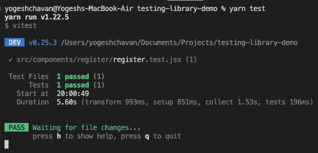

one test passed

在上面的代码中，我们首先使用测试库提供的`render`方法来呈现`Register`组件。

因为我们在`Register`组件中有一个带有`Register`文本的 h1 元素，所以我们使用`screen.getByRole`方法来获取角色`heading`的 DOM 元素。

如果您不知道在`getByRole`方法中使用什么角色，那么您可以使用某个随机名称，测试库将向您显示该组件的每个 dom 元素的所有可用角色，如下所示:

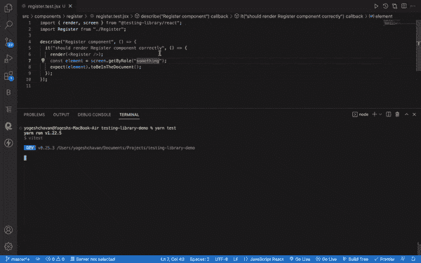

Seeing the DOM structure of UI elements

一旦我们使用`getByRole`方法获得了那个元素，那么我们就使用下面的方法断言检查这个元素是否存在于 DOM 中:

```
expect(element).toBeInTheDocument(); 
```

您可以通过在`screen`后添加一个点来查看所有可用的`getBy`、`findBy`或`queryBy`方法的列表，如下所示:

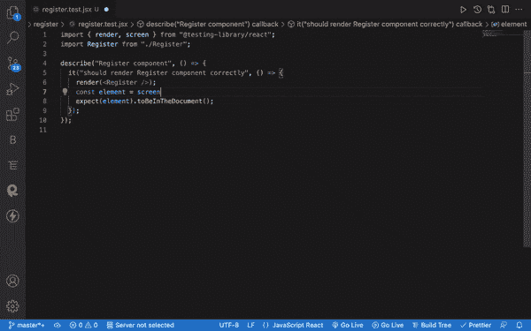

Methods provided by screen object

现在，我们添加了一个测试来检查`Register`组件是否被正确渲染。

让我们再写一些测试。

如果您通过运行`yarn dev`命令来运行应用程序，您将会看到，一旦您在没有填写所有细节的情况下单击`Register`按钮，您会得到如下所示的错误消息。

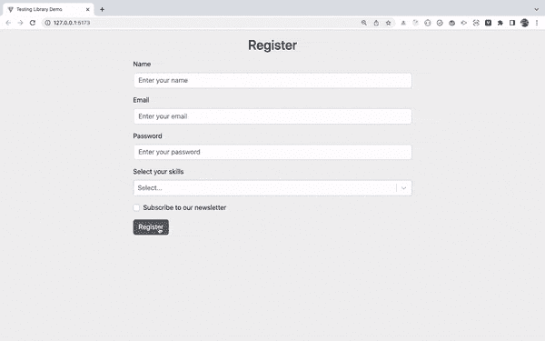

Error message display on submitting form without entering data

所以现在，我们需要通过编写测试用例来测试相同的内容。

为此，我们可以使用已经安装的`@testing-library/user-event`包中的`userEvent`。

现在，在您的`register.test.jsx`文件中添加一个新测试，如下所示:

```
it("should show error message when all the fields are not entered", () => {
    render(<Register />);
    const buttonElement = screen.getByRole("button");
    userEvent.click(buttonElement);
}); 
```

您的`register.test.jsx`文件将如下所示:

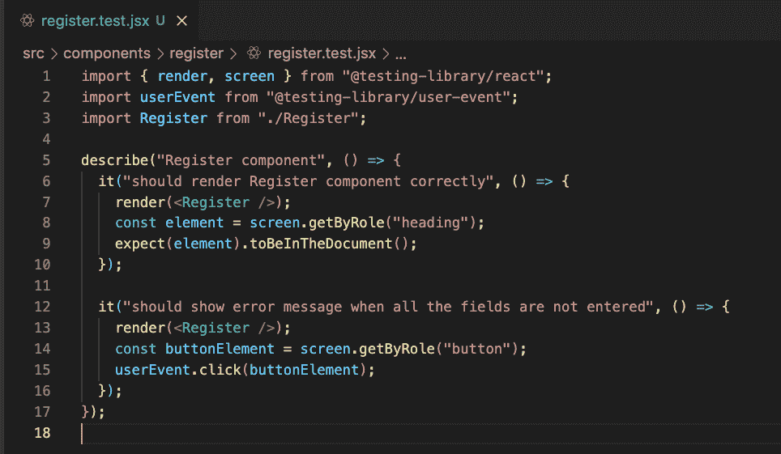

New test added for testing error message display

所以我们在上面的代码中触发了`Register`按钮的点击事件。

现在，我们需要找到带有错误消息的元素，这样我们就可以在测试中为它添加断言。

错误消息实际上是来自`react-bootstrap`的一个`Alert`组件，它最初是不可见的。只有当我们提交表单而没有填写所有数据时，它才会显示。

在这种情况下，我们可以调用`screen.debug`方法来查看触发 click 事件时 DOM 的结构。

因此，如下所示更改测试用例:

```
it("should show error message when all the fields are not entered", async () => {
    render(<Register />);
    const buttonElement = screen.getByRole("button");
    userEvent.click(buttonElement);
    screen.debug();
}); 
```

请注意，我们已经在测试的末尾添加了`screen.debug`。

现在，如果您运行`yarn run test`或`npm run test`，您将看到下面的 DOM 结构:

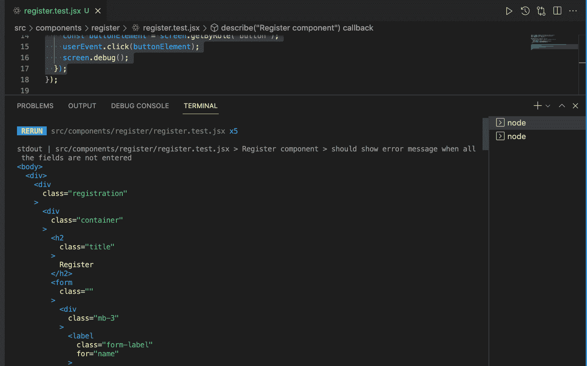

DOM structure when after submitting the Form

从截图中可以看到，在`Register`标题之后，直接看到了表单标签内部的姓名输入标签。

因此，即使我们触发了按钮的 click 事件，我们也看不到错误消息。

这是因为执行来自`handleFormSubmit`方法的验证代码需要一些时间。在此之前，我们只使用了`screen.debug`方法，所以我们看不到错误消息。

所以要解决这个问题，我们可以使用 async/await 等待。

因此将测试函数声明为`async`，并在`userEvent.click(buttonElement)`前添加一个`await`关键字，如下所示:

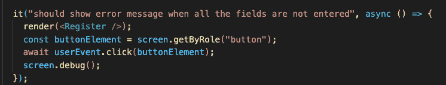

Added async/await

现在，如果您检查控制台，您将能够在角色为`alert`的 div 中看到文本`All the fields are required.`。

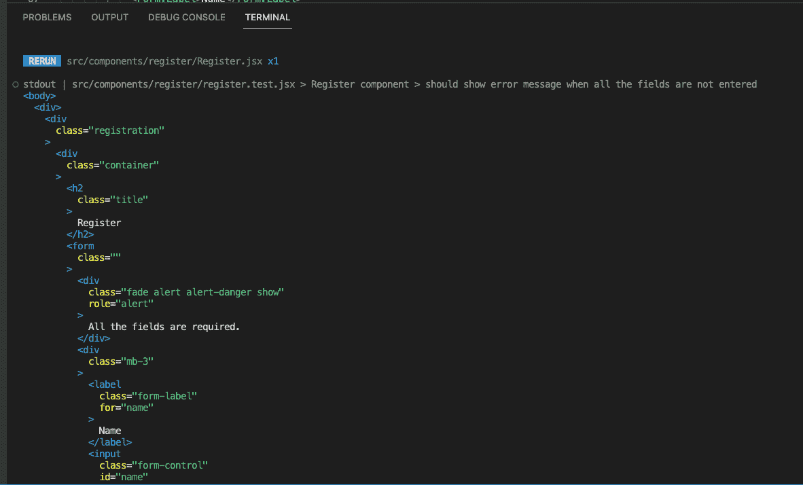

Error message getting displayed in DOM structure

所以我们可以在我们的断言中使用它，就像这样:

```
const alertElement = screen.getByRole("alert");
expect(alertElement).toBeInTheDocument(); 
```

现在，你可以看到第二次测试也成功了。

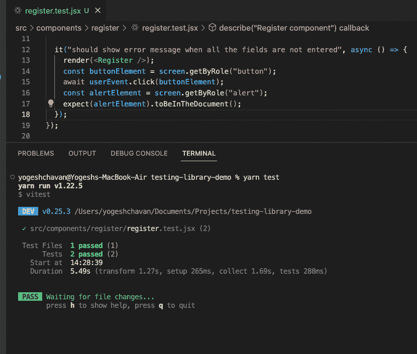

test passed

需要注意的几点:

*   永远记住，一旦完成断言，就要删除`screen.debug`语句，永远不要把它保留在代码中。
*   在使用`userEvent`触发任何事件之前，总是添加一个`await`关键字，因为您可能不知道动作何时会完成。

## 让我们再写一些测试

现在我们已经完成了这两个测试的添加，我们可以再添加一个测试来检查页面如下加载时是否没有错误:

```
it("should not show any error message when the component is loaded", () => {
    render(<Register />);
    const alertElement = screen.getByRole("alert");
    expect(alertElement).not.toBeInTheDocument();
}); 
```

这里，不使用这个:

```
expect(alertElement).toBeInTheDocument(); 
```

我们用这个:

```
expect(alertElement).not.toBeInTheDocument(); 
```

因为我们希望组件负载上的报警元素是**而不是**。

但是如果您检查控制台，您会看到测试失败。

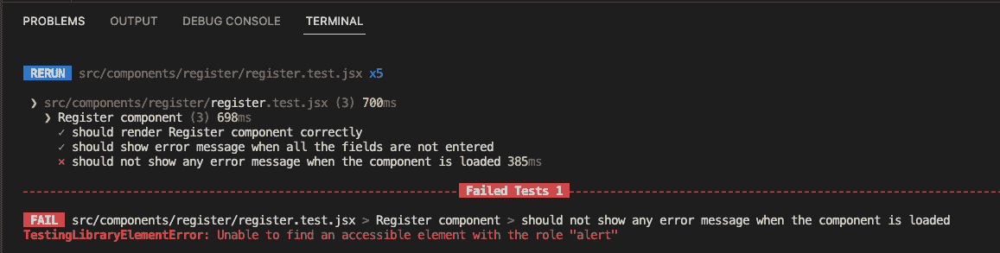

Failed test when using getByRole

所以，测试不会因为我们的断言而失败。相反，它失败是因为它在页面加载中找不到预期的角色为`alert`的元素，因为在页面加载中不会有任何错误。

但是我们怎样才能通过测试呢？

如果您还记得之前截图中的查询列表:

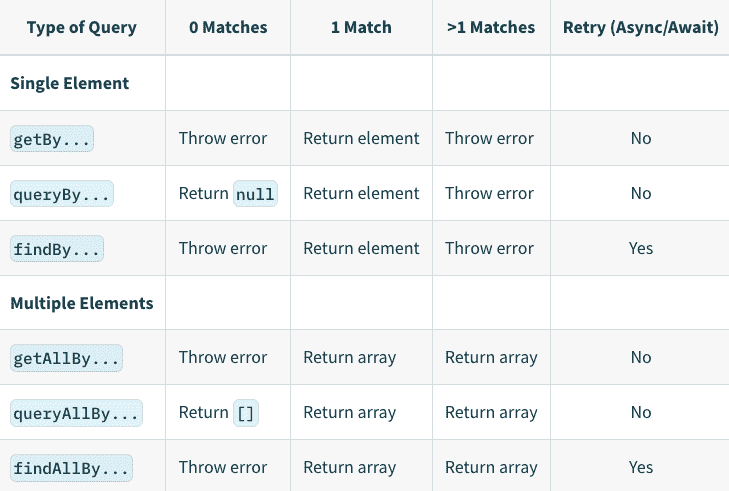

Screenshot showing getBy, queryBy, findBy, getAllBy, queryAllBy, and findAllBy queries.

如果没有找到匹配的元素，`getBy`方法会抛出一个错误。所以我们需要使用`queryBy`而不是`getBy`。它做同样的事情，但是当没有匹配的元素时，它不会抛出错误。

因此，让我们将测试用例修改为下面的代码:

```
it("should not show any error message when the component is loaded", async () => {
    render(<Register />);
    const alertElement = screen.queryByRole("alert");
    expect(alertElement).not.toBeInTheDocument();
}); 
```

现在，如果您检查控制台，您将看到测试成功通过。

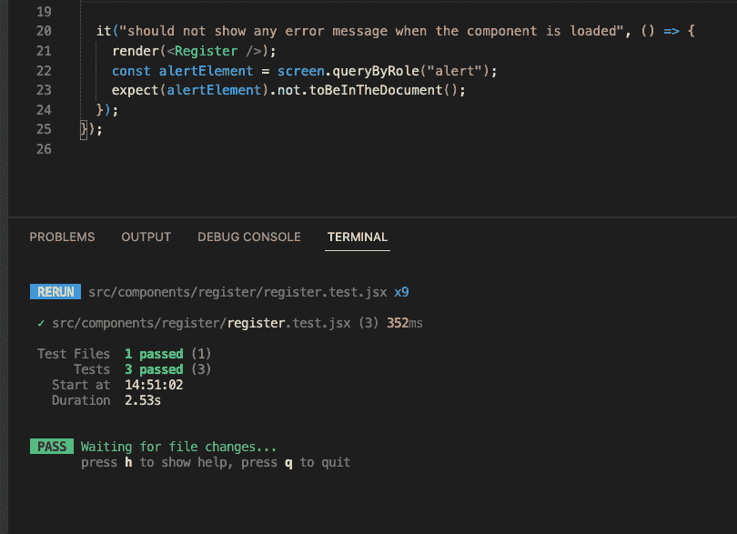

Passed test when using queryByRole

现在，让我们在填写所有必填字段后编写一个成功注册的测试。

```
it("should show success message when the registration is successful.", async () => {
    render(<Register />);
    const buttonElement = screen.getByRole("button");
    await userEvent.click(buttonElement);
    const alertElement = screen.getByRole("alert");
    expect(alertElement).toBeInTheDocument();
}); 
```

现在，如果您看到控制台，您将看到测试成功通过。

让我们给注册页面添加一个副标题，看看当我们再次运行测试时会发生什么。

在`Register.jsx`文件中的`Form`标签内添加以下标题:

```
<h6 className="subtitle">
   Please enter your details below to register yourself.
</h6> 
```

因此，您的代码现在将如下所示:

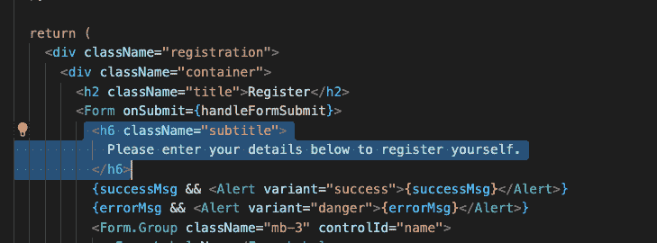

Added new subheading

现在，如果您再次运行测试，您将会看到一个测试失败了:

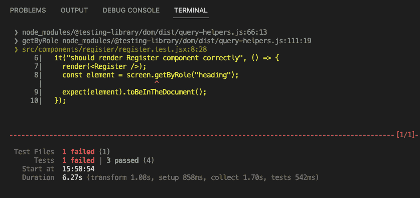

Failed test due to multiple headings on the page

测试失败是因为在第一次测试中，我们发现了如下所示的`Register`标题文本:

```
screen.getByRole("heading") 
```

如您所知，当您有多个匹配时，`getBy`会返回一个错误。

在这里，我们在`Register`组件上有两个标题，所以测试失败了。

那么如何才能修复呢？

为了解决这个问题，我们需要确定在编写测试时如何准确地选择元素。

我见过许多开发人员通过添加一些`testid`来改变 HTML 结构，这样他们就可以像这样通过测试:

```
it("should render Register component correctly", () => {
    render(<Register />);
    const element = screen.getByTestId("title");
    expect(element).toBeInTheDocument();
}); 
```

假设您向 JSX 添加了一个额外的`data-testid`属性，如下所示:

```
<h2 className="title" data-testid="title">
     Register
</h2> 
```

这会起作用，让你所有的测试通过。但这不是正确的方法。

仅仅为了让你的测试通过，**你不应该通过增加一些额外的`testid`或`class`来改变你的 JSX。**

相反，你应该**总是尝试使用`screen`** 提供的方法来准确选择 DOM 元素。

所以现在的问题是如何做出准确的选择。

`getByRole`方法接受可选选项，您可以这样使用:

```
const element = screen.getByRole("heading", { level: 2 }); 
```

由于我们的主`Register`航向是一个`h2`航向，我们特意说选择`level 2`航向。

现在，如果您更新第一个测试用例，您将会看到所有的测试都通过了。

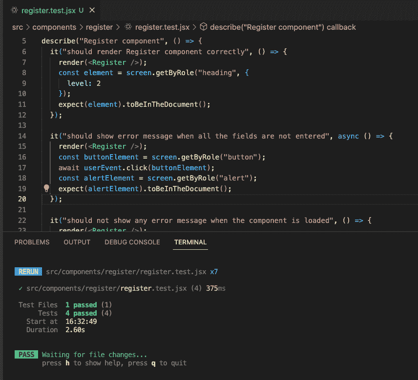

Test passed by adding more specific query for heading 

现在，让我们添加另一个测试来测试副标题。

由于副标题是第 6 级，您可以像这样查询它:

```
const element = screen.getByRole("heading", { level: 6 }); 
```

这是可行的，但是我们还有另外一种方法来瞄准这个元素。

为此，你可以安装[测试平台](https://chrome.google.com/webstore/detail/testing-playground/hejbmebodbijjdhflfknehhcgaklhano?hl=en) Chrome 浏览器扩展。

安装完成后，请遵循以下步骤:

*   使用 Ctrl + Alt + I 或 Cmd + Option + I 打开 Chrome 开发工具(Mac)
*   选择`Testing Playground`选项卡
*   点击光标并选择`Register`组件的副标题，如下图所示:

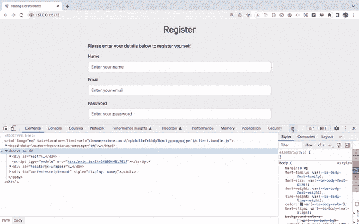

Testing Playground extension demo

如您所见，您将获得准确的 DOM 元素查询，可以在测试中使用，如下所示:

```
screen.getByRole('heading', {
  name: /please enter your details below to register yourself\./i
}) 
```

所以你可以这样写你的测试:

```
 it("should test for presence of subheading in the component", () => {
    render(<Register />);
    const element = screen.getByRole("heading", {
      name: /please enter your details below to register yourself\./i
    });
    expect(element).toBeInTheDocument();
 }); 
```

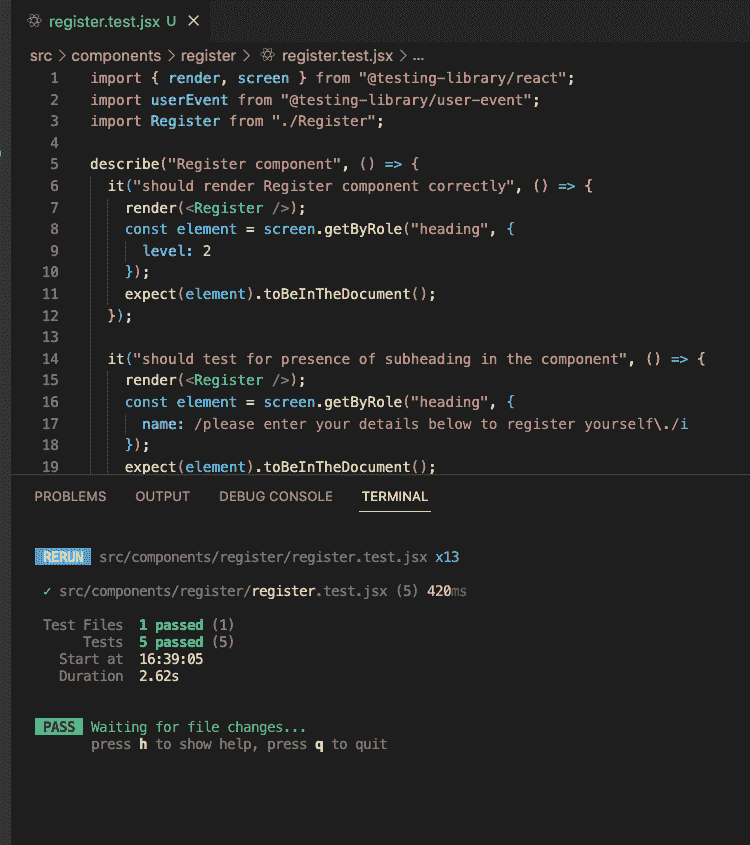

Test result

没有必要为副标题编写测试用例，因为即使不测试，它也不会影响组件的行为。但是，为了向您展示您的测试将如何针对多个元素中断，我已经在 UI 上添加了该元素及其测试用例。

Chrome 扩展对于查找任何 UI 元素的精确匹配查询非常有用。

因此，不用使用`screen.debug`方法来查看 DOM 结构，您可以使用这个 Chrome 扩展来找出所有显示元素的角色和其他信息，如下所示:

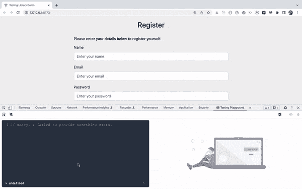

Finding out specific query using testing playground

如您所见，使用`screen`提供的方法，您可以通过角色、占位符文本或标签文本获得任何元素。

现在您已经知道了更具体的查询选择器，让我们更新其他测试用例来使用特定的选择器。

只要我们使用`screen.getByRole("button")`，就用下面的替换它:

```
screen.getByRole("button", {
  name: /register/i
}) 
```

所以现在，如果以后有人在同一个组件中添加另一个按钮，你的测试也不会失败。

您的最终`register.test.jsx`文件将如下所示:

```
import { render, screen } from "@testing-library/react";
import userEvent from "@testing-library/user-event";
import Register from "./Register";

describe("Register component", () => {
  it("should render Register component correctly", () => {
    render(<Register />);
    const element = screen.getByRole("heading", {
      level: 2
    });
    expect(element).toBeInTheDocument();
  });

  it("should test for presence of subheading in the component", () => {
    render(<Register />);
    const element = screen.getByRole("heading", {
      name: /please enter your details below to register yourself\./i
    });
    expect(element).toBeInTheDocument();
  });

  it("should show error message when all the fields are not entered", async () => {
    render(<Register />);
    const buttonElement = screen.getByRole("button", {
      name: /register/i
    });
    await userEvent.click(buttonElement);
    const alertElement = screen.getByRole("alert");
    expect(alertElement).toBeInTheDocument();
  });

  it("should not show any error message when the component is loaded", () => {
    render(<Register />);
    const alertElement = screen.queryByRole("alert");
    expect(alertElement).not.toBeInTheDocument();
  });

  it("should show success message when the registration is successful.", async () => {
    render(<Register />);
    const buttonElement = screen.getByRole("button", {
      name: /register/i
    });
    await userEvent.click(buttonElement);
    const alertElement = screen.getByRole("alert");
    expect(alertElement).toBeInTheDocument();
  });
}); 
```

## 结论

React 测试库非常棒，已经成为测试 React 应用程序的一个非常流行的工具。

请记住，与[酶测试库](https://enzymejs.github.io/enzyme/)不同，您不应该在使用 React 测试库时测试状态变化。

所以我们没有编写测试用例来检查用户在`name`、`email`或`password`字段中输入一些文本后，状态是否正确地改变。

在 React 测试库中，当用户点击一个按钮或者提交一个表单等等时，你检查 DOM 的行为，而不是测试组件的内部状态。

### 感谢阅读！

您可以在这个库中找到本教程的完整源代码。

如果你想成为最好的 MERN 栈开发者(全栈开发者)，那么就来看看[我的课程](https://online-elearning-platform.netlify.app/)。

*   这是一个预先录制的视频课程，将根据未来的变化不断更新。
*   在本课程中，您将学习如何从头开始创建 React 和 Node.js 应用程序，并构建一个令人惊叹的在线学习平台。
*   通过本课程的学习，您将能够自信轻松地构建任何 MERN 堆栈应用程序。
*   本课程中有一个单独的部分，您将学习如何使用 React 测试库和 jest 测试整个 React 应用程序。

所以一定要去看看这个神奇的课程。

想要了解关于 JavaScript、React、Node.js 的最新常规内容吗？[在领英上关注我](https://www.linkedin.com/in/yogesh-chavan97/)。