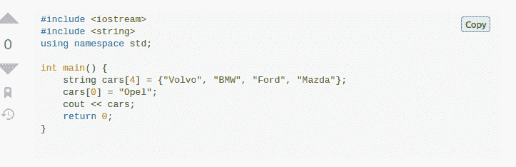

# 如何编写自己的浏览器扩展[包含示例项目]

> 原文：<https://www.freecodecamp.org/news/write-your-own-browser-extensions/>

在本文中，我们将讨论浏览器扩展——它们是什么，它们是如何工作的，以及如何构建自己的浏览器。

我们将通过实际编写我们自己的扩展来结束(超级有趣！)允许我们通过单击一个按钮将任何代码片段复制到剪贴板。

要继续这篇文章:

*   你需要对 JavaScript 有一个基本的了解。
*   你需要 Firefox 浏览器(或者其他浏览器也可以)

## 什么是浏览器扩展？

浏览器扩展是您添加到浏览器中的东西，它通过扩展浏览器的容量来增强您的浏览体验。

举个例子，想想你可能已经在你的设备上安装了一个广告拦截器。这可以在您上网时阻止广告，从而改善您的浏览体验。

## 如何编写自己的基本浏览器扩展

现在让我们从编写一个非常基本的扩展开始。

首先，我们将创建一个文件夹，在其中创建一个名为`manifest.json`的文件。

### 什么是清单文件？

清单文件是任何浏览器扩展中的必备文件。这个文件包含关于我们的扩展的基本数据，比如名称、版本等等。

现在在`manifest.json`文件中复制下面的代码片段:

```
{
  "manifest_version":2,
  "version":"1.0",
  "name":"Test",
} 
```

### 如何加载扩展文件

对于 Firefox 用户，请遵循以下步骤:

在地址栏中，搜索:

```
about:debugging#/runtime/this-firefox
```

你会看到一个选项*加载临时插件*。点击该选项并从目录中选择`manifest.json`文件。

对于 Chrome 用户:

在地址栏中搜索:

```
chrome://extensions.
```

*   启用开发人员模式并切换到该模式。
*   单击 Load unpacked 按钮并选择扩展目录。

万岁！您已经成功安装了扩展。但是该扩展目前不做任何事情。现在让我们给我们的扩展添加一些功能。为此，我们将像这样编辑我们的`manifest.json`文件:

```
{
  "manifest_version":2,
  "version":"1.0",
  "name":"Test",
  "content_scripts":[
    {
     "matches":["<all_urls>"],
     "js":["main.js"]
    }
  ]
}
```

在上面的代码中，我们给`manifest.json`添加了一个内容脚本。内容脚本可以操纵网页的文档对象模型。我们可以使用内容脚本将 JS(和 CSS)注入到网页中。

`"matches"`包含应该添加内容脚本的域和子域的列表，而`js`是要加载的 JS 文件的数组。

现在在同一个目录中创建一个`main.js`文件，并添加以下代码:

```
alert("The test extension is up and running")
```

现在重新加载扩展，当你访问任何`URLs`时，你会看到一个警告消息。

在编辑代码时，不要忘记重新加载扩展。

## 如何定制您的浏览器扩展

现在让我们在扩展中获得更多的乐趣。

我们现在要做的是创建一个 web 扩展，将我们访问的网页中的所有图像更改为我们选择的图像。

为此，只需将任何图像添加到当前目录，并将`main.js`文件更改为:

```
console.log("The extension is up and running");

var images = document.getElementsByTagName('img')

for (elt of images){
   elt.src = `${browser.runtime.getURL("pp.jpg")}`
   elt.alt = 'an alt text'
}
```

让我们看看这里发生了什么:

```
var images = document.getElementsByTagName('img')
```

这一行代码选择 web 页面中带有`img`标签的所有元素。

然后我们使用 for 循环遍历数组图像，在这里我们借助于`runtime.getURL`函数将所有`img`元素的`src`属性更改为一个 URL。

这里的`pp.jpg`是我的设备中当前目录下的图像文件的名称。

我们需要通过编辑`manifest.json`文件来通知我们的内容脚本关于`pp.jpg`文件的信息:

```
{
  "manifest_version":2,
  "version":"1.0",
  "name":"Test",
  "content_scripts":[
   {
    "matches":["<all_urls>"],
    "js":["main.js"]
   }
  ],
  "web_accessible_resources": [
        "pp.jpg"
  ]
} 
```

然后只需重新加载扩展，并访问任何你喜欢的网址。现在，您应该看到所有的图像都被更改为当前工作目录中的图像。

### 如何给你的扩展添加图标

在`manifest.json`文件中添加以下代码:

```
"icons": {
  "48": "icon-48.png",
  "96": "icon-96.png"
} 
```

### 如何在扩展中添加工具栏按钮

现在，我们将在浏览器的工具栏中添加一个按钮。用户可以使用此按钮与扩展进行交互。

要添加工具栏按钮，将以下几行添加到`manifest.json`文件中:

```
"browser_action":{
   "default_icon":{
     "19":"icon-19.png",
     "38":"icon-38.png"
   }
  }
```

所有的图像文件都应该存在于您的当前目录中。

现在，如果我们重新加载扩展，我们应该在浏览器的工具栏中看到一个扩展图标。

### 如何为工具栏按钮添加监听事件

也许我们想在用户点击按钮时做些什么——假设我们想在每次点击按钮时打开一个新标签页。

为此，我们将再次向`manifest.json`文件添加以下内容:

```
"background":{
        "scripts":["background.js"]
  },
  "permissions":[
      "tabs"
  ] 
```

然后，我们将在当前工作目录中创建一个名为`background.js`的新文件，并在文件中添加以下几行:

```
function openTab(){

    var newTab = browser.tabs.create({
        url:'https://twitter.com/abhilekh_gautam',
        active:true
    })
}

browser.browserAction.onClicked.addListener(openTab) 
```

现在重新加载扩展！

每当有人点击这个按钮，它就会调用`openTab`函数，打开一个新的标签，上面有链接到我的 twitter 个人资料的 URL。此外，当设置为 true 时，活动键会使新创建的选项卡成为当前选项卡。

请注意，您可以在后台脚本中使用浏览器提供的 API。有关 API 的更多信息，请参考以下文章:[Javacript API](https://developer.mozilla.org/en-US/docs/Mozilla/Add-ons/WebExtensions/API)。

既然我们已经学习了浏览器扩展的一些基础知识，让我们创建一个我们作为开发人员可以在日常生活中使用的扩展。

## 最终方案

好了，现在我们要写一些在日常生活中对我们有用的东西。我们将创建一个扩展，允许您通过单击从 StackOverflow 复制代码片段。所以我们的扩展将在网页上添加一个`Copy`按钮，将代码复制到我们的剪贴板上。

### 演示



首先，我们将创建一个新的文件夹/目录，在其中添加一个`manifest.json`文件。

将以下代码添加到文件中:

```
{
  "manifest_version":2,
  "version":"1.0",
  "name":"copy code",
  "content_scripts":[
    {
     "matches":["*://*.stackoverflow.com/*"],
     "js":["main.js"]
    }
  ]
}
```

看看`content script`里面的`matches`——这个扩展只对 StackOverflow 的域和子域有效。

现在，在同一目录中创建另一个名为`main.js`的 JavaScript 文件，并添加以下代码行:

```
var arr =document.getElementsByClassName("s-code-block")

for(let i = 0 ; i < arr.length ; i++){
 var btn = document.createElement("button")
 btn.classList.add("copy_code_button")
 btn.appendChild(document.createTextNode("Copy"))
 arr[i].appendChild(btn)
 //styling the button
 btn.style.position = "relative"

 if(arr[i].scrollWidth === arr[i].offsetWidth && arr[i].scrollHeight === arr[i].offsetHeight)
  btn.style.left = `${arr[i].offsetWidth - 70}px`

  else if(arr[i].scrollWidth != arr[i].offsetWidth && arr[i].scrollHeight === arr[i].offsetWidth)
   btn.style.left = `${arr[i].offsetWidth - 200}px`
 else 
   btn.style.left = `${arr[i].offsetWidth - 150}px`

 if(arr[i].scrollHeight === arr[i].offsetHeight)
   btn.style.bottom = `${arr[i].offsetHeight - 50}px`

 else
   btn.style.bottom = `${arr[i].scrollHeight - 50}px`
 //end of styling the button

   console.log("Appended")
}
```

首先，我选择了类名为`s-code-block`的所有元素——但是为什么呢？这是因为当我查看 StackOverflow 的网站时，我发现所有的代码片段都保存在一个同名的类中。

然后我们遍历所有这些元素，并在这些元素中添加一个按钮。最后，我们只需要正确地放置和设计按钮(设计还不完美——这只是一个开始)。

当我们使用上面的过程加载扩展并访问 StackOverflow 时，我们应该会看到一个复制按钮。

### 如何向按钮添加功能

现在，当点击按钮时，我们希望将整个代码片段复制到我们的剪贴板。为此，将以下代码行添加到`main.js`文件中:

```
var button = document.querySelectorAll(".copy_code_button")
 button.forEach((elm)=>{
  elm.addEventListener('click',(e)=>{
    navigator.clipboard.writeText(elm.parentNode.childNodes[0].innerText)
    alert("Copied to Clipboard")
  })
 })
```

首先，我们使用`querySelectorAll`选择所有已经添加到站点的按钮。然后，每当按钮被单击时，我们就监听 click 事件。

```
navigator.clipboard.writeText(elm.parentNode.childNodes[0].innerText) 
```

上面的代码行将代码复制到我们的剪贴板。每当一个片段被复制时，我们用消息`Copied to clipboard`提醒用户，我们就完成了。

## 最后的话

Web 扩展在很多方面都很有用，我希望在这篇文章的帮助下，你能够编写自己的扩展。

所有的代码都可以在[这个 GitHub](https://github.com/Abhilekhgautam/Copy-Code) 资源库中找到。不要忘记，每当你想出一些好的样式或新的功能，如剪贴板历史等，都要给出一个拉请求。

**编码快乐！**