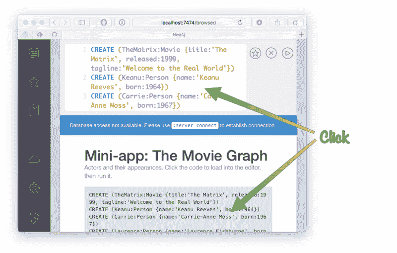
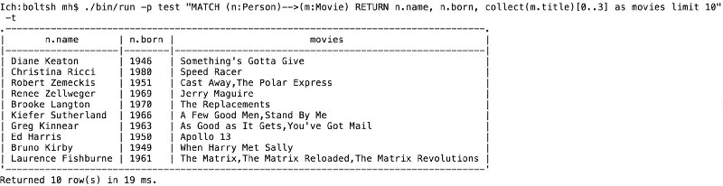
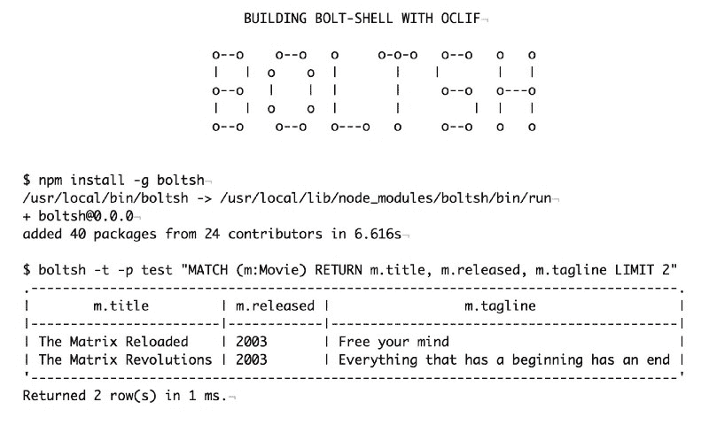

# 如何使用 OCLIF 和 TypeScript 在 10 分钟内编写一个命令行数据库客户机

> 原文：<https://www.freecodecamp.org/news/writing-a-command-line-database-client-in-10-minutes-aa608536ae4b/>

迈克尔·亨格

# 如何使用 OCLIF 和 TypeScript 在 10 分钟内编写一个命令行数据库客户机


本周我在[杰夫·迪基](https://www.freecodecamp.org/news/writing-a-command-line-database-client-in-10-minutes-aa608536ae4b/undefined)的一篇博文中偶然发现了 SalesForce/Heroku 的[“OCLIF，开源命令行框架](https://engineering.salesforce.com/open-sourcing-oclif-the-cli-framework-that-powers-our-clis-21fbda99d33a)”。

我很感兴趣，它看起来真的很容易和干净(感谢 TypeScript)，我从过去的经验中知道，在 CLI 中有很多杂务和样板文件。文档和例子看起来也很不错。

我在 neo4j-shell 和 [cypher-shell](http://github.com/neo4j/cypher-shell) 上花了很多时间，都是用 Java 编写的，所以我想尝试一下 JavaScript (JS)。

我以前使用过 [neo4j-javascript-driver](https://github.com/neo4j/neo4j-javscript-driver) 进行图形可视化，我知道它非常简单快速。

驱动程序通过二进制 Bolt 协议向数据库发送密码查询，并处理智能路由、事务和重试。

为了获得漂亮的输出，我选择了`ascii-table`，这是一个整洁的 JS 库，可以为终端生成漂亮的表格。

基本上，你必须提供一个 **bolt-url** 、**用户名、**和**密码**以及一个**查询**来运行，所以我想象我们的客户端是这样的。

```
boltsh -a bolt://host:port -u neo4j -p pa55w0rd \  "MATCH (n:Person) RETURN n.name, n.age LIMIT 10"
```

### 录像

我录了一段做这个编码的过程。它归结为 15 分钟的运行时间，主要是由于打字。放心 2x 看:)

### 运行 Neo4j 实例

要让 Neo4j 运行一些数据，有两种选择。可以安装 [Neo4j 桌面](https://neo4j.com/download)，这是一个管理数据库的电子 app，用本地的空数据库创建一个项目。或者你可以启动一个 [Neo4j 沙盒](https://neo4j.com/sandbox)，并选择一个“空白沙盒”

请注意“详细信息”选项卡中的服务器 IP 地址和**螺栓**端口以及**用户名**和**密码**。

在这两种情况下，在启动“Neo4j 浏览器”之后，这只是一个很好的基于 React 的前端(也使用 neo4j-javascript-driver)，请在顶部命令行中输入并运行。

```
:play movie graph
```

这为您提供了一个幻灯片，在第二页上您可以看到一个巨大的语句来创建样本数据。点击并运行它，你会看到汤姆·汉克斯和他的一系列电影以及一些导演在一起。



### OCLIF 入门

这非常简单——只需决定您想要多命令还是单命令客户端，然后运行适当的`npx` (npm package runner)命令。

```
npx oclif single boltsh
```

这将询问您一些关于名称、许可证和 github-repo 的问题，并生成一个框架，在我们的例子中是一个单命令 CLI。

要查看是否一切正常，您可以运行`./bin/run`命令，应该会看到如下输出:

```
./bin/run
```

```
hello world from /Users/mh/d/js/boltsh/src/index.ts!
```

好了，我们可以在这个文件中找到要编辑的代码，它是一个[命令](https://oclif.io/docs/commands.html)类。在编辑器中打开它，我们可以看到添加描述、使用示例和上面提到的[标志](https://oclif.io/docs/flags.html)的地方。

我们将所有标志设置为 required，并为`address`和`user`提供默认值。然后我们还要加上`query` [论据](https://oclif.io/docs/flags.html)，这也是必须的。

```
import { Command, flags } from '@oclif/command'
```

```
class Boltsh extends Command {  static description = 'Execute Cypher Queries via Bolt'
```

```
 static examples = [    `$ boltsh -a bolt://localhost -u neo4j -p test \                 "MATCH (n:Person) return n.name"n.nameKeanu ReevesTom Hanks...`,  ]
```

```
 static flags = {    version: flags.version({ char: 'v' }),    help: flags.help({ char: 'h' }),
```

```
 address: flags.string({ char: 'a', description: 'bolt address',                       required: true, default: 'bolt://localhost' }),    user: flags.string({ char: 'u', description: 'neo4j user',                      required: true, default: 'neo4j' }),    password: flags.string({ char: 'p', required: true,                      description: 'user password' }),  }
```

```
 static args = [{ name: 'query', required: true,                    description: 'Cypher Query to Run' }]
```

```
 async run() {    const { args, flags } = this.parse(Boltsh)
```

```
 this.log(`boltsh: ${flags.address} ${flags.user}               ${args.query} from ${__filename}!`)  }}
```

```
export = Boltsh
```

因此，我们输出我们的命令行输入，并尝试一下。作为一个好的副作用，`run`命令还运行 TypeScript 编译器，所以我们不必手动这么做。

```
./bin/run -p test "MATCH (n:Person) RETURN n.name"
```

```
boltsh: bolt://localhost neo4j MATCH (n:Person) RETURN n.name from /Users/mh/d/js/boltsh/src/index.ts!
```

很好，现在我们可以添加 neo4j 驱动程序，并将我们的查询发送到服务器:

```
yarn add neo4j-driver
```

在顶部添加导入:

```
import * as neo4j from 'neo4j-driver'
```

你可以在这里找到 Neo4j 驱动 API 的细节。

1.  我们将用我们的地址、用户和密码创建一个驱动程序，并获取一个会话，我们用它来运行查询。
2.  获取结果，并将第一行的记录键作为标题输出，将所有记录的值作为行输出，所有行都用制表符分隔。
3.  在底部，我们还输出了总行数和从结果摘要中花费的时间。

(注意，Neo4j 驱动程序使用自己的数字类型，因为 Javascript 不能表达 64 位数字。)

```
async run() {  const { args, flags } = this.parse(Boltsh)
```

```
 const driver = neo4j.v1.driver(flags.address,                    neo4j.v1.auth.basic(flags.user, flags.password))  const session = driver.session()  const result = await session.run(args.query)  session.close()  driver.close()  const records = result.records;  if (records.length > 0) {    // header    this.log(records[0].keys.join("\t"))    // rows    records.forEach(r => this.log(                    r.keys.map(k => r.get(k)).join("\t")))
```

```
 this.log(`Returned ${records.length} row(s) in              ${result.summary.resultAvailableAfter.toNumber() +                result.summary.resultConsumedAfter.toNumber()} ms.`)  } else {    this.log('No Results.')  }}
```

如果我们再次运行我们的测试，它“只是工作。”酷！

```
./bin/run -p test "MATCH (n:Person) RETURN n.name limit 2"
```

```
n.nameKeanu ReevesCarrie-Anne MossReturned 2 row(s) in 3 ms.
```

现在我们可以用`[ascii-table](https://github.com/sorensen/ascii-table)`来美化它

```
yarn add ascii-table
```

由于 ASCII-table 没有 TypeScript 定义，编译器会出错——这就是为什么我们必须在单独的文件“src/ambient.d.ts”中声明该模块:

```
declare module 'ascii-table';
```

再次添加导入。这一次，我们添加了一个非必需的标志`-t`,用于打开表格模式。

```
import * as AsciiTable from 'ascii-table'
```

然后我们构造并输出`AsciiTable`实例，而不是设置标志时的纯文本。

```
static flags = {  // ...  table: flags.boolean({ char: 't', description: 'Table Format' })}
```

```
async run() {  const { args, flags } = this.parse(Boltsh)
```

```
 const driver = neo4j.v1.driver(flags.address,                   neo4j.v1.auth.basic(flags.user, flags.password))  const session = driver.session()  const result = await session.run(args.query)  session.close()  driver.close()  const records = result.records;
```

```
 if (records.length > 0) {    // extract data to be rendered    const data = { heading: records[0].keys,           rows: records.map(r => r.keys.map(k => r.get(k))) }
```

```
 if (flags.table) {      const table = AsciiTable.factory(data)      this.log(table.toString())    } else {      this.log(data.heading.join("\t"))      data.rows.forEach(r => this.log(r.join("\t")))    }
```

```
 this.log(`Returned ${records.length} row(s) in              ${result.summary.resultAvailableAfter.toNumber() +                  result.summary.resultConsumedAfter.toNumber()} ms.`)  } else {    this.log('No Results.')  }}
```

让我们试一试，看看我们的桌子是什么样的:

```
./bin/run -p test -t "MATCH (n:Person) RETURN n.name limit 10"
```

```
.--------------------.|       n.name       ||--------------------|| Keanu Reeves       || Carrie-Anne Moss   || Laurence Fishburne || Hugo Weaving       || Lilly Wachowski    || Lana Wachowski     || Joel Silver        || Emil Eifrem        || Charlize Theron    || Al Pacino          |'--------------------'Returned 10 row(s) in 25 ms.
```

还有，更复杂的查询看起来也不错(除了，对 Medium 来说太宽了，所以截图)。这将呈现人们的姓名、出生年份以及与他们相关的三部电影。



OCLIF 的好处在于它自带电池。例如，我们可以运行`boltsh --help`来获得正确的帮助页面:

```
./bin/run --helpExecute Cypher Queries via Bolt
```

```
USAGE  $ boltsh QUERY
```

```
ARGUMENTS  QUERY  Cypher Query to Run
```

```
OPTIONS  -a, --address=address    (required) [default: bolt://localhost] bolt address  -h, --help               show CLI help  -p, --password=password  (required) user password  -u, --user=user          (required) [default: neo4j] neo4j user  -v, --version            show CLI version
```

```
EXAMPLE  $ boltsh -a bolt://localhost -u neo4j -p test \           "MATCH (n:Person) return n.name"  n.name  Keanu Reeves  Tom Hanks  ...
```

在本文开头提到的文章中，Jeff 展示了如何构建多命令 CLI。代码与我们的基本相同，唯一的区别是您有多个命令。

查看 OCLIF [文档](https://oclif.io/docs)和[示例](https://github.com/oclif?utf8=%E2%9C%93&q=example&type=&language=)。

框架有插件基础设施，已经有[几个插件](https://github.com/oclif?utf8=%E2%9C%93&q=plugin&type=&language=)，像自我更新。我希望我们能看到更多。

我认为 OCLIF 在 Heroku 做得非常好，这要感谢杰夫·迪基。

酷，任务完成，现在剩下的就是推送 [GitHub](https://github.com/jexp/boltsh) 和[发布到 npm](https://www.npmjs.com/package/boltsh) 。



那么，为什么不试一试，构建一个自己的 CLI 呢？

黑客快乐！