# 如何写一份杀手级软件工程简历

> 原文：<https://www.freecodecamp.org/news/writing-a-killer-software-engineering-resume-b11c91ef699d/>

#### 对简历的深入分析让我在谷歌、脸书、亚马逊、微软、苹果等公司获得面试机会。

这份简历让我获得了谷歌、脸书、亚马逊、微软和苹果的面试机会。

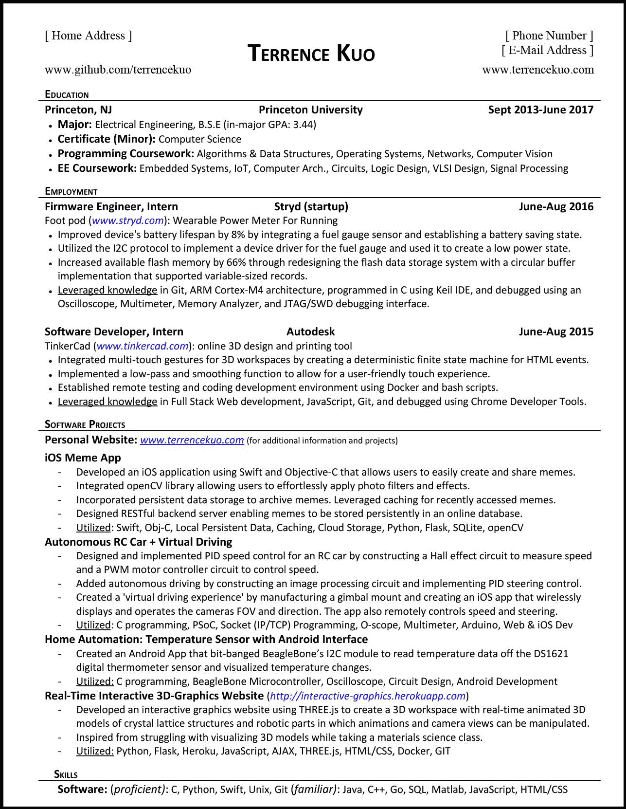

2017 Senior Year Résumé

我通过向简历黑洞发送简历获得了这些面试机会，也就是所谓的在线申请。

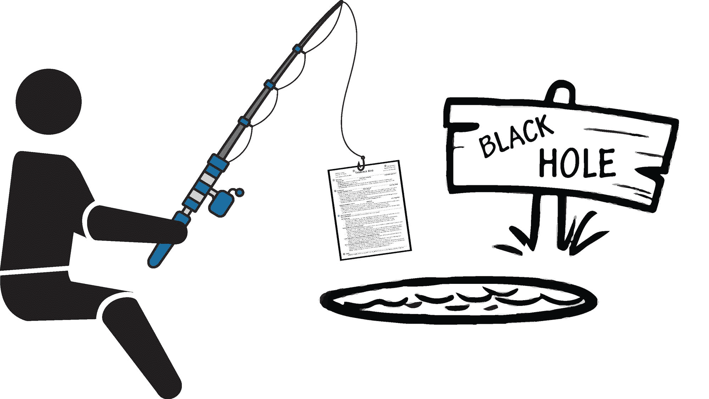

网上申请是人们申请工作最常见的方式，因此，由于竞争激烈，这也是获得面试机会最低效的方式。然而，这正是我如何获得我所有的采访。

我是怎么做到的？

在本文中，我将对我的简历进行逐行分析，目的如下:

*   解释我在制作简历时所做的选择
*   为什么我认为这份简历有助于我获得面试机会，以及
*   如何创造一份更好的简历！

我决定写这篇文章，因为当我刚开始找工作的时候，我在面试中挣扎了很久。如果能有一份真实的简历，对我来说会非常有帮助。

本文分为以下几个部分:

1.  **再熟悉不过的得不到面试机会的方式——我刚开始求职时遭遇挫折的一个小故事**
2.  **[**评估选项:前进**](https://medium.com/p/b11c91ef699d#d859)**——对提高面试成功几率的不同策略的思考****
3.  ****[**通过例子学习如何写一份黑仔简历**](https://medium.com/p/b11c91ef699d#0512)——我的简历的逐步分析，以下每一部分都与我的简历相对应:****

*   ****一瞥中的精华****
*   ****你是谁****
*   ****联系信息****
*   ****教育****
*   ****雇用****
*   ****个人项目****
*   ****技能****

### ****错过面试的常见方式****

#### ****在线申请****

****你可能知道每个公司为在线申请提供的链接。这是一个经典的职业网站，它会向你展示一堆你认为自己完全胜任的职位，直到你打开职位描述并阅读最低要求。****

****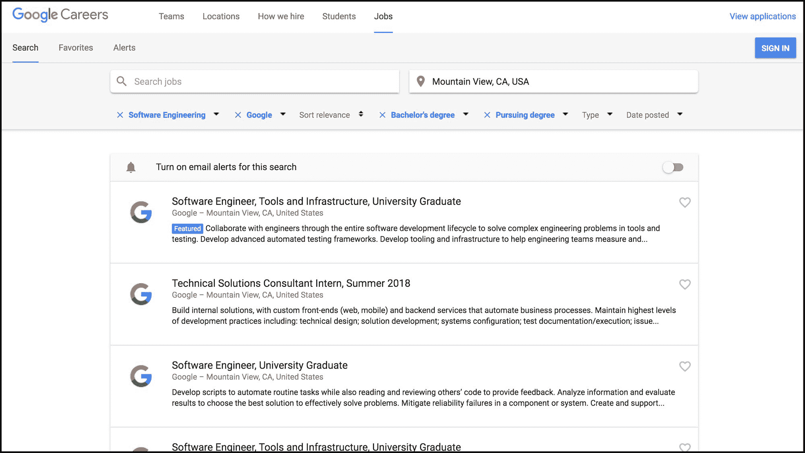

Google Career Page**** 

****一份工作描述，里面有一堆你从未听说过、可能听说过或者希望你听说过的词。并且它有一个看起来很无辜的**应用**按钮**。******

****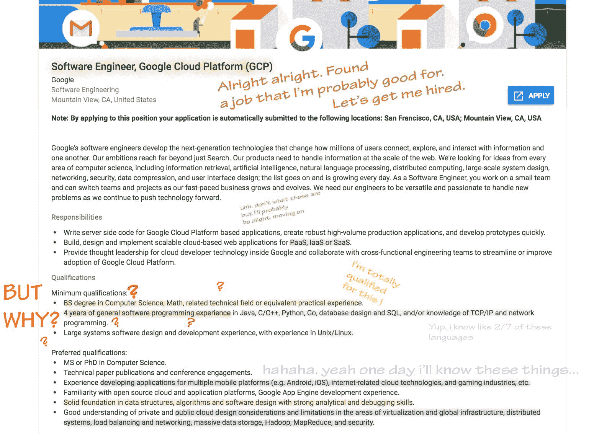

Google Job Description**** ********

****尽管你可能对自己的资格感到不确定，但你还是申请了，因为你想要一份工作。****

****所以你填好申请表，点击提交——然后等待一个肯定的答复。****

****您的结果会有所不同:****

1.  ****电话面试？(耶，就业机会！！！)****
2.  ****立即拒绝？(织补，回到绘图板)****
3.  ****没有回复？(呃，至少给我一些结束的礼貌)****

#### ****重复直到成功…对吗？****

****可悲的是，这是许多人在找工作/实习时经历的典型过程。****

****申请几家公司。得到一些拒绝或者没有回复。多申请几家公司。得到更多的拒绝或者没有回复。一遍又一遍又一遍。****

****为什么我们要这样对待自己？我们花了这么多时间做同样的重复性工作，却得到同样令人失望的结果。****

****因为这是每个人获得面试机会的手段，对吗？因为至少我们在朝着正确的方向努力，还有一线希望，对吗？你还能怎么得到面试机会？****

### ****评估备选方案:向前迈进****

> ****"沮丧和失败是走向成功的两块最可靠的垫脚石."
> 
> ——戴尔·卡耐基(《如何赢得朋友和影响人》的作者)****

****我们可以考虑用两种方法来解决得不到面试机会的问题:****

1.  ****把你的申请/简历放在显微镜下观察****
2.  ****质疑你获得面试的过程****

****本文主要讨论前者，因为不管你最终通过什么途径获得面试机会，基本上每个公司都会利用你的简历作为评估的基础。因此，我们将在显微镜下审视我的简历，并专注于学习如何写一份出色的简历。****

****通过在线申请获得面试机会极具挑战性，因为你的简历在到达招聘经理手中之前必须经过许多阶段。****

****它必须绕过网上的关键词过滤器，在审查了大约 6 秒钟的招聘人员面前脱颖而出，并满足决定你是否值得面试的招聘经理的期望。****

****然而，尽管有这些障碍，我还是通过网上申请获得了所有的面试机会。**如何？** *试错*。从大学二年级开始，我已经申请了数百个不同的软件工程职位。****

****当我第一次开始申请的时候，我面临着数量惊人的拒绝，但是随着时间的推移，我学会了如何适应。到我大四的时候，我非常成功地获得了几乎所有我申请的公司的面试机会。****

****给我带来这些面试的简历正是本文中的那份。****

****我花了**四年**的迭代和真实测试才达到这一步。从这次经历中，我列出了一系列**简历撰写原则**，来帮助你撰写一份更好的软件简历。这些原则帮助我找到了理想的工作，也可以帮助你找到你的工作。****

****虽然我花了四年的大学时间才弄明白这一切，但你不必经历所有的飞跃，因为你可以在此时此地学到所有的东西。****

****我的目标是成为你关于如何获得软件工程面试的所有问题的一站式中心。这样，你就不必浪费无数时间交叉参考谷歌搜索结果来寻找如何写一份获得面试的软件工程简历的最佳答案。****

****你的宝贵时间可以更好地用来写你的杀手简历。****

****所以现在就从这篇文章开始吧。从我过去的经历中获益，让我们开始一步一步地浏览我的简历吧！****

### ****学习如何写黑仔简历——举例说明****

> ****“方法可能有一百万甚至更多，但原则很少。掌握原则的人能够成功地选择自己的方法。尝试方法的人，忽视原则，肯定会有麻烦。”****

> ****-拉尔夫·瓦尔多·爱默生****

****让我们再来看看这份简历:****

****

Résumé: Essential Sections Highlighted**** 

#### ****一瞥中的精华****

#### ****一页纸的简历****

****招聘人员没有一整天的时间来阅读你的简历。平均来说，他们观看的时间不到 6 秒。保持**简短**和**简洁**。****

#### ****部分(标题、教育、就业、软件项目、技能)****

****从上到下按照**的重要性顺序**放置各部分。“[个人项目](https://medium.com/p/b11c91ef699d#ed02)”部分是一个独特的，对于寻找软件工程职位的人来说必不可少的。****

#### ****每个部分的一致布局+字体****

****确保每个部分都有统一的外观。一致的风格很重要，因为它增强了可读性。**可读性**至关重要。****

****那么，这份简历为什么有用呢？让我们来探索编号的要点。****

#### ****你是谁(1)****

****目标受众:任何写简历的人****

****

Résumé: Name Section**** 

****开始很容易。你的名字。将你的名字放在简历的顶部，字体要大且清晰。****

****没有必要用夸张的颜色或花哨的字体来装饰它。简单明了就行了。你希望招聘人员在一英里外就能很容易地看到这一点，因为你希望他们知道你是谁。一个必须做最少工作的招聘人员是一个快乐的招聘人员。一个快乐的招聘人员更有可能给你面试机会。****

****概述:让招聘人员非常容易地阅读和找到你的名字。****

#### ****联系信息(2)****

*****目标受众:任何写简历的人*****

****

Résumé: Contact Section**** 

****你的联系信息应该像识别你的名字一样简单。这很重要。在世界上所有的事情中，**请不要把这件事情搞砸了**,否则招聘人员还会怎么联系你呢？****

******重述:**输入正确的联系信息，否则永远不会有人联系你。****

#### ****教育(3)****

*****目标受众:任何有学位的简历撰写者*****

****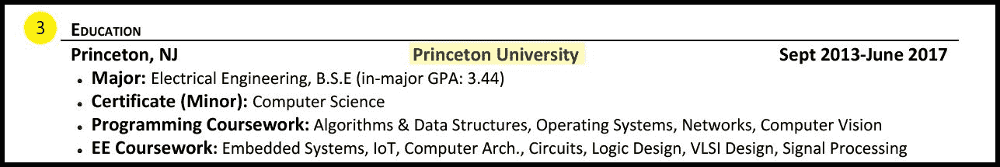

Résumé: Education Section: Header Subsection**** 

****如果你正在或曾经上过大学，这应该是你简历的第一部分，因为上大学是一项巨大的成就。根据美国劳工统计局的数据，只有“66.7%的 2017 年 16 至 24 岁的高中毕业生进入学院或大学”。所以要引以为豪，把它包含进去！****

****马上，这告诉招聘人员你在教育和学习上投资，这是至关重要的，因为技术是不断变化的。此外，这些信息是你成功的标志，所以一定要记下来。****

****回顾:写下你在哪里接受的教育。****

****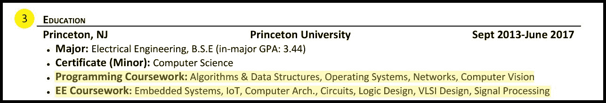

Résumé: Education Section: Coursework Subsection**** 

****确保包括与你申请的职位相对应的**相关的**课程。虽然一门关于意大利美食历史的课程听起来格外诱人，但它在试图让你在计算机科学领域找到工作的简历中并没有一席之地。****

****这将极大地提高招聘人员和招聘经理查看你简历的能力，以决定你是否适合这个职位。如前所述，一个快乐的招聘人员更有可能给你面试机会。****

******概述:**仅包括相关课程。****

****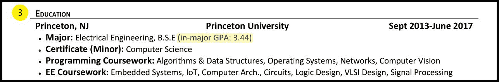

Résumé: Education Section: GPA Subsection**** 

****好吧。GPA。在我们谈论这个之前，让我们提醒自己简历的主要目的。****

****简历的主要目的是简洁地突出你的知识、技能和成就。你想在简历中加入你引以为豪的东西，但也要有能给人留下深刻印象的东西。你想尽可能地描绘出一幅自己的美好形象，这样招聘人员和招聘经理才会想采访你。****

****现在回到你的平均成绩。你的平均绩点是否令人印象深刻应该是相当明显的。如果你的平均绩点低于 3.0，就不要放在简历上。如果把你的平均绩点从简历中去掉只会损害你的机会，这没有什么错。****

****如果你的平均绩点在 3.0-3.2 之间，这是一个判断电话。从个人经验来看，我曾与一些要求最低 GPA 为 3.2 的公司交谈过，但这些公司主要是金融或量化公司。大多数软件公司都不重视你的平均绩点。如果你有 3.2 分以上的成绩，我会把它放在你的简历里。****

****如果你的 GPA 很低，不要害怕，因为这给了你发挥创造力的机会！我的总平均成绩是 3.2，因为我的大一工程预备课程和人文课程成绩很差。但一旦我完成并开始学习我专业范围内的课程，我的专业内 GPA(根据我专业内的课程计算的 GPA)是 3.44，明显更高。所以这就是我写的(但是一定要把它限定为部门 GPA)。****

****有很多方法可以让你尽可能地展现自己，即使看起来你似乎胜算不大。我只提供了一个实现这一点的例子，但是还有更多方法等待您去发现。充分拥抱你的失败和成就，因为它们构成了你。要诚实和真实，并且总是专注于突出自己最好的部分。****

****概述:你的平均绩点并不能定义你。你简历的目的是展示你最好的一面。永远不要忘记这一点！做这件事的时候要有创造性，不要撒谎。****

#### ****就业(4)****

*****目标受众:有软件工程工作经验的学生*****

****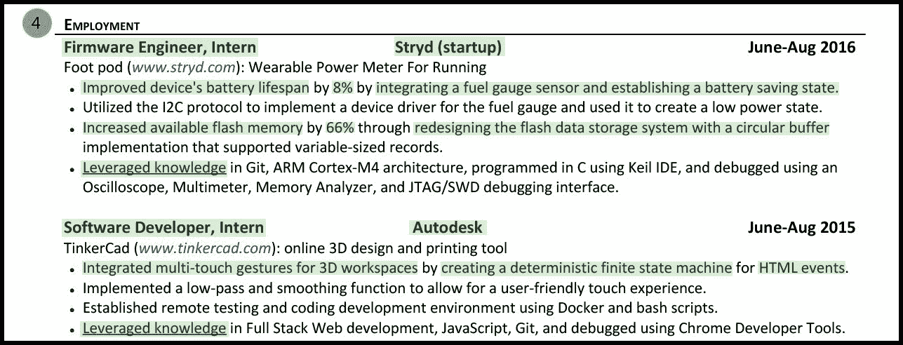

Résumé: Employment Section**** 

****如果你是一个没有任何经验的大学生，不要怕！这是我大四申请全职工作时的简历。我很幸运地从暑期实习中积累了相关的工作经验，但这并不是获得面试的绝对必要条件。如果你发现你没有太多东西可以放在这个部分，跳到“[个人项目](https://medium.com/p/b11c91ef699d#ed02)”部分。****

****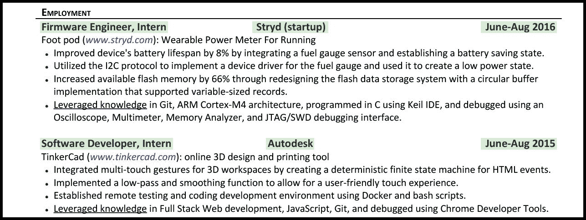

Résumé: Employment Section: Header Subsection**** 

****虽然有过去的工作经验很好，但在找软件工程工作时，并不是所有的工作经验都一视同仁。只把重点放在与你申请的工作相关的工作经历上。例如，如果你有在零售业做收银员或食品行业做服务员的经验，那就不要包括在内！不幸的是，你处理金钱或提供食物的能力并不能表明你会成为一名成功的软件工程师。****

****招聘人员的目标是将候选人与符合候选人技能的工作相匹配。因此，在你的简历中只包括与你目前申请的职位相关的过去的工作经历是很重要的。****

****实现这一目标的一部分意味着创建一个各种简历的集合，每个简历都是为你感兴趣的不同工作量身定制的。这类似于大学申请过程，你必须为你申请的每所大学写单独的论文。每所大学都有自己的价值观、文化和愿景，因此几乎不可能写出一篇通用的、放之四海而皆准的大学论文。因此，根据你申请的工作量身定制你的简历。****

****最后，关于日期的说明。从你最近的经历开始，按降序排列你的经历。对于本科生来说，这意味着要注意包括最近的和相关的经历。可悲的是，没有人在乎你在初中或高中取得了什么成就。如果经验已经过时了，就把它删掉。****

****概述:为你申请的每份工作准备不同版本的简历。没有放之四海而皆准的简历。****

****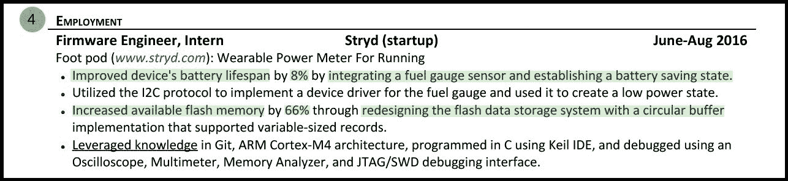

Résumé: Employment Section: Description Subsection**** 

****写简历最难的部分是用一种有意义和令人印象深刻的方式来描述你在过去工作经历中取得的成就。****

****你的描述有意义和令人印象深刻意味着什么？这意味着让招聘人员认为:“这是一个拥有我们需要的技能的人。这个人在过去的工作中产生了重大影响。这是一个我们想面试并有可能聘用的人。”****

****就业部分的主要目的是展示你在一家知名机构工作时的影响力和价值。你的目标是向招聘人员展示你是一个能把事情做好的候选人。****

****为了在简历中更好地展示我的成就，我采用了以下强大的公式，这是前拉兹洛·博克谷歌人事运营 SVP 发明的:****

> ****“完成了[X]，用[Y]做了[Z]来衡量”—拉兹洛·博克****

****你可以在我简历的这一部分的第一个要点中清楚地看到这一点。****

******通过集成燃油表传感器和建立电池节能状态，将设备的电池寿命延长了 8%******

****让我们来分解一下:****

******完成了[X]-** 延长了设备的电池寿命****

******按【Y】测量-** 按 8%测量****

******通过做【Z】-**整合燃油表传感器并建立电池节省状态****

****我在简历的几乎每个句子中都以某种形式运用了这个公式。****

****为了帮助你完成这个过程，下面是一个你可以并且应该使用的优秀动词的词库:****

****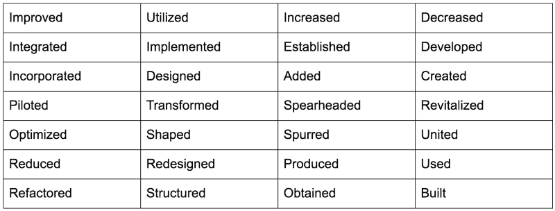

Verb Wordbank**** 

****以下是我为你准备的一些填空句子的例子:****

*   ****减少了 _____ 个百分点。****
*   ****针对 _____ 重新设计了 _____。****
*   ****由 _____ 为 _____ 实施了 _____。****
*   ****通过 _____ 对 _____ 进行了改进。****
*   ****从 _____ 到 _____ 使用了 _____。****
*   ****通过 _____ 增加了 _____。****
*   ****由 _____ 集成为 _____。****
*   ****由 _____ 为 _____ 合并了 _____ 公司。****

******重述:**使用“完成[X]由[Y]通过做[Z]来衡量”公式。这是向招聘人员/经理展示你影响力的最有效、最明显的方式。****

****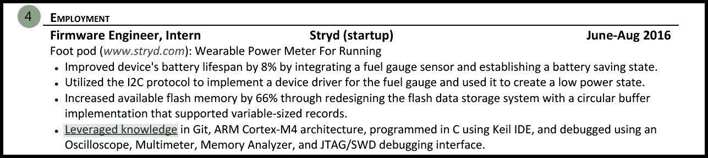

Résumé: Employment Section: Leveraged Knowledge Subsection**** 

****最后，我用一个**利用知识**要点来结束每一次工作经历。这最后一点背后的效用是，通过明确陈述我在项目中使用的技术，它使读者能够真正了解我所熟悉的技术。****

****这也让我可以在简历底部有一个简洁而干净的“技能”部分。然后，招聘人员可以查看底部，通过查看我熟悉的计算机语言，立即了解我的能力。如果他们想看看我是否在某个特定的工具、框架或库中有专门的知识，那么他们可以通过查看我的项目来发现这一点。****

******概述:**在你的描述中包括你使用的技术将有助于你在网上申请时绕过网上关键词过滤器。这也会让招聘人员对你的经历和知识有更清晰的了解。****

#### ****个人项目(5)****

*****目标受众:寻找软件工程实习/全职职位的学生+软件工程申请人的独特版块*****

****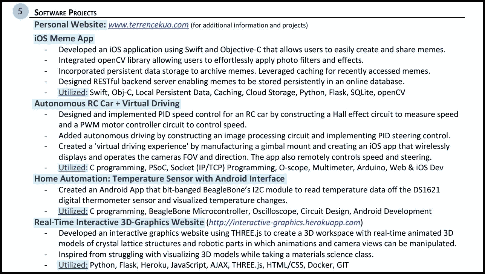

Résumé: Personal Projects Section**** ********

****也许如果我说的次数足够多，你就会明白这部分的重要性，**特别是对于那些没有工作经验的人**。****

> ****个人项目对于激起招聘人员和招聘经理的兴趣是不可或缺的，因为这表明你对编程充满热情。****

****个人项目可以是任何与编程相关的东西，无论是 Python 脚本、Java 程序、网页、移动应用程序等等。这些项目表明你对计算机科学真正感兴趣，你有强烈的愿望成为一名软件工程师，因为你愿意超越你的学校作业，自己创造一些东西。****

****主动建立自己的东西是非常令人印象深刻的。这表明你致力于扩展你的计算机科学知识，并且你不怕为此付出额外的努力。最终，这是一种展示自我主动性和对该领域真正兴趣的极好方式。****

****做个人项目的另一个好处是，你不可避免地会获得适用于现实世界工作的技能。您通常不会在学校做，但会在工作中做的事情，例如使用标准框架/库、了解全栈 web 开发、创建移动应用程序、设置开发环境或使用 Vim 高效编程。****

> ****提示:创建一个展示和记录你所有个人项目的个人网站。这是一个小小的技巧，可以让你的简历超出一页纸的限制。****

****最后重申一次，个人项目显示了你对发展一份你还不具备的工作所需的必要技能的热情和奉献精神。这是任何软件工程简历上的**必备**。****

> ****“开发一些 iPhone 应用程序、web 应用程序等等！老实说，只要你在做什么，你在做什么并不重要。你可以在一个周末构建一个相当大的项目。这意味着大约 3-4 个周末的工作，你可以让你的简历从一般变得精彩。说真的，我见过很多人这样做。”
> 
> ——Gayle McDowell，前谷歌工程师，《破解编码访谈》的作者****

****如果有一家你非常想去的公司，脱颖而出的最好方法之一就是做一个与你申请的工作直接相关的个人项目。****

****我在 Udacity 上参加了一个免费的在线交互式计算机图形学课程，从而获得了在 Autodesk 的实习机会。课程教会了我使用一个叫做 *three.js* 的 JavaScript 库，碰巧 Autodesk 有一个软件工程实习机会，想找一个拥有全栈网站和 *three.js* 知识的人(也就是我)。****

****这种技术需要注意。这个策略并不完美。这只适用于像 Autodesk 这样没有通用软件工程实习机会的公司，比如谷歌、脸书和微软。当你在职业生涯的早期开始时，最好概括并弄清楚计算机科学的不同学科。尽管如此，如果有你想要的特定公司，这是一个值得一试的好方法。****

******回顾:**个人项目势在必行。如果你还没有，现在就开始吧！你不会有任何损失，反而会有所收获。****

#### ****技能(6)****

*****目标受众:任何正在寻找软件工程工作的人*****

****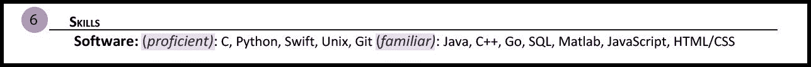

Résumé: Skill Section**** 

****标题说明了一切。保持这个部分简单明了。列出你想让招聘人员知道的所有相关技能。你在这里列出的技能越多，越符合职位描述中资格部分的关键技术词汇，你的机会就越大！****

****这将让你轻松绕过在线关键词扫描仪。然而，这并不是规避扫描仪的简单方法。最终决定的是拿到你简历的招聘人员，但如果他们认为你非常适合这份工作，他们也会更愿意给你一次面试机会！****

****技能部分需要注意的一点是，不要仅仅为了显示你非常适合而简单地列出工作描述中的所有关键词。它会回来咬你，因为你会被质疑你声称知道的技能。****

****在这方面给自己留些余地的一部分是包括你熟练程度的指示。因为你可能不会每天都练习你所遇到的每一种语言，包括熟练程度可以帮助招聘人员及时了解你最强的语言和你熟悉的其他语言。****

****我选择使用两层:****

1.  ******精通** -我非常熟悉的语言，使用起来感觉非常舒服，并且可以立即进行面试。****
2.  ******熟悉的**——我过去使用过的语言，但现在可能还不太熟悉，但过一段时间就能掌握。****

****其他有效选项包括:****

1.  ****先进的****
2.  ****中间的****
3.  ****基础****

****或者****

1.  ****专家****
2.  ****先进的****
3.  ****中间的****

****或者****

1.  ****流利的****
2.  ****能手****
3.  ****熟悉的****

****或者****

1.  ****工作知识****
2.  ****基础知识****

****概述:当你在网上申请一份特定的工作时，交叉参考职位描述，并在简历上添加必要的技术关键词，以增加你获得面试的机会。****

### ****关键要点****

*   ****确保您的姓名和联系信息正确、清晰****
*   ****一定要包括你的学历。如果你的 GPA 很低，那就不要管它，或者发挥你的创造力！****
*   ****利用“通过[Y]做[Z]来衡量的完成[X]”公式来有效地展示你在过去工作中的影响****
*   ****做个人项目——尤其是如果你过去没有在科技领域工作的经验****

### ****最后的想法****

****虽然这份简历让我参加了许多软件工程公司的面试，但并不保证遵循我在这里解释的所有原则和技术会给你带来同样的结果。****

****这是我 2017 年的大四简历。它展示了我的旅程和对软件工程的兴趣。复制它对你没有好处，因为技术在不断发展，人才搜索是一个不断变化的过程。而是以此为参考。****

****把我的简历和这篇文章作为一个资源，成为一个更好的简历作者和更有效的沟通者。专注于学习如何最好地向他人传达你的技能和成就。这本身就是一种无价的、终身的技能，无论你去哪里都需要它。****

****当你写简历时，请记住——做你自己！****

****你的简历是你自己的成就、成就和兴趣的列表。你的目标是打造最完美的自己。最后，尽情享受这个过程吧！****

****对于任何对使用这个简历模板感兴趣的人，我从 Gayle Laakmann McDowell 创建的 [CareerCup](https://careercup.com/resume) 获得了这个模板，Gayle Laakmann McDowell 是《T2》一书的作者。****

****从个人经验来看，**最重要的**是内容。上面讨论的简历写作原则可以适用于任何模板！****

****另外，看看我的新网站，[memlayout.com](https://memlayout.com/)，它帮助学生通过一行一行可视化他们的 python 代码来学习编程。****