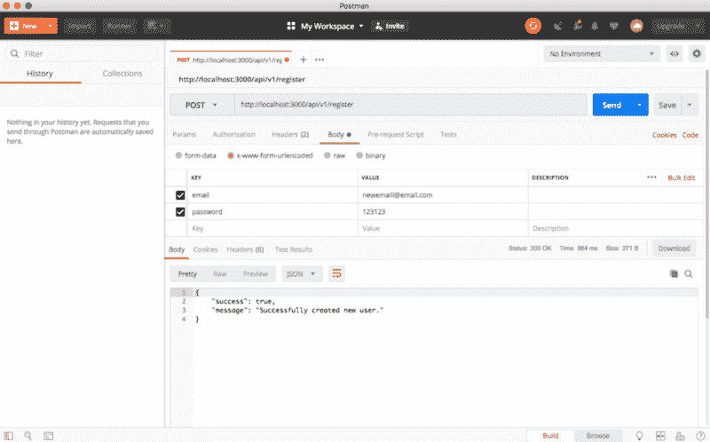
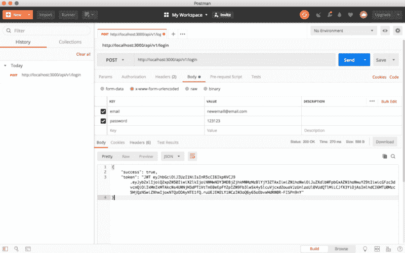
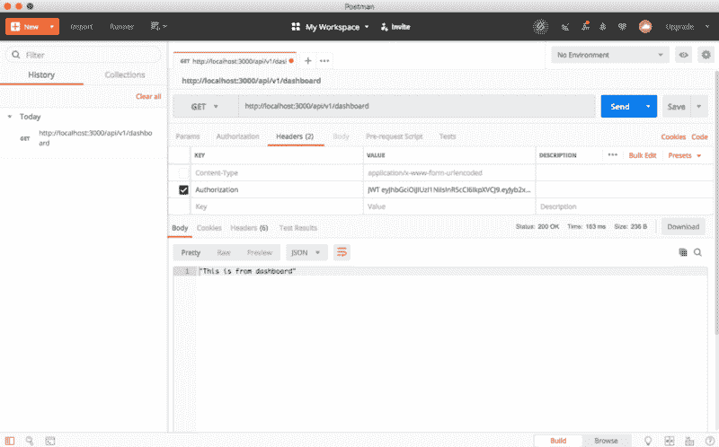

# 为 Nodejs 编写可伸缩的架构

> 原文：<https://www.freecodecamp.org/news/writing-scalable-architecture-for-node-js-2b58e0523d7f/>

作者:扎法尔·萨利姆

# 为 Nodejs 编写可伸缩的架构


多亏了全栈 JavaScript，现在为任何项目编写后端逻辑都非常容易。随着数十个用于客户端和服务器端实现的框架的引入，尤其如此。

最流行的 Node.js 框架之一是 [Express.js](https://expressjs.com/) 。它提供了一种简单的方法来构建不同规模的应用程序。然而，随着项目的增长，在某一点上变得难以扩展。

许多开发人员倾向于为新的服务和 API 端点添加新的路由文件和模型。这种方法是可行的，但它确实让未来的工程师很难扩展和添加新的服务。

在这篇博客中，我将建立一个登录和注册系统，使用 JWT 认证和可伸缩的架构。对于那些喜欢直接进入代码的人来说，继续克隆这个库。

这个博客将分为四个部分。

1.  基本架构设置
2.  登记
3.  注册
4.  仪表盘

这篇博客假设您已经在系统中安装了 Node.js。让我们进入第一步——基本架构设置。

#### 基本架构设置

首先，在您的文件系统上创建一个新目录，并将其命名为`auth`(或者您喜欢的任何名称)。

```
mkdir auth
```

现在`cd`进入那个目录并创建一个 package.json 文件。把下面几行加进去。

```
{    "name": "auth",    "version": "0.0.0",    "private": true,    "main": "index.js",    "scripts": {      "start": "node index.js"    },    "dependencies": {      "bcrypt": "latest",      "body-parser": "^1.18.2",      "cookie-parser": "~1.4.3",      "express": "~4.15.5",      "jsonwebtoken": "^8.1.1",      "mongoose": "^5.0.3",      "lodash": "^4.17.11",      "morgan": "^1.9.0",      "passport": "^0.4.0",      "passport-jwt": "^3.0.1",      "serve-favicon": "~2.4.5"    }  }
```

上面文件最重要的部分是`dependencies`属性。这些是项目所需的依赖项。在这篇博客的后面，它们将被用作中间件。

现在继续运行下面的命令来安装所有这些依赖项。您可能需要等待几秒钟。

```
npm install
```

一旦它安装了以上所有的依赖项，继续在您的根文件夹中创建一个`index.js`文件，如下所示:

```
touch index.js
```

这个特定的文件只负责启动服务器。为此，在其中添加以下代码:

```
'use strict';
```

```
const server = require('./server')();const config = require('./configs');const db = require('./configs/db');
```

```
server.create(config, db);server.start();
```

如您所见，该文件需要三个文件:

1.  计算机网络服务器
2.  配置
3.  

我们接下来将创建这些。

上面的代码然后调用服务器模块上的`create`方法。最后，它调用`start`方法，启动服务器。

#### 1.创建`server`文件夹

```
mkdir server
```

完成后，将`cd`放入该文件夹并创建另一个`index.js`文件。

```
touch index.js
```

现在将下面的代码添加到该文件中:

```
'use strict';
```

```
const express = require('express');const bodyParser = require('body-parser');const logger = require('morgan');const mongoose = require('mongoose');const passport = require('passport');const cookieParser = require('cookie-parser');
```

```
module.exports = function() {  let server = express(),      create,      start;
```

```
 create = function(config, db) {      let routes = require('./routes');
```

```
 // Server settings       server.set('env', config.env);       server.set('port', config.port);       server.set('hostname', config.hostname);
```

```
 // Returns middleware that parses json       server.use(bodyParser.json());       server.use(bodyParser.urlencoded({ extended: false }));       server.use(cookieParser());       server.use(logger('dev'));       server.use(passport.initialize());       mongoose.connect(db.database);       require('../configs/passport')(passport);
```

```
 // Set up routes       routes.init(server);   };
```

```
 start = function() {       let hostname = server.get('hostname'),       port = server.get('port');
```

```
 server.listen(port, function () {          console.log('Express server listening on - http://' + hostname + ':' + port);        });    };
```

```
 return {       create: create,       start: start    };};
```

在这个文件中，我们首先需要这个项目所需的所有依赖项。请注意，如果需要，可以在这个文件中添加更多的依赖项。

然后我们使用`module.exports`从这个模块中导出一个匿名函数。在这个函数中，创建三个变量:`server`、`create`和`start`。

`server`变量是针对 Express.js 服务器的。因此，调用`express()`函数并将其分配给`server`。我们将为`create`和`start`变量分配匿名函数。

现在，是时候写一个带有两个参数的`create`函数了:`config`和`db`。

然后使用 server.use()函数设置一些服务器设置，即 env、port 和 hostname。然后用`cookieParser, bodyParser, logger and passport`中间件。然后连接到`mongoose`数据库，最后需要 passport 的配置文件，用需要的 passport 调用它。

Passport 中间件用于身份验证，我们将在本博客的后面使用。要了解更多信息，请点击[此处](http://www.passportjs.org/)。

现在是 API 端点即路线的时候了。只需在 routes 上调用`init`函数，并将`server`传递给它。

接下来，编写`start`函数。设置`hostname`和`port`，用该函数内的`listen`命令启动服务器。

然后，返回`create`和`start`函数，使它们可供其他模块使用。

#### 2.创建配置文件夹

在根级别，创建一个`configs`文件夹:

```
mkdir configs
```

`cd`放入该文件夹并创建一个 index.js 文件:

```
touch index.js
```

将以下代码添加到 index.js 文件中:

```
'use strict';
```

```
const _ = require('lodash');const env = process.env.NODE_ENV || 'local';const envConfig = require('./' + env);
```

```
let defaultConfig = {  env: env};
```

```
module.exports = _.merge(defaultConfig, envConfig);
```

现在创建一个 local.js 文件:

```
touch local.js
```

打开它，添加下面的代码:

```
'use strict';
```

```
let localConfig = {  hostname: 'localhost',  port: 3000};
```

```
module.exports = localConfig;
```

这个也很简单。我们正在创建一个`localConfig`对象，并添加一些属性，如`hostname`和`port`。然后导出它来使用它，就像我们在`./index.js`文件中所做的那样。

#### 3.现在创建一个数据库

```
touch db.js
```

在您最喜欢的编辑器中打开 db.js，并将以下代码粘贴到其中。

```
module.exports = {   'secret': 'putsomethingsecretehere',  'database': 'mongodb://127.0.0.1:27017/formediumblog'};
```

我们正在导出一个具有属性`secret`和`database`的 JavaScript 对象。这些用于使用名为 mongoose 的中间件连接 MongoDB 数据库。

### 构建应用程序

现在我们完成了项目的基本设置，是时候做有趣的事情了！

`cd`到`server`文件夹，并创建以下文件夹:

```
mkdir controllers models routes services
```

首先，我们将覆盖`routes`文件夹。该文件夹用于添加可供客户端使用的所有端点。首先，在`routes` 文件夹中创建`index.js`文件。

```
touch index.js
```

并将以下代码放入该文件:

```
'use strict';
```

```
const apiRoute = require('./apis');
```

```
function init(server) {  server.get('*', function (req, res, next) {    console.log('Request was made to: ' + req.originalUrl);    return next();  });
```

```
 server.use('/api', apiRoute);}
```

```
module.exports = {  init: init};
```

首先，需要我们接下来要创建的`apiRoute`文件夹。该文件夹将包含另一个 API 版本号为`v1`的文件夹。

其次创建一个`init`函数。我们从底部的`create`函数中的`server/index.js`文件调用这个函数，并将`server`作为参数传递。它只是获取所有的路由并返回下一个回调函数。

然后使用我们上面要求的`apiRoute`。最后，导出 init 函数，使这个函数在项目的其余部分可用。

现在创建一个`apis`文件夹。在该文件夹中创建一个文件`index.js`。

```
mkdir apistouch index.js
```

将下面的代码粘贴到`index.js`文件中。

```
'use strict';
```

```
const express = require('express');const v1ApiController = require('./v1');
```

```
let router = express.Router();
```

```
router.use('/v1', v1ApiController);
```

```
module.exports = router;
```

该文件需要`express`和 api 版本文件夹，即`v1`。然后创建路由器，并使用`router.use()`方法制作`/v1`端点。最后导出路由器。

是时候创建`apis/v1.js`文件了。将下面的代码粘贴到`v1.js`文件中:

```
'use strict';
```

```
const registerController = require('../../controllers/apis/register');const express = require('express');
```

```
let router = express.Router();
```

```
router.use('/register', registerController);
```

```
module.exports = router;
```

我们需要注册控制器和 express.js 并创建一个路由器。然后我们需要公开`register` API 端点供客户端使用。最后，我们必须从该模块中导出路由器。

这是我们要不断修改的文件。当我们创建控制器时，我们需要更多的控制器。

现在我们完成了路径文件夹，是时候创建控制器文件夹了。继续 CD 到那个文件夹，并创建一个文件夹`apis`。

```
mkdir apis
```

现在我们在`controllers`中有了 apis 文件夹，我们将创建以下三个控制器和它们各自的`services`。

1.  基本架构设置
2.  **登记**
3.  注册
4.  仪表盘

首先出场的是`registerController`。继续创建下面的文件。

```
touch register.js
```

在您最喜欢的编辑器中打开该文件，并将以下代码粘贴到其中:

```
'use strict';
```

```
const express = require('express');const registerService = require('../../services/authentication/register');
```

```
let router = express.Router();
```

```
router.post('/', registerService.registerUser);
```

```
module.exports = router;
```

首先，它需要`express.js`和`register`服务(我们将在后面编写)。然后使用`express.Router()`方法创建一个路由器，并向`'/'`路径发出 post 请求。然后在 registerService 上调用 registerUser 方法(我们后面要写)。最后，从这个模块中导出路由器。

现在我们需要在已经完成的`routes/apis/v1.js`文件中包含这个控制器。

现在注册控制器已经完成。是时候进入`services`文件夹了。CD 放入该文件夹，并创建一个`authentication`文件夹。首先，将 cd 放入`authentication`并创建一个`register.js`文件。

```
touch register.js
```

然后打开`register.js`文件，将以下代码粘贴到其中:

```
'use strict';
```

```
const express = require('express');const User = require('../../models/User');
```

```
const httpMessages = {  onValidationError: {    success: false,    message: 'Please enter email and password.'  },  onUserSaveError: {    success: false,    message: 'That email address already exists.'  },  onUserSaveSuccess: {    success: true,    message: 'Successfully created new user.'  }}
```

```
// Register new usersfunction registerUser(request, response) {  let { email, password } = request.body;
```

```
 if (!email || !password) {    response.json(httpMessages.onValidationError);  } else {    let newUser = new User({      email: email,      password: password    });
```

```
 // Attempt to save the user    newUser.save(error => {      if (error) {        return response.json(httpMessages.onUserSaveError);      }      response.json(httpMessages.onUserSaveSuccess);    });  }}
```

```
module.exports = {  registerUser: registerUser};
```

在`register`服务中，首先我们需要`expressjs`和`User`模型。然后，我们创建一个 JavaScript 对象，即`httpMessages`，它基本上是当客户端发送请求时，我们将通过 api 发送给客户端的所有消息的列表。

然后是实际执行注册过程的函数`registerUser`。在保存用户之前，会检查用户是否提供了电子邮件和密码。如果是的话，那么使用关键字`new`和提供的电子邮件和密码创建一个新用户。

然后简单地调用`newUser`上的`save`函数，将该用户保存在数据库中，并使用`response.json`发送适当的响应。

最后使用`module.exports`导出这个函数，以便在项目的其余部分使用它。我们在`controllers/register.js`文件中使用它。

在测试它是否有效之前，首先我们需要创建一个`User`模型。继续在`models`文件夹中创建一个文件`User.js`。

```
touch User.js
```

并将这段代码粘贴到上面的文件中:

```
const mongoose = require('mongoose');const bcrypt = require('bcrypt');
```

```
const UserSchema = new mongoose.Schema({  email: {    type: String,    lowercase: true,    unique: true,    required: true  },  password: {    type: String,    required: true  },  role: {    type: String,    enum: ['Client', 'Manager', 'Admin'],    default: 'Client'  }});
```

```
UserSchema.pre('save', function(next) {  let user = this;
```

```
 if (this.isModified('password') || this.isNew) {      bcrypt.genSalt(10, (err, salt) => {        if (err) {          console.log(err);          return next(err);        }
```

```
 bcrypt.hash(user.password, salt, (err, hash) => {          if (err) {            console.log(err);            return next(err);          }
```

```
 user.password = hash;          next();        });      });  } else {    return next();  }});
```

```
// Create method to compare password input to password saved in databaseUserSchema.methods.comparePassword = function(pw, cb) {  bcrypt.compare(pw, this.password, function(err, isMatch) {    if (err) {      return cb(err);    }
```

```
 cb(null, isMatch);  });};
```

```
module.exports = mongoose.model('User', UserSchema);
```

首先需要`mongoose`和`bcrypt`模块。Mongoose 用于创建 mongodb 模式，而 bcrypt 用于在将密码存储到数据库之前对其进行加密。

用`email, password and role`属性创建`UserSchema`。然后在保存用户之前，在散列密码之前执行一些检查。

最后一个功能是比较密码。它将用户密码与数据库中的哈希密码进行比较。

现在为了测试这个代码，打开 postman(如果你还没有安装 postman，从[这里](https://www.getpostman.com/)开始安装)。打开 postman 并输入以下 url:

```
http://localhost:3000/api/v1/register
```

选择 POST 作为请求，选择 body 选项卡和`form-urlencoded`并输入电子邮件和密码。按下发送按钮，你应该会看到下面的成功信息。



现在注册部分完成了。

1.  基本架构设置
2.  注册
3.  **登录**
4.  仪表盘

是时候关注登录了。在`controllers`文件夹中创建一个`login.js`文件。

```
touch login.js
```

现在打开它，粘贴下面的代码:

```
'use strict';
```

```
const express = require('express');const loginService = require('../../services/authentication/login');
```

```
let router = express.Router();
```

```
router.post('/', loginService.loginUser);
```

```
module.exports = router;
```

同样简单，与注册模块相同:导入`express.js`和`loginService`后，我们创建路由器，并通过`loginService`上的`loginUser`回调函数向根路径`'/'`发出 post 请求。最后导出路由器。

是时候要求`routes/apis/v1.js`文件中的`loginController`了。你的`v1.js`文件应该看起来像下面这样。

```
'use strict';
```

```
const registerController = require('../../controllers/apis/register');const loginController = require('../../controllers/apis/login');
```

```
const express = require('express');
```

```
let router = express.Router();
```

```
router.use('/register', registerController);router.use('/login', loginController);
```

```
module.exports = router;
```

现在对于登录服务，在`services/authentication/`中创建一个`login.js`文件:

```
touch login.js
```

并将以下代码粘贴到该文件中:

```
'use strict';
```

```
const express = require('express');const apiRoutes = express.Router();
```

```
const jwt = require('jsonwebtoken');const passport = require('passport');const db = require('../../../configs/db');
```

```
const User = require('../../models/User');
```

```
const httpResponse = {  onUserNotFound: {    success: false,    message: 'User not found.'  },  onAuthenticationFail: {    success: false,    message: 'Passwords did not match.'  }}
```

```
function loginUser(request, response) {   let { email, password } = request.body;
```

```
User.findOne({    email: email  }, function(error, user) {    if (error) throw error;
```

```
 if (!user) {      return response.send(httpResponse.onUserNotFound);    }
```

```
 // Check if password matches    user.comparePassword(password, function(error, isMatch) {      if (isMatch && !error) {        var token = jwt.sign(user.toJSON(), db.secret, {           expiresIn: 10080        });
```

```
 return response.json({           success: true, token: 'JWT ' + token        });      }
```

```
 response.send(httpResponse.onAuthenticationFail);    });  });};
```

```
module.exports = {  loginUser: loginUser};
```

首先需要一些必要的模块比如:`express.js, jsonwebtoken, passport, db and User model`。创建一个 JavaScript 对象，该对象包含向该服务发出 http 请求时要发送到客户端的消息列表。

创建一个 loginUser 函数，并在其中创建几个变量，即 email 和 password，并将用户发送的 email 和 password 赋给这些变量，这些变量在`request.body`中。

然后在`User`模型上使用`findOne()`方法，根据用户从客户端发来的邮件找到一个用途。`findOne()`的回调函数接受两个参数，`error and user`。首先检查上面的`findOne()`方法是否抛出任何错误——如果抛出，那么抛出一个错误。

然后执行检查:如果没有找到用户，那么从我们在本模块中声明的消息列表中选择一条消息发送正确的响应。

然后使用我们在本博客前面的`User`模型中编写的`compare`函数，将用户发送的密码与数据库中的密码进行比较。

如果密码匹配并且没有返回错误，那么我们使用`jsonwebtoken`模块创建一个令牌，并使用`json.response()`将该令牌返回给客户端。否则我们发送一个`authenticationFail`消息。

最后用`exports.module`导出`loginUser`函数，这样我们就可以在我们的控制器和其他地方使用它。

是时候测试登录功能了。回到 postman，这次用`login`替换`register`作为 url 中的 api 端点。输入电子邮件和密码，然后按发送按钮。你应该能收到一个令牌。继续将它复制到剪贴板，因为您稍后将使用它来访问仪表板。



1.  基本架构设置
2.  注册
3.  注册
4.  **仪表板**

现在到了`dashboard.js`文件的时候了。在`controllers`文件夹中创建`dashboard.js`文件。

```
touch dashboard.js
```

打开它，粘贴下面的代码:

```
'use strict';
```

```
const passport = require('passport');const express = require('express');const dashboardService = require('../../services/dashboard/dashboard');
```

```
let router = express.Router();
```

```
router.get('/', passport.authenticate('jwt', { session: false }), dashboardService.getDashboard);
```

```
module.exports = router;
```

这个控制器的不同之处在于它需要经过身份验证的访问。也就是说，只有登录的用户才能访问仪表板服务并发出不同的 http 请求。

出于这个原因，我们还导入 passport，对于 get 请求，我们使用`passport.authenticate()`函数来调用`getDashboard`服务。

同样，我们需要在`routes/apis/v1.js`文件中要求`dashboardController`。您的`v1.js`文件应该如下所示:

```
'use strict';
```

```
const registerController = require('../../controllers/apis/register');const loginController = require('../../controllers/apis/login');const dashboardController = require('../../controllers/apis/dashboard');
```

```
const express = require('express');
```

```
let router = express.Router();
```

```
router.use('/register', registerController);router.use('/login', loginController);router.use('/dashboard', dashboardController);
```

```
module.exports = router;
```

既然`dashboardController`可以用于客户端请求，那么是时候创建它自己的服务了。转到 services 文件夹，并在其中创建一个`dashboard`文件夹。创建一个`dashboard.js`文件，并将下面的代码放在这个文件中。

```
'use strict';
```

```
function getDashboard(request, response) {  response.json('This is from dashboard');}
```

```
module.exports = {  getDashboard: getDashboard}
```

没有什么特别的事情发生。出于演示的目的，我只是用一条文本消息`This is from dashboard`来响应。然后将这个方法导出到我们已经完成的控制器中。

现在是测试时间。打开 postman，将 url 的终点更改为仪表板。点击 headers 选项卡，添加`Authorization`，并在登录时粘贴上一步复制的 JTW。



您应该会看到消息`This is from dashboard`作为响应。

如您所见，当我们创建新服务时，我们需要一个控制器，并且我们可以不断向架构中添加新服务。如果您想更改 API 的版本并保持当前版本，只需添加一个新的`v2.js`文件并将所有请求重定向到该端点。这是一个简单的例子。

我希望你喜欢这个博客，下次再见。

更新:如果你想实现它的客户端，那么请[点击这里](https://medium.com/@zafarsaleem/login-using-react-redux-redux-saga-86b26c8180e)在这里我使用 react.js 来验证这个服务器。