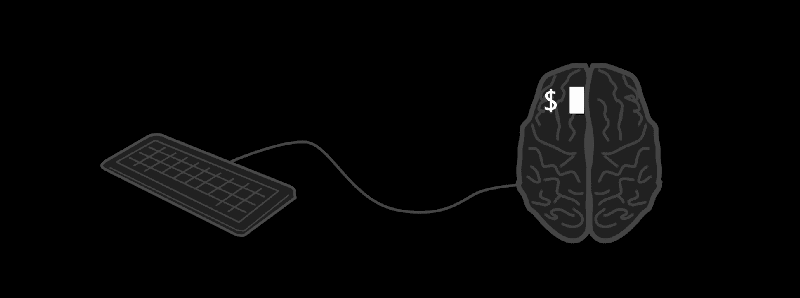
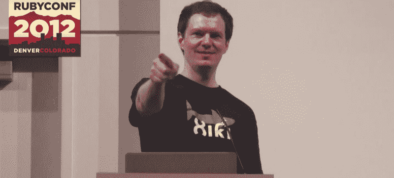
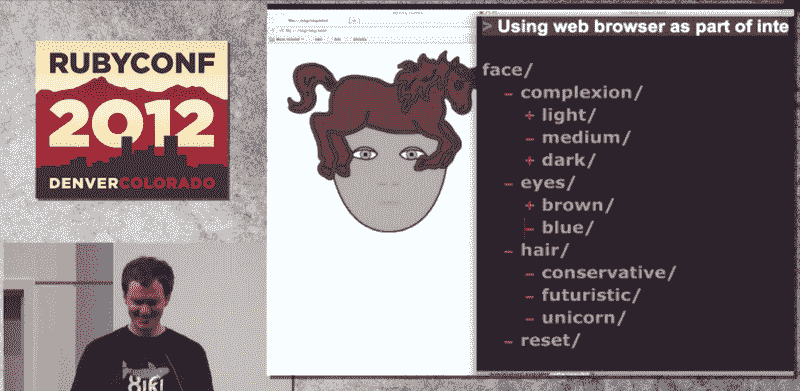
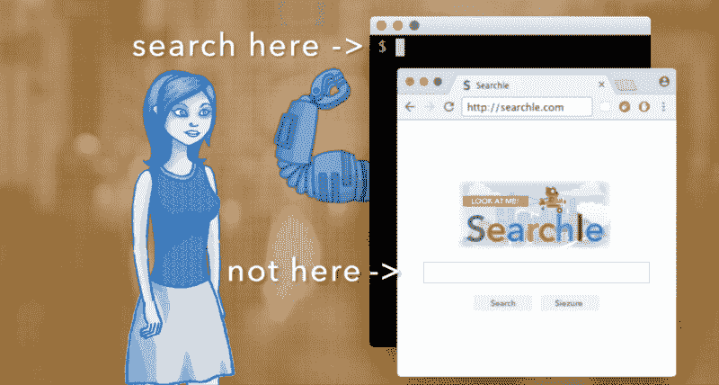

# Xiki:一个开发者对增强命令行界面的探索

> 原文：<https://www.freecodecamp.org/news/xiki-one-developers-quest-to-turbocharge-the-command-line-interface-b68e5345788d/>

克雷格·穆思

# Xiki:一个开发者对增强命令行界面的探索

我和我的朋友查尔斯坐在旧金山金门公园旁边的一家时尚咖啡馆里。我们周围都是在昂贵的 MacBooks 上工作的年轻人，以及一些从公园里闲逛进来的流浪者。

“我永远也不会用这个，”他告诉我，我的心沉到了肚子里。

五年前，我决定从俄亥俄州搬到旧金山，花光我一生的积蓄来实现我的科技梦想。他看了我花了 6 个月时间和一大笔钱制作的 KickStarter 视频草稿。

他不是唯一有这种反应的人。视频中包括我和一匹马和一根香蕉在河里跳舞，这只会增加尴尬。我怎么会错得这么离谱？

倒回到 RubyConf 2012。我在舞台上凝视着外面，心跳加速，双手出汗。数百双眼睛盯着我。我的演讲刚刚结束，就有人举手提问。

房间很明亮，空气中有咖啡的味道。但我不在乎。事情进展顺利。

人群中在适当的时候发出了几声喘息，听起来像是“啊！”我拜访的第一个人说，“我没有问题。我只想说这太棒了。”对我这样的人来说，这是纯粹的肾上腺素。如果我当时就死了，生命就有意义了。

再次倒带。回到俄亥俄州的大学时代，那时电话是挂在墙上的东西，年份以“19”而不是“20”开始。我发现自己独自一人在一座巨大的混凝土建筑四楼的计算机实验室里。没有窗户。风扇舒缓的嗡嗡声从四面八方传来。我们应该弄清楚如何在这些小黑命令行窗口中编程，只用键盘。我讨厌它。真的很讨厌。

命令行就像学习说俄语一样。从外面看似乎不可能。

不知道什么时候态度转变了。但是在某种程度上，一个书呆子孩子可以爱上一项技术，我做到了。这是一个可以完全控制的世界，而无情的现实世界却不能。我喜欢这种控制。需要它。我花了几个小时定制我能做的一切。

我在 RubyConf 的舞台上所做的是展示 10 年来对控制近乎狂热的追求的结果。"为什么不让人们在命令行中输入任何东西，而不仅仅是命令呢？"我争辩道。

像搜索引擎一样。我演示了通过输入“数据库”来浏览和编辑数据库，以及通过输入“浏览器”来控制你的网络浏览器。

我发现，如果你让人们编辑所有的东西并与之互动，命令可以表现得更像应用程序。不放弃命令行的伟大之处。您可以在几分钟内创建命令。你甚至可以让人们使用他们的鼠标

大学毕业后，我发现自己住在更高、更窄的混凝土建筑里。在辛辛那提的一家银行，当我和老板尝试我设计的一个新功能时，一位名叫拉胡尔的高个子高管曾站在我们身后。错误可能意味着你阻止了 10，000 人进入他们的银行账户一个小时。

“这最好管用，”他只说了这么一句。

这招奏效了，他闷闷不乐地回到自己的办公室。

我买了房子和两只猫。

我把真正的创作精力放在了开发西基上。在我职业生涯的大部分时间里，我用它作为我的主要开发环境，并存储我所有的笔记。我会向任何愿意听的人展示我的最新功能。

10 年开车上班，开车回家，那是 2011 年。我坐在我妈妈房子后面的平台上，告诉她“我的朋友基思认为我应该搬到旧金山去。”这是俄亥俄州的一个夏日，温暖的风在树上沙沙作响，让你忘记了俄亥俄州冰冷的冬天。我告诉自己，不关心体育、宗教或电视会阻碍你在俄亥俄州交朋友的机会。更重要的是，具有讽刺的个性也是如此。

我有点怀疑她会哭着求我留下来。“去吧，”她说。我去了。

我在旧金山呆了两个星期，想试试这座城市。基思告诉过我，那里的程序员被认为很酷。甚至到了女孩们会追着他们跑的地步。我不相信他。我一直坐在俄亥俄州，忘记了 10 年前编码员获得了汽车作为雇佣奖金。

基思带我去了咖啡馆。到处都是编程和黑客。他们不是尴尬的龙与地下城类型。他们骑滑板。他们会看着你的屏幕说“看起来很酷，你在做什么？”自小学以来，我第一次觉得我不应该为去了某个地方而道歉。在回来的飞机上，我有一种奇怪的感觉，我要离开我的家了。

在接下来的五年里，我大部分时间都在旧金山附近的咖啡馆和休闲场所度过。研究西基并试图说服人们使用它。我喜欢工作和社交生活的结合。就像我想象的篮球运动员和一些政客。如果你足够热爱和相信你正在做的事情，它还是工作吗？

会有几天和朋友坐在咖啡店里，和他们一起聊天、聊天，然后一起吃晚餐、喝饮料。我会去某个地方，给人们发电子邮件，告诉他们如果他们想的话就出现。通常至少有一两个，有时更多。我在极客天堂。我开始发微博和新认识的人联系。

我申请在一次会议上做报告，并被邀请在另外两次会议上发言。我是几个播客的嘉宾。

我说服了几个和我密切合作的人收养西基，并认为从此以后事情会越来越糟。事实证明并非如此。

在一次失败的劝说会议中，一个家伙沮丧地站起来，回到自己的笔记本电脑前。出错时，他曾试图按下退出键来取消。在旧版本 Xiki 中，您必须打开 Emacs 文本编辑器并在其中使用 Xiki。在 Emacs 中，逃避会让你陷入更多的麻烦，而不是让你摆脱困境。这需要解决。

人们想要一个光滑的安装程序。但那需要做很多工作，而且花时间在这上面并不令人兴奋。

一路上会有许多起伏。我在 2014 年运行了一个初步成功的 KickStarter。它通过了，但只是勉强通过。我不得不拿出一半的钱来支付 t 恤、贴纸、费用、税收和制作视频的费用。

一开始很容易让人兴奋。但是当你要求他们接受某样东西时，他们的期望值大大提高了。

人们希望 Xiki 直接从终端工作，就在他们正常的提示符下。

这很糟糕，但我意识到我必须暂时放弃有趣的东西，重写几乎所有的东西。

我会为此花费好几个月的时间，因为我的储蓄继续被证明是高度易燃的。但我仍然热爱它胜过我自己做过的任何事情。

一个雾天，我在一个我最喜欢的地方找到了自己——一家半书店的咖啡馆后面的一张桌子。一个看起来像欧洲人的女孩和一些加入的朋友一起来的。我当时很健谈，并(我认为很机智地)忽略了她说她想专注于工作。她在为某种考试而学习。她用可爱的语调告诉我，我“越界了”。我不确定她是不是在开玩笑，但我开玩笑地打断了她几次。她成了我的女朋友，后来成了我的妻子。

人们想贡献他们用西基做的酷东西。有些捐款很好，但不是很大，所以我拒绝接受。我意识到我需要做一个库，让人们提交新的命令，而不成为瓶颈。制造一个给人们控制权的工具意味着我必须放弃控制权。

一天，我有了一个想法。我能让命令行像搜索引擎一样运行吗？搜索结果来自互联网，任何人都可以对它们做出贡献。

要花上三年乏味的时间坐下来，做人们想要的所有困难的事情。我不得不从最有趣的不切实际的功能中休息一下。

现在，我正拿着我的新 KickStarter 活动视频强调新的社交搜索版本。听查尔斯礼貌地告诉我这糟透了。

啊。

我从内心深处相信我有一些有价值的东西。修复命令行。这只可能是我没有充分地把信息传递出去。

我又花了六个月的时间一遍又一遍地重做视频。当人们告诉我“选择一件事并专注于它”时，我听着。然后“我不明白一件事。”然后是“我得到了，但我不在乎”，最后是“啊，好吧，*那*我得到了。”一位长期顾问甚至告诉我，这是他看过的最好的 KickStarter 视频。这很好，因为我所有的希望都集中在这上面。

与香蕉共舞的我还在里面。我不会完全出卖自己:)