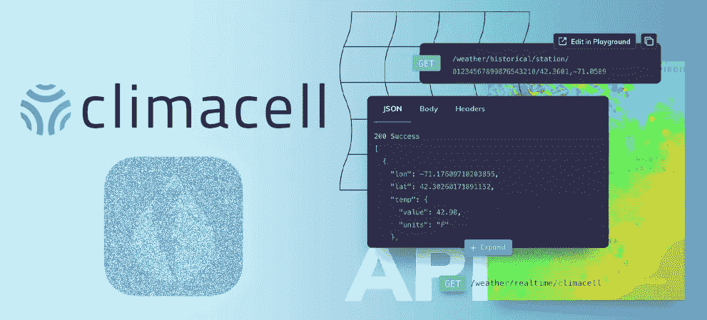
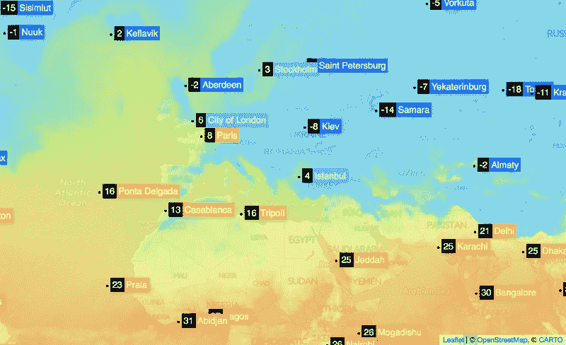
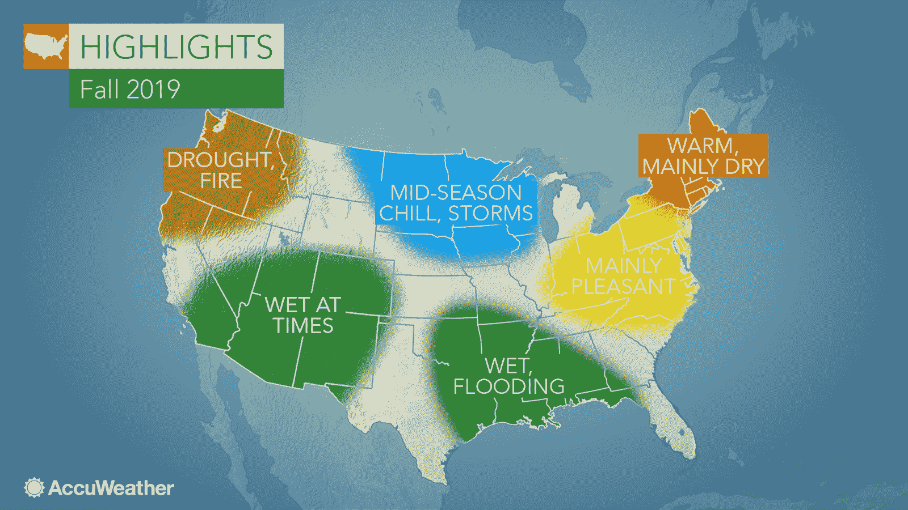
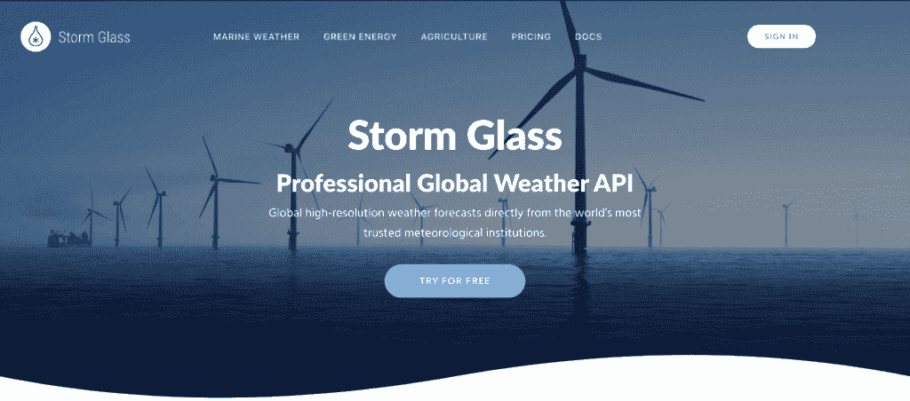
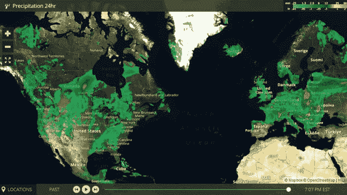
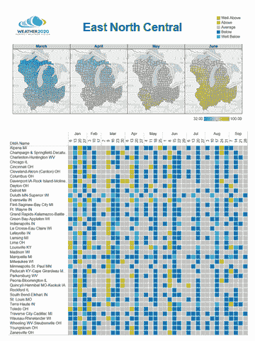

# 雅虎天气 API 替代方案

> 原文：<https://www.freecodecamp.org/news/yahoo-weather-api-alternatives/>

对于新手开发者来说，[雅虎天气 API](https://developer.yahoo.com/weather/) 可能足以构建简单的天气应用程序。

然而，雅虎有很多限制，因为它只提供特定位置的当前数据和 10 天的历史数据。

如果您的应用程序需要更多的特性和信息，使用这个免费的 API 可能不是最好的选择。

以下是 Yahoo weather API 的最佳替代产品列表，以及它们的主要优势和特性、最常见的使用案例和定价。

## [ClimaCell 微气象 API](https://www.climacell.co/weather-api/)

ClimaCell 的 Microweather API 以数字数据和地图图层的形式提供了广泛的信息。它可以从合作站提供长达四周的历史数据，从自己的观测站提供长达六小时的历史数据。

### ClimaCell 微气象 API 的主要特点/优势:

*   人工智能驱动的数据模型，处理来自无人机和物联网设备等广泛来源的数据
*   20 多个参数的地图图层
*   超本地和全球历史和实时数据
*   现成的模板，用于更轻松地制作请求调用

**最适用于:**

*   大多数企业应用程序。福特和优步等公司都使用这种 API。

**定价**:免费计划每天最多允许 1，000 次通话。付费计划每月起价 87 美元。

## [OpenWeatherMap API](https://openweathermap.org/api)

OpenWeatherMap 是一个受维基百科众包模式启发的 API。它可能是最受欢迎的天气 API，因为它很简单。

### OpenWeatherMap API 的主要特性/优势:

*   使用起来非常简单
*   任何位置的 40 年历史天气数据
*   有用的数据可视化，如“历史上的这一天”图表
*   多个地点的 16 天天气预报
*   三小时和五天预报
*   非常准确的数据，因为它从全球 40，000 多个站点收集
*   Creative Commons 在天气地图上共享类似的许可，允许开发者轻松地构建基于地图的应用程序

**最适合用于**:

*   个人气象站和开发人员的简单项目
*   面向农业部门的应用

**定价**:其免费层每天最多允许 100 次通话。付费计划起价为每月 40 美元。

## [Accuweather API](https://developer.accuweather.com/)

Accuweather 是另一个非常受欢迎的天气 API。它每天处理超过 300 亿个请求，并提供图像端点。

### Accuweather API 的主要特点/优势:

*   开发者可以很快开始使用它的 [Apigee](https://apigee.com/api-management/) 门户网站(Accuweather 与谷歌合作的项目)。
*   它的“指数 API”提供了其他有用的信息，如航班延误，蚊子活动，观星者的数据，以及特定地点的大量每日指数。
*   它提供引人入胜的视频演示以及每分钟的预报。
*   顾名思义，它提供了地球上几乎任何一点的超级准确的天气数据。
*   天气信息可以定制。

**最适合用于**:

*   如果应用程序需要视频演示，这是最好的选择。
*   面向管理灾难风险的应用程序。

价格:它有一个有限的试用期，允许每天打 50 次电话。付费计划每月起价 25 美元。

## [风暴类 API](https://stormglass.io/)

Stormglass weather API 提供全球知名气象机构的高分辨率预报。它允许开发人员通过简单的 HTTP 请求从任何坐标获取数据。

### Stormglass API 的主要特性/优势:

*   它提供高达 10 天的高分辨率预报。
*   提供海洋信息，如潮汐，水化学分析。
*   提供可再生能源数据(风能和太阳能指数)以及农业信息(土壤湿度、地表温度)。

**最适合用于**:

*   海洋相关应用。
*   可再生能源监测。
*   农业组织。

**定价**:它有一个免费层，每天最多允许 50 次 API 调用。付费计划每月 16 欧元起。

## [气象公司 API (IBM)](https://www.ibm.com/products/weather-company-data-packages)

气象公司 API 归 IBM 所有，是一个更加全面的数据包的一部分。它的主要价值主张是提供高度可操作的见解，允许企业优化其运营并降低成本，同时增加利润。

### 气象公司 API 的主要特点/优势:

*   它提供大约 500 米分辨率的非常精确的预报。
*   它有大量的信息来源，包括来自 250，000 个气象站的高分辨率观测。
*   它提供了涵盖 35 公里全球网格的历史数据，使企业能够了解模式，从而做出与天气相关的更好决策。
*   它提供实时恶劣天气预报。
*   它还提供非天气信息，如空气质量、花粉和流感指数。

**最适合用于**:

*   严重依赖快速预报和长期历史天气数据的业务。

**定价**:免费试用，每分钟最多允许 10 次通话。一旦超过 10，000 次免费通话的限制，试用期就会到期。付费计划每月起价 24.95 美元。

## 【2020 年天气 API

Weather 2020 以自己是一个预测性天气建模平台而自豪。它的主要主张是，仅仅根据前三个月的观察，它就可以提供长达九个月的预测。它的统计模型是基于著名气象学家加里·雷扎克的工作。

### 天气 2020 API 的主要特点/优势:

*   它提供长期预测，让企业和组织有更长的规划视野。
*   它每天提供超过 1000 万次预测，最适合用于移动应用程序。
*   它有一个非常互动的仪表板，显示关键信息，分析和图表。

**最适合用于**:

*   移动天气应用。
*   创建视频预测(适用于付费计划)。

**定价**:免费计划允许每天最多 1000 次 API 调用。付费计划每月起价 9.99 美元。

## 结论

正如我们从上面的列表中看到的，每个选项都有它最适合的特定用例。这绝不意味着这些 API 只有这些用途。

您的选择将取决于几个因素，包括成本、所需数据的数量和准确性，以及您自己的偏好。