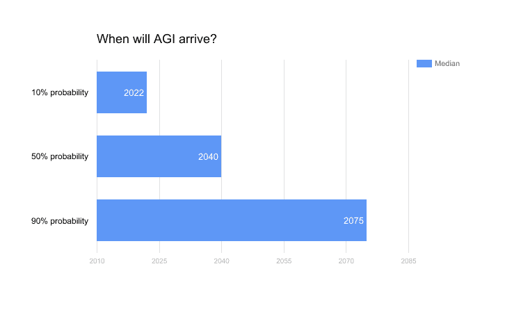

# 每年的捐赠，以及为什么你应该现在就捐赠，而不是以后

> 原文：<https://www.freecodecamp.org/news/yearly-donations-and-why-you-should-give-now-not-later-cba890cabfbe/>

作者 Haseeb Qureshi

# **每年捐赠，以及为什么你应该现在就捐赠，而不是以后**

#### 2017 年接近尾声。这是我第三年[为付出而挣钱](https://haseebq.com/why-ive-decided-to-devote-my-career-to-earning-to-give/)，又是充满变化的一年。

今年，我曾多次认真考虑过创办一家公司。这让我问自己:如果我在考虑一些有风险的事情，今年捐出三分之一的收入还有意义吗？捐钱当然很好，但也许在以后的生活中这样做更有意义。看看比尔·盖茨、沃伦·巴菲特、埃隆·马斯克——首先最大化你的成功，然后继续捐赠，这不是更有意义吗？

我不止一次面对这个问题，也有很多人给我写过类似的想法。在有效的利他主义社区中，这是一个长期的争论。但我的回答一直很坚定:你应该现在就给予，而不是以后。

我有四个主要的理由来解释为什么你不应该推迟你的付出。

### 复利

有一个常见的说法是这样的:如果你以后捐赠而不是现在捐赠，你可以获得资本的复利。如果你现在有 10 万美元，把它投资到高增长资产，翻倍，以后再捐 20 万美元，不是很有意义吗？

为了便于讨论，让我承认你总是有投资机会，会给你复利。这就引出了一个问题——如果你一直将资本翻倍，那么在什么时候你应该停止翻倍并最终放弃它？

假设你的资本是 x = 1000。加上一定量的复利，最终 x 将是 10，000。但是 x 变成 100，000，最终变成 1，000，000，也需要同样长的时间。如果你认真对待这个论点，你应该什么时候决定“好了，这已经足够复杂了，是时候放弃它了”？

如果有什么不同的话，似乎你的钱越多，复利就越有价值，所以你应该越少给。这似乎自相矛盾。

自然的答案可能是在临死前捐赠(这在税收方面不是最佳选择，但忽略这一点)。如果是这样的话，那么我们应该给钱只是偶然的。如果医疗保健达到了可以无限延长寿命的水平，那么就没有必要再去捐钱了。

这显然是错误的。

一个更有力的论点是这样的:在你职业生涯的早期，投资于你自己和你自己的跑道更有意义，这样你可以增加你的收入潜力，并承担更多高价值的风险。所以你不应该早点投资自己，然后再捐赠吗？

这一点我比较赞同。如果你处于职业生涯的早期，或者需要建立你的证书/专业知识，或者搬到一个对你的技能有更高需求的地区(通常是昂贵的城市)，那么我认为你不应该捐太多。你仍然处在投资自己会产生极高回报的阶段。

但对我自己来说，我已经过了那个阶段。对我来说，投资技能建设(培训、会议、书籍等)不再是繁重的工作。)，我已经住在 SF 了，我的时间利用效率还是蛮高的。我肯定可以使用更多的跑道，但我在这里不是真正的资本约束，因为如果你想在海湾建立一个公司，资本是相当便宜的。

换句话说，过了某个点，优化你的职业生涯并不昂贵，你也不会有无限的能力来吸收新的资本投资。一旦你训练有素，生活在一个高需求的领域，并有一点跑道，你真的不需要太多其他的。

(注意，这些观点并不适用于资本密集型职业，如职业赌博、日内交易或投资。在这种情况下，我确实认为，等到你开始用自己的资本实现收益递减时再捐赠可能是有意义的。)

### 流通效应

但是前面的论证只考虑了价值转移的一个方面——只考虑了你自己能用这些钱做什么。它忽略了一个至关重要的事实，即有效的捐赠也会为慈善机构带来复利回报。

举个简单的例子，通过 [GiveDirectly](https://www.givedirectly.org/) 直接捐赠给穷人。如果我们让更多的人摆脱贫困，或者让他们获得更多的教育或技能，现在可能需要 1000 美元。但是这些人可以继续为他们的经济做出贡献，发展他们的社区，并最终进一步减少那里的贫困。你的捐赠也是复合的。

大多数人认为慈善捐赠只是暂时给社会伤口贴上创可贴。但如果是这样的话，那就说明干预本身并不是很有效。有效的给予往往会产生复合收益和[流通效应](https://blog.givewell.org/2013/05/15/flow-through-effects/)。因此，你应该预期最好的慈善机构的回报率会比边际自我投资或你在资本市场上的回报率更高。

这会让你强烈倾向于现在给予而不是以后。

### 影响他人

你现在应该给予的第三个原因是因为它影响了你周围的人。

如果我把之前所有的捐款都投资到指数基金中，并且现在就把收益捐出去，我今天可能会捐得更多。但是通过每年付出并写下来，如果我能激励更多的人去付出，那么我很可能会加倍我对这个世界的影响。

人们通常认为慈善应该是私人的或秘密的。我强烈反对。激励人们给予的最好方式就是自己去做。所以，大声地、自豪地给予，并积极鼓励他人也这样做。

从我收到的博客读者的电子邮件中，我知道我已经说服了几个人学习有效的利他主义并遵循同样的道路。影响你周围的人是一个强大的杠杆，我通过影响别人对世界产生的影响可能比我通过自己的付出产生的影响更大。

### 影响你自己

最后一个原因最微妙，但我认为最重要。现在给予可以培养你自己的美德，并确保你继续实现自己的理想。

你不是一个完美的生物。即使你现在打算做一些艰难的事情，无论是捐钱、发誓戒酒、吃素，还是你打算做出的任何牺牲，你都必须考虑到你会改变主意或退步的可能性。

人们很难预测自己的退步。我见过足够多的人，他们曾经是素食主义者，曾经是放弃者，甚至曾经是挣钱者。人们很容易陷入这样一个陷阱，即相信你的信念中有某种特殊的东西使你对此免疫。但每个人都容易受到价值漂移的影响。

你变老了。你的环境变了。你的热情变得模糊。更加疏远。比较好商量。

当我 50 岁的时候，我可能会像 15 岁的自己一样远离现在的自己。

那么，你如何才能忠于自己的理想呢？很简单。养成美德的习惯。呆在里面。让它成为你生活的一部分。让它渗入你的骨头。年复一年地付出，即使这会让你慢下来。

道路是漫长的，有时会令人失望，但美德和纪律是前进的唯一道路。

所以这就是为什么我现在给予而不是以后。我对此感觉非常好。

### 我的 2017 捐款

今年我总共捐了 45，370.00 美元(比去年略少，因为我离开 Airbnb 后几个月没有工作)。

其中，11，340 美元我将捐给抗击疟疾基金会——我每年都会捐给这个组织，它也是多年来 Givewell 排名第一的慈善机构。

抗击疟疾基金会是一个非营利组织，在疟疾肆虐的国家，主要是非洲和亚洲，资助和分发抗疟疾蚊帐。一顶蚊帐只需 4 美元就能得到资助和分发，这可能是世界上最具成本效益的救生措施。

我今年捐款的其余 75%，即 34，030 美元，我将捐给一个由捐赠者建议的基金，该基金将捐给一个有前途的人工智能安全慈善机构。该基金由我的好朋友亚历克斯·弗林特(Alex Flint)管理，他是牛津大学的计算机视觉博士，非常精通人工智能风险(如果你也想向该基金捐款，我可以帮你联系他)。

对于那些不熟悉人工智能安全的人来说，你可能已经听说过埃隆·马斯克、斯蒂芬·霍金和山姆·哈里斯等人发表了关于不受控制的人工智能的危险的声明。人工智能正在快速发展，它可能会增长并控制世界上更多的基础设施，速度远远超过我们对如何使其安全的理解。到目前为止，全世界在考虑如何让人工智能更加安全方面投入的资金非常少，我认为随着人工智能研究的进展，这将成为一个越来越重要的问题。如果你是这方面的新手，我推荐阅读[这个](http://slatestarcodex.com/superintelligence-faq/)，然后[这个](http://slatestarcodex.com/2015/05/22/ai-researchers-on-ai-risk/)，然后[这个](https://intelligence.org/2014/11/18/misconceptions-edge-orgs-conversation-myth-ai/)。

总的来说，人工智能风险的研究资金严重不足，对我来说，这显然是一个迫切需要更多关注和资金的领域。我对当地的慈善机构了解不多，所以一个捐助者建议的基金允许我让我信任的人做出比我在这方面更好的研究决定。

2017 年到此为止。2018 年应该会有更多。我可能会继续写关于区块链和 crypto 的文章，希望会有一些令人兴奋的新进展可以分享！

放马过来吧，2018。

> *—Haseeb*