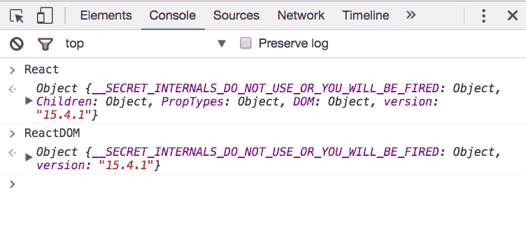
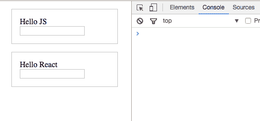
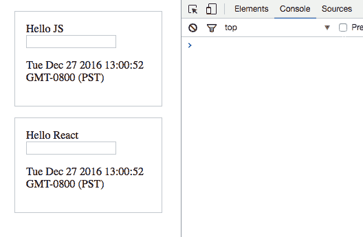
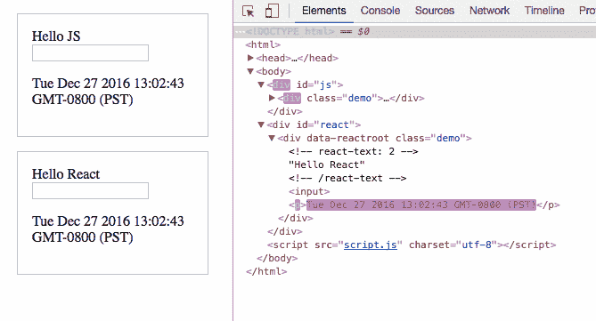

# 是的，React 正在接管前端开发。问题是为什么。

> 原文：<https://www.freecodecamp.org/news/yes-react-is-taking-over-front-end-development-the-question-is-why-40837af8ab76/>

> **更新:**这篇文章现在是我的书《React.js Beyond The Basics》的一部分。

> 阅读此内容的更新版本以及更多关于在[**【jscomplete.com/react-beyond-basics】**](https://jscomplete.com/g/why-react)*做出反应。*

以下是 React 如此迅速地变得如此流行的几个原因:

*   使用 DOM API 很难。React 基本上让开发人员能够使用比真实浏览器更友好的虚拟浏览器。React 的虚拟浏览器就像是开发者和真实浏览器之间的代理。
*   React 使开发人员能够以声明方式描述他们的用户界面，并对这些界面的状态进行建模。这意味着开发人员不用想出步骤来描述接口上的事务，而只是根据最终状态(像函数一样)来描述接口。当事务发生在那个状态时，React 负责根据那个状态更新用户界面。
*   React 只是 JavaScript，有一个很小的 API 要学，就几个函数和怎么用。之后，您的 JavaScript 技能会使您成为更好的 React 开发人员。没有进入的障碍。一个 JavaScript 开发人员可以在几个小时内成为一个高效的 React 开发人员。

但是不仅仅是这样。让我们尝试涵盖 React 越来越受欢迎背后的所有原因。一个原因是它的虚拟 DOM (React 的调和算法)。我们将通过一个例子来展示拥有这样一个算法的实际价值。

React 的官方定义称它是一个用于构建用户界面的 JavaScript 库。理解这个定义的两个不同部分很重要:

1.  React 是一个 *JavaScript 库*。它不是一个框架。这不是一个完整的解决方案，我们经常需要使用更多的库和 React 来形成任何解决方案。React 不对任何完整解决方案中的其他部分做任何假设。它只专注于一件事，并且把这件事做得很好。
2.  React 做得很好的是定义的第二部分:*构建用户界面*。用户界面是我们放在用户面前让他们与机器互动的任何东西。从微波炉上的简单按钮到航天飞机的仪表板，用户界面无处不在。如果我们尝试连接的设备能够理解 JavaScript，我们可以使用 React 为它描述一个用户界面。

由于 Web 浏览器理解 JavaScript，我们可以使用 React 来描述 Web 用户界面。我喜欢用*这个词来描述*,因为这是*和我们*在 React 上做的事情，我们只是告诉它我们想要什么，React 就会代表我们在网络浏览器上构建实际的用户界面。如果没有 React 或类似的库，我们将需要用本地 Web APIs 和 JavaScript 手动构建用户界面。

当你听到“React 是声明性的”这种说法时，这正是它的意思，我们用 React 描述用户界面，告诉它我们想要什么(而不是怎么做)。React 将负责“如何”将我们的声明性描述(我们用 React 语言编写)翻译成浏览器中的实际用户界面。React 与 HTML 本身共享这种简单的声明能力，但是有了 React，我们可以对表示动态数据的 HTML 界面进行声明，而不仅仅是静态数据。

React 有三个推动其流行的主要设计概念:

#### 1 —使用可重用、可组合和有状态的组件

在 React 中，我们使用组件来描述用户界面。你可以把组件想象成简单的函数(在任何编程语言中)。我们用一些输入调用函数，它们给我们一些输出。我们可以根据需要重用函数，将较小的函数组合成较大的函数。

组件完全相同；我们称它们的输入为“属性”和“状态”，组件输出是对用户界面的描述(类似于浏览器的 HTML)。我们可以在多个用户界面中重用单个组件，并且组件可以包含其他组件。

然而，与纯函数不同，完整的 React 组件可以有一个私有状态来保存可能随时间变化的数据。

#### 2 —被动更新的性质

React 的名字就是对这个概念的简单解释。当一个组件(输入)的状态改变时，它所代表的用户界面(输出)也会改变。用户界面描述的这种变化必须反映在我们正在使用的设备上。

在浏览器中，我们需要在文档对象模型(DOM)中重新生成 HTML 视图。有了 React，我们不需要担心*如何*反映这些变化，甚至不需要管理*何时*对浏览器进行修改；React 将简单地*对状态变化做出反应*，并在需要时自动更新 DOM。

#### 3 —视图在内存中的虚拟表示

通过 React，我们使用 JavaScript 编写 HTML。我们依靠 JavaScript 的能力来生成依赖于某些数据的 HTML，而不是增强 HTML 来使其处理这些数据。增强 HTML 是其他 JavaScript 框架通常做的事情。例如，Angular 用循环、条件等特性扩展了 HTML。

当我们只从服务器接收数据时(在后台，用 AJAX)，我们需要比 HTML 更多的东西来处理这些数据。要么使用增强的 HTML，要么使用 JavaScript 本身的能力来生成 HTML。这两种方法各有利弊。React 拥抱后一种，论点是利大于弊。

事实上，这种方法本身有一个很大的优势；使用 JavaScript 呈现 HTML 使得 React 很容易在内存中保留 HTML 的虚拟表示(通常称为*虚拟 DOM* )。React 首先使用虚拟 DOM 来虚拟地呈现 HTML 树，然后，每当状态改变时，我们得到需要被带到浏览器的 DOM 的新的 HTML 树，而不是写入整个新的树，React 将只写入新的树和先前的树之间的差异(因为 React 在内存中有两个树)。这个过程被称为*树协调*，我认为，这是自 AJAX 以来 Web 开发中发生的最好的事情！

在下面的例子中，我们将把重点放在最后一个概念上，看看树协调过程的一个简单的实际例子以及它所带来的巨大差异。我们将两次编写同一个 HTML 示例，首先使用原生 Web APIs 和普通 JavaScript，然后我们将看到如何用 React 描述同一个 HTML 树。

为了专注于最后一个概念，我们将不使用组件，我们将使用 JavaScript 计时器模拟状态改变操作。我们也不打算使用 JSX，尽管使用 JSX 会使代码简单得多。我在编写 React 时一直使用 JSX，但是在这个例子中直接使用 React API 有望让你更好地理解这个概念。

#### React 的协调算法示例

要理解这个示例，您需要一个浏览器和一个代码编辑器。您实际上可以使用在线编码平台，但我将使用本地文件，并直接在浏览器中测试它们(我们不需要 web 服务器):

我们将从头开始这个例子。创建一个新目录，并在那里启动您最喜欢的编辑器:

```
mkdir react-democd react-demoatom .
```

在该目录中创建一个`index.html`文件，并在其中放置一个标准的 HTML 模板。在模板中包含一个`script.js`文件，并在脚本中放入一个`console.log`语句，以测试包含文件是否有效:

```
<!DOCTYPE html>
<html>
  <head>
    <meta charset="utf-8">
    <title>React Demo</title>
  </head>
  <body>
    <script src="script.js"></script>
  </body>
</html>
```

在您的浏览器中打开`index.html`文件，确保您可以看到没有问题的空模板，并且您可以在控制台开发工具选项卡中看到您放入`script.js`中的`console.log`测试消息:

```
open index.html # On Mac
explorer index.html # On Windows
```

现在，让我们引入 React 库本身，我们可以从 [Reactjs 网站](https://facebook.github.io/react/docs/installation.html)中包含它。复制`react`和`react-dom`脚本，并将它们包含在`index.html`中:

```
<script src="https://unpkg.com/react@15/dist/react.js"></script> <script src="https://unpkg.com/react-dom@15/dist/react-dom.js"></script>
```

我们在这里包含两个不同的脚本是因为一个重要的原因:`React`库本身可以在没有浏览器的情况下使用。要在浏览器中使用 React，我们需要`ReactDOM`库。

当我们现在刷新浏览器时，我们应该看到`React`和`ReactDOM`在全局范围内可用:



Image captured in Chrome

通过这个简单的设置，我们现在可以访问`React`和`ReactDOM`API，当然，我们也可以访问我们首先要使用的本地 Web APIs 和 JavaScript。

要在浏览器中动态插入 HTML，我们可以简单地使用纯 JavaScript 和 DOM Web API 本身。让我们创建一个`div`元素来存放我们的 JavaScript HTML 内容，并给它一个 id `"js"`。在`index.html`的 body 元素中，就在`script`标记之前，添加:

```
<div id="js"></div>
```

现在在`script.js`中，让我们通过 id 获取这个新的`div`元素，并将其放入一个常量中。让我们把这个常数命名为`jsContainer`。我们可以用`document.getElementById`从 HTML 中抓取`div`:

```
jsContainer.innerHTML = `
  <div class="demo">
    Hello JS
  </div>
`;
```

为了控制这个`div`的内容，我们可以直接在`div`元素上使用`innerHTML` setter 调用。我们可以使用这个调用来提供任何想要插入到 DOM 中的 HTML 模板。让我们插入一个`div`元素，它包含一个“demo”类和字符串“Hello JS”作为其内容:

```
jsContainer.innerHTML = `  <div class="demo">    Hello JS  </div>`;ReactDOM.render(
  /* TODO: React's version of the HTML template */,
  reactContainer
)
```

确保这在浏览器中有效。现在，您应该会在屏幕上看到“Hello JS”行。

到目前为止，这个演示 div 是我们的用户界面。很简单的一个。我们只是输出一个文本给用户看。

`document.getElementById`和`element.innerHTML`实际上都是原生 DOM Web API 的一部分。我们在这里使用 Web 平台支持的 API 直接与浏览器通信。然而，当我们编写 React 代码时，我们使用 React API，并让 React 使用 DOM Web API 与浏览器通信。

React 就像是我们浏览器的代理人 T1，我们 T2 通常需要与 React，我们的代理人，而不是浏览器本身进行交流。我说主要是因为在某些情况下，我们仍然需要与浏览器进行通信，但这种情况很少见。

为了创建与我们到目前为止使用 React API 完全相同的用户界面，让我们创建另一个`div`元素，并给它一个 id`"react"`。在`index.html`中，在`div#js`元素的正下方，添加:

```
<div id="react"></div>
```

现在，在`script.js`中，为新的`div`创建一个新的容器常量:

```
const reactContainer = document.getElementById("react");
```

这个容器将是我们对本地 web API 的唯一调用。ReactDOM 需要这个容器来知道在 DOM 中的何处托管我们的应用程序。

识别出 react 容器后，我们现在可以使用 ReactDOM 库来`render`将 HTML 模板的版本反应到该容器中:

```
ReactDOM.render(
  /* TODO: React's version of the HTML template */,
  reactContainer
)
```

我们接下来要做的是你真正理解 React 库的第一个里程碑。还记得我告诉过你，在 React 中，我们使用 JavaScript 编写 HTML 吗？这正是我们下一步要做的。

为了编写简单的 HTML 用户界面，我们将使用 JavaScript 调用 React API，在本示例结束时，您将对这样做的原因有一个更好的了解。

在 React 中，我们使用*对象*，而不是使用字符串(就像我们在上面的原生 JavaScript 示例中所做的那样)。任何 HTML 字符串都将使用一个`React.createElement`调用表示为一个对象(这是 React API 中的核心函数)。

以下是我们目前为止在 React 上使用的等效 HTML 用户界面:

```
ReactDOM.render(
    React.createElement(
      "div",
      { className: "demo" },
      "Hello React"
    ),
    reactContainer
  );
```

`React.createElement`有许多论点:

*   第一个参数是 HTML 标签，在我们的例子中是`div`。
*   第二个参数是一个对象，它表示我们希望这个标签具有的任何属性。为了匹配原生 JS 示例，我们使用了翻译成`class="demo"`的`{ className: "demo" }`。注意我们如何在属性中使用`className`而不是`class`，因为使用 React 时，匹配 Web API 的都是 JavaScript，而不是 HTML 本身。
*   第三个参数是元素的内容。我们在那里放了一个“Hello React”字符串。

我们现在可以测试这个。浏览器应该同时呈现“Hello JS”和“Hello React”。让我们使用这个 CSS 将演示 divs 设计成一个盒子，这样我们就可以直观地分割屏幕。在`index.html`中:

```
<style media="screen">
  .demo {
    border: 1px solid #ccc;
    margin: 1em;
    padding: 1em;
  }
</style>
```



Image captured in Chrome

我们现在有两个节点，一个由 DOM Web API 直接控制，另一个由 React API 控制(反过来使用 DOM Web API)。我们在浏览器中构建这两个节点的唯一主要区别是，在 JS 版本中，我们使用字符串来表示内容，而在 React 版本中，我们使用纯 JavaScript 调用，并用对象而不是字符串来表示内容。

无论 HTML 用户界面变得多么复杂，当使用 React 时，每个 HTML 元素都将使用一个 JavaScript 对象通过一个`React.createElement`调用来表示。

现在让我们为简单的用户界面添加更多的特性。让我们添加一个文本框来读取用户的输入。

在我们的 HTML 模板中嵌套元素，在 JS 版本中很简单，因为它只是 HTML。例如，要让演示程序`div`呈现一个`<input/>`元素，我们只需将它添加到内容中:

```
jsContainer.innerHTML = `
  <div class="demo">
    Hello JS
    <input />
  </div>
`;
```

我们可以用 React 做同样的事情，在第三个参数之后为`React.createElement`添加更多的参数。为了匹配我们在原生 JS 示例中所做的，我们可以添加第四个参数，这是另一个呈现`input`元素的`React.createElement`调用(记住，每个 HTML 元素都是一个对象):

```
ReactDOM.render(
  React.createElement(
    "div",
    { className: "demo" },
    "Hello React",
    React.createElement("input")
  ),
  reactContainer
);
```

在这一点上，如果你在质疑我们正在做的事情，并且认为“这使一个简单的过程变得复杂”，那么你是完全正确的！但是我们这么做有一个很好的理由。继续读。

让我们也在两个版本中呈现一个时间戳。在 JS 版本中，让我们将时间戳放在一个段落元素中。我们可以调用`new Date()`来显示一个简单的时间戳:

```
jsContainer.innerHTML = `
  <div class="demo">
    Hello JS
    <input />
    <p>${new Date()}</p>
  </div>
`;
```

为了在 React 中做同样的事情，我们向顶层的`div`元素添加了第五个参数。这个新的第五个参数是另一个`React.createElement`调用，这次使用了一个`p`标记，没有属性，使用了用于内容的`new Date()`字符串:

```
ReactDOM.render(
  React.createElement(
    "div",
    { className: "demo" },
    "Hello React",
    React.createElement("input"),
    React.createElement(
      "p",
      null,
      new Date().toString()
    )
  ),
  reactContainer
);
```

JS 和 React 版本仍然在浏览器中呈现完全相同的 HTML。



Image captured in Chrome

如你所见，到目前为止，使用 React 实际上比简单熟悉的原生方式要难很多。React 做得如此之好，以至于值得放弃熟悉的 HTML，而不得不学习一种新的 API 来编写可以简单地用 HTML 编写的内容？答案不是关于呈现第一个 HTML 视图，而是关于我们需要做什么来更新 DOM 中的任何现有视图。

因此，让我们对目前已有的 DOM 进行更新操作。让我们简单地让时间戳每秒滴答一次。

我们可以使用`setInterval` Web timer API 在浏览器中轻松重复 JavaScript 函数调用。因此，让我们将 JS 和 React 版本的所有 DOM 操作放在一个函数中，称之为`render`，并在`setInterval`调用中使用它，使它每秒重复一次。

以下是`script.js`中完整的最终代码:

```
const jsContainer = document.getElementById("js");
const reactContainer = document.getElementById("react");
const render = () => {
  jsContainer.innerHTML = `
    <div class="demo">
      Hello JS
      <input />
      <p>${new Date()}</p>
    </div>
  `;
  ReactDOM.render(
    React.createElement(
      "div",
      { className: "demo" },
      "Hello React ",
      React.createElement("input"),
      React.createElement(
        "p",
        null,
        new Date().toString()
      )
    ),
    reactContainer
  );
}
setInterval(render, 1000);
```

当我们现在刷新浏览器时，时间戳字符串应该在两个版本中每秒都在滴答作响。我们现在正在更新 DOM 中的用户界面。

这是 React 可能会让你大吃一惊的时刻。如果你试图在 JS 版本的文本框中键入一些东西，你将无法。这是意料之中的，因为我们基本上是在每一次点击时丢弃整个 DOM 节点并重新生成它。但是，如果您尝试在用 React 呈现的文本框中键入内容，您肯定可以这样做！

尽管整个 React 呈现代码都在我们的计时器内，React 只是改变了时间戳段落，而不是整个 DOM 节点。这就是为什么文本输入框没有重新生成，我们可以在里面输入。

如果您在 Chrome dev tools elements 面板中查看两个 DOM 节点，您可以看到我们可视化地更新 DOM 的不同方式。Chrome div 工具突出显示任何更新的 HTML 元素。您将看到我们如何在每一次点击时重新生成整个“js”div，而 React 只是智能地重新生成带有时间戳字符串的段落。



Image captured in Chrome

React 有一个智能的*差分*算法，它使用该算法仅在其 DOM 节点中重新生成实际上*需要重新生成的*，同时保持其他所有内容不变。这个不同的过程是可能的，因为 React 的虚拟 DOM 和我们在内存中有一个用户界面的表示(因为我们用 JavaScript 编写)。

使用虚拟 DOM，React 在内存中保存上一个 DOM 版本，当它有新的 DOM 版本带到浏览器时，新的 DOM 版本也将在内存中，因此 React 可以计算新旧版本之间的差异(在我们的例子中，差异是时间戳段落)。

React 将指示浏览器只更新计算出的 diff，而不是整个 DOM 节点。无论我们重新生成界面多少次，React 只会给浏览器带来新的“部分”更新。

这种方法不仅效率更高，而且还消除了我们思考更新用户界面的方式的复杂性。让 React 做所有关于我们是否应该更新 DOM 的计算，使我们能够专注于考虑我们的数据(状态)和为它描述用户界面的方式。

然后，我们根据需要管理数据的更新，而不必担心在浏览器的实际用户界面上反映这些更新所需的步骤(因为我们知道 React 会这样做，而且它会以高效的方式这样做！)

感谢阅读！你可以在这里查看我的演示[的源代码，在这里](https://github.com/jscomplete/react-virtual-dom-demo/tree/master/demo)可以看到运行[的演示。](https://jscomplete.github.io/react-virtual-dom-demo/demo/)

学习 React 还是 Node？签出我的图书:

*   [通过构建游戏学习 react . js](http://amzn.to/2peYJZj)
*   [Node.js 超越基础](http://amzn.to/2FYfYru)