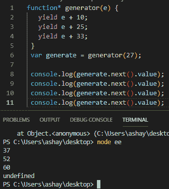
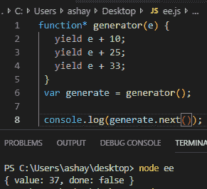
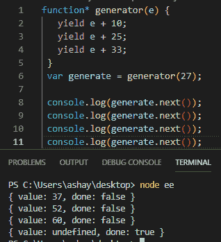
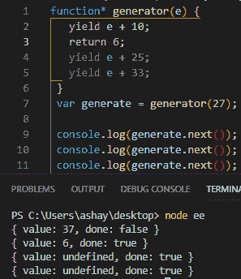
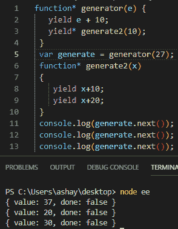
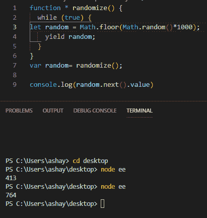
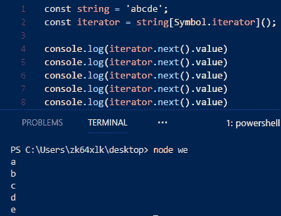
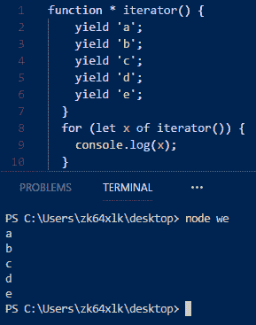
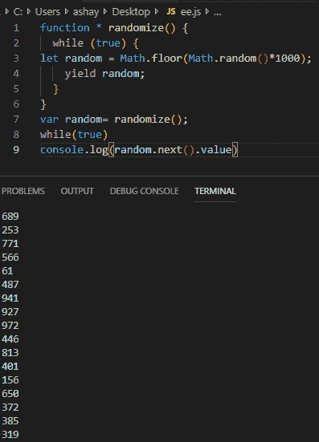

# 屈服！屈服！JavaScript 中生成器的工作方式。

> 原文：<https://www.freecodecamp.org/news/yield-yield-how-generators-work-in-javascript-3086742684fc/>

作者阿莎·曼德瓦娅？️?？

# 屈服！屈服！JavaScript 中生成器的工作方式。


Photo by [Frederik Trovatten.com](https://unsplash.com/@trovatten?utm_source=medium&utm_medium=referral) on [Unsplash](https://unsplash.com?utm_source=medium&utm_medium=referral)

如果标题没有给出提示，我们将在这篇文章中讨论生成器。

在进入生成器之前，让我们复习一些关于函数的基础知识。

*   在 JavaScript 中，函数是一组执行任务并返回某个值以结束函数的语句。
*   如果你一次又一次地调用一个函数，它会一次又一次地执行所有的语句。
*   箭一旦离开弓就无法停止——它们要么命中，要么错过。同样，一个函数一旦被调用就不能停止，它将运行，返回值，抛出一个错误，然后在执行完所有语句后停止。

我们只需要记住这 3 点就可以理解生成器。

### 发电机

生成器是一种特殊类型的函数，它可以中途停止执行，然后在一段时间后从同一点启动。生成器是函数和迭代器的组合。这是一个有点混乱的声明，但我会确保在文章结束时，这一行将是清晰的。

为了清楚起见，考虑玩一个游戏，突然妈妈要求做一些工作。你暂停游戏，帮助她，然后重新开始游戏。发电机也是如此。

> 一个**迭代器**是一个对象，它定义了一个序列，并可能在序列终止时返回一个值。— MDN。

迭代器本身是一个巨大的话题，不是本文的目的。

#### 基本语法

生成器被定义为在函数旁边带有星号(*)的函数。

```
function* name(arguments) {   statements}
```

**名称—** 功能名称。

**参数—** 函数的参数。

**语句—** 函数体。

#### 返回

一个函数几乎可以返回任何东西，从一个值、对象或另一个函数本身。生成器函数返回一个称为生成器对象的特殊对象(*不完全正确*)。该对象看起来像下面的代码片段

```
{   value: value,  done: true|false}
```

该对象有两个属性`value` 和`done`。该值包含要被**产生的值。** Done 由一个**布尔(真|假)**组成，它告诉发生器是否**。next()** 将产生一个值或者**未定义。**

上面的说法会很难消化。让我们用一个例子来改变它。



```
function* generator(e) {  yield e + 10;  yield e + 25;  yield e + 33;}var generate = generator(27);
```

```
console.log(generate.next().value); // 37console.log(generate.next().value); // 52console.log(generate.next().value); // 60console.log(generate.next().value); // undefined
```

让我们一行一行地理解上面代码的机制。

***第 1–5 行:*** 第 1–5 行定义了与自变量 e 同名的生成器，在函数体内部，包含了一串带有关键字 yield 的语句，之后进行一些操作。

***第 6 行:*** 第 6 行将生成器赋给一个名为 generate 的变量。

***第 8–11 行:*** 这些行调用一串`console.log`，每个调用链接到一个`next` 方法的生成器，该方法调用生成器对象的`value`属性。



每当调用生成器函数时，与普通函数不同，它不会立即开始执行。相反，一个迭代器被返回(*实际原因*被一个生成器使用。它告诉 JS 将要返回一个迭代器对象*。当迭代器的`next()`方法被调用时，生成器的执行开始并执行，直到找到第一条`yield` 语句。在这一点上，返回生成器对象，其规范已经解释过了。再次调用`next()`函数将恢复生成器功能，直到找到另一个`yield` 语句，循环返回，直到所有的`yields` 用完。



在这一点之后，如果调用`next` ,它返回带有未定义值的生成器对象。

现在让我们尝试从原始生成器生成另一个生成器函数和一个 return 语句。



生成器中的`return`语句将使生成器像其他函数一样完成它的执行。生成器对象的`done property` 将被设置为`true` ，返回的`value` 将被设置为生成器对象的`value` 属性。所有其他的`yields` 将返回`undefined`。

如果抛出一个错误，那么生成器的执行也会停止，生成一个生成器本身。



对于`yielding` 一个生成器，我们需要针对`yield` 指定一个*来告诉 JS 一个生成器被生成了。`[yield*](https://developer.mozilla.org/en-US/docs/Web/JavaScript/Reference/Operators/yield*)`委托给另一个生成器函数——这就是为什么我们可以使用原始生成器函数的`generate.next()`来`yield` 所有`generator2` 函数的值。第一个值`yielded`来自第一个生成器函数，后两个值`yielded` 由生成器函数生成，而`yielded` 由原始生成器生成。

#### 优势

**惰性加载**

惰性加载本质上是一种价值评估，只在有需要的时候才进行。正如我们将在接下来的例子中看到的，我们实际上可以用生成器来实现。我们可能只在需要的时候产生值，而不是同时产生。

下面的例子来自本文中的另一个例子，它生成无限个随机数。这里我们可以看到，我们可以调用任意多的 `next()`,但并不能得到它产生的所有值。只有需要的人。



```
function * randomize() {  while (true) {let random = Math.floor(Math.random()*1000);    yield random;  }}
```

```
var random= randomize();
```

```
console.log(random.next().value)
```

**内存高效**

从上面的例子中我们可以推断出，生成器的内存效率极高。因为我们只根据需要获取这些值，所以我们需要很少的存储空间来存储这些值。

#### 陷阱

发电机非常有用，但也有自己的缺陷。

*   生成器不像数组和其他数据结构那样提供随机访问。由于这些值是在调用时一个接一个产生的，所以我们不能访问随机元素。
*   **发电机提供一次性接入。**生成器不允许你反复迭代值。一旦所有的值都用完了，我们必须创建一个新的生成器实例来再次迭代所有的值。

#### 为什么我们需要发电机？

生成器在 JavaScript 中提供了各种各样的用途。让我们试着再造一些我们自己。

**实现迭代器**

> 迭代器是一个对象，它使程序员能够遍历一个容器——维基百科

我们将使用迭代器打印一个字符串中的所有单词。字符串也是迭代器。

**迭代器**



```
const string = 'abcde';const iterator = string[Symbol.iterator]();console.log(iterator.next().value)console.log(iterator.next().value)console.log(iterator.next().value)console.log(iterator.next().value)console.log(iterator.next().value)
```

使用发电机也是一样



```
function * iterator() {yield 'a';yield 'b';yield 'c';yield 'd';yield 'e';}for (let x of iterator()) {console.log(x);}
```

比较这两种方法，很容易看出，在生成器的帮助下，我们可以做到更少的混乱。我知道这不是一个很好的例子，但足以证明以下几点:

*   `next()`没有实现
*   没有`[Symbol.iterator]()`调用
*   在某些情况下，我们甚至需要使用迭代器将`object.done`属性的返回值设置为 true/false。

#### 异步等待~承诺+生成器

如果你想了解 Async/Await，你可以阅读我的[前一篇](https://medium.com/@ashaymurceilago/async-await-javascript-5038668ec6eb)文章，并查看[这篇](https://medium.com/javascript-in-plain-english/truly-understanding-promises-in-javascript-cb31ee487860)的承诺。

粗略地说，Async/Await 只是与 Promises 一起使用的生成器的一个实现。

异步等待

```
async function async-await(){let a=await(task1);console.log(a);
```

```
let b=await(task2);console.log(b);
```

```
let c=await(task3);console.log(c);
```

```
}
```

承诺+发电机

```
function * generator-promise(){let a=yield Promise1();console.log(a);let b=yield Promise1();console.log(b);let c=yield Promise1();console.log(c);
```

```
}
```

正如我们所看到的，两者产生了相同的结果，而且方式也几乎相似。这是因为 Async/Await 机制松散地基于生成器和 promise 的组合。Async/Await 比上面显示的要多得多，但是为了展示生成器的使用，我们可以考虑这样做。

#### 无限数据结构

这个标题可能有点误导，但它是真实的。我们可以使用 while 循环来创建生成器，这个循环永远不会结束，并且总是会产生一个值。



```
function * randomize() {  while (true) {let random = Math.floor(Math.random()*1000);    yield random;  }}var random= randomize();while(true)console.log(random.next().value)
```

在上面的代码片段中，我们创建了一个无限生成器，它将在每次`next()` 调用时产生一个随机数。可以称之为随机数的无限流。这是一个很基本的例子。

### 结论

关于生成器还有很多内容要介绍，这只是对这个主题的介绍。希望你学到了新的东西，这篇文章很容易理解。

跟着我鼓掌！

