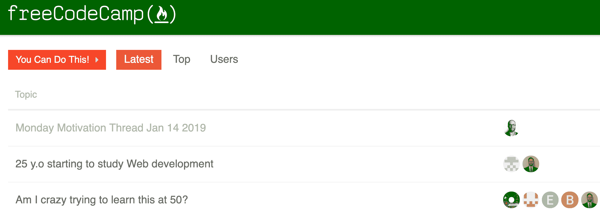

# 介绍:你可以这样做！在您的编码之旅中获得支持的新地方

> 原文：<https://www.freecodecamp.org/news/you-can-do-this/>

学习编码很难。任何人告诉你，否则可能是试图卖给你一些东西。

我们的每一次编码之旅都有点不同。但是我们所有人都面临挑战，以及随之而来的情绪起伏。

好消息是，还有数百万人也在学习编程。我们可以互相帮助，在整个过程中保持动力。

你能做到的！是 freeCodeCamp 论坛上的一个新地方，在这里你可以分享你的胜利、挫折和激励。

我们都在一起。我们可以互相帮助，共同前进。[从这里开始](https://www.freecodecamp.org/forum/c/motivation)。

记住:你能做到！