# 如何在 VS 代码中打开任何回购而不克隆它

> 原文：<https://www.freecodecamp.org/news/you-can-now-edit-anything-on-github-in-vs-code-without-cloning/>

你现在可以用官方的[远程仓库扩展](https://marketplace.visualstudio.com/items?itemName=GitHub.remotehub&WT.mc_id=devcloud-18509-cxa)直接从 VS 代码打开 GitHub 上的任何东西(你可以访问的)。

我指的是直接的*。这意味着没有克隆。不下载。不要看着你的开发文件夹，想知道你到底为什么以这种方式组织你的项目，OMG 这么多遗憾。*

*听着，没事的。没有人对他们如何搞乱他们曾经原始的开发环境感到满意。在我的“c:\dev”文件夹里有整整一季的《囤积者》,不，我不会删除那个 jQuery 项目。也许有一天我会需要它。*

*让我们看看 VS 代码的新的远程存储库扩展如何让你随意地与 GitHub 上的任何项目交互，而不必克隆任何东西。*

## *如何安装远程存储库扩展*

*首先，您需要为 Visual Studio 代码安装 GitHub 的[远程存储库扩展](https://marketplace.visualstudio.com/items?itemName=GitHub.remotehub&WT.mc_id=devcloud-18509-cxa)。*

*[Remote Repositories - Visual Studio MarketplaceExtension for Visual Studio Code - Remotely browse and edit a GitHub repository](https://marketplace.visualstudio.com/items?itemName=GitHub.remotehub&WT.mc_id=devcloud-18509-cxa)*

*要打开一个 GitHub repo，点击 VS 代码左下角的绿色指示器。*

*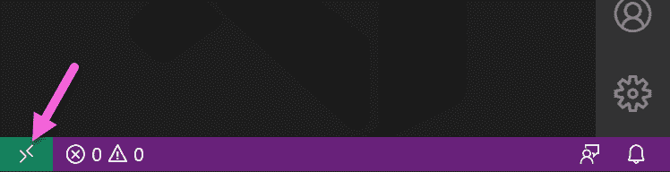*

*您将看到一个新选项“打开远程存储库”。*

*如果你安装了其他 VS 代码的远程扩展，你会在这个列表中看到更多的选项，所以只需搜索正确的选项。*

*如果用鼠标点击东西太麻烦，你也可以从命令面板进入这个选项。我看见你们这些维姆人。*

*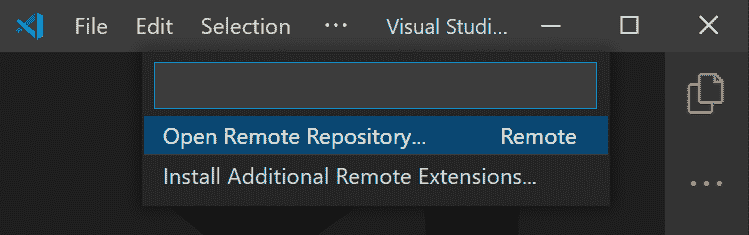*

*你可以粘贴 GitHub repo 的 URL，如果你碰巧把它放在你的剪贴板上(很奇怪)，或者你可以通过选择“从 GitHub 打开存储库”来浏览 GitHub。第三个选项让您打开一个拉请求分支，这样您就可以~~假装~~彻底地检查它。*

*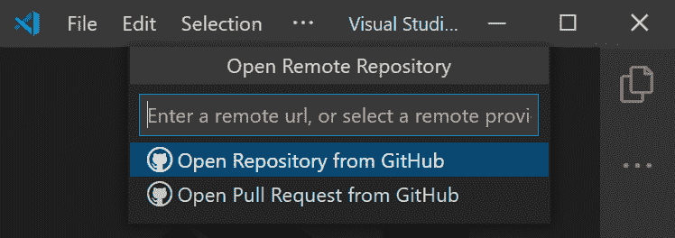*

*VS 代码将会重新打开，您将会看到这个库，就像您在本地使用它一样。但你不是。你正在 GitHub *上*通过*VS 代码的窗口查看它。**

*您会注意到关于“某些功能”不可用以及您处于“受限模式”的免责声明。*

*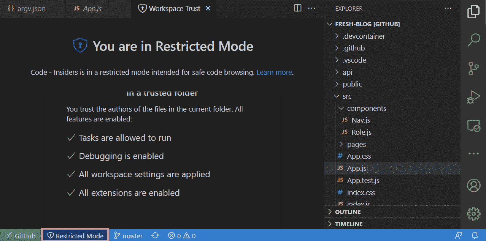*

*这是 VS 代码中新的可信工作区设置的一部分。*

*[Visual Studio Code Workspace Trust securityVisual Studio Code Workspace Trust folder securityVisual Studio Code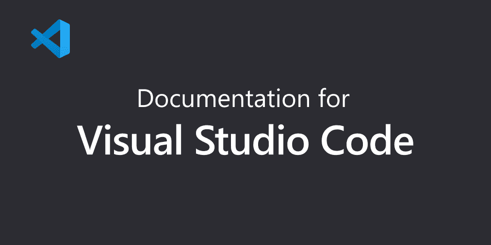](https://code.visualstudio.com/docs/editor/workspace-trust?WT.mc_id=devcloud-30876-buhollan)*

*默认情况下，VS 代码现在关闭任务、调试、一些工作区设置和任何可能在你第一次打开文件夹时尝试和执行某些东西的扩展。你必须告诉 VS 代码，它很酷，你知道并信任这个代码，你 100%确定它不会[关闭你的石油管道](https://www.nytimes.com/2021/05/08/us/politics/cyberattack-colonial-pipeline.html)。*

*好了，可怕的安全警告被解除了，我们在这里能做什么呢？*

## *如何使用远程存储库*

*你有完全的编辑能力，最大的不同是你不需要保存任何东西。您所做的更改会随着您的操作而保存。*

*他们并不会自动地对 GitHub 负责。为了将更改保存到 repo 中，您必须从源代码控制视图中提交它们。*

*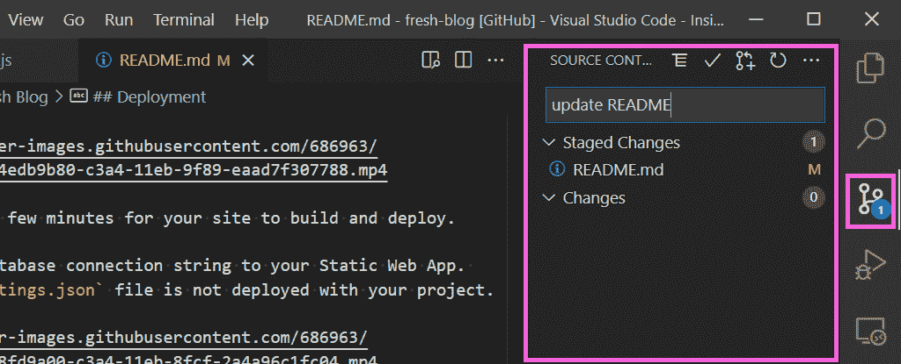*

*你不用推他们，因为你已经在 GitHub 上了。提交就是提交，不需要推送。这和你直接在 GitHub 上编辑文件是一样的。因为你本质上就是。*

*就编辑而言，您会在 VS 代码中得到很多您期望的东西。*

*特定语言的智能感知有效。例如，如果你开始写一个`fetch`，VS 代码会帮助你，因为它知道`fetch`。*

*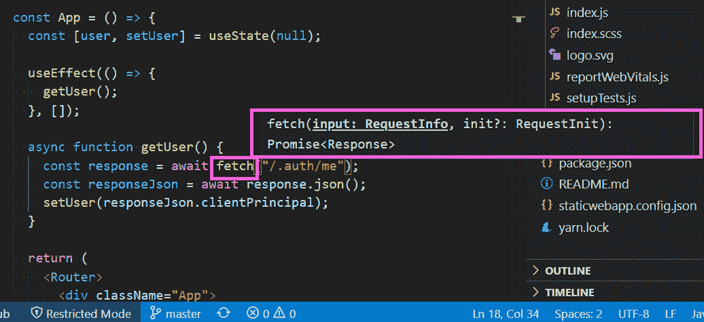*

*但是，当 VS 代码在本地运行您的项目时，您无法获得 VS 代码在项目文件上提供的智能感知。*

*例如——在本地，VS 代码知道来自`react`导入的`useEffect`。它知道这一点，因为它正在检查作为节点模块的导入。*

*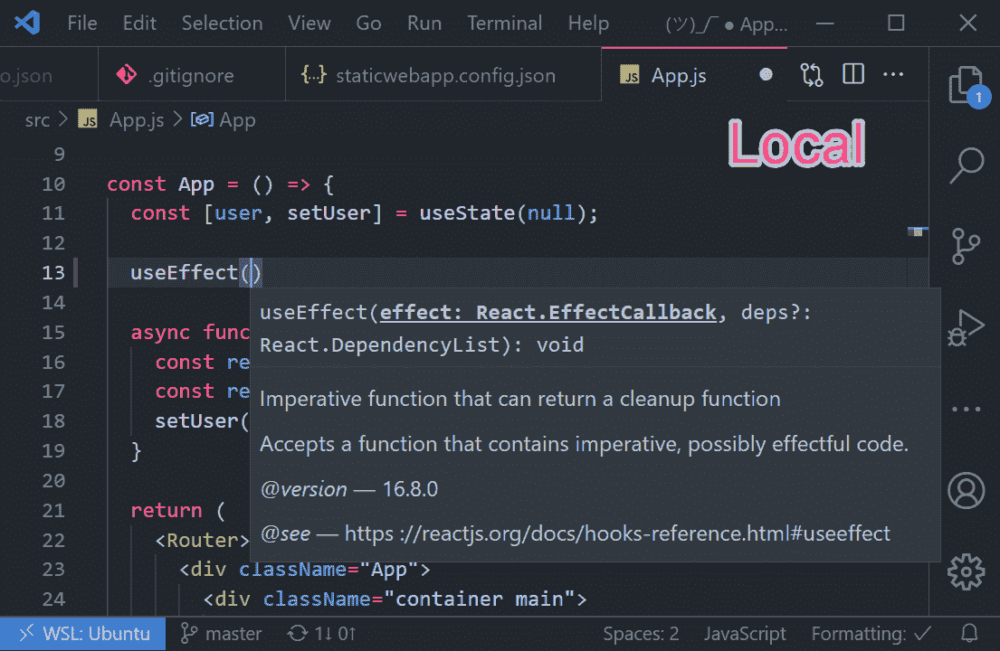*

*但是对于远程存储库，我们直接查看 GitHub，node_modules 文件夹永远不会被推送到 GitHub，除非你是 10 年前的我。所以对于`useEffect`没有智能感知，因为该代码实际上并不存在于回购中。*

*你可以使用像 Emmet 这样的东西来编写 HTML，你会得到很好的分屏降价预览，你可能会像我一样喜欢。*

*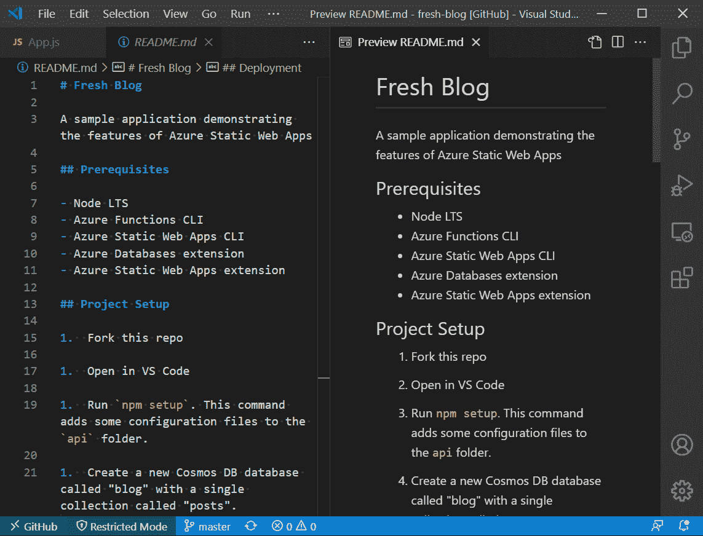*

*您也可以使用“查找”和“在文件中查找”。*

*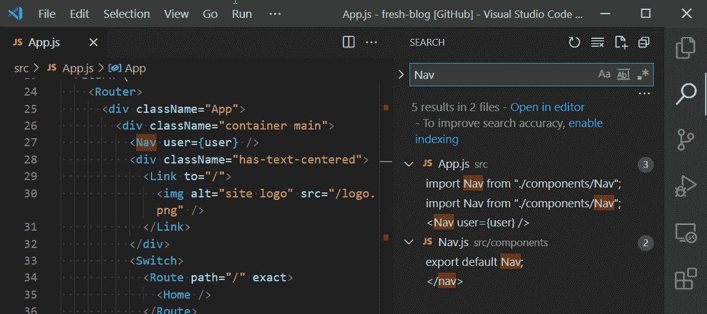*

*当直接连接到 GitHub 上的项目时，许多在本地工作的东西都以同样的方式工作，但有些却不是。这是任何人在互联网上写过的最模糊的东西，但是理解这一切是如何工作的将会对你可以合理预期的东西有所启发。*

## *它是如何工作的*

*VS 代码有一个[文件系统提供者 API](https://github.com/microsoft/vscode/blob/dc8bd9cd7e5231745549ac6218266c63271f48cd/src/vs/vscode.d.ts#L7038) ，它已经存在一段时间了。这个 API 所做的是提供一种机制来消费 API，就像它是一个物理文件一样。在这种情况下，远程存储库扩展使用并映射 GitHub API 到 VS 代码中的“虚拟工作区”。*

*这意味着任何试图处理物理文件的扩展都不会工作**，直到** **扩展作者更新他们的扩展以使用虚拟文件系统 API** 。这意味着随着扩展的更新，今天不工作的东西将来可能会工作。*

*那么你能指望什么工作呢？主题、按键绑定、代码片段和语法扩展。这些类型的扩展通常不执行任何代码，所以你知道它们不试图与文件一起工作，这意味着假设它们将在远程存储库中工作是安全的(互联网安全)。*

*但是有些事情永远不会成功，因为你需要本地文件访问来完成它们。*

*一个最好的例子是更漂亮。漂亮是一个 CLI 工具，改变你的代码重新格式化你的本地文件。由于没有本地文件访问，它目前不能与远程存储库一起工作。所以没有人会自动把双引号改成单引号，或者把分号放回去。或者移除它。我想摆脱这一段。*

*事实上，你根本不能*运行*一个远程存储库项目。如果您在连接到远程存储库时打开终端，它将会出现在那里。但是它不能访问这个项目。*

*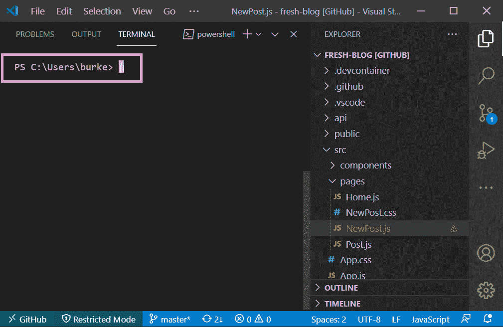*

*这是合法的，因为项目实际上并不存在于您的机器上。那么，如果您发现您确实想运行您正在处理的代码，或者只是想将您的编辑体验升级到完整的 VS 代码，您如何获得一个终端呢？*

## *如何切换到完整的 VS 代码*

> *“继续我任性的儿子”——[70 年代的某个乐队](https://www.youtube.com/watch?v=2X_2IdybTV0)*

*如果你现在点击状态栏左下角绿色的“GitHub ”,你会看到一个“继续工作”的选项。*

*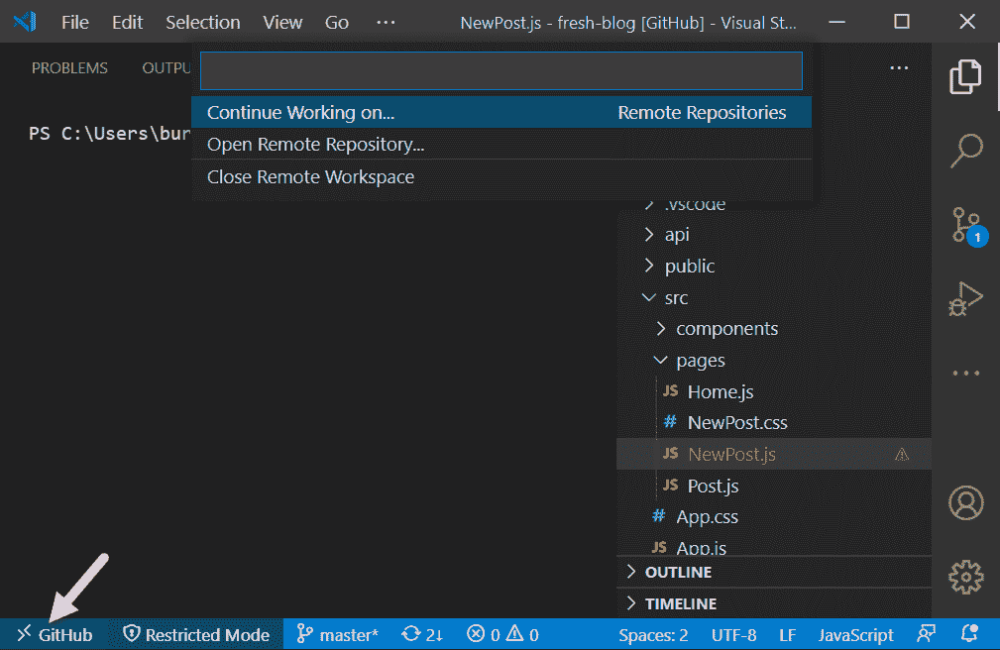*

*该选项将允许您在本地克隆项目，或者在 GitHub 代码空间中打开它。*

*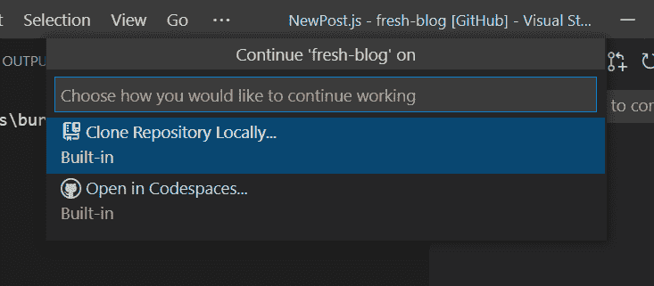*

*如果你在 Codespaces Beta ( *[请求访问这里](https://github.com/features/codespaces)* ，你可以在 Codespace 中打开回购。这是在浏览器中运行的 VS 代码，但是由计算环境支持，在计算环境中，您可以像在桌面上一样运行任何东西。这是可行的，因为 VS 代码最初被设计成一个 web 应用程序。真实的故事。*

*或者在本地克隆！打开那个`c:\Users\you\Documents\GitHub`文件夹，你后悔选择将所有项目放入其中，因为现在你的“Documents”文件夹正在备份到 OneDrive，其中有 900 的 node_modules。现在已经有 920 了。*

*

Credit: Some brilliant soul. Please comment and take credit for this work of genius.* 

## *酷毙了。但是为什么呢？*

*你现在应该问自己的自然问题是，“非常酷！但是我为什么需要这个？”*

*问得好。你很感性，人们喜欢你。*

*考虑以下场景...*

*   ***你想浏览一个 GitHub repo，看看代码。** GitHub 是一个很棒的网站，但它不是快速浏览文件和检查项目的最佳方式。你真的需要一个编辑器，远程存储库只需查看代码，就可以省去繁琐且通常占用大量带宽的克隆步骤。*
*   *你想要快速更新。虽然您几乎总是在本地进行繁重的编码工作，但您可能希望在不同步本地环境的情况下，突然进入一个 repo 并进行快速更改。README 的想法，但这可能是任何一种小的变化。*
*   *你正在做减价工作。如果您正在 GitHub 中处理文档、README 或其他 Markdown，那么不再需要在本地克隆 repo 来完成这些工作。除非你运行一个本地服务器来预览降价，否则使用内置的预览是一个更快的方式来敲打你的 API 的 5K 字。*
*   *你想查看一份简历。似乎不言自明。*****

## *变得更加遥远*

*现在您已经有了远程存储库，您可以清理 dev 文件夹了。只需点击右键，删除一些东西。看到那感觉有多好了吗？*

*远程存储库是用 VS 代码进行“远程”开发的几种方法之一。查看这些选项，使用 VS 代码连接几乎任何东西。*

*   *[开发容器](https://code.visualstudio.com/docs/remote/containers?WT.mc_id=devcloud-30876-buhollan)——使用 Docker 容器作为全功能开发环境*
*   *[远程 SSH](https://code.visualstudio.com/docs/remote/ssh?WT.mc_id=devcloud-30876-buhollan)——通过 SSH 连接在任何远程机器上打开 VS 代码中的远程文件夹*
*   *[远程 WSL](https://code.visualstudio.com/docs/remote/wsl?WT.mc_id=devcloud-30876-buhollan)——在 VS 代码中使用你的 WSL 作为全职后台运行时环境。*