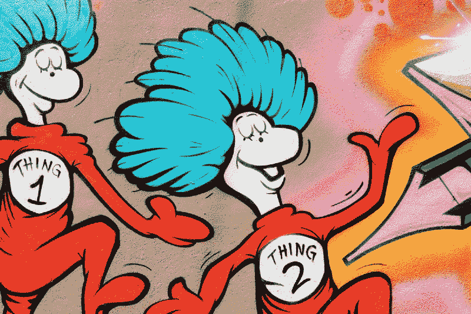

# 你不需要聊天机器人创建工具——让我们从头开始构建一个信使机器人

> 原文：<https://www.freecodecamp.org/news/you-dont-needs-chatbot-creation-tools-let-s-build-a-messenger-bot-from-scratch-8fcbb40f073b/>

有很多很多聊天机器人创建工具。套用苏斯博士的话，有些是好的，有些是悲伤的，有些是非常非常糟糕的。我知道，我已经[复习过](https://chatbottech.io/)一堆了。

但是如果你想自己写一个，从零开始，不使用任何花哨的工具呢？这可能吗？你能做些有用的东西吗？答案是肯定的，因为我已经做到了，我要告诉你怎么做。

所有的代码都可以在 Github 上的[这里](https://github.com/daoudclarke/chatbot-from-scratch)找到。我们将为 Facebook Messenger 创建一个机器人，我们将使用谷歌应用引擎来托管我们的机器人，这将是用 Python 编写的。



I happen to know a thing or two about chatbots. Photo by [Scott Webb](https://unsplash.com/photos/KesWZ9GyJ5k?utm_source=unsplash&utm_medium=referral&utm_content=creditCopyText) on [Unsplash](https://unsplash.com/search/photos/dr-seuss?utm_source=unsplash&utm_medium=referral&utm_content=creditCopyText).

但是等等，你为什么要这么做？使用图形用户界面来制作你的机器人要容易得多。嗯，这里有几个原因:

*   它是免费的。App Engine 的[免费等级](https://cloud.google.com/free/docs/always-free-usage-limits#gae_name)非常慷慨，你不太可能超过它，除非你有成千上万的机器人用户——在这种情况下，你会笑的。
*   去学习。看看构建聊天机器人到底需要什么。
*   超越聊天机器人创建工具所能做的。感觉野心勃勃？做一些完全原创的东西，或者让你的[拥有](http://daoudclarke.github.io/chatbots/2018/02/06/manifesto-for-a-new-chatbot-platform)聊天机器人平台。

### 选择聊天机器人频道

你可以为许多不同的渠道建立一个机器人。其中最受欢迎的是 Facebook Messenger、Kik、Slack、Twitter 和 Telegram。如果你需要支持几个平台，你最好使用 bot 框架。这样，您就不必编写代码来集成您想要支持的所有平台。

在本文中，我们将为 Facebook Messenger 构建一个聊天机器人。为什么？首先，它是聊天机器人最受欢迎的平台。几乎所有构建聊天机器人的工具都以 Messenger 为目标，其中相当多的工具*只*支持 Messenger。理由很充分:2017 年，它拥有 12 亿月活跃用户。这是很多潜在的聊天机器人用户。

我们想瞄准 Messenger 还有一个原因:快速回复。这些按钮是聊天机器人可以提供给用户的快捷方式，这样他们就不用打字了。它们不仅让你的机器人更有吸引力(谁喜欢在手机上打字？)，但是它们也让你作为聊天机器人开发者的工作变得更加容易。

如果你给用户提供按钮，他们会按这些按钮。这意味着您不必担心解析来自用户的任意查询，这些用户想知道明天是否会下雨或者他们在哪里可以买到披萨。引导用户对他们和我们都有好处。

### 机器人能做什么？


None shall pass. Well, mostly none. Photo by [Jeremy Dorrough](https://unsplash.com/photos/wdtF-f4qBdU?utm_source=unsplash&utm_medium=referral&utm_content=creditCopyText) on [Unsplash](https://unsplash.com/search/photos/visa?utm_source=unsplash&utm_medium=referral&utm_content=creditCopyText)

你的机器人需要一个目标。它不能做所有的事情。我的朋友 Naré Vardanyan 和我设计了一个机器人，帮助人们在英国签证申请的浑水中航行。在本文中，我们将使用该机器人的简化版本作为示例。

### 树遍历魔法


Not this kind of tree. Photo by [Adarsh Kummur](https://unsplash.com/photos/zThTy8rPPsY?utm_source=unsplash&utm_medium=referral&utm_content=creditCopyText) on [Unsplash](https://unsplash.com/search/photos/tree?utm_source=unsplash&utm_medium=referral&utm_content=creditCopyText).

我们将使用基于 [**树**](https://en.wikipedia.org/wiki/Tree_(data_structure)) 的机器人设计方法。树的每个节点代表一种可能的对话状态。节点的每个子节点对应于一个可能的用户消息，我们认为该消息与这个特定状态相关。

```
say: "What is the purpose of your visit? (options: travel, study, business/work, medical treatment, join family/get married, visit child at school, diplomatic/government visit)"
answers:
  travel:
    say: You need a Standard Visitor Visa
  study:
    say: How long are you going to stay in the UK? up to 6 months; more than 6 months
    answers:
      up to 6 months:
        say: You can apply for a Short-term Study Visa
      more than 6 months:
        say: You need a Study Visa (Tier 4)
  business/work:
    say: How long are you going to stay in the UK? up to 6 months; more than 6 months
    answers:
      up to 6 months:
        say: You need a Standard Visitor Visa
      more than 6 months:
        say: Are you an 1\. entrepreneur 2.investor 3\. leader in arts or sciences 4\. none of the above
        answers:
          '1':
            say: You can apply for a Tier 1 Entrepreneur
          '2':
            say: You can apply for Tier 1 Investor
          '3':
            say: You can apply for Tier 1 (Exceptional Talent)
          '4':
            say: Are you offered  1\. a skilled job 2\. role in the UK branch of your employer 3\. job in a religious community 4\. job as an elite sportsman or coach
            answers:
              '1':
                say: You can apply for a Tier 2 (General) visa
              '2':
                say: You can apply for a Tier 2 (Intra-company transfer)
              '3':
                say: Tier 2 (Minister of Religion)
              '4':
                say: Tier 2 (Sportsperson)
  medical treatment:
    say: You need a Standard Visitor Visa
  join family/get married:
    say: You need a Family of a settled person visa if your family/partner are settled in the UK or a 'dependant' visa of their visa category if they are working or studying
  visiting a child:
    say: You need a Parent visa if you're visiting for over 6 months and a Standard Visitor visa if your visit is  for less than 6 months
  diplomatic or government visit:
    say: You can apply for exempt vignette (exempt from immigration control)
```

这是我们的签证咨询机器人的简化版本，以树形结构显示。它是 YAML(另一种标记语言)格式，这使得它易于阅读。根节点指定机器人发送给用户的第一条消息，在本例中，询问用户“您访问的目的是什么？”子节点(在“答案”下指定)包含我们将接受的可能答案，即“旅行”、“学习”、“业务/工作”等等。

### 入门指南

为了创建我们的机器人，我们需要在脸书设置一些东西。官方的[说明在这里](https://developers.facebook.com/docs/messenger-platform/getting-started/app-setup)，但是总的来说，你需要:

*   一个脸书页面——每个机器人需要一个不同的脸书页面。
*   允许您创建应用程序的开发人员帐户。
*   一个脸书应用程序获得一个秘密访问令牌，这将是以后需要的。

脸书机器人与 **webhooks** 一起工作，webhooks 只是 Facebook Messenger 用来与你的机器人交互的 URL。

为了创建我们的 webhook，我们将使用[谷歌应用引擎](https://cloud.google.com/appengine/)。这样做的好处是，低流量时它是免费的，当你获得更多流量时，它会自动扩展。对于本文，我使用了 Python，但是也可以使用许多其他语言。你需要[下载 Python SDK](https://cloud.google.com/appengine/docs/standard/python/download) ，如果你还没有的话[创建一个谷歌云项目](https://console.cloud.google.com/project)。

### 创建我们的 webhook


Hooked? Photo by [Fabien Bazanegue](https://unsplash.com/photos/TRggaD8mHJ4?utm_source=unsplash&utm_medium=referral&utm_content=creditCopyText) on [Unsplash](https://unsplash.com/search/photos/hook?utm_source=unsplash&utm_medium=referral&utm_content=creditCopyText).

我们的网络钩子要做的第一件事是让脸书验证我们确实是正确的网络钩子。我们通过处理包含“验证令牌”的 GET 请求来做到这一点这是我们与脸书分享的秘密随机字符串。我们的这部分代码基于优秀的 Facebook Messenger Bot [库](https://github.com/hartleybrody/fb-messenger-bot)。

```
class MainPage(webapp2.RequestHandler):
    def __init__(self, request=None, response=None):
        super(MainPage, self).__init__(request, response)
        logging.info("Initialising with new bot.")
        self.bot = TreeBot(send_message, UserEventsDao(), TREE)

    def get(self):
        self.response.headers['Content-Type'] = 'text/plain'
        mode = self.request.get("hub.mode")
        if mode == "subscribe":
            challenge = self.request.get("hub.challenge")
            verify_token = self.request.get("hub.verify_token")
            if verify_token == VERIFY_TOKEN:
                self.response.write(challenge)
        else:
            self.response.write("Ok")
```

这里我们首先初始化一个类来处理 [webapp2 框架](https://webapp2.readthedocs.io/en/latest/)中的请求。我们首先记录一条消息，说明机器人正在初始化，然后构造将处理所有机器人逻辑的类`TreeBot`，这将在下面讨论。

接下来，我们检查来自脸书的“订阅”请求，并检查请求中发送的验证令牌是否与我们与脸书共享的秘密令牌相同。

### 处理来自用户的消息

接下来，我们需要解释来自用户的消息，这些消息是由脸书使用 POST 请求发送到我们的 webhook 的。

```
 def post(self):
        data = json.loads(self.request.body)
        logging.info("Got data: %r", data)

        if data["object"] == "page":

            for entry in data["entry"]:
                for messaging_event in entry["messaging"]:
                    sender_id = messaging_event["sender"]["id"]

                    if messaging_event.get("message"):
                        message = messaging_event['message']
                        if message.get('is_echo'):
                            logging.info("Ignoring echo event: " + message.get('text', ''))
                            continue
                        message_text = messaging_event['message'].get('text', '')
                        logging.info("Got a message: %s", message_text)
                        self.bot.handle(sender_id, message_text)

                    if messaging_event.get("postback"):
                        payload = messaging_event['postback']['payload']
                        self.bot.handle(sender_id, payload)
                        logging.info("Post-back")
```

在这里，我们首先解析来自脸书的 JSON 数据，并记录下来以帮助调试。然后我们迭代数据中的消息事件。首先，我们提取发件人 ID，我们需要用它来向用户发送回复。有两种类型的事件，消息(用户键入的)和“回发”事件，它们在用户单击快速回复按钮时发送。

对于第一个问题，我们需要忽略“回声”事件。然后，我们提取消息文本，并将其发送给我们的 bot 逻辑进行处理。我们对回发事件做同样的事情，提取有效负载，在我们的例子中，它只是按钮的文本。

### 向用户发送消息


Messages from users don’t come in bottles. Photo by [Scott Van Hoy](https://unsplash.com/photos/ssoJQfH7Acw?utm_source=unsplash&utm_medium=referral&utm_content=creditCopyText) on [Unsplash](https://unsplash.com/search/photos/message-in-a-bottle?utm_source=unsplash&utm_medium=referral&utm_content=creditCopyText).

当我们构造我们的`TreeBot`类时，我们传递了一个函数`send_message`,它允许机器人逻辑向用户发送返回消息。这是:

```
def send_message(recipient_id, message_text, possible_answers):
    logging.info("Sending message to %r: %s", recipient_id, message_text)
    headers = {
        "Content-Type": "application/json"
    }
    message = get_postback_buttons_message(message_text, possible_answers)
    if message is None:
        message = {"text": message_text}

    raw_data = {
        "recipient": {
            "id": recipient_id
        },
        "message": message
    }
    data = json.dumps(raw_data)
    r = urlfetch.fetch("https://graph.facebook.com/v2.6/me/messages?access_token=%s" % ACCESS_TOKEN,
                       method=urlfetch.POST, headers=headers, payload=data)
    if r.status_code != 200:
        logging.error("Error sending message: %r", r.status_code)

def get_postback_buttons_message(message_text, possible_answers):
    if possible_answers is not None and len(possible_answers) <= 3:
        buttons = []
        for answer in possible_answers:
            if len(answer) > 20:
                return None
            buttons.append({
                "type": "postback",
                "title": answer,
                "payload": answer,
            })
        return {
            "attachment": {
                "type":"template",
                "payload": {
                    "template_type": "button",
                    "text": message_text,
                    "buttons": buttons,
                }
            }
        }
    return None
```

收件人 ID 将是我们之前提取的发件人 ID。除此之外，我们还有消息文本，以及一些供用户按下的快速回复按钮。我们首先确保请求头将我们的内容指定为 JSON，然后构造消息的回发按钮部分。我们指定收件人 ID 和消息文本，并转换成 JSON。我们向脸书图形 API 发出请求，传递脸书在我们创建应用程序时给我们的秘密访问令牌。

### 运行 bot 服务器

这个文件中的最后一段代码只是构造了主类并运行它:

```
app = webapp2.WSGIApplication([
    ('/', MainPage),
], debug=True)
```

### 机器人大脑


Not a brain, but looks like one. Photo by [Vlad Tchompalov](https://unsplash.com/photos/ZEpxoNzKfcc?utm_source=unsplash&utm_medium=referral&utm_content=creditCopyText) on [Unsplash](https://unsplash.com/search/photos/brain?utm_source=unsplash&utm_medium=referral&utm_content=creditCopyText).

现在我们进入有趣的部分:机器人如何知道说什么？机器人的大脑在文件`bot.py`里。

```
class TreeBot(object):
    def __init__(self, send_callback, users_dao, tree):
        self.send_callback = send_callback
        self.users_dao = users_dao
        self.tree = tree

    def handle(self, user, message):
        self.users_dao.add_user_event(user, 'received', message)
        history = self.users_dao.get_user_events(user)
        tree = self.tree
        logging.debug("History items: %d", len(history))
        restarting = False
        nothing_sent = True
        response = DEFAULT
        possible_answers = DEFAULT_POSSIBLE_ANSWERS
        for direction, content in history:
            response = DEFAULT
            possible_answers = DEFAULT_POSSIBLE_ANSWERS
            if direction == 'received':
                key = get_content_match(content, tree)
                if nothing_sent:
                    response = tree['say']
                    possible_answers = tree['answers'].keys()
                elif key is not None:
                    tree = tree[key]
                    if 'say' in tree:
                        response = tree['say']
                        possible_answers = None
                        if 'answers' in tree:
                            possible_answers = tree['answers'].keys()
                    restarting = False
                elif restarting:
                    if content == 'yes':
                        tree = self.tree
                        response = tree['say']
                        possible_answers = tree['answers'].keys()
                        restarting = False
            elif direction == 'sent':
                nothing_sent = False
                if 'answers' in tree and direction == 'sent' and content == tree.get('say'):
                    tree = tree['answers']
                elif direction == 'sent' and content == DEFAULT:
                    restarting = True
            else:
                raise ValueError("Unexpected direction: " + direction)

        logging.debug("Responding: %s", response)

        self.send_callback(user, response, possible_answers)
        self.users_dao.add_user_event(user, 'sent', response)
```

该类用三个参数初始化:

*   将消息发送回用户的回调函数(如上所述)
*   用于存储用户信息的数据访问对象
*   包含何时应该说什么的逻辑的树。这是从我们上面展示的 YAML 解析而来的。

首先，我们记录收到了用户的消息，然后从数据访问对象中检索用户过去的所有操作。然后，我们重放用户的动作，找出他们当前在树中的位置。

我们初始化对默认消息的响应，当用户说一些我们不理解的话时，将返回该消息。在我们的例子中，这是“对不起，我没听懂，我们重新开始好吗？”还有一些默认的可能答案，分别是“是”和“不是”。我们也会记录下我们是否认为我们是在从头开始对话。

然后我们开始迭代用户的历史。对于每条消息，我们检查它是否是由我们发送的，或者我们是否是从用户那里收到的。如果收到了，我们检查树中的当前选项是否匹配。这使用了以下函数:

```
def get_content_match(content, tree):
    matches = []
    for key in sorted(tree):
        if content.lower() in key.lower():
            matches.append(key)
    if len(matches) == 1:
        return matches[0]
```

这将检查用户消息的内容，以查看它是否作为树中某个当前选项的子字符串出现。如果只有一个匹配，我们就返回那个匹配，否则要么用户的响应不明确，要么根本没有匹配。

接下来，我们检查之前是否向用户发送过任何东西。如果不是，我们将我们的响应设置为树中的第一个响应，并将可能的答案设置为树中的第一个集合。

然后，我们检查是否找到了用户消息的匹配。如果是的话，我们将树更新为适当的子分支，并从树中提取正确的响应和可能的答案。

然后我们检查我们是否已经建议重启，以及用户是否已经确认他们确实想要重启对话。在这种情况下，我们将树重置回其初始状态，并像以前一样使用第一个响应。

对于历史中由机器人发送的每条消息，我们相应地更新树。或者，如果我们发送了默认消息，请记录我们可能会重新开始对话。

最后，在遍历完所有历史之后，我们记录我们的响应，将消息发送回用户，并将我们发送的消息记录在我们的数据访问对象中。

### 拼图的最后一块


Writing a chatbot is easier than doing this puzzle. Photo by [Hans-Peter Gauster](https://unsplash.com/photos/3y1zF4hIPCg?utm_source=unsplash&utm_medium=referral&utm_content=creditCopyText) on [Unsplash](https://unsplash.com/search/photos/puzzle?utm_source=unsplash&utm_medium=referral&utm_content=creditCopyText).

剩下要讨论的唯一一段代码是存储所有用户交互的数据访问对象。我们做出了存储所有用户动作并像上面那样重放它们的设计决定，因为它允许我们容易地改变机器人的逻辑，并且仍然能够为机器人和用户推断出适当的状态。如果我们选择标记树的每个节点并存储该标记，那么对树的任何更改都会使旧的对话无效。

因此，我们的数据访问对象需要能够做两件事:存储一个新的用户事件，并检索特定用户的所有事件。

```
class UserEvent(ndb.Model):
    user = ndb.StringProperty()
    direction = ndb.StringProperty()
    message = ndb.StringProperty()
    date = ndb.DateTimeProperty(auto_now_add=True)

class UserEventsDao(object):
    def add_user_event(self, user, direction, message):
        event = UserEvent()
        event.user = user
        event.direction = direction
        event.message = message
        logging.info("Adding event: %r", event)
        event.put()

    def get_user_events(self, user):
        events = UserEvent.query(UserEvent.user == user)
        sorted_events = sorted(events, key=lambda x: x.date)
        return [(event.direction, event.message) for event in sorted_events]
```

我们的数据访问对象利用了 [Google Datastore](https://cloud.google.com/datastore/docs/concepts/overview) ，它很容易从 App Engine 中使用，并且有一个慷慨的免费使用层。Python API 使得使用数据存储变得非常容易。首先我们创建一个模型类，`UserEvent`,它指定了字段及其类型。在我们的例子中，用户 ID、消息的方向和消息本身都是字符串，最后事件的日期是日期-时间类型。

为了创建和存储一个新的用户事件，我们简单地构造这个类，设置属性，然后在对象上调用`put()`。

为了检索用户的事件，我们调用该类的`query()`函数，传入用户 ID。然后，我们按日期对事件进行排序，并返回方向消息对的列表。

### 部署

那是我们机器人的所有部分！现在部署它，并连接到信使。

要将您的应用部署到 App Engine，请使用 App Engine SDK 附带的`gcloud`命令:

```
gcloud app deploy --project [YOUR_PROJECT_ID]
```

部署完成后，你的 webhook 的 URL 是

```
http://[YOUR_PROJECT_ID].appspot.com/
```

使用此 webhook URL 更新您的脸书应用程序(按照此处的说明)您应该可以开始了！

### 世界是你的聊天机器人牡蛎


Oysters are tasty but chatbots are fun. Photo by [Charlotte Coneybeer](https://unsplash.com/photos/p4-LAfM9yAg?utm_source=unsplash&utm_medium=referral&utm_content=creditCopyText) on [Unsplash](https://unsplash.com/search/photos/oyster?utm_source=unsplash&utm_medium=referral&utm_content=creditCopyText).

使用这些技术，你可以制作多种聊天机器人。我曾经很喜欢制作一个 [*选择你自己的冒险*](https://en.wikipedia.org/wiki/Choose_Your_Own_Adventure) 风格的机器人，但我相信你能想出更多有创意的东西。哦，如果你想试试 visa bot，你可以试试这里的(虽然这个版本更复杂一点)。

而且，如果你不喜欢所有这些艰苦的工作，你可以尝试众多聊天机器人创建工具中的一个。