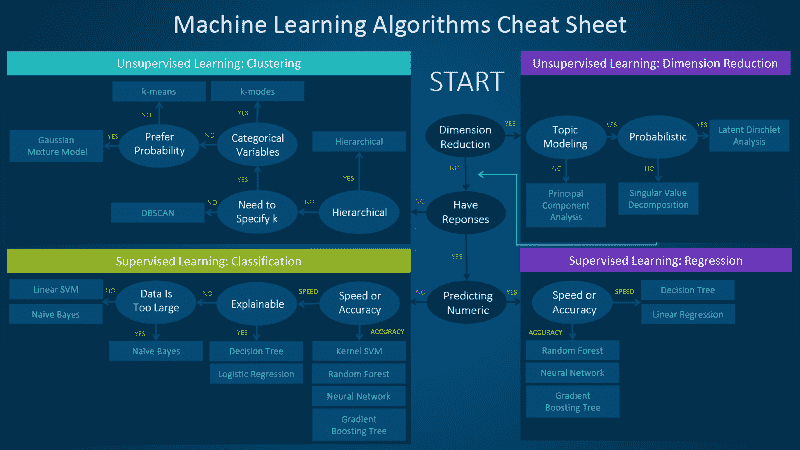
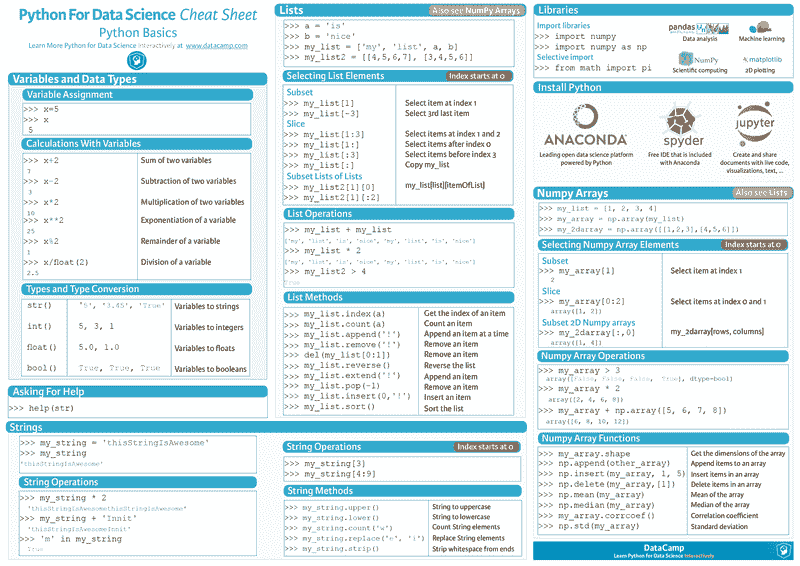
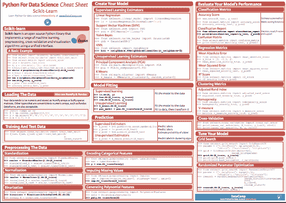
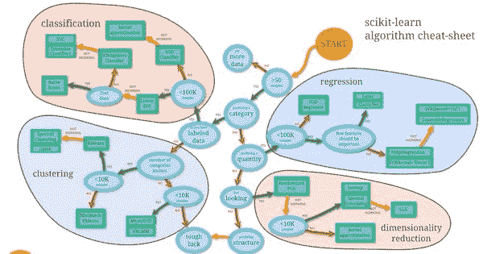

# 如果你在处理机器学习算法，你需要这些备忘单。

> 原文：<https://www.freecodecamp.org/news/you-need-these-cheat-sheets-if-youre-tackling-machine-learning-algorithms-45da5743888e/>

作者 Shubhi Asthana

# 如果你在研究机器学习算法，你需要这些备忘单。

当我两年前开始学习机器学习(ML)时，我有许多关于使用哪些算法、如何将其与数据集相关联等问题。答案取决于许多因素，如数据大小、预期输出和可用的计算资源。然后我接触了 ML 备忘单，它让我熟悉了常用的算法、软件包和函数。

这篇文章包含了我推荐给对识别和应用 ML 算法解决不同问题感兴趣的初学者的前三个备忘单。考虑到这个领域发展的速度，趋势算法也在进步。因此，理解有助于适应监督和非监督学习、分类和回归等领域的算法是很重要的。

### **SAS 算法流程图**

来源:[https://blogs . SAS . com/content/潜意识音乐/2017/04/12/machine-learning-algorithm-use/](https://blogs.sas.com/content/subconsciousmusings/2017/04/12/machine-learning-algorithm-use/)

SAS 博客本身是一个很好的读物。该链接显示了如何使用备忘单以及选择算法时的注意事项。备忘单显示了将数据与算法相关联的易于使用的流程图。

### **Python 和 Scikit 备忘单**

大多数开发人员使用 Python 或 R 语言来实现 ML 算法。我使用 Python，所以下面的两个备忘单对我非常有用。

来源:[https://S3 . Amazon AWS . com/assets . data camp . com/blog _ assets/python fordatascience . pdf](https://s3.amazonaws.com/assets.datacamp.com/blog_assets/PythonForDataScience.pdf)

Python 备忘单是由 DataCamp 编写的，可以作为快速参考来指导 ML Python 包和数据结构。

来源:[https://S3 . Amazon AWS . com/assets . data camp . com/blog _ assets/Scikit _ Learn _ Cheat _ Sheet _ python . pdf](https://s3.amazonaws.com/assets.datacamp.com/blog_assets/Scikit_Learn_Cheat_Sheet_Python.pdf)

Scikit-learn 是一个开源 Python 库，它实现了各种各样的 ML、数据预处理、交叉验证以及算法可视化。这个库是每个有抱负的数据科学家必须知道的，所以我强烈推荐这个备忘单。

### **用户友好的机器学习地图**

来源:[http://sci kit-learn . org/stable/tutorial/machine _ learning _ map/](http://scikit-learn.org/stable/tutorial/machine_learning_map/)

这个备忘单可以在 scikit-learn 教程中找到，并且是最容易理解和使用的流程图之一。在上面的链接中，你可以看到解决一个 ML 问题的完整流程，你也可以点击地图上的任何算法来了解它的实现。

分享和学习！请在下面的评论中添加你最喜欢的小抄。