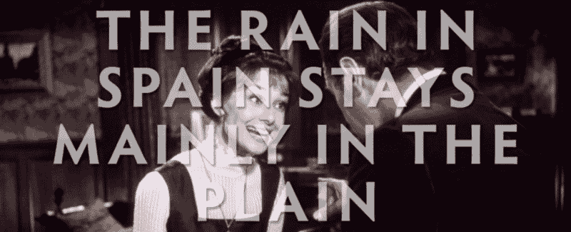
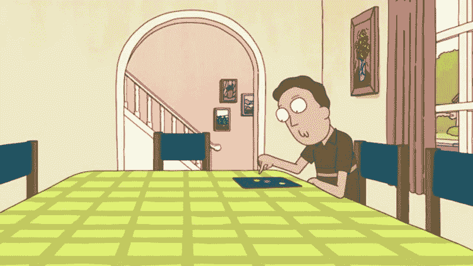

# 你说错了

> 原文：<https://www.freecodecamp.org/news/you-re-saying-it-wrong-359e4634268/>

作者丹·麦克亨利

# 你说错了

#### 因为我的意见是最好的意见

在过去的几个月里，当我专注于 JavaScript 来提高我的 web 开发技能时，我在脑海中对其他人如何发音进行了一场无声的战争。

好了，这是我最后的宣言，我不会支持任何异议，也不会向明智的论点或受人尊敬的权威人士提出上诉。

*   var 和 bear 押韵，不是 bar

var bear = true, bar = false;

*   tuts 和 boots 押韵，不是 butts
*   JSON 听起来像 Jason，不是 Khe Sanh

Okay, let’s parse this …

*   在 regex/regexp 中，reg 与 leg 押韵，而不是 ledge
*   以-ify 结尾的名字是有意无意地不恰当的。他们不遵循正常的重音规则(即，不喜欢拟人化的人)。Browserify 是 BROWSer-ify，不是 BROWSer-ZER-ify。JSONify 是杰森-ify，不是杰伊-SAHN-ify
*   jQuery 就像是“嘿，Siri”，而不是“嘿，Jerry”

Hey, Jerry: get a job!

*   favicon 是一个“fave icon”，听起来不像“have a naan”(但不要介意我这样做)
*   SQL 和它的衍生词更酷，发音为“sequel ”,而不是“ess queue el”

我知道打破这些习惯可能很难，但改变是可能发生的。几十年来，在两次激烈的战斗中，我站在了错误的一方，最终我拥有了一台 Mac 电脑，并把 gif 发成了一个软 g。

你也可以！