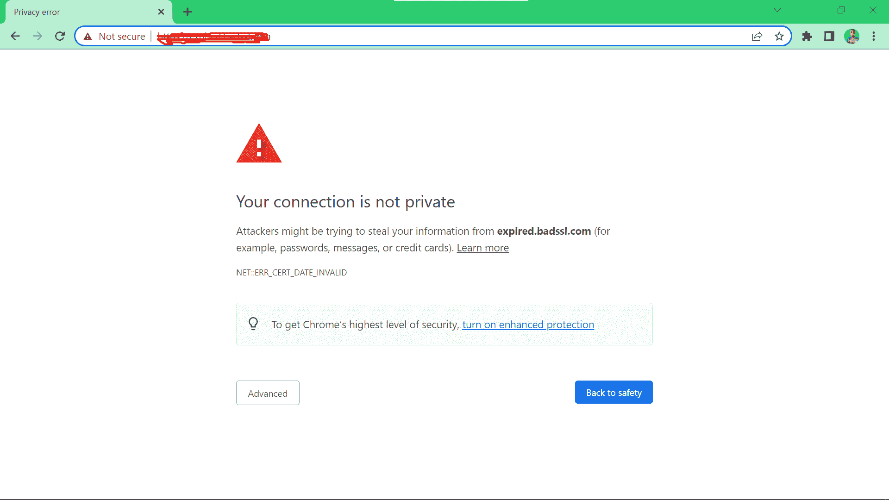
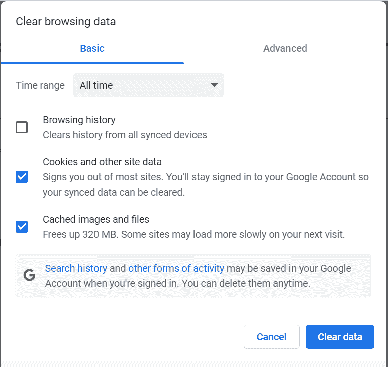
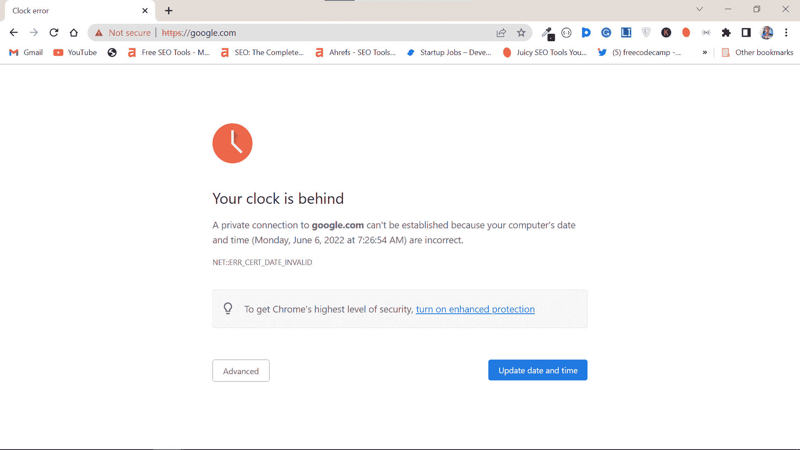
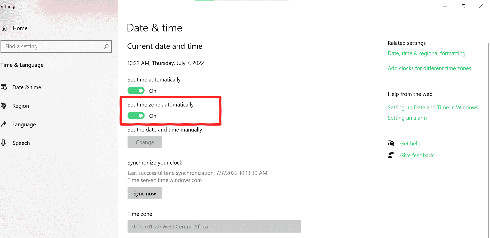

# 你的连接不是私人错误-如何在 Chrome 中修复

> 原文：<https://www.freecodecamp.org/news/your-connection-is-not-private-error-how-to-fix-in-chrome/>

如果您登录到一个网站，而您的浏览器显示“您的连接不是私人的”错误，浏览器试图警告您远离该网站。

在这种情况下，浏览器对 SSL(安全套接字层)证书进行了检查，并发现了一个问题——SSL 可能已经过期或者根本没有安装。

在某些情况下，问题可能是因为您的浏览器，而不是网站。因此，在本文中，我将向您展示如何修复 Chrome 浏览器上的“您的连接不是私人的”错误。

## 我们将涵盖的内容

*   [如何修复 Chrome 浏览器上的“你的连接不是私人的”错误](#howtofixtheyourconnectionisnotprivateerroronachromebrowser)
*   [重新加载网页](#reloadthewebpage)
*   [清除 Chrome 的缓存](#clearchromescache)
*   [确定您电脑的日期和时间是正确的](#makesureyourcomputersdateandtimearecorrect)
*   [禁用您的防病毒软件和 VPN](#disableyourantivirusandvpn)
*   [最终想法](#finalthoughts)

## 如何修复 Chrome 浏览器上的“你的连接不是私人的”错误

### 重新加载网页

我建议你做的第一件事是重新加载页面。

如果网页出现问题，重新加载网页是每个人都会尝试的老把戏。

此外，网站上有可能正在进行与 SSL 相关的工作，所以如果您等待一段时间并重新加载页面，问题可能会消失。

如果重新加载不能解决问题，请继续本文中的其他解决方案。

### 清除 Chrome 的缓存

Chrome 浏览器缓存中的网站 SSL 数据可能已经过期。因此，如果您清除缓存，错误可能会消失。

按照以下步骤清除您的 Chrome 浏览器缓存:

**第一步**:点击右上角的 3 个竖点，选择设置:
T3

**第二步**:点击左侧栏的“隐私与安全”标签，选择“清除浏览数据”:

**第三步**:选择缓存和 Cookies，然后点击“清除数据”:

### 确定您电脑的日期和时间是正确的

如果你的电脑时钟落后或超前，你的浏览器会显示“你的连接不安全”的错误。

最近，Chrome 中的错误信息变得更加准确:

在这种情况下，您应该将您的日期和时间设置为正确的日期和时间，并使其自动进行，这样就没有任何东西会重新调整它:

### 禁用您的防病毒和 VPN

一些具有 SSL 扫描功能的防病毒程序可以让您的浏览器显示“您的连接不是私人的”错误，如果它们检测到网站的 SSL 证书有任何异常。

同理，VPN(虚拟专用网)会隐藏你的 IP 地址和其他信息。问题是 VPN 给你的隐私可能对一些网站的 SSL 有负面影响。

因此，您应该考虑禁用您的防病毒和 VPN 程序，至少暂时禁用，看看是否可以修复错误。

## 最后的想法

其他可能消除“您的连接不是私有的”错误的修复包括:

*   试图以匿名模式访问网页。在 Chrome 中，你可以通过按`CTRL` + `SHIFT` + `N`来打开一个匿名标签。
*   重启路由器
*   重新启动计算机
*   更新您的操作系统

如果所有的修复都失败了，问题可能出在网站上。这意味着网站的 SSL 证书有问题。因此，请尝试联系网站管理员。

如果你找不到管理员联系，你应该远离这个网站，并确保你不与该网站共享敏感信息。

如果你是一个网站管理员，你的用户抱怨这个错误，我写了一篇关于如何恢复你的网站 SSL 的文章。