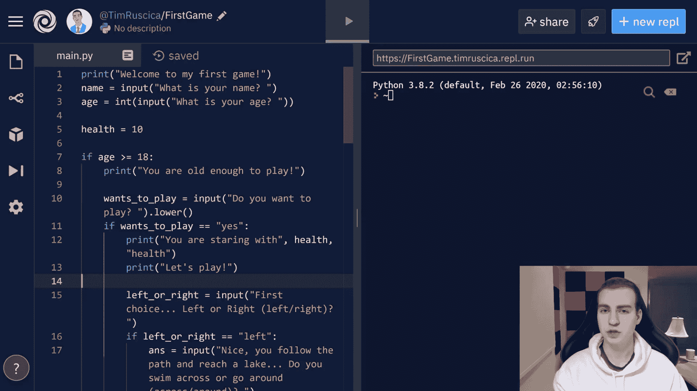

# 在这个免费的课程中建立你的第一个 Python 项目:一个基于文本的冒险游戏

> 原文：<https://www.freecodecamp.org/news/your-first-python-project/>

有大量的 Python 项目教程。但是他们几乎都期望你在开始教程之前有一定的 Python 知识水平。

如果你是 Python 的完全初学者，并且想要构建你的第一个项目，我们已经在 freeCodeCamp.org YouTube 频道为你发布了[完美教程](https://www.youtube.com/watch?v=_ZqAVck-WeM)。

在这篇来自 Tech With Tim 的教程中，你将学习从零开始构建一个简单的游戏，即使你以前从未使用过 Python。通过这个初级 Python 项目，您将学习 Python 的基础和原理，并应用这些技能。

本教程旨在让您尽快上手并运行 Python。您将学习一些最流行的 Python 命令和概念，包括:

*   打印
*   if/else 和其他条件逻辑
*   嵌套 if/else 语句
*   输入捕获
*   类型转换
*   还有更多。

你将学会在你的浏览器中完成这一切，这样你就不必安装任何软件。

在[freeCodeCamp.org YouTube 频道](https://www.youtube.com/watch?v=_ZqAVck-WeM)观看全部课程(1 小时观看)。