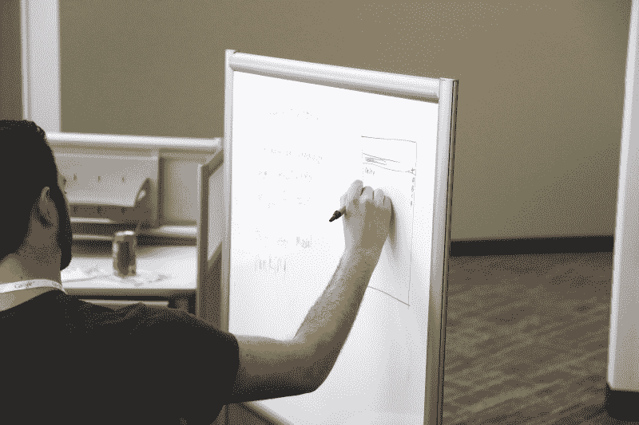

# 从 Scrum Master 到工程副总裁:为什么职称很重要

> 原文：<https://www.freecodecamp.org/news/your-job-title-matters-more-than-you-think-c34a0156b8ef/>

马可·马森齐奥

# 从 Scrum Master 到工程副总裁:为什么职称很重要

当协商一份新工作时，许多公司会带着一定程度的圆滑来对待职称问题。他们似乎在说，“我们在这里是如此的酷和时髦，而你是如此的棒。我们愿意做任何事来得到你。”

这一切看起来都很棒。给每个人听起来印象深刻的标题！直到现实开始侵入。

在过去的 20 年里，我一直是谷歌的高级工程经理。我在几家初创公司担任过工程副总裁，在另外几家公司担任过工程总监。我现在是苹果公司的高级架构师。

因此，在过去的十年里，我直接为各种规模的团队雇佣了 100 多名不同技术职能、不同资历的员工。

此外，我对是否让高管加入董事会有决定性的影响。

我可以肯定地告诉你一件事:你的职位很重要。很多。

#### 名字里有什么

现实是头衔和责任紧密交织在一起。虽然它们显然会因公司而异，因行业而异，但它们为你将被要求达到(或者，理想情况下，超越)的期望奠定了基础。他们决定了领导会要求你承担什么样的工作，以及他们不会考虑让你做什么样的工作。

承担一个不符合你期望的角色，或者大大超出你目前的能力，往往比谈判错误的薪水更糟糕:薪水通常可以这样或那样固定下来，没有太多大惊小怪(因为你的薪水只有少数人知道)。

你的职位非常公开，任何人都知道。除此之外，被“降级”的文化耻辱，以及与职称相关的错误实际上是无法修复的。

#### 背景

当我女儿 5、6 岁的时候，她问了我一个最甜蜜的问题:“但是，爸爸，你是做什么工作的？”

那时，我正在经营自己的公司(在 2002 年开发了 Waze 的同类产品！)我还是一家咨询公司的管理合伙人，该公司是我共同创办的，我们为公司提供与规划、融资和部署多用途无线网络相关的技术策略建议。这不太符合她在学校读到的角色:消防员、教师或水管工，而我不是。

许多年后，我不得不问自己同一个问题的另一种形式。我刚刚以“高级工程师”的身份加入了一家当时发展迅速的旧金山初创公司，当时我明白(但这是我的致命错误，不是书面协议)，一旦我掌握了他们技术的基本原理，熟悉了团队，他们就会提拔我为工程总监。

然后现实闯入了我被告知的那个伟大的故事，他们反而提升我为工程经理——这实际上更像是一个 scrum 大师的角色，对团队的方向没有真正的权威。

不用说，这个故事的结局并不好。

为了帮助其他人避免同样的命运，下面我将概述通常与这些职位相关的角色和职责:

*   工程经理
*   工程总监
*   工程副总裁
*   生产部经理
*   敏捷教练

我曾经担任过所有这些角色，并且雇佣和管理过这些角色中的人。根据我的经验，让我们深入了解一下这些职责应该包括哪些内容。

### 一个 Scrum 大师…

*   支持 Scrum 团队管理当前敏捷跟踪系统(如吉拉、拉力赛、Pivotal)中的各种任务、故事和错误。
*   可能兼任发布经理，确保给定发布的所有关键特性都得到分配和跟踪。
*   确保沟通顺畅，尤其是针对阻碍因素和时间敏感问题。
*   在光谱的一端，正如其他人所说，可能只是一个“荣耀的管理员”另一方面，他们可能是工程团队中非常有成就的成员，帮助推动事情向前发展。

#### 主要日常任务:

跟踪和管理吉拉问题，并确保它们是最新的。

#### 时间范围:

很有策略。最多 1-2 次冲刺。

### 产品经理…

*   充分了解产品特性、市场定位(包括客户群需求和竞争对手的战略立场)以及未来方向(即路线图)。
*   全权负责功能的相对优先级及其时间关键性。
*   在产品开发领域协调不同销售和客户团队的需求。
*   协调不同的工程团队和依赖关系(咨询)。
*   正如有人所说，它是“销售和工程之间的桥梁”

#### 主要日常任务:

管理路线图，冲刺规划和管理，整理积压。

#### 时间范围:

从战术(冲刺)到战略(多达几个版本，6-12 个月路线图)。

### 一名工程经理…

*   管理不同资历和专业水平的其他工程师。
*   对产品(领域)有深入的技术理解。
*   负责工程团队的福利、他们的职业发展和成长，是对他们的工作满意度负责的第一人。
*   处理细粒度的资源管理(通常在个人级别)。
*   进行招聘和解雇(或者，更广义地说，[绩效管理](https://en.wikipedia.org/wiki/Performance_management))。
*   主要与团队中的工程师，以及其他工程经理、产品经理和 Scrum 高手互动。
*   正如我曾经说过的:“团队的人肉盾牌”

#### 主要日常任务:

与其他工程师交谈，确保拦截器得到处理。工程经理也花费大量时间编码。

#### 时间范围:

从战术(从来没有沉闷的一天！)到季刊(工程师绩效管理)。

### 一个工程总监…

*   管理工程经理(可能还有 QA 经理、产品经理和发布经理)。
*   从整体上对产品有很好的技术理解。
*   具有产品架构知识，并且知道各种团队的互动如何影响它。
*   确保跨团队和跨职能部门(如销售、产品、QA)的协调。
*   监督端到端的发布管理流程(包括测试、QA 和操作)。
*   可能有部分(或全部)这些职能也向他们报告(取决于产品、团队或组织的规模/复杂性)。
*   负责工程实践和流程的交付。
*   让经理负起责任，并确保他们继续职业发展。

#### 主要日常任务:

主要是会议:确保工程组织的所有部分都以最高效率工作，确保跨职能的完整性和效率。

一些技术工作，通常是在架构层面。

#### 时间范围

中期战略—通常是几个季度。

### 工程副总裁…

*   拥有工程愿景、实践和流程。
*   必须对产品及其如何与其他技术/产品相适应(竞争、互补和支持)有良好的架构理解。
*   可能实际上拥有产品架构，并积极参与其初始和开发。
*   负责参与产品交付过程的所有领域:开发、质量保证/QE、测试、发布管理。根据组织的不同，也可能拥有产品和运营(基础架构)。
*   主要关注长期产品愿景和客户/市场需求。
*   与其他副总裁(以及首席技术官/首席执行官)密切合作，确保整个组织完全符合愿景和战略。
*   确保工程组织的所有部分以最佳生产率和效率运行。
*   就产品交付而言，它们是“责任停止的地方”

#### 主要日常任务:

会议——与其他副总裁、客户和高管会面。

#### 时间范围

战略性—从几个季度到几年。

我希望这篇文章能让你对软件工程中丰富的管理者生态系统有一个更好的了解。我也希望它能让你更加明白准确的职位名称的重要性。认真对待他们！

感谢阅读！

*最初发布于[codetrips.com](https://codetrips.com/2015/06/12/engineering-roles-responsibilities/)2015 年 6 月 12 日。*