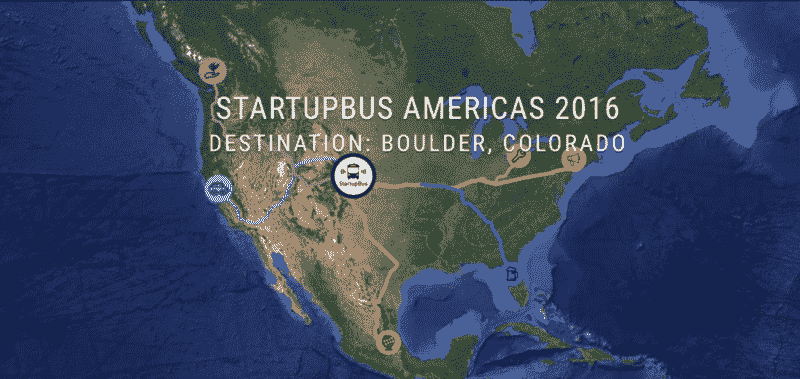
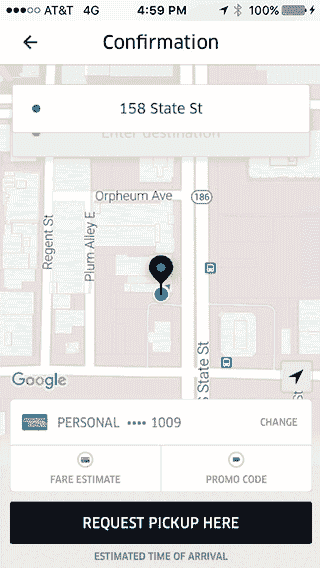

# 你已经为你的第一次黑客马拉松做好了准备

> 原文：<https://www.freecodecamp.org/news/youre-already-ready-for-your-first-hackathon-b585aca54b93/>

坐科林渡轮

# 你已经为你的第一次黑客马拉松做好了准备

我一直认为黑客马拉松是一项技术性很强的活动，进门就意味着对所有类型的编程都有很深的了解。

尽管我对这些压力室创意竞赛很好奇，但我一直认为我的技能组合——一个几乎没有任何编码经验的万金油组合——不会给黑客马拉松团队增加多少价值。

“黑客马拉松羞耻”只是我最近决定使用免费代码营[自学编码](https://medium.freecodecamp.com/how-long-does-free-code-camp-take-f986202346ef#.b2bc3kgpf)的一个原因。他们的前端开发课程极具挑战性，但社区帮助我保持了完成课程所需的动力。

几个月后，我觉得自己终于跨越了误解之谷，它介于基本 HTML 标签和高级 JavaScript 算法之间。

这个过程给了我足够的信心，让我最终尝试了一次黑客马拉松——我应该早点这么做的。

我在最后一刻提交了一份申请，要求搭乘从旧金山开往科罗拉多州博尔德的 StartupBus。总共有六辆巴士，每辆载着几十名参与者，他们组成团队，试图在 72 小时内创建一家初创公司。在行驶的公交车上，网络不可靠，每隔几个小时就有现场产品推介。

是啊，我们都没怎么睡觉。

事实证明，构建一个技术产品需要的不仅仅是强大的开发人员。我们的五人团队包括三名非技术人员。

在过去的 48 小时里，我们一直在构建和迭代一款名为 [Tub](http://www.fillthetub.com) 的产品。

Tub 通过 Pocket、Instapaper、YouTube 的“稍后观看”功能、Chrome 插件、Twitter 等工具与“以后保存”的内容相集成。我们的研究表明，很多人会把内容保存起来以后再欣赏，但是他们中的大多数人从来没有抽出时间来欣赏。

我们相信有时间去消费你想要的内容。问题是你的时间是碎片化的。

通过与技术挂钩——比如优步新的 triexperiences API——Tub 的聊天机器人会根据你的心情和你有多少时间来提供内容。一个这样的时间片段是当你等待一辆优步来接你的时候。

Tub Mockup Using Uber API

我们还在使用思科的 Tropo API 为那些想用 Tub 来回发短信的用户构建短信发送功能。

有了自由代码营，我构建出了触及各种 API 的 JavaScript 应用程序，比如 OpenWeatherMap、Twitch 和 Wikipedia。所以我已经有了构建 API 集成的经验。

我很兴奋地得知优步和思科正在赞助 StartupBus，并为那些将他们的 API 整合到他们的产品创意中的团队提供工程支持。

希望这个故事会有更多，但现在，旧金山创业巴士已经进入博尔德。我们在拉斯维加斯和盐湖城向现场观众推销 Tub。明天早上，我们将向 TechStars 推介，看看我们如何应对竞争对手。

不要淹没在内容的海洋中——到浴缸里来吧！我们在[脸书](https://www.facebook.com/intothetub/)和[推特](https://twitter.com/fillthetub)上，你可以在【www.FillTheTub.com】T4 注册 beta 访问？

新产品和服务需要黑客、骗子、设计师和经理来进入这个世界。

去参加你所在地区的黑客马拉松吧。很有可能你已经准备好承受压力，把一个项目变成现实。你只是还不知道而已。