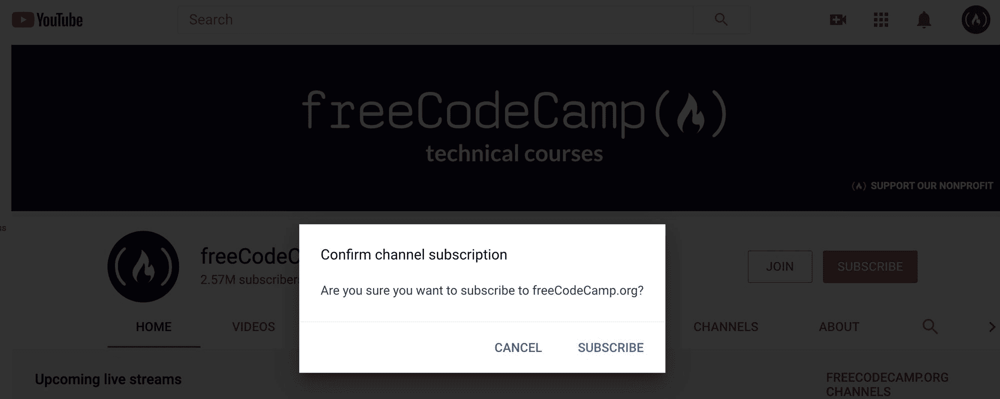
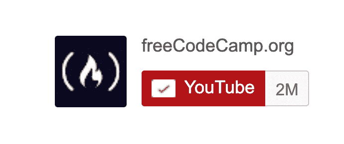
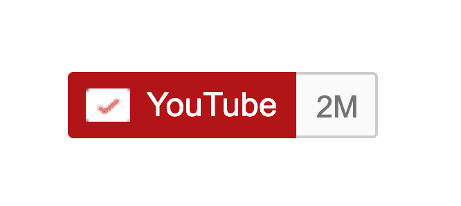

# YouTube 订阅按钮:如何让人们通过链接订阅你的频道

> 原文：<https://www.freecodecamp.org/news/youtube-subscribe-button-link/>

你知道吗，当人们访问你的频道时，你可以提示他们订阅。

对于在笔记本电脑或台式电脑上单击该链接的人来说，这看起来是这样的:



YouTube will show a Confirm channel subscription message.

不要担心，如果有人点击此链接时已经是您的频道的订户，他们将像平常一样看到您的频道，而没有订阅确认消息。

## 让人们直接订阅你的 YouTube 频道的两种方法

有两种主要方法可以让人们直接订阅你的频道:

1.  您可以在任何地方使用的 YouTube 订阅链接，包括社交媒体网站和消息工具。
2.  一个 YouTube 订阅按钮，您可以在任何可以嵌入 JavaScript 的地方使用，比如您的个人网站。

## 如何制作自己的 YouTube 订阅链接

YouTube 有一个功能，你可以在你的 YouTube 频道 URL 中添加`?sub_confirmation=1`参数。

同样，这非常适合从社交媒体或其他地方链接到您的 YouTube 频道，在这些地方您无法为正确的订阅按钮插入代码。

YouTube 上有两种类型的频道:

1.  渠道渠道
2.  用户渠道

实际上，这些类型的渠道之间没有太大的区别。它们只是使用了稍微不同的 URL 结构。

### 如果您的 YouTube 频道被归类为频道，如何创建订阅链接

您可以通过访问您的频道并查看地址栏中是否有“频道”一词来判断您的频道是否使用了“频道”结构。

这里有一个例子:

```
https://www.youtube.com/channel/freecodecamp
```

看到这里的“渠道”这个词了吗？因此，在这种情况下，您可以对链接使用这种结构:

```
https://www.youtube.com/channel/<YOUR CHANNEL ID>?sub_confirmation=1
```

你只需用你的频道 ID 替换这个 URL 中的`<YOUR CHANNEL ID>`,你可以去你的 YouTube 频道找到它。

它可以是一个自定义名称(在本例中为`freecodecamp`)，也可以是一个 base-64 字符串，如下所示:`UC0syIz79dzjMXIf5VdJ65EA`

将您的频道 ID 添加到该链接后，您就可以开始了。点击该链接的人不仅会被带到您的频道，还会看到订阅确认提示。

### 如果您的 YouTube 频道被归类为用户，如何创建订阅链接

一些较老的频道仍然被设置为用户而不是频道。您可以通过访问您的频道并查看地址栏中是否有“用户”一词来判断您的频道是否使用了“用户”结构。

这里有一个例子:

```
https://www.youtube.com/user/thenewboston
```

这个频道是作为用户设置的。

在这种情况下，您可以使用以下结构:

```
https://www.youtube.com/user/<YOUR CHANNEL ID>?sub_confirmation=1
```

您只需用您的频道 ID 替换这个 URL 中的`<YOUR CHANNEL ID>`。它可以是一个自定义名称(在本例中为`thenewboston`)，也可以是一个 64 进制字符串，如下所示: [`UC0syIz79dzjMXIf5VdJ65EA`](https://www.youtube.com/channel/UC0syIz79dzjMXIf5VdJ65EA)

将您的频道 ID 添加到该链接后，您就可以开始了。

## 如何制作自己的 YouTube 订阅按钮

好了，有趣的部分来了。YouTube 为你提供了一种将订阅按钮直接嵌入网站的方法。

以下是其中一个按钮的外观:



This is a static image that leads to [a subscribe prompt](https://www.youtube.com/c/freecodecamp?sub_confirmation=1).

这是您可以添加到博客中的可嵌入 HTML 代码。请注意，这段代码将导入 Google 的`platform.js` JavaScript 库，以便动态显示按钮和您当前的订户数。

```
<script src="https://apis.google.com/js/platform.js"></script>

<div class="g-ytsubscribe" data-channelid="<YOUR CHANNEL ID>" data-layout="full" data-theme="dark" data-count="default"></div>
```

你可以嵌入这段代码。请务必将`<YOUR CHANNEL ID>`替换为您访问页面时看到的频道 ID。

如果你有一个自定义的 YouTube 频道 URL，比如`https://www.youtube.com/freecodecamp`，你可以用它作为你的频道 ID，但是我发现使用 24 个字符的完整频道 ID 更可靠。

## 如何定制您的 YouTube 订阅按钮

还有另外两种方法可以定制您的订阅按钮。

### 如何在订阅按钮中显示您的频道名称和徽标

您可以将`data-layout`更改为`default`或`full`(这将显示您的频道名称和图标)。

下面是您设置`data-layout="default"`时的样子:



This is a static image that would lead to [a subscribe prompt](https://www.youtube.com/c/freecodecamp?sub_confirmation=1).

这是你设置`data-layout="full"`时的样子:


This is a static image that leads to [a subscribe prompt](https://www.youtube.com/c/freecodecamp?sub_confirmation=1).

也可以用`data-theme="dark"`设置主题为暗。

您可以使用`data-count="hidden"`完全隐藏您的订户数量。如果你只有少数几个订户，你可能想隐瞒几个月，而你建立了一千个或更多的订户，以避免“负面的社会证明”。

# 为什么我推荐 YouTube 订阅链接而不是 YouTube 订阅按钮

我推荐使用链接方法而不是这些动态按钮有几个原因。

1.  广告拦截器、防火墙和浏览器插件可能会阻止按钮正确呈现或正常工作。这个按钮确实包括从谷歌的 CDNs 中提取一个 JavaScript 文件，这意味着它不会在中国呈现，例如，谷歌目前在中国被屏蔽。
2.  很难控制这些按钮的样式，它们在移动设备上可能看起来很糟糕。
3.  这些按钮可能会导致辅助功能问题。另一方面，链接只是一个链接，人们很容易在屏幕阅读器或其他辅助工具中使用。

但是谷歌也支持这些 YouTube 订阅按钮，所以你可以决定是否要使用它们。

## YouTube 订阅按钮定制工具

谷歌有一个官方工具来定制这些 YouTube 订阅按钮。你可以在这里访问它。请注意，您仍然需要能够访问要嵌入这些按钮的页面的 HTML。

感谢您阅读本指南，我希望它能帮助您了解这些 YouTube 订阅链接和按钮是如何工作的，以及您如何使用它们来让更多人订阅您的频道。

如果你想要更多关于如何成为一个成功的 YouTube 创作者的建议，你可以从我们非营利组织 5 年多的实验中学习，这帮助我们成为 YouTube 上最大的节目频道。

这是我们的免费 YouTube 手册，其中还包括一个 1 小时的视频课程。我们在设计它时考虑到了以软件为中心的创造者，但是许多技术也可以应用到其他主题领域。希望对你有帮助。

干杯。

昆西