# Z 轴冒险

> 原文：<https://www.freecodecamp.org/news/z-axis-html-css-z-index-layout-adventures-2419cefdc2ed/>

作者:丹尼尔·罗宾逊

# Z 轴冒险

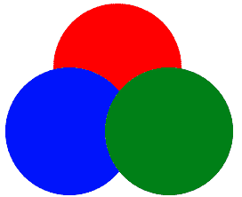

让我们直接跳到探索和冒险。

我们从三个圆开始:每个圆都是一个填充了“█”字符(墨迹)的 div，因此我们可以研究 divs 内容的排序，与背景和边框分开。开始的 HTML 看起来像:

```
<body> <div id=”one” class=”circle”> ██████<br/>██████<br/>██████<br/>██████<br/>██████ </div> <div id=”two” class=”circle”> ██████<br/>██████<br/>██████<br/>██████<br/>██████ </div> <div id=”three” class=”circle”> ██████<br/>██████<br/>██████<br/>██████<br/>██████ </div></body>
```

和 CSS:

```
.circle { width: 72px; height: 72px; overflow: hidden; line-height: 16px; border-radius: 100%; box-sizing: border-box;}
```

```
#one { margin-left: 27px; color: red;}
```

```
#two { margin-top: -36px; color: blue;}
```

```
#three { margin-top: -72px; margin-left: 56px; color: green;}
```

这个 HTML/CSS 生成了上面的第一张图片。按照定义的顺序重叠的三个圆。很好。让我们添加一些边框:

```
div {   border: 6px solid black;}
```

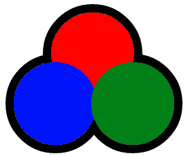

Borders are at the back with the contents stacked in the front.

也许这让你感到惊讶。即使内容在前面，边框也在后面。边框也是堆叠的吗？一抹色彩:

```
#two {  border-color: grey;}
```

```
#three {  border-color: white;}
```

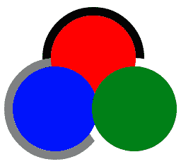

The border stack order is the same as the content stack order, but independent.

是的，HTML 中 div 的顺序决定了边框相对于彼此的顺序，以及内容相对于彼此的顺序，但是边框和内容之间的顺序是:边框在内容之后。

以下是迄今为止的例子:[开始](https://plnkr.co/edit/osQgt6?p=preview)、[黑色边框](https://plnkr.co/edit/THwgYG?p=preview)、[彩色边框](https://plnkr.co/edit/ZHSxBZ?p=preview)。

到目前为止，三个 div 都有默认的定位类型:static。让我们“定位”它们(完整代码在 [plunker](https://plnkr.co/edit/REXUce?p=preview) 中):

```
div {   border: 6px solid black;   position: relative;}
```

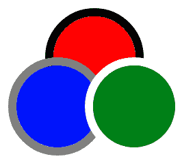

Just when you’d gotten your head around borders being ‘separate’?

好的，所以“定位”元素(位置值≠静态)堆叠在一起:内容、边框和所有。下一个实验！([扑通](https://plnkr.co/edit/REXUce?p=preview)):

```
div {   border: 6px solid black;}
```

```
#one { position: relative; /* just position the first div */}
```

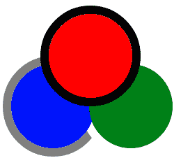

Red circle is ‘positioned’, the others are not. Positioned elements are the ‘highest’.

对，所以定位的元素在未定位的元素前面。仅基于布局属性进行排序有很多情况。这是另一个例子:

```
#one { margin-left: 24px; color: red;}
```

```
#two { margin-top: -36px; margin-right: -20px; border-color: grey; color: blue; float: left;  /* the important part */}
```

```
#three { margin-top: -36px; border-color: white; color :green;}
```

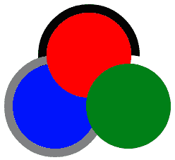

在这里，蓝色的圆圈被向左浮动，其他两个圆圈未定位。div two 的边框和内容都位于其他圆的边框和内容之间。浮动元素的行为很像定位元素，它的边框和内容放在一起，只是它不在顶部。

让我们暂时跳过内容+边框的行为，来看看嵌套的 HTML。这个密码本很好地带领我们前进。

```
<div class=”black”></div><div class=”gray”>  <div class=”lime”></div> <div class=”yellow”></div> </div><div class=”blue”></div>
```

```
(The CSS solely set’s background colours, box sizes, and margins)
```

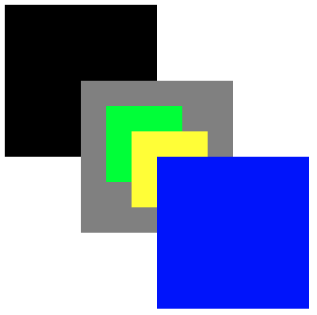

正如人们所预料的，嵌套 HTML 创建了相对于父元素的堆栈。

让我们把重点放在嵌套部分——重新引入边框和内容，但也加入背景。我将解释下面的图表，但是请参见 [plunker](https://plnkr.co/edit/rbKxnq?p=preview) 以获得完整的 HTML/CSS:

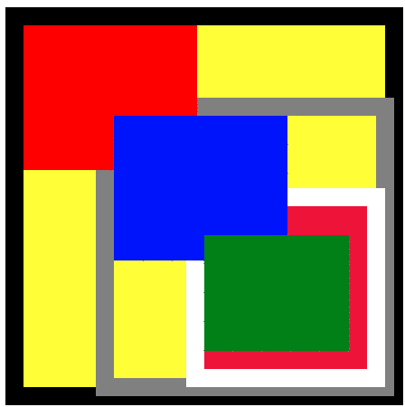

我们之前划分的圆圈变成了嵌套的方块。黄色是外 div 的背景，右下方的深红色是内 inner div (div 三)的背景。

第二个 div 没有背景。允许溢出。在没有定位的嵌套上下文中，边界在嵌套顺序中位于后面。

我们也看到背景和它们一起被送到后面，也是嵌套顺序:深红色在蓝色的后面，黄色的上面。

第一行绿色字符已被删除，以显示这种效果。如果我们给它添加定位，我们会得到与圆形相似的效果——所有这些边界/背景下沉都消失了( [plunker](https://plnkr.co/edit/zChij4?p=preview) ):

```
div {  position: relative;}
```

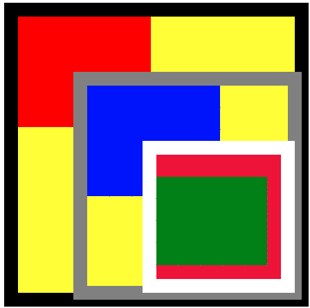

在有定位的嵌套上下文中，子元素位于父元素之上:边框、背景、内容等等。

如果我们将目前为止的所有案例结合起来，我们可以生成大多数元素排序场景，只需要位置、浮点和 HTML 结构。嗯，也就是说，至少在视觉上。那么在事件捕获方面呢？请考虑以下情况:

```
<div id="one"></div><div id="two"></div><div id="three"></div>
```

```
div {  /* all divs overlap 100% */  position: absolute;   top: 0;  bottom: 0;  left: 0;  right: 0;   background-color: white;}
```

```
#three {   background-color: lightblue;}
```

```
document.getElementById(‘one’)  .addEventListener(‘mouseover’,logTarget)
```

```
document.getElementById(‘two’)  .addEventListener(‘mouseover’,logTarget)
```

```
document.getElementById(‘three’)  .addEventListener(‘mouseover’,logTarget)
```

```
function logTarget(e){   console.log(e.target);}
```

如果您将鼠标移动到浏览器窗口中，您预计会触发什么 *mouseover* 事件？

如果我们像下面这样更新 HTML 呢？

```
<div id="one">  <div id="two">   <div id="three"></div>  </div></div>
```

是的。没错。使用串联 HTML，您可以获得一个事件。使用嵌套的，您可以得到三个*。尽管从视觉上看，第三个 div 完全覆盖了其他两个 div，但是对于事件捕获来说，在嵌套的情况下它并没有覆盖。看这里的掠夺者[和这里](https://plnkr.co/edit/Y7SMTtHqm2lga0to5g84?p=preview)的[。](https://plnkr.co/edit/Rvb0zaEvCCQO87BRdjeb?p=preview)

*目标为第三个 div 的三个事件—它仍然在顶部，因此 mouseover 事件目标适用于它。

到目前为止，我们已经探索了自然的堆叠顺序——该顺序完全由 HTML 结构和标准布局属性(如位置和浮动)定义。

我们已经看到元素内容是浮动的

使用 z-index 打破自然堆叠顺序怎么样？

CSS z-index 属性影响定位的元素。我们已经看到被定位的元素出现在最前面，带着它们所有的边框和背景，但是除此之外，它们是按照 HTML 中定义的顺序排列的。z-index 只是提供了一种打破 HTML 排序环境的方法。所以最明显的第一个例子( [plunker](https://plnkr.co/edit/EPHDqI?p=preview) ):

```
div { width: 80px; height: 80px; position: relative; line-height: 16px; box-sizing: border-box;}
```

```
#one { background-color: red; z-index: 1;}
```

```
#two { background-color: blue; top: -80px;}
```

```
<body>  <div id=”one”></div>  <div id=”two"></div></body>
```


We’d normally see the blue box since it was defined second, but the red one has a z-index of 1;

接下来，它与嵌套的情况类似，除了您必须为相同的( [plunker](https://plnkr.co/edit/UQmeiD?p=preview) )向子元素应用负数(我们将很快了解原因):

```
.box { position: relative; width: 80px; height: 80px;}
```

```
#one { background-color: red;}
```

```
#two { background-color: blue; z-index: -1;} 
```

```
<div id="one" class="box">  <div id="two" class="box"></div></div>
```

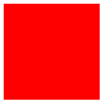

#two has been sunk behind #one

如果我们也给父节点添加一个 z 索引:

```
#one { background-color: red;  z-index: 1;}
```

```
#two { background-color: blue; z-index: -1;}
```


Erm huh?

在这种情况下，会“忽略”子对象的 z 索引。这个例子可以让这一点变得更清楚:

```
.box { position: absolute; width: 80px; height: 80px;}
```

```
#one { background-color: red; z-index: 2;}
```

```
#two { height: 60px; width: 60px; background-color: green; z-index: 1;}
```

```
#three {  background-color: blue;}
```

```
<div id=”one” class=”box”> <div id=”two” class=”box”></div> <div id=”three” class=”box”></div></div>
```

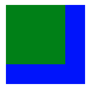

使用 z 索引的嵌套创建了一个新的堆叠上下文。所以# 1 相对于它的兄弟元素在“2”处，而# 2 和# 3 在# 1 内部相对于彼此分别在“1”和“0”处。

这可能会在类似这样的情况下造成混乱:

```
.box { position: absolute; width: 80px; height: 80px;}
```

```
#one { background-color: red; z-index: 2;}
```

```
#two { width: 100px; position: relative; z-index: 4;}
```

```
#three {  margin-top: 80px; background-color: blue; z-index: 2;}  <div id="one" class="box">  <div id="two" class="box">    Text inside two    Text inside two    Text inside two    Text inside two    Text inside two    Text inside two    Text inside two    Text inside two  </div></div><div id="three" class="box"></div>
```

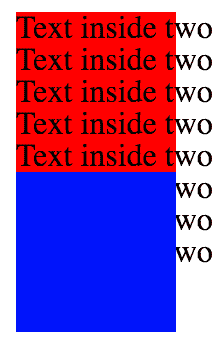

尽管第二个中的文本的 z 索引为 4，但它仍然位于 z 索引为 2 的蓝色方块后面。为什么？因为在 z 索引为 2 的堆栈上下文中，它的 z 索引为 4。然后，因为第三个 div 是在第一个 div 之后定义的，并且也在 z-index 2 处，所以它位于顶部。当然，如果我们把它的 z-index 调整为 1，它会在下面( [plunker](https://plnkr.co/edit/3LsRJv?p=preview) ):

```
#three {  margin-top: 80px; background-color: blue; z-index: 1;  /* was 2, now 1 */}
```

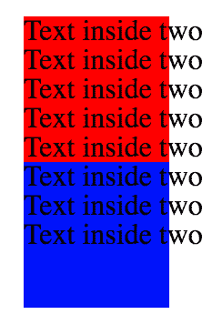

Z-index 不是在父级上创建新上下文的唯一属性。不透明是另一个原因:

```
#one { background-color: red; opacity: 0.99;}
```

```
#two { width: 100px; position: relative; z-index: 1;}
```

```
#three {  margin-top: 80px; background-color: blue;}
```

```
(same HTML as above)
```

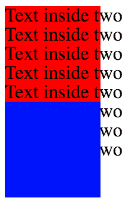

至此，[http://Philip walton . com/articles/what-no-one-tell-you-about-z-index/](http://philipwalton.com/articles/what-no-one-told-you-about-z-index/)应该开始相当清晰了。

[https://www . smashingmagazine . com/2009/09/the-z-index-CSS-property-a-comprehensive-look/](https://www.smashingmagazine.com/2009/09/the-z-index-css-property-a-comprehensive-look/)也是一本不错的读物。

因为规则之间有如此巨大的相互作用，堆栈顺序可能会变得有点笨拙，但第一篇文章所说的是真的:规则并没有那么难理解，它们只是不一定是人们所期望的。

开发人员必须创建新的堆栈上下文，以便在垂直堆栈情况下获得想要的结果。

我希望你已经有了一次上下滚动这篇文章的经历。