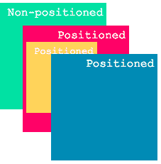
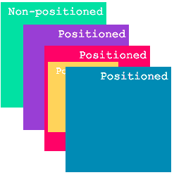
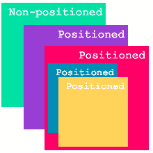

# Z-Index 解释:如何使用 CSS 堆叠元素

> 原文：<https://www.freecodecamp.org/news/z-index-explained-how-to-stack-elements-using-css-7c5aa0f179b3/>

作者:韦罗妮卡·伊夫赫德

# Z-Index 解释:如何使用 CSS 堆叠元素


Photo by [All Bong](https://unsplash.com/photos/7cq0F-sTw9M?utm_source=unsplash&utm_medium=referral&utm_content=creditCopyText) on [Unsplash](https://unsplash.com/search/photos/stack?utm_source=unsplash&utm_medium=referral&utm_content=creditCopyText)

我一直纠结于 CSS 属性 [z-index](https://developer.mozilla.org/en-US/docs/Web/CSS/z-index) 。一开始听起来很容易。具有较高 z 索引值的元素显示在具有较低 z 索引值的元素之前。尽管如此，很多时候我还是会遇到 z-index 值根本不起任何作用的情况。

我决定我已经受够了 z-index 的反复试验，我想更好地理解它。我希望这篇文章可以帮助你，这样你就永远不会想为什么 z-index 没有做你期望它做的事情。

### 默认堆叠顺序

让我们先来看看没有应用 z 索引时，浏览器堆叠元素的默认顺序:

1.  根元素(元素)
2.  按照定义顺序排列的非定位元素
3.  按照定义的顺序定位元素

[非定位](https://developer.mozilla.org/en-US/docs/Web/CSS/position)元素是具有默认位置值 static 的元素。一个[定位的](https://developer.mozilla.org/en-US/docs/Web/CSS/position)元素是一个具有任何其他位置值的元素。其他值的示例有:绝对值、相对值、粘性值或固定值。

HTML:

```
<div class=”pink”>
  <div class=”orange”></div>
</div>
<div class=”blue”></div>
<div class=”green”></div>
```

CSS:

```
/* This is only the CSS that is relevant for the example. For the complete CSS check the links below the pictures. */

.blue, .pink, .orange {
  position: absolute;
}
```



[https://codepen.io/ivhed/pen/QrdEBB](https://codepen.io/ivhed/pen/QrdEBB)

我们在文档中最后定义了绿盒。尽管如此，它还是出现在其他的后面，因为它是无定位的。

### 使用 z 索引堆叠

如果我们现在想要改变这些元素的堆叠顺序，我们可以使用属性 z-index。具有较高 z 索引的元素将显示在具有较低 z 索引的元素之前。需要注意的一点是，z-index **仅适用于定位元素** *。*

```
.blue, .pink, .orange {
  position: absolute;
}

.blue {
  z-index: 2;
}

.orange {
  z-index: 3;
}

.green {
  z-index: 100; // has no effect since the green box is non-         positioned
}
```


[https://codepen.io/ivhed/pen/xjqmpV](https://codepen.io/ivhed/pen/xjqmpV)

具有较高 z 索引的橙色框显示在蓝色框的前面。

#### 堆叠上下文

假设我们在布局中添加了另一个定位框，我们想把它放在粉色框的后面。我们将代码更新如下:

HTML:

```
<div class=”pink”>
  <div class=”orange”></div>
</div>
<div class=”blue”></div>
<div class=”purple”></div>
<div class=”green”></div>
```

CSS:

```
.blue, .pink, .orange, .purple {
  position: absolute;
}

.purple {
  z-index: 0;
}

.pink {
  z-index: 1;
}

.blue {
  z-index: 2;
}

.orange {
  z-index: 3;
}

.green {
  z-index: 100;
}
```



[https://codepen.io/ivhed/pen/YLZdjx](https://codepen.io/ivhed/pen/YLZdjx)

我们的粉色盒子果然显示在紫色盒子前面，但是橙色盒子怎么了？为什么它的 z 指数比蓝色的高，却突然落后了？这是因为向元素添加 z 索引值会形成所谓的[堆栈上下文](https://www.w3.org/TR/CSS21/zindex.html) **。**

粉色框具有除 auto 之外的 z 索引值，这形成了新的堆叠上下文。事实上，它形成了一个堆栈上下文，影响了其子元素的显示方式。

可以改变粉色盒子子元素的堆叠顺序。然而，它们的 z 索引只在堆栈上下文中有意义。这意味着，我们无法将橙色框移动到蓝色框的前面，因为它们不再处于相同的堆叠上下文中。

如果我们希望蓝色框和橙色框是同一个堆叠上下文的一部分，我们可以将蓝色框定义为粉色框的子元素。这将使蓝色框出现在橙色框的后面。

```
<div class=”pink”>
  <div class=”orange”></div>
  <div class=”blue”></div>
</div>
<div class=”purple”></div>
<div class=”green”></div>
```



[https://codepen.io/ivhed/pen/erGoJE](https://codepen.io/ivhed/pen/erGoJE)

堆叠上下文不仅在对元素应用 z 索引时形成。还有[几个其他属性](https://developer.mozilla.org/en-US/docs/Web/CSS/CSS_Positioning/Understanding_z_index/The_stacking_context)导致元素形成堆叠上下文。一些例子是:过滤器，不透明度，和变换。

让我们回到之前的例子。蓝盒子又是粉盒子的兄弟。这一次，我们没有将 z-index 添加到粉色框中，而是对它应用了一个[过滤器](https://developer.mozilla.org/en-US/docs/Web/CSS/filter)。

HTML:

```
<div class=”pink”>
  <div class=”orange”></div>
</div>
<div class=”blue”></div>
<div class=”green”></div>
```

CSS:

```
.blue, .pink, .orange {
  position: absolute;
}

.pink {
  filter: hue-rotate(20deg);
}

.blue {
  z-index: 2;
}

.orange {
  z-index: 3;
}

.green {
  z-index: 100;
}
```


[https://codepen.io/ivhed/pen/LmWMQb](https://codepen.io/ivhed/pen/LmWMQb)

橙色框仍然比蓝色框具有更高的 z 索引，但是仍然显示在它的后面。这是因为过滤器值导致粉红色框形成新的堆叠上下文。

#### 摘要

通过对定位的元素使用 z-index，我们可以更改默认的堆叠顺序。

当应用某些 CSS 属性时，一个元素可以形成一个堆栈上下文。z 索引值仅在相同的堆叠上下文中有意义。

关于 z-index 的更多信息，我推荐[这篇文章。](https://developer.mozilla.org/en-US/docs/Web/CSS/CSS_Positioning/Understanding_z_index)写这个的时候从中得到很多启发。

感谢阅读！:)