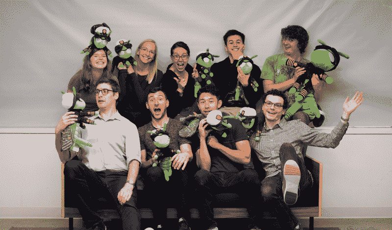
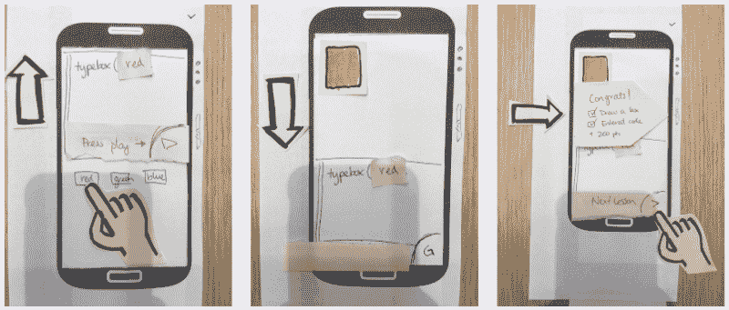
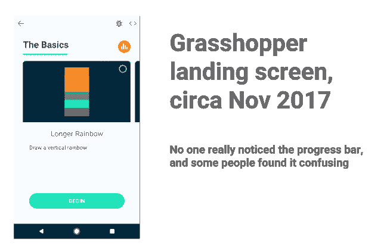
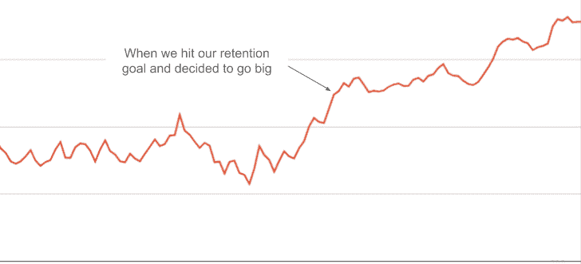

# 从零到 150 万编码员:构建 Grasshopper 的九个经验教训

> 原文：<https://www.freecodecamp.org/news/zero-to-1-5-million-coders-nine-lessons-learned-while-building-grasshopper-3f8fc96acff7/>

劳拉·霍姆斯

# 从零到 150 万编码员:构建 Grasshopper 的九个经验教训

两年半前，我开始教人们在手机上从头开始编写代码。截至今天，已有 150 万人下载了 [Grasshopper](https://grasshopper.codes/) 。尽管我在谷歌有 10 年的产品管理经验，我还是在未知的领域建立了 Grasshopper。以下是我一路走来学到的一些东西:

### 建立你所知道的

我开始学习编码是偶然的。我去了加州的一所公立高中，那里的计算机班正在学习打字。当我到达斯坦福时，我听说了“计算机科学”，但不知道它是什么。我的大一住院助理推荐上了一门叫“CS106A”的课。我信以为真。后来发现是斯坦福的计算机科学(CS)入门课。

一开始上课，我就喜欢计算机科学，但却得了全 b。很多人都很惊讶我居然会上这门课，因为我是一个“喜欢说话的女孩”。有太多事情我不明白。我记得有一次向我宿舍的一名员工寻求帮助，他们嘲笑地说，“你不知道 Unix 吗？！你怎么会不知道 Unix？”

学习编码有很多障碍:行话、工具、人们对编码员的看法。所有这些障碍让我觉得自己没有归属感。我最终获得了计算机科学学位。我在谷歌找到了一份工作，但我无数次怀疑自己能否胜任。

快进到在谷歌工作的大约十年。我想知道我能做些什么来帮助科技行业实现更多的多样性和包容性。外面有很多令人惊奇的工作。根据我自己的经验，我想改变一件事:我想让更多的人觉得他们会编码。我希望人们比我更容易进入软件行业。

我最终把谷歌的 [Area 120](https://area120.google.com/) 放在了一个游戏化的学习代码应用程序上，使用了最少的指令，并放在了移动设备上([，这样更多的人可以使用它](http://www.pewinternet.org/fact-sheet/mobile/))。

### 和优秀的人在一起

> “独自一人我们能做的很少，团结起来我们能做很多。”—海伦·凯勒

一群关心让编码教育变得更容易的伟大的人建立了 Grasshopper。一开始，只有我们几个人。在过去的两年里，人们加入了，有些人继续前进。在每一次迭代中，人的决定都是应用程序的核心。

在过去的两年里，我明白了你可以是聪明的，你可以是幸运的，你可以在你的团队中拥有具有深厚专业知识的人。这还不够。你需要和即将成为团队成员的人在一起。技能是可以学习的。说到底，我很多时候都是错的。是我的队友们的努力和耐心让我们走到了今天。

The Grasshopper Team (top left, clockwise): Heather, Val, Laura (me), Frankie, Lucas, Elliott, Kris, Phil and Ben

### 尽可能快地把东西呈现在用户面前

我们在 2016 年 9 月开始构建 Grasshopper，并在 10 月进行了第一次用户测试。我们还没有造出任何东西，我们只有手绘的纸原型。

到了 11 月，我们有了第一台样机，并在感恩节期间把 10 个人带回家(只有 2 个人用它)。

在每一次迭代中，我们都知道什么可行，什么不可行。我们很早就意识到编码难题是令人愉快的。我们必须确保游戏不要太孩子气(例如，没有海龟图形)。我们了解了用户想要在代码编辑器中的什么地方点击以添加新的一行(并且我们最初的控件是混乱的)。

到了 6 月，我们有了一个包含 13 个谜题的粗略应用程序，并把它放在了 Play Store 上。我们买了一些流量。我们保持低调，不断学习。

Our very first “fully functional” paper prototype

### 好的衡量标准可以帮助你说不

当我们开始做 Grasshopper 的时候，我们不确定成功会是什么样子。我知道指标会帮助我们，但不确定哪些数字是重要的。我看了很多关于成长的博客。然后，我开始查看以下指标来衡量 Grasshopper 的成功:活跃用户、入职成功、第 1 周保留率、每次收购的成本、课程完成情况和每周内容创作。

有很多不同的指标。

拥有大量的度量标准会使决策变得困难。

我们想建立一个功能来增加我们的日常活跃用户吗？还是降低收购成本？我们是想让人们花更多的时间在应用程序上，还是完成我们的课程？当一个指标上升而另一个指标下降时，这意味着什么？哪些指标是最重要的？

过了几个月，我才意识到我需要缩小范围。我们决定只关注两个指标:第一天的保留率和毕业率。我们让自己对学生的学习(毕业率)负责，同时也构建了一个吸引人的产品，让用户不断回来(第一天的保留)。我们关注第一天的保留率，因为这是我们第一次有机会衡量用户的回头率。所有其他保留目标都在第一天的下游。

明显缺乏任何用户增长指标。在我们确定了另外两个指标之前，我们不需要增长。如果我们没有让用户保持兴趣，没有教我们的学生，我们就没有准备好往火上浇油。

缩小到两个成功指标是澄清。除了一些简单的付费活动，我们没有在营销上花时间。我们可以看看我们的想法列表，并根据它们是否有助于保留或毕业来关注最好的想法。诸如平板电脑支持、让代码编辑器支持更多用例以及引用等事情不再重要。

一旦我们有了共同的目标，我们就能够开始做出一些艰难的决定。

### 你的用户是对的

2017 年 6 月到 12 月，事情很坎坷。我们已经就我们的成功指标达成一致，但是我们没有提高这些数字。

我们对应用程序做了很多修改。我们扩展了我们的课程以创造一个更好的“终点”。似乎没有什么能改善我们的指标。我一直希望下一个变化会是一个，但它不是。

我们不断听到用户说我们的课程令人困惑，他们真的想要一个进度条。我没得到它。我们将我们的课程设计成动态的，以便根据用户的表现为他们选择“完美”的下一课。这样一来，课程也可以交换进出。我们刚刚添加了一个进度条。为什么用户没有得到它？他们看不到进度条吗？

与此同时，我团队中的一些人开始注意到他们对动态课程感到不舒服。这对他们来说很困惑，而且计算量很大。

这时我意识到:我们的用户是对的。他们一直告诉我，我们的应用程序令人困惑，但我就是不明白。我的队友也听到了，但我还是没有听进去。我太在意我们过去的做事方式和我们所做的投资。

所以我们做了一个支点，让我们的课程成为一条线性路径，有清晰的进程和进展。我们不再自作聪明，而是倾听。就在那时，一切开始变得更好:我们所有的数字都开始向右上方上升。

### 坚持你的核心，剩下的只是细节

当我们从动态课程转向线性课程时，我非常担心。我们的投资者认为动态课程很酷，我们团队的人也是如此。这个新策略足够有趣，能让我们的团队保持兴奋吗？这个新模型让我们使用分数和成绩。那是作弊吗？

这时候，我提醒自己为什么我想建立蚱蜢:我想教更多的人学习编码。动态课程不起作用；把它换成有效的课程。只要有更多的人学习，谁在乎你是否使用积分系统？

构建 Grasshopper 是一次学习之旅，让我的团队成员放手去做决定(这是一次我仍在进行的旅程)。事实证明，如果你有一个伟大的团队，最好的想法将来自他们。作为领导者，我的工作是确保我们都到达同一个地方:教更多的人学习编码。

自从去年做了我们的支点，并意识到我太依赖于一个不起作用的应用程序版本，我已经更愿意接受建议和实验。我已经放开了一点，看到我的团队在被赋予更多责任的情况下做了些什么真是太棒了。我的团队开发了新的功能，开发了新的课程，并对 Grasshopper 做了一些我最初不喜欢的改动。但事实证明我错了，我的团队开发的功能增加了我们的核心指标。我们也发布了一些东西。但最重要的是忠于我们的使命，永不动摇。剩下的只是细节。

### 当指标正确时，寻求增长

在谷歌的这些年里，我学到了不要过度承诺而犯错。你永远无法恢复用户的信任。当我在做[项目/Google Fi](https://fi.google.com/about/) 的时候，我们慢慢地接纳用户，直到我们知道我们的客户会有很好的体验，而且进展顺利。我想效仿 Grasshopper 的类似模式，在我们知道我们有了一个伟大的产品之前，不做营销和新闻。

在一个月又一个月的指标持平之后，我们从假期中回到了向右上方的图表。我们太兴奋了。线性课程的支点得到了回报！

2017 年 9 月，我们为第一天的保留率和毕业率设定了一些目标，我们在 2018 年 2 月实现了这些目标。

除了看到我们的成功指标上升，我们实际上还看到了有机增长。从一月份开始，我们看到越来越多的增长来自有机增长。

到了二月，我们知道我们正在做一些有用的事情，所以我们决定将公告计划付诸实施。我们感到惊讶的是，尽管 Grasshopper 已经公开了几个月，却没有人关注它。因为我们保持低调，一旦我们知道产品是正确的，我们就给自己机会宣布和讲述我们自己的故事。

Graph of our 7-day [moving average](https://en.wikipedia.org/wiki/Moving_average) on Day 1 retention. After months of flatlined success metrics, our pivot resulted in 2x Day 1 retention, even as we added more users.

### 监控和扩展支持的回报

发布当天，我们在太平洋时间早上 5 点进入办公室。《时代》杂志做了一个关于蚱蜢的独家报道，它将在太平洋时间早上 6 点登陆网站。没有东西是开着的，所以我们把华夫饼干熨斗带到办公室，用微波炉做了一些熏肉。

故事发布后，我们看到我们的指标开始攀升。太刺激了！ [TechCrunch 做了一篇文章](https://techcrunch.com/2018/04/18/grasshopper-a-learn-to-code-app-from-googles-area-120-incubator-goes-live/)。然后一帮[其他](https://www.androidcentral.com/learn-how-code-free-area-120s-new-app-grasshopper?utm_source=ac_tw&utm_medium=tw_card&utm_content=66807&utm_campaign=social) [网点](https://www.bustle.com/p/googles-grasshopper-mobile-game-teaches-adults-how-to-code-in-easy-accessible-way-its-free-8839675)开始来接我们。到下午 3 点，情况稳定下来，我们决定出去喝杯啤酒庆祝一下。我们已经上线了，获得了很多新用户，没有任何问题。增长是适度的，但是我们在野外。干得好。那天晚上我们回家时感觉很好。

第二天早上，东西着火了。亚洲加快了我们的发展。我们的工程团队及时得到了警报，他们在我们的服务器负载阻止 Grasshopper 运行之前关闭了非必要的服务(如我们的仪表盘)。

一旦我们拿回数据，我们发现我们打破了之前的 24 小时记录。我们一直希望是 10 倍。接下来的几周很难熬。我们的工程团队努力重写我们的后端，使其具有可伸缩性，我们的课程和支持团队处理用户问题。我们幸存了下来，因为我们投资了监控，投资了建立快速关闭服务的开关，投资了一个论坛和应用内反馈系统，以适应大规模用户增长。

如果你曾经遇到过类似的情况，我怎么强调都不为过，在我们宣布之前把这些事情都准备好是多么的有帮助。

### 没有所谓的工作生活平衡；有一个工作与生活的妥协

快进到今天，我们现在有 150 万用户在使用 [Grasshopper](https://grasshopper.codes/) 。我为这个团队和我们所取得的成就感到骄傲，也为我们的学生学会了编程感到骄傲。但是是时候来点私人的了:

在这期间，我也有了我的第一个孩子。在执行我们的中枢神经系统时，我正经历着妊娠早期的疲惫。当我们在四月发布公告时，我已经怀孕 35 周了。尽管我已经回到工作岗位几个月了，但我仍然觉得自己正在从产假中慢慢恢复。适应为人父母的状态+在 Grasshopper 上工作充满了意想不到的挑战。

我希望我能给这里的人们一些建议。我希望我能告诉你，有了成功的事业和大量的资源，工作与生活的平衡就会到位。我不能。但我能提供的是真实的感受，在做领导和做妈妈之间保持平衡:真他妈的难。工作与生活的平衡意味着，如果一个人足够努力，就可以达到某种理想的美好状态。相反，我经常在照顾家庭和公司之间权衡。

我下午 5 点下班，这样在我女儿睡觉前，我可以和她呆一会儿。有些晚上，我翘掉和丈夫的时间去做蚱蜢，结果第二天女儿意外地早早醒来。我会尽力喂她，但是因为我太累了，在我去上班之前，我们在一起的笑容不多了。当我在白天思考蚱蜢策略时，我就没那么有创造力了。

作为一名职业父母，我感觉自己在对工作和家庭的每一项活动进行复杂的投资回报分析。我所能希望的是，我在前进的道路上做出了正确的选择，并对挑战保持谦逊。我希望诚实面对挑战能让阅读这篇文章的在职父母们有机会庆祝你每天做出的所有惊人的妥协。如果你正在读这篇文章，而你还不是一个家长，但你可以和那些为人父母的人一起工作，也许你可以考虑告诉他们你认为他们在这两个角色上做得有多好。

如果你已经做到了这一步，非常感谢你的阅读！希望你已经发现了一些有价值的经验，并希望很快回到 freeCodeCamp 博客来分享更多来自 Grasshopper 的见解。如果你正在寻找一种方式开始你的编码之旅，下载 [Grasshopper](https://grasshopper.codes/) 。我很想听听你的想法和反馈。

我还撰写和发布关于多元化和包容性的话题。要关注我，这里有[我的推特](https://twitter.com/fearofpoets)和[我的博客](https://www.fearofpoets.com/)。